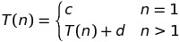
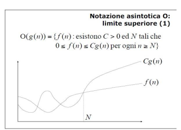
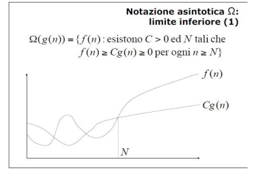

# Elementi fondamentali delle strutture dati e degli algoritmi

## Formalismo per la misura del calcolo del tempo

### Concetti base

#### Definizioni
**Definizione di problema**:
> Specificazione della relazione tra dati di input ed output.

**Definizione di algoritmo**:
> Descrizione precisa di una sequenza di azioni che un esecutore deve compiere per giungere alla soluzione di un dato problema computazionale.

**Definizione di un problema computazionale**:
> Specificazione della relazione esistente tra dati in ingresso e risultato.

L'esecuzione di un algoritmo deve:
* Rappresentare, organizzare ed elaborare l'input;
* Rappresentare, organizzare ed elaborare l'output;
* Gestire le informazioni intermedie utili al calcolo **manipolando oggetti elementari: i dati**.

#### Procedure
Una **procedura** e' un algoritmo descritto per mezzo dei costrutti tipici di un linguaggio di programmazione:
* **Procedura Ricorsiva**: una procedura che chiama se stessa per la soluzione di un problema;
* **Procedura Iterativa**: una procedura che itera parte di se stessa per soluzione di un problema.

La **terminazione** di una procedura, ricorsiva od iterativa, e' garantita da:
* **Condizioni di uscita**: `if( j==k) { m = a[j]; }`;
* **Riduzione della dimensione dell'input**: `min_r( a, j+1, k );`.

#### Rappresentazione dei dati

I dati dei problemi devono essere rappresentati attraverso i seguenti tipi di dato primitivi:
* Un array od una struttura _a_ per modellare l'insieme dei dati in input;
* Una variabile primitiva _m_ per modellare l'output.

___

### Efficienza e Complessita'
E' necessario definire un formalismo per misurare l'efficienza di un algoritmo in modo da poter trovare, tra differenti algoritmi, l'algoritmo piu' efficiente per la soluzione di un problema computazionale.

Se l'efficienza venisse misurata come tempo di esecuzione, quest'ultimo misurato con un orologio, e il contesto di esecuzione potesse variare (esempio: due processori in due macchine differenti) si avrebbero due tempi distinti.

La contestualizzazione del tempo di esecuzione di algoritmo e' la dimostrazione che e' necessario introdurre una **misura astratta**.

Il **tempo di calcolo _T(n)_** e' dato da:
> Il costo complessivo delle operazioni elementari in funzione della dimensione _n_ dei dati in input.

Le **Operazioni Elementari** sono:
> Tutte le operazioni aritmetiche, logiche, di confronto e di assegnamento che possono essere svolte all'interno di un algoritmo.

Per calcolare l'insieme, o il numero complessivo delle operazioni elementari si deve sempre considerare il **caso pessimo**: dove le operazioni elementari da compiere sono maggiori.

In generale si escludono le operazioni non necessarie per l'esecuzione dell'algoritmo, tenendo quindi solamente conto delle operazioni fondamentali.

#### Esempio
Trovare il valore minimo _m_ in un array di interi _a_.

| Codice in un algoritmo Iterativo  | Costo | Frequenza |
|------------------------------------|-------|-----------|
| `int min_i( int *a, int j, int k) {` | c1    | 1       |
| `int i, m;`                          | 0     | 1       |
| `m = a[j];`                          | c2    | 1       |
| `for ( i=j+1; i<=k; i++ )`           | c3    | n       |
| `m = ( a[i]<m ? a[i] : m );`         | c4    | n-1     |
| `return( m );`                       | c5    | 1       |
| `}`                                  | -     | -       |

Il ciclo `for` viene ripetuto _n_ volte, dunque:

_T(n) = c1 + c2 + c3n + c4(n-1) + c5_

_T(n)= (c3 + c4)n + (c1 + c2 + c5 - c4)_

che puo' essere scritto come:

_T(n) = an + b_         con _a_ e _b_ costanti positive.

La funzione `min_i` ha tempo di calcolo **lineare** nella dimensione _n_ dell'input, a meno di _a_ e _b_.

| Codice in un algoritmo Ricorsivo   | Costo       | n=1 | n>1 |
|------------------------------------|-------------|-----|-----|
| `int min_r( int *a, int j, int k ) {`| c1          | 1 | 1   |
| `int m;`                             | 0           | 1 | 1   |
| `if ( j==k ) m = a[j];`              | c2          | 1 | 1   |
| `else {`                             | -           | - | -   |
| `m = min_r( a, j+1, k);`             | c3 + T(n-1) | - | 1   |
| `m = ( a[j]<m ? a[j] : m );`         | c4          | - | 1   |
| `}`                                  | -           | - | -   |
| `return( m );`                       | c5          | 1 | 1   |
| `}`                                  | -           | - | -   |

**Caso n=1**: Se vi e' un solo elemento nei dati di input, il tempo di calcolo e' dato da c1+c2+c5, ovvero _T(1) = c_, dove _c_ e' una costante.

**Caso n>1**: La funzione suddivide in due l'array, la prima di una posizione mentre la seconda di _(n-1)_ posizioni. Quindi:

_T(n) = T(n-1) + c1 + c2 + c3 + c4 + c5_
     
_T(n) = T(n-1) + d_, dove _d_ e' una costante.

Per valutare _T(n)_ usiamo il metodo delle **sostituzioni successive**:

_T(n) = T(n-1) + d_

_T(n) = T(n-2) + 2d_

_T(n) = T(n-3) + 3d_

_T(n) = ..._

_T(n) = T(1) + (n-1)d_

_T(n) = c + (n-1)d_

_T(n) = dn + (c-d)_

Possiamo osservare che **l'algoritmo ricorsivo ho lo stesso tempo di calcolo lineare della sua versione iterativa**. 

#### Complessita' computazionale

Nel caso di algoritmi complessi, puo' risultare difficile contare le operazioni elementari. Per questo introduciamo la **complessita' computazionale**:
> Si valuteranno il numero di operazioni in **ordine di grandezza**, ovvero come limite della funzione _T(n)_ al tendere di _n_ all'infinito, trascurando le costanti.

**Notazione asintotica O - Limite superiore**

_O(g(n))_ rappresenta l'insieme di tutte le funzioni _f(n)_ tali che esistono due costanti positive _C_ ed _N_ per cui _0<f(n)<Cg(n)_, per ogni _n>=N_.

Ogni operazione elementare e' _O(1)_ oppure costante.

Non danno contributo le istruzioni:
* Condizionali;
* Di iterazione;
* Chiamate a procedura e funzioni.

**Notazione asintotica Ω - Limite inferiore**

_Ω(g(n))_ rappresenta l'insieme di tutte le funzioni f(n) tali che esistono due costanti positive _C_ ed _N_ per cui _f(n)>=C(g(n))>=0, per ogni n>=N_.

La **complessita' di un algoritmo** e' dunque:
> L'ordine di grandezza _O(T(n))_ inteso come numero di operazioni elementari eseguite nel caso pessimo in funzione della dimensione _n_ dei dati d'ingresso.

Un algoritmo si dice:
* **Efficiente**: se la sua complessita' e' di ordine polinomiale, ovvero _O(nc)_ con _c_ costante positiva;
* **Inefficiente**: se la sua complessita' e' di ordine super polinomiale, ovvero _O(cn)_ con _c>1_ costante.

La **complessita' di un problema** ci serve per individuare l'algoritmo con complessita' piu' bassa cercando la limitazione inferiore alla complessita' che dipende solo dal problema in esame.

Se dimostriamo che qualsiasi algoritmo per un dato problema ha una complessita' _Ω(f(n))_ si e' stabilita una **limitazione inferiore** alla complessita' del problema.

Se un particolare algoritmo ha complessita' _O(g(n))_, si e' stabilita una **limitazione superiore** alla complessita' del problema.

Se _f(n) = g(n)_ allora l'algoritmo e'detto **ottimo** perche' la sua complessita' in ordine di grandezza risulta la migliore possibile.

Calcolare il limite inferiore non e' pero' semplice a causa della generalita' del ragionamento (Quale e' il numero minimo di operazioni che un qualsiasi algoritmo deve compiere per risolvere un problema determinato?).
I metodi che abbiamo a disposizione sono:
* **Dimensione dei dati**:
  * Se un problema ha in ingresso _n_ dati e richiede di esaminarli tutti, allora una limitazione inferiore della complessita' e' _Ω(n)_. 
  * Gli algoritmi per il minimo iterativo e ricorsivo sono ottimi per il calcolo della complessita'.
* **Eventi contabili**:
  * Se un problema richiede che un certo evento sia ripetuto almeno _n_ volte allora la limitazione inferiore alla complessita' e' _Ω(n)_.
  * Gli algoritmi per ilminimo iterativo e ricorsivo sono ottimi e richiedono almeno _n-1_ confronti.

Entrambi i metodi sono validi ma se non si tengono in considerazione le ipotesi sotto le quali si agisce, la probabilita' di trovare un limite inferiore inesatto aumenta.

___

### Complessita' per induzione

[PDF](M1_complessita_per_induzione.pdf)

