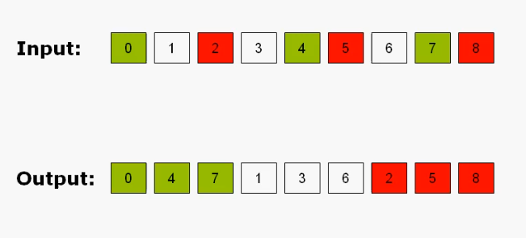
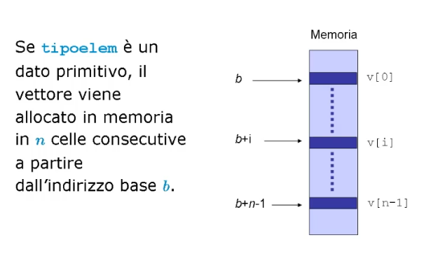
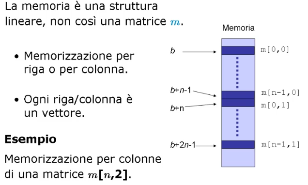

# Elementi fondamentali delle strutture dati e degli algoritmi

## Formalismo per la misura del calcolo del tempo

### Concetti base

#### Definizioni
**Definizione di problema**:
> Specificazione della relazione tra dati di input ed output.

**Definizione di algoritmo**:
> Descrizione precisa di una sequenza di azioni che un esecutore deve compiere per giungere alla soluzione di un dato problema computazionale.

**Definizione di un problema computazionale**:
> Specificazione della relazione esistente tra dati in ingresso e risultato.

L'esecuzione di un algoritmo deve:
* Rappresentare, organizzare ed elaborare l'input;
* Rappresentare, organizzare ed elaborare l'output;
* Gestire le informazioni intermedie utili al calcolo **manipolando oggetti elementari: i dati**.

#### Procedure
Una **procedura** e' un algoritmo descritto per mezzo dei costrutti tipici di un linguaggio di programmazione:
* **Procedura Ricorsiva**: una procedura che chiama se stessa per la soluzione di un problema;
* **Procedura Iterativa**: una procedura che itera parte di se stessa per soluzione di un problema.


La **terminazione** di una procedura, ricorsiva od iterativa, e' garantita da:
* **Condizioni di uscita**: `if( j==k) { m = a[j]; }`;
* **Riduzione della dimensione dell'input**: `min_r( a, j+1, k );`.

#### Rappresentazione dei dati

I dati dei problemi devono essere rappresentati attraverso i seguenti tipi di dato primitivi:
* Un array od una struttura _a_ per modellare l'insieme dei dati in input;
* Una variabile primitiva _m_ per modellare l'output.

___

### Efficienza e Complessita'
E' necessario definire un formalismo per misurare l'efficienza di un algoritmo in modo da poter trovare, tra differenti algoritmi, l'algoritmo piu' efficiente per la soluzione di un problema computazionale.

Se l'efficienza venisse misurata come tempo di esecuzione, quest'ultimo misurato con un orologio, e il contesto di esecuzione potesse variare (esempio: due processori in due macchine differenti) si avrebbero due tempi distinti.

La contestualizzazione del tempo di esecuzione di algoritmo e' la dimostrazione che e' necessario introdurre una **misura astratta**.

Il **tempo di calcolo _T(n)_** e' dato da:
> Il costo complessivo delle operazioni elementari in funzione della dimensione _n_ dei dati in input.

Le **Operazioni Elementari** sono:
> Tutte le operazioni aritmetiche, logiche, di confronto e di assegnamento che possono essere svolte all'interno di un algoritmo.

Per calcolare l'insieme, o il numero complessivo delle operazioni elementari si deve sempre considerare il **caso pessimo**: dove le operazioni elementari da compiere sono maggiori.

In generale si escludono le operazioni non necessarie per l'esecuzione dell'algoritmo, tenendo quindi solamente conto delle operazioni fondamentali.

#### Esempio
Trovare il valore minimo _m_ in un array di interi _a_.

| Codice in un algoritmo Iterativo  | Costo | Frequenza |
|------------------------------------|-------|-----------|
| `int min_i( int *a, int j, int k) {` | c1    | 1       |
| `int i, m;`                          | 0     | 1       |
| `m = a[j];`                          | c2    | 1       |
| `for ( i=j+1; i<=k; i++ )`           | c3    | n       |
| `m = ( a[i]<m ? a[i] : m );`         | c4    | n-1     |
| `return( m );`                       | c5    | 1       |
| `}`                                  | -     | -       |

Il ciclo `for` viene ripetuto _n_ volte, dunque:

_T(n) = c1 + c2 + c3n + c4(n-1) + c5_

_T(n)= (c3 + c4)n + (c1 + c2 + c5 - c4)_

che puo' essere scritto come:

_T(n) = an + b_         con _a_ e _b_ costanti positive.

La funzione `min_i` ha tempo di calcolo **lineare** nella dimensione _n_ dell'input, a meno di _a_ e _b_.

| Codice in un algoritmo Ricorsivo   | Costo       | n=1 | n>1 |
|------------------------------------|-------------|-----|-----|
| `int min_r( int *a, int j, int k ) {`| c1          | 1 | 1   |
| `int m;`                             | 0           | 1 | 1   |
| `if ( j==k ) m = a[j];`              | c2          | 1 | 1   |
| `else {`                             | -           | - | -   |
| `m = min_r( a, j+1, k);`             | c3 + T(n-1) | - | 1   |
| `m = ( a[j]<m ? a[j] : m );`         | c4          | - | 1   |
| `}`                                  | -           | - | -   |
| `return( m );`                       | c5          | 1 | 1   |
| `}`                                  | -           | - | -   |


**Caso n=1**: Se vi e' un solo elemento nei dati di input, il tempo di calcolo e' dato da c1+c2+c5, ovvero _T(1) = c_, dove _c_ e' una costante.

**Caso n>1**: La funzione suddivide in due l'array, la prima di una posizione mentre la seconda di _(n-1)_ posizioni. Quindi:

_T(n) = T(n-1) + c1 + c2 + c3 + c4 + c5_
     
_T(n) = T(n-1) + d_, dove _d_ e' una costante.


Per valutare _T(n)_ usiamo il metodo delle **sostituzioni successive**:

_T(n) = T(n-1) + d_

_T(n) = T(n-2) + 2d_

_T(n) = T(n-3) + 3d_

_T(n) = ..._

_T(n) = T(1) + (n-1)d_

_T(n) = c + (n-1)d_

_T(n) = dn + (c-d)_

Possiamo osservare che **l'algoritmo ricorsivo ho lo stesso tempo di calcolo lineare della sua versione iterativa**. 

#### Complessita' computazionale

Nel caso di algoritmi complessi, puo' risultare difficile contare le operazioni elementari. Per questo introduciamo la **complessita' computazionale**:
> Si valuteranno il numero di operazioni in **ordine di grandezza**, ovvero come limite della funzione _T(n)_ al tendere di _n_ all'infinito, trascurando le costanti.

**Notazione asintotica O - Limite superiore**

_O(g(n))_ rappresenta l'insieme di tutte le funzioni _f(n)_ tali che esistono due costanti positive _C_ ed _N_ per cui _0<f(n)<Cg(n)_, per ogni _n>=N_.


Ogni operazione elementare e' _O(1)_ oppure costante.

Non danno contributo le istruzioni:
* Condizionali;
* Di iterazione;
* Chiamate a procedura e funzioni.

**Notazione asintotica Ω - Limite inferiore**

_Ω(g(n))_ rappresenta l'insieme di tutte le funzioni f(n) tali che esistono due costanti positive _C_ ed _N_ per cui _f(n)>=C(g(n))>=0, per ogni n>=N_.


La **complessita' di un algoritmo** e' dunque:
> L'ordine di grandezza _O(T(n))_ inteso come numero di operazioni elementari eseguite nel caso pessimo in funzione della dimensione _n_ dei dati d'ingresso.

Un algoritmo si dice:
* **Efficiente**: se la sua complessita' e' di ordine polinomiale, ovvero _O(n<sup>c</sup>)_ con _c_ costante positiva;
* **Inefficiente**: se la sua complessita' e' di ordine super polinomiale, ovvero _O(c<sup>n</sup>)_ con _c>1_ costante.

La **complessita' di un problema** ci serve per individuare l'algoritmo con complessita' piu' bassa cercando la limitazione inferiore alla complessita' che dipende solo dal problema in esame.

Se dimostriamo che qualsiasi algoritmo per un dato problema ha una complessita' _Ω(f(n))_ si e' stabilita una **limitazione inferiore** alla complessita' del problema.

Se un particolare algoritmo ha complessita' _O(g(n))_, si e' stabilita una **limitazione superiore** alla complessita' del problema.

Se _f(n) = g(n)_ allora l'algoritmo e'detto **ottimo** perche' la sua complessita' in ordine di grandezza risulta la migliore possibile.

Calcolare il limite inferiore non e' pero' semplice a causa della generalita' del ragionamento (Quale e' il numero minimo di operazioni che un qualsiasi algoritmo deve compiere per risolvere un problema determinato?).
I metodi che abbiamo a disposizione sono:
* **Dimensione dei dati**:
  * Se un problema ha in ingresso _n_ dati e richiede di esaminarli tutti, allora una limitazione inferiore della complessita' e' _Ω(n)_. 
  * Gli algoritmi per il minimo iterativo e ricorsivo sono ottimi per il calcolo della complessita'.
* **Eventi contabili**:
  * Se un problema richiede che un certo evento sia ripetuto almeno _n_ volte allora la limitazione inferiore alla complessita' e' _Ω(n)_.
  * Gli algoritmi per ilminimo iterativo e ricorsivo sono ottimi e richiedono almeno _n-1_ confronti.

Entrambi i metodi sono validi ma se non si tengono in considerazione le ipotesi sotto le quali si agisce, la probabilita' di trovare un limite inferiore inesatto aumenta.

___

### Complessita' per induzione

[PDF](M1_complessita_per_induzione.pdf)

___

### Soluzione di un semplice problema computazionale

Lo schema per l'analisi di un problema computazionale e' composto da 3 fasi:
* **Analisi della complessita' del problema**: _Ω(.)_;
* **Progettazione dell'algoritmo**;
* **Analisi della complessita' dell'algoritmo** o degli algoritmi proposti: _O(.)_.

#### Problema: ordinamento dei colori
Sia dato un vettore di _n_ elementi che possono assumere solo 3 valori: "verde", "bianco" e "rosso". Si vuole ordinare il vettore in tempo ottimo in modo che tutti i "verdi" precedano tutti i "bianchi" e tutti i "bianchi" precedano tutti i "rossi".
Le uniche operazioni ammesse sono l'esame di un elemento e lo scambio di due elementi dati i loro indici.



#### Complessita' del problema: dimensione dei dati
Non sapendo come sono distribuiti i colori, per effettuare l'ordinamento occorre necessariamente leggere almeno una volta ogni singola posizione del vettore.

La complessita' del problema e' dunque _Ω(n)_.

Studiamo la complessita' del problema usando il metodo degli eventi contabili: per ordinare gli _n_ colori occorrono almeno _n-1_ confronti a coppie anche solo per stabilire se il vettore e' gia' ordinato.

Il numero di confronti, ovvero gli eventi contabili sono dunque _n-1_.

La complessita' del problema, valutata anche con questo metodo risulta _Ω(n)_.

#### Progettazione dell'algoritmo
Per la progettazione di un algoritmo efficiente occorre entrare nella struttura del problema per individuare le caratteristiche che permettano di esprimere un algoritmo in modo efficiente.

Si scorre il vettore dalla prima posizione verso l'ultima spostando i verdi a sinistra e i rossi a destra, ottenendo di fatto l'ordinamento.

Per scrivere quanto supposto dal punto di vista algoritmico supponiamo di avere 3 cursori:
* **k**: indica la prima posizione del vettore che contiene un colore diverso dal verde, _k>=0_.
* **j**: indica l'ultima posizione del vettore che contiene un colore diverso dal rosso, _k<=n_.
* **i**: cursore per la scansione del vettore tale che _k<i<j_.

Utilizziamo i 3 cursori appena introdotti: **dato un colore in posizione _i_ abbiamo 3 possibili operazioni**:
* Se il colore e' **rosso**: esso viene scambiato con quello contenuto nella posizione _j_ e si descremeta il valore associato a _j_ di uno;
* Se il colore e' **verde**, esso viene scambiato con quello contenuto in posizione _k_ e si incrementa il valore associato a _k_ di uno;
* Se il colore e' **bianco** non si effettua alcuno scambio e si incrementa il valore associato da _i_ di uno.

```C
i = k;
while ( i<j ) {
    switch( colori[i] ) {
        case 0:         /* colore verde */
            temp = colori[k];
            colori[k] = colori[i];
            colori[i] = temp;
            k++;
            break;
        case 1:         /* colore bianco */
            i++;
            break;
        case 2:         /* colore rosso*/
            temp = colori[i];
            colori[i] = colori[j];
            colori[j] = temp;
            j--;
    }
}
```

#### Studio della complessita' dell'algoritmo appena realizzato
L'algoritmo esegue le seguenti operazioni:
* Il cursore _i_ e' incrementato al piu' **_n-2_** volte;
* Prima di ogni incremento di _i_, vengono eseguiti al piu' 2 scambi;
* Uno scambio consiste in 4 operazioni elementari.

Il caso pessimo prevede che ad ongi passo di incremento del cursore _i_ vengono effettuati 2 scambi, quindi:

_T(n) = 2 x 4 x (n-2)_

Dunque _T(n)_ e' _O(n)_.

___

## Formalismo per la rappresentazione dei tipi di dati

### Aspetti fondamentali del formalismo

#### Dati astratti

Un **dato** e' un valore che una variabile puo' assumere.
Un **tipo di dato** e' un modello matematico che equivale ad un insieme di valori sui quali sono ammesse delle operazioni.

Le proprieta' che caratterizzano un tipo di dato dipendono esclusivamente dalla sua **specifica** e non dalla sua rappresentazione.
La specifica indica:
> Le caratteristiche dei valori e delle operazioni per mezzo di definizioni e nozioni matematiche.

Un tipo di dato cosi' definito si dice **tipo di dato astratto**.

La specifica di un tipo di dato astratto si divide in:
* **Specifica sintattica**:
  * Elenco di nomi relativi ai tipi di dato utilizzati per definire:
    * La **struttura** interna del tipo di dato astratto;
    * Le **operazioni** specifiche della struttura e delle costanti.
  * Descrive inoltre i domini di partenza e di arrivo per ogni operatore.
* **Specifica semantica**:
  * Definizione di una funzione matematica ottenuta indicando sui domini di partenza e di arrivo:
    * Una **pre-condizione**;
    * Una **post-condizione**.

Una corretta specifica equivale ad un manuale d'uso chiaro e non ambiguo.

#### Strutture dati

Le **Strutture Dati** sono formate da dati da elaborare, organizzati in modo specifico. In particolare una struttura dati e' un tipo di dato che:
* Utilizza un modo sistematico per organizzare i dati;
* Ha un insieme di operatori che permettono di manipolare i dati o di aggregarli per costruire altri agglomerati.

Le strutture dati possono distinguersi in:
* **Lineari** (dati in sequenza) o **non-lineari**;
* A **dimensioni fisse** o **variabili**;
* **Omogenee** (dati dello stesso tipo) o **non-omogenee**.

#### Esempio: Vettore
Il vettore e' una struttura dati:
* Lineare;
* A dimensioni fisse;
* Omogenea.

Specifica sintattica del tipo di dato vettore:
* Struttura:
  * Vettore;
  * Intero;
  * TipoElem.
* Operazioni specifiche:
  * CreaVettore: () -> vettore;
  * LeggiVettore: (vettore, intero) -> tipoelem;
  * ScriviVettore: (vettore, intero, tipoelem) -> vettore.

Specifica semantica:
* CreaVettore = _v_
  * post: per ogni _i, 1<=i<=n_ l'_i_-esimo elemento _v(i)_ e' uguale ad un certo tipoelem
* LeggiVettore(_v, i_) = _e_
  * pre: _i<=i<=n_
  * post: _e = v(i)_
* ScriviVettore(_v, i, e_) = _v'_
  * pre: _i<=i<=n_
  * post: _v'(i)_ = _e, v'(j)_ = _v(j)_ per ogni _i<=j<=n_ e _j!=i_


Una volta definito il tipo di dato astratto che poi associamo alla struttura dati, dobbiamo occuparci della **realizzazione**: implementare in un linguaggio di programmazione il tipo di dato secondo la specifica fornita.

Ad esempio, in C:
* CreaVettore: `tipoelem v[n];`;
* LeggiVettore: `v[i];`;
* ScriviVettore: `v[i] = e`;

#### Rappresentazione in memoria

L'efficienza di una struttura dati dipende anche dalle caratteristiche della macchina. Infatti per valutare l'efficienza elle strutture dati ipotizzeremo che l'organizzazione dei dati sia fatta presciendendo dalle caratterstiche della macchina.

E' bene conoscere i tempi di accesso alle strutture dati elementari rispetto alla loro organizzazione dei dati in memoria.







In C abbiamo un tipo di dato primitivo di nome **puntatore**. Esso permette:
* La realizzazione di strutture dati a dimensione variabile;
* La possibilita' di restituire strutture dati come risultato di funzioni.

Il tipo di dato puntatore puo' essere visto come una **struttura dati composta di locazioni di memoria con operatori di accesso diretto alla memoria stessa**.
<<<<<<< Updated upstream
=======

___

### Costruzione di un tipo di dato

Esercitazione nella costruzione di un tipo di dato attraverso:
* Definizione della specifica sintattica;
* Definizione della specifica semantica;
* Realizzazione tramite vettore.

Implementiamo un **mapping** (memoria associativa) in cui c'e' una corrispondenza tra gli elementi di un dominio _D_ a quelli di un codominio _C_.
> _M: D -> C_

Le operazioni ammesse sono:
* Creazione;
* Assegnamento;
* Calcolo.

Specifica sintattica del tipo di dato mapping:
* Nome dei tipi di dato e delle costanti:
  * Mapping;
  * Dominio;
  * Codominio;
  * Booleano;
  * Λ (Lambda), mapping vuoto.
* Operazioni specifiche:
  * Crea;
  * Assegna;
  * Calcola.
* Funzioni:
  * Crea: `() -> mapping`;
  * Assegna: `(mapping, dominio, codominio) -> mapping`;
  * Calcola: `(mapping, dominio) -> codominio * booleano`;

Specifica semantica:
* crea() = _M_
  * pre: nessuna
  * post: _M_ = _Λ_
* assegna(_M_, _d_, _c_) = _M'_
  * pre: nessuna
  * post: _M'(d) = c_ e _M'(x) = M(x)_, per ogni _x != d_
* calcola(_M_, _d_) = (_c_, _b_)
  * pre: nessuna
  * post: _b_ = _false_ se _M(d)_ indefinito, altrimenti _c_ = _M(d)_ e _b_ = _true_

Realizzazione: supponiamo che il dominio _D_ e il codominio _C_ siano rappresentati come degli interi e che il mapping sia un vettore:

```C
#define UNDEFINED 0
#define DIM 100
#define TRUE 1
#define FALSE 0

typedef short boolean;
typedef int mapping;

mapping *M;

void crea(mapping *M) {
    int i;
    M = (mapping *)malloc(DIM * sizeof(mapping));
    for (i=0; i<DIM; i++) M[i] = UNDEFINED;
}

void assegna(mapping *M, int d, int c) {
    M[d] = c;
}

boolean calcola(mapping *M, int d, int *c) {
    if(M[d] == UNDEFINED)
        return(FALSE);
    else {
        *c = M[d];
        return(TRUE);
    }
}
```
>>>>>>> Stashed changes
