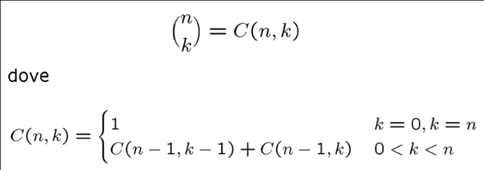

# Programmazione Dinamica

## Schema generale

### Progetto di algoritmi di Programmazione Dinamica

La programmazione dinamica e' un'estensione della tecnica Divide et Impera. Fu introdotta da Bellman nel 1957 per la soluzione di problemi di ottimizzazione.

L'idea principale consiste nello sfruttare tutte le soluzioni dei sottoproblemi piu' piccoli per la costruzione della soluzione dei problemi di dimensione maggiore.

Condizioni di applicazione:
* Sia possibile **ricombinare** la soluzione di problemi piccoli per ottenere quelle di problemi piu' grandi;
* La soluzione di un sottoproblema sia **invariante**.
* I sottoproblemi devono essere **dipendenti**.

Per avere complessita' al piu' polinomiale occorre:
* Un numero **polinomiale** di sottoproblemi da risolvere;
* Usare una **tabella** per memorizzare le soluzioni dei sottoproblemi a prescindere dal loro futuro utilizzo;
* Che il tempo per combinare le soluzioni e trovare la soluzione al problema piu' grande sia **polinomiale**.

#### Programmazione Dinamica vs Divide et Impera
A differenza della tecnica Divide et Impera, la programmazione dinamica:
* E' **iterativa**;
* Risolve sottoproblemi di dimensione crescente;
* Memorizza i risultati intermedi in una **tabella**.

In particolare risulta conveniente quando i sottoproblemi **non sono indipendenti** tra loro, in quanto la tenica risolvere i sottoproblemi comuni una volta soltanto e riutilizza la soluzione ottenuta ogni volta che e' necessario.

La tecnica di Divide et Impera e' conveniente quando i sottoproblemi sono indipendenti, in quanto ricalcolerebbe piu' volte la soluzione del sottoproblema in comune.

#### Calcolo del Coefficiente Binomiale
Il coefficiente binomiale rappresenta il numero di modi di scegliere _k_ oggetti da un insieme di _n_ oggetti, con _0 <= k <= n_, ed e' definibile ricorsivamente:



##### Divide et Impera
Un possibile algoritmo di Divide et Impera fa un'applicazione diretta della definizione matematica:
```C
int C(int n, int k) {
    int c;
    if(n == k || k == 0)
        return(1);
    else {
        c = C(n - 1, k - 1) + C(n - 1, k);
        return(c);
    }
}
```

La complessita' dell'algoritmo ricorsivo dipende dal numero di chiamate fatte, che sono proprio _C(n, k)_:


##### Programmazione Dinamica
L'algoritmo di programmazione dinamica si basa sullo schema del **Triangolo di Tartaglia**. Memorizzando in una matrice le soluzioni per dimensioni inferiori del problema, possiamo riutilizzarle per quelle di dimensione superiore:

```C
void tartaglia(int n, int *C) {

    /* C matrice [0..n]x[0..n] */
    int i, j;

    C[0,0] = 1;
    for(i = 1; i <= n; i++) C[i,0] = C[i,i] = 1;
    
    for(i = 2; i <= n; i++)
        for(j = 1; j <= i - 1; j++)
            C[i, j] = C[i - 1, j - 1] + C[i - 1, j];
}
```

Il numero degli assegnamenti fatti sulla matrice _C_ e' quadratico in _n_, dunque la comlessita' totale dell'algoritmo e' _O(n<sup>2</sup>)_.


___

## String matching approssimato

### Algoritmo per lo String Matching approssimato

Lo String Matching approssimato consiste nel cercare un pattern _P_ all'interno di un testo _T_ **ammettendo errori** tra _T_ e _P_:
* I corrispondenti caratteri in _P_ e in _T_ sono diversi;
* Un carattere in _P_ non compare in _T_;
* Un carattere in _T_ non compare in _P_;

Il problema quindi consiste nel trovare un'occorrenza _k-_approssimata di _P_ in _T_.

Supponiamo che sia _P_ che _T_ partano con un carattere vuoto in posizione 0.

Gli elementi di _P_ saranno indicati come _p<sub>0</sub>, p<sub>1</sub>, ..., p<sub>m</sub>_, mentre gli elementi di _T_ saranno _t<sub>0</sub>, t<sub>1</sub>, ..., t<sub>n</sub>_.

Definiamo una tabella o matrice _D[i, j]_ con _0 <= i <= m_ e _0 <= j <= n_:
> _D[i, j]_ = **minimo** numero di errori tra _p<sub>0</sub>, p<sub>1</sub>, ..., p<sub>m</sub>_ ed un segmento di _T_ che termina in _t<sub>j</sub>_.

Inizializziamo la matrice:
* _D[0, j] = 0_, per ogni _j_;
* _D[i, 0] = i_, per ogni _i_.

In base a cio, le posizioni di _i_ e _j_ all'interno della tabella _D[i, j]_ potra' essere uguale a:
* **_D[i - 1, j - 1]_** se _p<sub>i</sub> = t<sub>j</sub>_, altrimenti **_D[i - 1, j - 1] + 1_**: avanzando di un carattere sia in _P_ che in _T_, il numero di errori rimane invariato oppure incrementa di 1;
* **_D[i - 1, j] + 1_**: avanzando di un carattere in _P_ aumentano di 1 gli errori;
* **_D[i, j - 1] + 1_**: avanzando di un carattere in _T_ aumentano di 1 gli errori.

```C
int StringMatchingApprox(char *P, char *T, int n, int m) {
    /* D matrice [0..n]x[0..n] */
    int i, j, min;

    /* Inizializzazione della matrice */
    for(j = 0; j <= n ; j++) D[0,j] = 0;
    for(i = 0; i <= m ; i++) D[i,0] = i;

    /* Calcolo dei minimi delle posizioni adiacenti della posizione che stiamo calcolando */
    for(i = 0; i <= m ; i++)
        for(j = 1; j <= n ; j++) {
            
            min = D[i - 1, j - 1];
            min = (P[i] == T[j] ? min : min + 1);
            min = (D[i - 1, j] + 1 < min ? D[i - 1, j] + 1 : min);
            min = (D[i, j - 1] + 1 < min ? D[i, j - 1] + 1 : min);
            D[i,j] = min;
        }

        /* Viene scandita l'n-esima riga per cercare il numero minimo di differenze tra il pattern e il testo */
        min = D[m,0]; 
        i = 0;

        for(j = 1; j <= n; j++) 
            if(D[m,j] < min) {
                min = D[m,j];
                i = j;
            }
        
        return(i);
}
```


L'algoritmo riempie una matrice di dimensioni _n x m_. Ogni posizione della matrice, compresa la prima riga e la prima colonna e' calcolata in tempo costante.

La complessita' e' dunque _O(nm)_.

La procedura puo' essere modificata senza aumentarne la complessita' anche per ricavare l'occorrenza approssimata e i relativi errori.