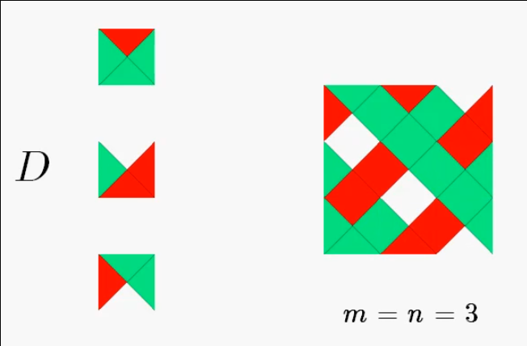
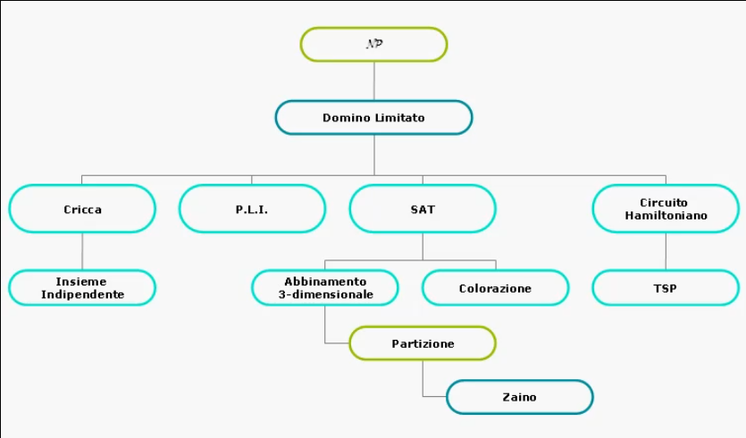

# Introduzione alla teoria della complessita'

## Problemi facili e difficili: strumenti di analisi

### Problemi computazionali e certificati polinomiali

Partendo dalla definizione di **Domino Limitato** e' possibile determinare quando un problema e' facile o difficile:
> Dati un intero positivo _n_ ed un insieme finito _D_ di _m_ tipi di **tessere orientate** e' possibile ricoprire un'area quadrata di lato _n_ con copie delle tessere in _d_ in modo che:
> * Nessuna tessera sia ruotata;
> * Una particolare tessera _d ∈ D_ occupi la posizione piu' in basso a sinistra;
> * Due tessere che si toccano abbiano i lati adiacenti dello stesso colore.

Una **tessera orientata** e' un quadrato di lato unitario diviso in quattro parti dalle diagonali, con ciascun quarto colorato con un colore.



Un algoritmo per la soluzione del domino limitato che prova tutte le combinazioni dovra' generare _m<sup>n<sup>2</sup>-1</sup>_ combinazioni, dunque ha una complessita' superpolinomiale.

Sfortunatamente, non e' noto un algoritmo di soluzione migliore di quello che prova tutte le soluzioni. Rientra dunque nella classe di **problemi difficili** come i problemi seguenti:
* **Problema della colorazione (versione decisionale)**:
  * Dato un grafo non orientato ed un intero _k_, e' possibile colorare i nodi del grafo usando al piu' _k_ colori in modo che ogni nodo sia colorato con un colore diverso da tutti i nodi adiacenti?
* **Problema della cricca (versione decisionale)**:
  * Dato un grafo non orientato ed un intero _k_, esiste un sottoinsieme di almeno _k_ nodi tutti mutuamente adiacenti (da ogni nodo posso andare in tutti gli altri nodi appartenenti alla cricca)?
* **Problema del commesso viaggiatore (versione decisionale)**:
  * Date _n_ citta' e le distanze tra di esse, ed un intero _k_, e' possibile partire da una citta', attraversare ogni citta' esattamente una volta, e ritornare alla citta' di partenza percorrendo una distanza complessiva non superiore a _k_?

I problemi introdotti appartengono alla stessa classe di problemi computazionalmente correlati, ognuno puo' essere risolto in tempo superpolinomiale, ma nessun in tempo polinomiale.

Se **uno solo** fosse risolubile in tempo polinomiale allora lo sarebbero tutti.

La **tesi non dimostrata** e' che tale algoritmo polinommiale non esiste.

La soluzione di un problema in forma decisionale e' la risposta **si o no** a seconda che il dato d'ingresso soddisfi una certa proprieta'.

#### Certificato polinomiale
I problemi difficili hanno una caratteristica in comune, e' abbastanza facile certificare la corretteza di una soluzione.

Formalmente, per tutti questi problemi, esiste un **certificato polinomiale**: e' un algoritmo che, data una presunta soluzione del problema, verifica in tempo polinomiale che sia effettivamente una soluzione che fornisce la risposta **si**.

Esempio di certificato polinomiale per il problema del commesso viaggiatore:

Modellando il problema su grafo, una soluzione del problema e' una sequenza di _n_ nodi.
In **tempo lineare** si verifica che :
* Solo il nodo finale ed il nodo iniziale sono identici;
* I nodi sono tra loro effettivamente connessi;
* La somma delle distanze sia minore di _k_.


___

### Non determinismo ed enumerazione

Un algoritmo non deterministico e' un algoritmo che, al momento di effettuare una **decisione**, effettua sempre quella migliore, ossia quella che porta alla soluzione corretta.

Utilizzeremo, per indicare le decisioni, 3 istruzioni speciali:
* `choice(I)`: che sceglie arbitrariamente il migliore elemento dall'insieme finito _I_;
* `failure`: che blocca la computazione in uno stato di fallimento;
* `success`: che blocca la computazione in uno stato di successo.

L'istruzione `choice` puo' essere paragonata ad un oracolo che ad ogni chiamata indovina sempre la scelta giusta. Questa scelta puo' essere vista come se la `choice` facesse tante copie dell'algoritmo con parametri diversi, per ognuna trovasse la soluzione corrispondente e tra tutte le soluzioni scegliesse quella migliore.


L'algoritmo non deterministico utilizza un certificato polinomiale per **certificare** la correttezza della soluzione generata da una sequenza choice.

Esempio di algoritmo non deterministico per il problema della cricca:
```C
void ndcricca(grafo G=(N, A), int n, int k) {
    int i, j, h;
    boolean S[n];

    // creazione non deterministica della soluzione
    for(i = 0; i < n; i++) S[i] = choice({true, false});

    h = 0;
    for(i = 0; i < n; i++) {
        if(S[i]) {
        
            h++;
            for(j = 0; j < i - 1; j++)
                if(S[j] && (i,j) ∉ A) failure;
        }
    }

    // certificato polinomiale
    if(h >= k)
        success;
    else
        failure;
}
```

#### Albero delle scelte
Un algoritmo non deterministico e' caratterizzato da una computazione ad albero radicato, detto **albero delle scelte** dove:
* Un nodo interno rappresenta una **soluzione intermedia**;
* Una foglia rappresenta una **soluzione**.

#### Enumerazione
Poiche' il non determinismo **non e' realistico** occorre **simulare** il comportamento di un algoritmo non deterministico con uno deterministico.

Ossia, **generare** ed **esplorare** deterministicamente lo spazio delle soluzioni, **visitando sistematicamente** l'albero delle scelte che ha un numero superpolinomiale di nodi.

Un algoritmo enumerativo e' dunque un algoritmo che esegue una visita, quanto piu' possibile intelligente, dell'albero delle scelte.

Supponiamo che tutti i parametri siano globali nell'esempio enumerativo per il problema della cricca:
```C
void enum_cricca(int i ,int h) {
    int j;
    boolean cricca;

    if(i <= n) {
        S[i] = false;
        enum_cricca(i + 1, h);

        S[i] = true;

        for(j = 0; j < i - 1; j++)
            if(S[j] && (i, j) ∉ A) cricca = FALSE;

        if(cricca)
            if(h + 1 = k)
                success;
            else 
                enum_cricca(i + 1, h + 1);
    }
}
```

Per ridurre l'esplorazione si puo' sostituire il controllo `i <= n` con `k - h <= n - i + 1` dove:
* `n - i + 1`: e' il numero di nodi ancora da considerare;
* `k - h`: e' il numero di nodi mancanti per completare la cricca.

#### Algoritmi facili e difficili
Un problema e' **difficile** quando ammette solo un algoritmo enumerativo che, nel caso pessimo, esplora completamente l'albero delle scelte.

Un problema e' **facile** quando ammette un algoritmo capace di percorrere un cammino radice-foglia nell'albero delle scelte.   


___

## Classificazione di problemi computazionali

### Classi P e NP

Utilizziamo i concetti di problema facile e difficile per classificare i problemi computazionali rispetto al loro grado di difficolta'.

Un algoritmo polinomiale si comporta come un algoritmo non deterministico rispetto alla visita dell'albero delle scelte: ci si puo' chiedere se esiste una simulazione polinomiale di un algoritmo non deterministico, ma attualmente questo non e' noto.

Si e' individuata una classe di problemi detti **problemi NP-completi** per i quali:
* Si conoscono solo algoritmi polinomiali non deterministici;
* Non si conosce alcun algoritmo polinomiale deterministico;
* Se si trovasse un algoritmo polinomiale deterministico per uno solo dei problemi appartenenti alla classe, allora si potrebbe trovare un algoritmo per tutti gli altri problemi appartenenti alla classe.

#### Classe P
E' la classe di tutti i problemi decisionali che sono risolvibili in tempo polinomiale con algoritmi **deterministici**.

#### Classe NP
E' la classe di tutti i problemi decisionali che sono risolvibili in tempo polinomiale con algoritmi **non deterministici**.

#### Riducibilita' polinomiale
Dati A e B due problemi decisionali, si dice che **A si riduce in tempo polinomiale a B**, e si scrive **_A α B_**, se esiste una funzione _f_ di trasformazione:
> _f: (dati ingresso A) -> (dati ingresso B)_
tale che:
* _f_ e' computabile in tempo **polinomiale** con un algoritmo deterministico;
* _x_ e; un dato di ingresso per cui A ha risposta **SI, se e solo se _f(x)_ e' un dato di ingresso per cui B ha risposta SI**.


Osserviamo che dati A e B due problemi decisionali in NP, se _A α B_, allora significa che si trasforma un qualsiasi dato d'ingresso per A in un particolare ingresso per B. Inoltre:
* Se _B ∈ NP_ allora _A ∈ NP_;
* Se _B ∈ P_ allora _A ∈ P_;
* Se A e' _Ω(p(n))_ e _f_ e' _O(p(n))_ allora B e' _Ω(p(n))_.


#### Teorema di Cook-Levin
Problema:
> Esiste un particolare problema decisionale in NP tale che se si dimostrasse la sua appartenenza a P, allora dovrebbe risultare sicuramente P = NP?

Il teorema di Cook-Levin osserva che:
> Ogni problema in NP si riduce in tempo polinomiale al Domino Limitato.

Da questo teorema si possono evincere le conseguenze:
* P = NP se e solo se _Domino Limitato ∈ P_;
* A e' detto **NP-arduo** se _B α A_ per ogni _B ∈ NP_;
* A e' detto **NP-completo** se e' NP-arduo e _A ∈ NP_;


Grazie al teorema di Cook-Levin e' possibile derivare un procedimento per dimostrare che un problema decisionale A e' NP-completo:
* Dimostrare che _A ∈ NP_;
* Dimostrare che esiste un problema B NP-completo tale che _B α A_.

Non e' dunque necessario mostrare ogni volta che _B α A_ per ogni _B ∈ NP_.

Un albero di riduzioni tra problemi in NP:

