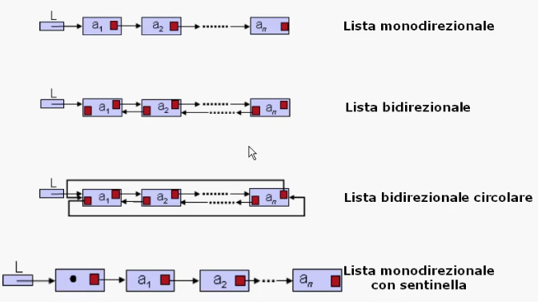
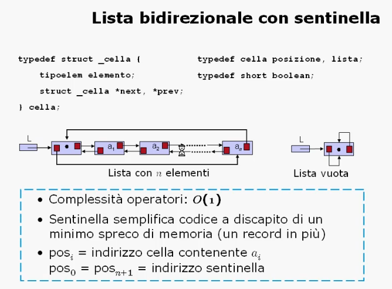
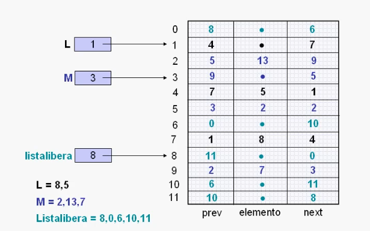
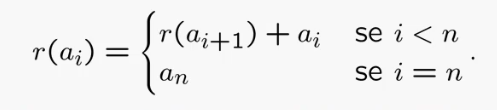
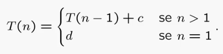

# Organizzazione dati di tipo lineare

## Liste

### Liste

Definizione:
> Una lista e' una sequenza di elementi dello stesso tipo, dove e' sempre possibile aggiungere o togliere elementi.

Le caratteristiche della lista sono:
* L'accesso solo al primo o all'ultimo elemento;
* L'accesso tramite scansione agli altri elementi.

Specifica sintattica:
* Tipi di dato:
  * Lista _L_;
  * Elementi della lista _a<sub>i</sub>_ di tipo _tipoelem_;
  * Posizioni relative di _a<sub>i</sub>_ e _a<sub>j</sub>_ tramite gli indici _p_ e _q_;
  * Booleano _b_;
  * Lista vuota Λ.
* Operatori specifici del tipo di dato lista:
  * crealista: `() -> lista`;
  * listavuota: `(lista) -> booleano`;
  * primolista: `(lista) -> posizione`;
  * ultimolista: `(lista) -> posizione`;
  * succlista: `(posizione, lista) -> posizione`;
  * predlista: `(posizione, lista) -> posizione`;
  * finelista: `(posizione, lista) -> posizione`;
  * leggilista: `(posizione, lista) -> tipoelem`;
  * scrivilista: `(tipoelem, posizione, lista) -> lista`;
  * inslista: `(tipoelem, posizione, lista) -> lista`;
  * canclista: `(posizione, lista) -> lista`.

Specifica semantica:
* `crealista() = L'`
  * post: _L' = Λ_
* `listavuota(L) = b`
  * post: vero solo se _L = Λ_
* `primolista(L) = p`
  * post: _p = posizione<sub>1</sub>_
* `ultimolista(L) = p`
  * post: _p = posizione<sub>n</sub>_
* `succlista(p, L) = q`
  * pre: _L = a<sub>1</sub>, a<sub>2</sub>, ..., a<sub>n</sub>_; _p = pos<sub>i</sub>_, _1<=i<=n_
  * post: _q = pos<sub>i+1</sub>_
* `predlista(p, L) = q`
  * pre: _L = a<sub>1</sub>, a<sub>2</sub>, ..., a<sub>n</sub>_; _p = pos<sub>i</sub>_, _1<=i<=n_
  * post: _q = pos<sub>i-1</sub>_
* `finelista(p, L) = b`
  * pre: _L = a<sub>1</sub>, a<sub>2</sub>, ..., a<sub>n</sub>_; _p = pos<sub>i</sub>_, _0<=i<=n+1_
  * post: _b_ vero solo se _p = pos<sub>0</sub> o pos<sub>n+1</sub>_
* `leggilista(p, L) = a`
  * pre: _L = a<sub>1</sub>, a<sub>2</sub>, ..., a<sub>n</sub>_; _p = pos<sub>i</sub>_, _1<=i<=n_
  * post: _a = a<sub>i</sub>_
* `scrivilista(a, p, L) = L'`
  * pre: _L = a<sub>1</sub>, a<sub>2</sub>, ..., a<sub>n</sub>_; _p = pos<sub>i</sub>_, _1<=i<=n_
  * post: _L' = a<sub>1</sub>, a<sub>2</sub>, ..., a<sub>i-1</sub>, a, a<sub>i+1</sub>, ..., a<sub>n</sub>_
* `inslista(a, p, L) = L'`
  * pre: _L = a<sub>1</sub>, a<sub>2</sub>, ..., a<sub>n</sub>_; _p = pos<sub>i</sub>_, _0<=i<=n+1_
  * post: 
    * _L' = a<sub>1</sub>, a<sub>2</sub>, ..., a<sub>i-1</sub>, a, a<sub>i+1</sub>, ..., a<sub>n</sub>_ se _1<=i<=n_;
    * _L' = a<sub>1</sub>, ..., a<sub>n</sub>, a_ se _i = n + i_;
    * _L' = a, a<sub>1</sub>, ..., a<sub>n</sub>_ se _i = 0_
* `canclista(p, L) = L'`
  * pre: _L = a<sub>1</sub>, a<sub>2</sub>, ..., a<sub>n</sub>_; _p = pos<sub>i</sub>_, _1<=i<=n_
  * post:_L' = a<sub>1</sub>, a<sub>2</sub>, ..., a<sub>i-1</sub>, a, a<sub>i+1</sub>, ..., a<sub>n</sub>_

Realizzazione con i puntatori:
* Memorizzare gli _n_ elementi in _n_ record, detti **celle** tali che l'_i_-esima cella contiene l'_i_-esimo elemento della lista e l'indirizzo (puntatore) della cella contenente l'elemento successivo;
* La prima cella e' indirizzata da una variabile **_L_** di tipo puntatore, mentre l'ultima cella contiene un valore convenzionale **_null_**.

Estensioni:
* **Sentinella**: cella aggiuntiva per gli estemi;
* **Bidirezionalita'**: ogni cella punta alla successiva e alla precedente;
* **Circolarita'**: l'ultima cella punta direttamente alla prima.






#### Cursori
Quando i puntatori non vengono forniti dal linguaggio di programmazione e' possibile realizzare una lista utilizzando un cursore:
> Un cursore e' una variabile intera il cui valore e' l'indice di un vettore che simula la memoria disponibile per i puntatori ->. Un cursore emula un puntatore.

In memoria, un vettore chiamato **spazio**:
* Contiene tutte le liste, ciascuna individuata da un proprio cursore iniziale;
* Contiene tutte le celle libere, organizzate anch'esse in una lista, detta **listalibera**.



### Programmare con le liste
#### Problema:

Il rango di un elemento di una lista e' definito come la somma del suo valore e dei valori degli elementi che lo seguono. Scrivere una procedura che data la lista iniziale **_L_** di interi produce una lista **_R_** dove il valore contenuto in ogni cella corrisponde al rango di **_L_**. Analizzare la complessita' dell'algoritmo proposto.

Formalizzazione del concetto di rango:
> Sia _a<sub>i</sub>_ l'elemento di _L_ in posizione _i_, _1<=i<=n. Allora la funzione che misura il rango puo' essere scritta come segue:



La formula ci suggerisce di scansionare la lista _L_ dall'ultima posizione mantenendo in una variabile la somma degli elementi scanditi. Ogni volta si va ad inserire il valore corrente come elemento della lista _R_.

#### Complessita' del problema
Secondo i metodi:
* Dimensione dell'input:
  * E' necessario scansionare l'intera lista _L_ che ha dimensione _n_, dunque la complessita' risulta _Ω(n)_;
* Eventi contabili:
  * Sono necessarie _n-1_ somme per calcolare il rango di ogni elemento, quindi la complessita' risulta _Ω(n)_.

#### Algoritmo iterativo

```C
void rango_i(lista L, lista R) {
    posizione p = ultimolista(L);
    int a = leggilista(p, L);

    crealista(R);
    inslista(a, primolista(R), R);
    p = predlista(p, L);

    while(!finelista(p, L)) {
        a += leggilista(p, L);
        inslista(a, primolista(R), R);
        p = predlista(p, L);
    }
}
```

La complessita' e' dominata dal ciclo `while` dove vengono utilizzati 5 operatori su lista.
Sapendo che tali operatori costano _O(1)_ possiamo dire che l'algoritmo `rango_i` ha complessita' _O(n)_.

#### Algoritmo ricorsivo

```C
void rango_r(posizione p, lista L) {
    int a = 0;

    if(finelista(succlista(p, L), L)) {
        a = leggilista(p, L);
    } else {
        a = rango_r(succlista(p, L), L);
        a += leggilista(p, L);
    }
    return(a);
}
```

Relazione di ricorrenza _T(n)_:


Per sostituzione otteniamo che:
_T(n)_ = _T(n-1) + c_

_T(n)_ = _T(n-2) + 2c_

_T(n)_ = _T(n-3) + 3c_

_T(n)_ = ...

_T(n)_ = _T(n - (n-1)) + (n-1)c_

_T(n) = _T(1) + (n-1)c_

_T(n) = _d + (n-1)c_

_T(n) = _cn + (d-c)_

_T(n)_ => _O(n)_

#### Conclusioni

Risulta che:
* La complessita' del problema e' _Ω(n)_
* La complessita' `rango_i` e' _O(n)_
* La complessita' `rango_r` e' _O(n)_

Dunque entrambi gli algoritmi sono ottimi.

___

## Pile

### Pile

Definizione:
> La pila e' una sequenza di elementi dello stesso tipo dove e' possibile aggiungere e togliere elementi soltanto dalla testa della sequenza (politica **LIFO**: Last In First Out).

Specifica sintattica:
* Tipi di dato:
  * Pila _P_;
  * Elementi della pila _a<sub>i</sub>_ di tipo _tipoelem_;
  * Booleano _b_;
  * Pila vuota Λ.
* Operatori specifici del tipo di dato pila:
  * creapila: `() -> pila`;
  * pilavuota: `(pila) -> booleano`;
  * leggipila: `(pila) -> tipoelem`;
  * fuoripila: `(pila) -> pila`;
  * inpila: `(tipoelem, pila) -> pila`.

Specifica semantica:
* `creapila() -> P'`
  * post: _P' = Λ_
* `pilavuota(P) = b`
  * post: _b = true_ solo se _P = Λ_
* `leggipila(P) = a`
  * pre: _P = a<sub>1</sub>, ..., a<sub>n</sub>_ con _n >= 1_
  * post: _a = a<sub>1</sub>_
* `fuoripila(P) = P'`
  * pre: _P = a<sub>1</sub>, ..., a<sub>n</sub>_ con _n >= 1_
  * post:
    * _P' = a<sub>2</sub>, ..., a<sub>n</sub>_ con _n >= 0_
    * _P' = Λ_ se _n = 1_
* `inpila(a, P) -> P'`
  * pre: _P = a<sub>1</sub>, ..., a<sub>n</sub>_ con _n >= 0_
  * post: _P' = a, a<sub>1</sub>, ..., a<sub>n</sub>_

#### Realizzazione con le liste
E' possibile usare il tipo di dato lista pe realizzare il tipo di dato pila ottenendo operatori di complessita' costante oppure **_O(1)_**:
* `creapila()` = `crealista()`;
* `pilavuota(P)` = `listavuota(P)`;
* `leggipila(P)` = `leggilista(primolista(P), P)`;
* `fuoripila(P)` = `canclista(primolista(P), P)`;
* `inpila(a, P)` = `inslista(a, primolista(P), P)`.

#### Realizzazione con vettore (senza puntatori)
Si memorizzano gli _n_ elementi della pila, in ordine inverso, nelle prime _n_ posizioni di un vettore **_maxlung_** elementi.

Si mantiene un cursore in testa alla pila, ovvero il cursore che indica la prima posizione libera:
* Pila vuota: cursore ha valore 0;
* Pila piena: cursore ha valore _maxlung_.

Esempio di implementazione con vettore:

```C
#define maxlung 100

typedef struct _pila {
    int testa;
    tipoelem elementi[maxlung];
} pila;

pila P;


void creapila(pila *P) {
    P->testa = 0;
}

boolean pilavuota(pila *P) {
    return(P->testa == 0);
}

tipoelem leggipila(pila *P) {
    if(!pilavuota(P))
        return(P->elementi[P->testa-1]);
}

void fuoripila(pila *P) {
    if(!pilavuota(P))
        P->testa--;
}

void inpila(tipoelem a, pila *P) {
    if(P->testa == maxlung)
        printf("Pila piena\n");
    else {
        P->elementi[P->testa] = a;
        P->testa++;
    }
}
```

___

### Programmare con le pile
#### Problema:

Consideriamo un sistema di esecuzione di lavori composto da un **servente** e da una **lista di lavori in attesa**.
Un servente e' un sistema che svolge un lavoro con un intervallo fisso di tempo prendendo i lavori dalla lista con una politica LIFO.
Data una lista _L_ di _n_ lavori e _T_ istanti di tempo, scrivere una procedura che simula lo svolgimento dei lavori e restituisce la lista _L_ con i lavori rimanenti ed il numero di lavori svolti.

#### Complessita' del problema
Secondo i metodi:
* Dimensione dell'input:
  * Nel caso pessimo il tempo _T_ permette l'esecuzione di tutti gli _n_ lavori in _L_, risulta quindi _Ω(n)_.
* Eventi contabili:
  * L'esecuzione degli _n_ lavori nel caso pessimo richiede almeno _n_ estrazioni dalla lista, risulta quindi _Ω(n)_.

#### Algoritmo iterativo

All'interno del ciclo `while` avremo:
* L'avanzamento del tempo;
* La gestione dell'arrivo di un nuovo lavoro nella lista _L_ modellata come una pila;
* La gestione del servente.

Supponiamo che esista una lista temporale di eventi con due operatori:
* `eventosucc(tempo t)`: restituisce l'evento successivo all'istante _t_.
* `inseriscievento(int id_evento, tempo t)`: inserisce nella lista al tempo _t_ l'evento identificato da _id\_evento_

```C
int simula_servente_LIFO(pila *L, tempo T) {
    int numLav = 0;
    evento *E;
    tempo t = 0;

    while(t <- T) {
        E = eventosucc(t);
        t = E->t;

        switch(E->id_evento) {
            case NEW_JOB:
                arrivolavoro(E, L, t);
                break;
            case SERVENTE_LIBERO:
                servente(E, L, &numLav, t);
                break;
        }
    }

    return(numLav);
}


void arrivolavoro(evento *E, pila *L, tempo t) {
    tempo delay = random_number();
    inpila(E->job, L);
    inseriscievento(NEW_JOB, E, t + delay);
}

void servente(evento *E, pila *L, int *numLav, tempo t) {
    int job;

    /*  servente libero;
     *  estraggo lavoro dalla pila, se non vuota,
     *  per darlo al servente
     */  

    (*numLav)++;

    if(!pilavuota(L)) {
        job = leggipila(L);
        fuoripila(L);
        inseriscievento(SERVENTE_LIBERO, E, t + tempo(job));
    }
    else inseriscievento(SERVENTE_LIBERO, E, t + WAIT_TIME);
}
```

Studiamo la complessita' della procedura proposta:
* Ipotizziamo che la pila _L_ non sia mai vuota;
* L'esecuzione e' dominata dal ciclo `while` che ne caso pessimo e' ripetuto _n_ volte;
* All'interno del ciclo vengono chiamate 2 procedure che utilizzano gli operatori sulla lista temporale e quelli sulla pila;
* Gli operatori su pila costano _O(1)_;
* Gli operatori su lista temporale costano:
  * `eventosucc`: _O(1)_;
  * `inseriscievento`: _O(n)_.

#### Conclusioni
L'algoritmo proposto ha dunque complessita' _O(n<sup>2</sup>)_, che non e' una complessita' ottima dato che il problema ha complessita' inferiore.

Esistono tuttavia dei tipi di dato che ci permettono di ridurre la complessita' da _O(n<sup>2</sup>)_ a _O(nlogn)_.