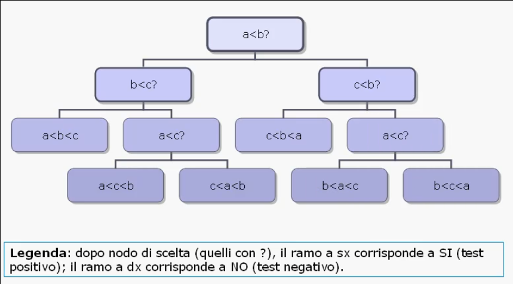
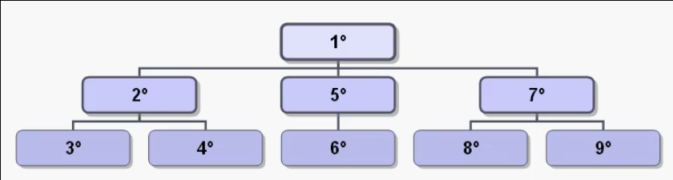
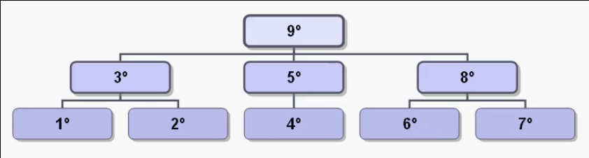
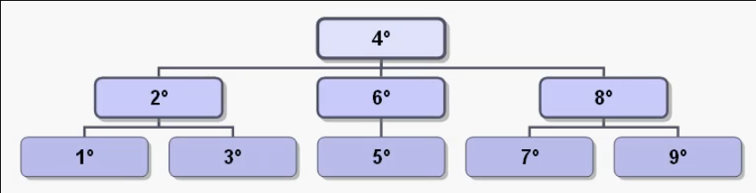
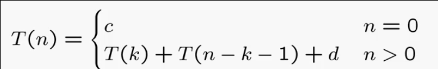
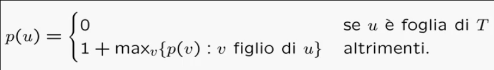
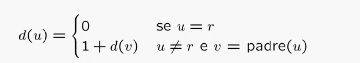

# Organizzazione dati di tipo albero

## Alberi

### Alberi: specifiche

Definizione:
> Sia dato un insieme finito ed ordinato di elementi detti **nodi**.
> Se tale insieme non e' vuoto, allora un particolare nodo e' designato come **radice**, ed i rimanenti nodi, se esistono, sono a loro volta separati in insiemi ordinati disgiunti (**partizione dei nodi**).
> Una struttura cosi' costruita e' detta **albero ordinato**, o piu' semplicemente albero.

Esempio di **albero decisionale** per ordinare 3 numeri _a_, _b_ e _c_ (_a !=b != c_):



Terminologia:
* Sia _T_ un albero di _n_ nodi di **radice** _r_;
* Se l'albero e' vuoto allora _T = Λ_;
* Siano _T<sub>1</sub>, ..., T<sub>k</sub> gli **insiemi disgiunti** non vuoti in cui sono partizionati i rimanenti _n -1_ nodi di _T_, aventi come radice i nodi _r<sub>1</sub>, ..., r<sub>k</sub>_;
* I nodi _r<sub>1</sub>, ..., r<sub>k</sub> sono detti anche **fratelli**;
* Ciascun _T<sub>i</sub> e' detto **sottoalbero** di _T_ mentre i nodi _r<sub>i</sub>_ sono detti **figli** di _r_, detto **padre**;
* Il generico nodo _u_ e' detto **foglia**;
* La radice e' l'unico nodo senza padre;
* Il **livello** di un nodo coincide con il numero di nodi che, ricorsivamente, sono i suoi padri.

Specifica sintattica:
* Operatori specifici del tipo di dato albero:
  * Operatori di creazione:
    * creaalbero: `() -> albero`;
  * Operatori di controllo:
    * foglia: `(nodo, albero) -> booleano`;
    * finefratelli: `(nodo, albero) -> booleano`;
  * Operatori di selezione:
    * radice: `(albero) -> nodo`;
    * padre: `(nodo, albero) -> nodo`;
    * primofiglio: `(nodo, albero) -> nodo`;
    * succfratello: `(nodo, albero) -> nodo`;
  * Operatori di interrogazione:
    * alberovuoto: `(albero) -> booleano`;
  * Operatori di modifica:
    * insradice: `(nodo, albero) -> albero`;
    * inssottoalbero: `(nodo, nodo, albero, albero) -> albero`;
    * cancsottoalbero: `(nodo, albero) -> albero`.

Specifica semantica:
* Operatori di creazione:
  * `creaalbero() = T'`
    * post: _T' = Λ_, albero vuoto
* Operatori di controllo:
  * `foglia(u, T) = b`
    * pre: _T != Λ_, _u_ nodo in _T_
    * post: _b = true_ se non esiste _v_ in _T_ tale che _u = padre(v, T)_; _b = false_ altrimenti
  * `finefratelli(u, T) = b`
    * pre: _T != Λ_, _u_ nodo in _T_ o _"sentintella" s_
    * post: _b = true_ se _u = s_; _b = false_ altrimenti
* Operatori di selezione:
  * `radice(T) = u`
    * pre: _T != Λ_
    * post: _u = r_
  * `padre(u, T) = v`
    * pre: _T != Λ_, _u_ nodo in _T_, _u != r_
    * post: _v_ padre di _u_ in _T_
  * `primofiglio(u, T) = v`
    * pre: _T != Λ_, _u_ nodo in _T_, _foglia(u, T) = false_
    * post: _v_ e' il primo figlio secondo la relazione di precedenza stabilita tra i figli di _u_
  * `succfratello(u, T) = v`
    * pre: _T != Λ_, _u_ nodo in _T_
    * post: _v_ nodo che segue _u_ nella relazione di precedenza (_v = s_ se _u_ e' l'ultimo fratello)
* Operatori di interrogazione:
  * `alberovuoto(T) = b`
    * post: _b = true_ se _T = Λ_; _b = false_ altrimenti
* Operatori di modifica:
  * `insradice(u, T) = T'`
    * pre: _T = Λ_
    * post: _T' = {u}_ con _u = r_, radice di _T_
  * `inssottoalbero(u, v, T, U) = T'`
    * pre: _T != Λ_, _U != Λ_, _u_ e _v_ nodi di _T_, _v_ figlio di _u_ oppure _v = u_
    * post: _T'_ ottenuto da _T_ aggiungendo _U_ come sottoalbero: 
      * Se _u != v_ la radice _z_ di _U_ diventa il nuovo fratello che segue _v_
      * Se _u = v_ la radice _z_ di _U_ dicenta il primo figlio di _u_
  * `cancsottoalbero(u, T) = T'`
    * pre: _T != Λ_, _u_ nodo in _T_
    * post: _T'_ ottenuto da _T_ eliminando il sottoalbero di radice _u_; _T = Λ_ se _u = r_

___

### Algoritmi di visita
Il tipo di dato albero e' fornito di algoritmi speciali che ne permettono la visita completa.
Gli **algoritmi di visita** seguono una regola di esplorazione che garantisce di visitare ogni nodo dell'albero una e una sola volta tramite **regole ricorsive**.

#### Previsita (preorder)
Consiste nell'esaminare la radice _r_ e poi la previsita di _T<sub>1</sub>, ..., T<sub>k</sub>_.


Implementazione:
```C
void previsita(nodo u, albero *T) {
    nodo v;
    # esame del nodo u per previsita
    if(!foglia(u, T)) {
        v = primofiglio(u, T);
        while(!finefratelli(v, T)) {
            previsita(v, T);
            v = succfratello(v, T);
        }
    }
}
```

#### Postvisita (postorder)
Consiste nell'effettuare nell'ordine la postvisita di _T<sub>1</sub>, ..., T<sub>k</sub>_ e poi nell'esaminare _r_.


Implementazione: 
```C
void postvisita(nodo u, albero *T) {
    nodo v;
    if(!foglia(u, T)) {
        v = primofiglio(u, T);
        while(!finefratelli(v, T)) {
            postvisita(v, T);
            v = succfratello(v, T);
        }
    }
    # esame del nodo u per postvisita
}
```

#### Invisita (inorder)
Fissato _i >= 1_, la invisita di _T_ consiste nell'effettuare nell'ordine la invisita di _T<sub>1</sub>, ..., T<sub>i</sub>_, nell'esaminare _r_ e poi nell'effettuare nell'ordine la invisita di _T<sub>i+1</sub>, ..., T<sub>k</sub>_.

Con _i = 1_:


Implementazione:
```C
void invisita(nodo u, albero *T) {
    nodo v;
    if(foglia(u, T))
        # esamina nodo u per invisita

    else {
        v = primofiglio(u, T);
        invisita(v, T);
        # esamina nodo u per invisita

        v = succfratello(v, T);
        while(!finefratelli(v, T)) {
            invisita(v, T);
            v = succfratello(v, T);
        }
    }
}
```

#### Complessita' degli algoritmi di visita
Supponendo che gli operatori utilizzati negli algoritmi di visita abbiano complessita' **_O(1)_**, la complessita' totale risulta dunque lineare nel numero dei nodi perche' questi vengono visitati una ed una sola volta ciascuno.

Tramite la tecnica di **induzione** possiamo dimostrare formalmente che la complessita' degli algoritmi di visita e' **_O(n)_**.

Supponendo di avere un albero _T_ completo con al piu' due figli per nodo, la complessita' degli algoritmi di visita risulta essere:


In particolare, quando il numero dei nodi e' maggiore di 0, l'algoritmo di visita chiama se stesso due volte (ciascuna su uno dei figli) con input di **K** nodi la prima volta e **n - k - 1** la seconda, tralasciando quindi il nodo radice.

Mostriamo per induzione che:

**_T(n) = (c + d)n + c_**

Per _n = 0_ la formula e' banalmente verificata; per _n > 0_ entra in gioco l'ipotesi induttiva osservando che _0 <= k <= n -1_.

_T(n)_ = 
* _T(k) + T(n - k - 1) + d_
* _((c + d)k + c) + ((c + d)(n - k - 1) + c) + d_
* _(c + d)n + c - (c + d) + c + d_
* _(c + d)n + c_

Dunque gli algoritmi di visita di un albero hanno complessita' _O(n)_.

___

### Alberi: realizzazioni

Esistono 3 possibili realizzazioni del tipo di dato albero:
* Vettore dei padri;
* Liste dei figli;
* Puntatori padre/primofiglio/fratello (p/p/f).


#### Vettore dei padri
Numerati i nodi di _T_ da _0_ a _n - 1_, allora il vettore dei padri _T_ e' un **vettore di cursori**: dove il cursore di un generico nodo _u_, con _0 <= u <= n - 1_ indica il padre di _u_.

Dunque:
* **_T[u] = v_**: se _v_ e' il padre di _u_;
* **_T[u] = 0_**: se _u_ e' la radice.

La realizzazione con il vettore dei padri consente di visitare facilmente i percorsi che partono da una foglia verso la radice, `padre(u, T)` e' _O(1)_.

Risulta invece particolarmente costoso passare da un nodo ai suoi figli, individuare il livello di un nodo, inserire e cancellare sottoalberi (in quanto non e' chiara la relazione di precedenza tra i fratelli).

In generale non e' una buona realizzazione tranne in alcune particolari applicazioni.

#### Liste dei figli
Numerati i nodi di _T_ da _0_ a _n - 1_, allora le liste dei figli di _T_ sono dei **vettori di puntatori a lista**, molto utili per facilitare la visita dei figli di un nodo: manteniamo una lista _L<sub>u</sub>_ contenente i figli del nodo _u_, con _0 <= u <= n - 1_.

Memorizziamo il puntatore (o il cursore) alla lista di ciascun figlio all'interno di un vettore di modo che: **_T[u] = L_**, dove _L_ e' la lista dei figli di _u_.

Dunque la realizzazione con liste dei figli risulta comoda per l'accesso ai figli di un nodo in quanto e' chiara la relazione di precedenza tra i fratelli, pero' `padre(u, T)` e `succfratello(u, T)` hanno complessita' lineare _O(n)_ in quanto nel caso pessimo occorre scorrere tutte le liste.

Non e' una buona realizzazione.

#### Puntatori p/p/f
Per migliorare l'efficienza degli operatori `padre(u, T)`, `succfratello(u, T)` e `inssottoalbero(u, v, T, U)` si possono introdurre le seguenti informazioni in cascun nodo:
* Un campo che identifica il padre del nodo;
* Un campo che identifica il primo filgio;
* Un campo che identifica il fratello successivo.

Questa comoda realizzazione introduce due nuovi operatori specifici.

Specifica semantica:
* legginodo: `(nodo, albero) -> tipoelem`;
* scrivinodo: `(tipoelem, nodo, albero) -> albero`.

Specifica sintattica:
* `legginodo(u, T) = a`
  * pre: _T != Λ_, _u_ nodo in _T_
  * post: _a_ e' valore memorizzato in _u_
* `scrivinodo(a, u, T) = T'`
  * pre: _T != Λ_, _u_ nodo in _T_
  * post: _T'_ e' ottenuto da _T_ scrivendo il valore _a_ nel nodo _u_

Con la presente realizzazione ogni operatore ha complessita' _O(1)_.

Solo l'operatore `cancsottoalbero` ha complessita' _O(n)_ per due motivi:
* Per cancellare un sottoalbero e' necessario aggiornare i puntatori (per un rapido aggiornamento occorrerebbe un puntatore al fratello precedente);
* E' necessario anche liberare la memoria in precedenza utilizzata, quindi nel caso pessimo in cui va cancellato tutto l'albero tranne la radice bisogna visitare _n - 1_ nodi.

Questa implementazione risulta la migliore.

___

### Programmare con gli alberi

#### Problema 1:
Si definisce la **profondita'** di un albero ordinato come il massimo livello delle sue foglie. Fornire una funzione in C che calcoli in tempo ottimo la profondita' di un albero ordinato _T_ di _n_ nodi.

#### Complessita' del problema 1
* Per determinare il livello massimo occorre identificare una foglia;
* Per identificare una foglia possiamo applicare l'operatore `foglia(u, T)`, che e' un confronto

Possiamo applicare il metodo degli eventi contabili, risulta necessario effettuare almeno _n_ confronti, dunque la complessita' e' _Ω(n)_.

#### Algoritmo ricorsivo 1
Definiamo la profondita' ricorsivamente come:



La relazione _p(u)_ suggerisce l'utilizzo di un algoritmo basato sulla **postvisita** visto che le informazioni vengono raccolte dalle foglie verso il padre.

```C
int maxProf(nodo u, albero T) {
  nodo v;
  int max, tmp;

  if(foglia(u, T))
    return(0);
  else {
    v = primofiglio(u, T);
    max = 0;
    while(!finefratelli(v, T)) {
      tmp = maxProfR(v, T);
      max = (tmp > max ? tmp : max);
      v = succfratello(v, T);
    }
    return(max + 1);
  }
}
```

#### Conclusioni 1
L'algoritmo adatta lo schema generale di postvisita per un albero ordinato.

Per ogni chiamata vengono fatte solo operazioni in tempo costante (se si assume una realizzazione con puntatori p/p/f).

L'algoritmo ha complessita' _O(n)_ quindi e' ottimo.


#### Problema 2
La distanza _d(u) di un nodo _u_ dalla radice _r_ in un albero ordinato e' dato dal livello del nodo _u_ in _T_.

Fornire una funzione in C che calcoli in tempo ottimo le distanze degli _n_ nodi in un albero ordinato _T_.

#### Complessita' del problema 2
La distanza _d(u)_ puo' essere definita risorsivamente come:



Per determinare la distanza di un singolo nodo, nel caso pessimo, dovro' visitare tutti i nodi dell'abero. Quindi per il metodo di dimensione dell'input ogni algorimo deve visitare tutti gli _n_ nodi, pertanto la complessita' e' _Ω(n)_.

#### Algoritmo ricorsivo 2 
La relazione di ricorrenza ci suggerisce una **previsita**, ossia un passaggio di informazioni dal padre verso i figli.

```C
void distanzaNodo(nodo u, albero T, int *D) {
  nodo v;

  if(u == radice(T))
    D[u] = 0;
  else 
    D[u] = 1 + D[padre(u)];

  v = primofiglio(u, T);
  while(!finefratelli(v, T)) {
    distanzaNodo(v, T, D);
    v = succfratello(v, T);
  }
}
```

#### Conclusioni 2
L'algoritmo adatta lo schema generale di previsita per un albero ordinato.

Per ogni chiamata vengono fatte solo oeprazioni in tempo costante (se si assume una realizzazione con puntatori p/p/f).

L'algoritmo ha complessita' _O(n)_ quindi e' ottimo.

___

### Alberi binari
Definizione:
> Un albero binario e' un particolare albero ordinato in cui ogni nodo _u_ ha al piu' due figli e si distingue tra figlio sinistro e figlio destro di _u_.

In particolare due alberi binari con stessi nodi, radice e figli per nodo possono essere distinti qualora un nodo _u_ sia designato come figlio sinistro del nodo _v_ nel primo albero e figlio destro del nodo _v_ nel secondo albero.

Specifica sintattica:
* Operatori comuni con gli alberi ordinati:
  * `creabinalbero = crealbero`
  * `binalberovuoto = alberovuoto`
  * `binradice = radice`
  * `binpadre = padre`
  * `cancsottobinalbero = cancsottoalbero`
  * `legginodo = legginodo`
  * `scrivinodo = scrivinodo`
* Operatori specifici degli alberi binari:
  * figliosinistro: `(nodo, binalbero) -> nodo`
  * figliodestro: `(nodo, binalbero) -> nodo`
  * sinistrovuoto: `(nodo, binalbero) -> booleano`
  * destrovuoto: `(nodo, binalbero) -> booleano`
  * costrbinalbero: `(binalbero, binalbero) -> binalbero`

Specifica semantica:
* `constrbinalbero(T, U) = T'`
  * post: T' e' ottenuto introducendo un nuovo nodo _u_ che diventa la radice di _T'_, che ha come sottoalbero sinistro _T_ e come sottoalbero destro _U_:
    * se _T = Λ_, _u_ non ha figlio sinistro;
    * se _U = Λ_, _u_ non ha figlio destro.

Schema generale di visita derivato da quello dell'albero ordinato:
```C
void binvisita(nodo u, binalbero T) {
  # esame anticipato di u per previsita

  if(!sinistrovuoto(u, T))
    binvisita(figliosinistro(u, T), T);

  # esame simmetrico di u per invisita

  if(!destrovuoto(u, T))
    binvisita(figliodestro(u, T), T);

  # esame differito di u per postvisita
}
```

La complessita' dello schema di visita, di qualunque tipo, e' lineare.

#### Realizzazione
Con la realizzazione con puntatori di tipo p/sx/dx, ogni nodo di un albero binario contiene:
* Valore del nodo;
* Puntatore al padre;
* Puntatore al figlio sinistro;
* Puntatore al figlio destro.

```C
typedef struct _bincella {
  tipoelem valore;
  struct _bincella *sx, *dx, *padre;
} bincella;

typedef *bincella binalbero;
typedef *bincella nodo;

binalbero T;


void creabinalbero(binalbero T) {
  T = NULL;
}

boolean binalberovuoto(binalbero T) {
  return(T == NULL):
}

nodo binradice(binalbero T) {
  if(!binalberovuoto(T))
    return(T);
}

nodo binpadre(nodo u, binalbero T){
  if(!binalberovuoto(T))
    return(u->padre);
}

nodo figliosinistro(nodo u, binalbero T){
  if(!binalberovuoto(T))
    return(u->sx);
}

nodo figliodestro(nodo u, binalbero T){
  if(!binalberovuoto(T))
    return(u->dx);
}

boolean sinistrovuoto(nodo u, binalbero T){
  if(!binalberovuoto(T))
    return(u->sx == NULL);
}

boolean destrovuoto(nodo u, binalbero T){
  if(!binalberovuoto(T))
    return(u->dx == NULL);
}

binalbero constrbinalbero(binalbero T, binalbero U) {
  nodo u;
  u = malloc(sizeof(bincella));
  u->padre = NULL;
  u->sx = T;
  u->dx = U;

  if(!binalberovuoto(T))
    T->padre = u;
  if(!binalberovuoto(U))
    U->padre = u

  return(u);
}
```

Tutti gli operatori hanno complessita' _O(1)_.

