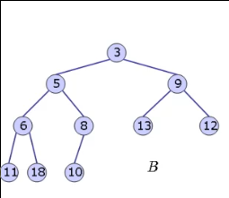
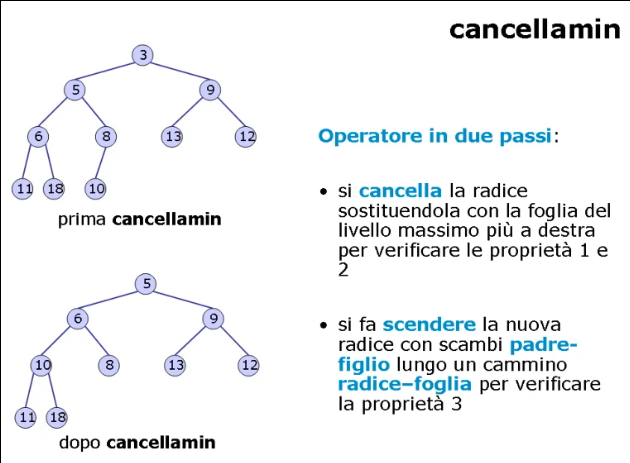
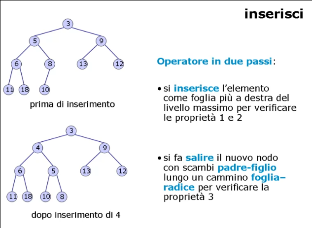

# Organizzazione dati di tipo albero

## Alberi

### Alberi: specifiche

Definizione:
> Sia dato un insieme finito ed ordinato di elementi detti **nodi**.
> Se tale insieme non e' vuoto, allora un particolare nodo e' designato come **radice**, ed i rimanenti nodi, se esistono, sono a loro volta separati in insiemi ordinati disgiunti (**partizione dei nodi**).
> Una struttura cosi' costruita e' detta **albero ordinato**, o piu' semplicemente albero.

Esempio di **albero decisionale** per ordinare 3 numeri _a_, _b_ e _c_ (_a !=b != c_):


Terminologia:
* Sia _T_ un albero di _n_ nodi di **radice** _r_;
* Se l'albero e' vuoto allora _T = Λ_;
* Siano _T<sub>1</sub>, ..., T<sub>k</sub> gli **insiemi disgiunti** non vuoti in cui sono partizionati i rimanenti _n -1_ nodi di _T_, aventi come radice i nodi _r<sub>1</sub>, ..., r<sub>k</sub>_;
* I nodi _r<sub>1</sub>, ..., r<sub>k</sub> sono detti anche **fratelli**;
* Ciascun _T<sub>i</sub> e' detto **sottoalbero** di _T_ mentre i nodi _r<sub>i</sub>_ sono detti **figli** di _r_, detto **padre**;
* Il generico nodo _u_ e' detto **foglia**;
* La radice e' l'unico nodo senza padre;
* Il **livello** di un nodo coincide con il numero di nodi che, ricorsivamente, sono i suoi padri.

Specifica sintattica:
* Operatori specifici del tipo di dato albero:
  * Operatori di creazione:
    * creaalbero: `() -> albero`;
  * Operatori di controllo:
    * foglia: `(nodo, albero) -> booleano`;
    * finefratelli: `(nodo, albero) -> booleano`;
  * Operatori di selezione:
    * radice: `(albero) -> nodo`;
    * padre: `(nodo, albero) -> nodo`;
    * primofiglio: `(nodo, albero) -> nodo`;
    * succfratello: `(nodo, albero) -> nodo`;
  * Operatori di interrogazione:
    * alberovuoto: `(albero) -> booleano`;
  * Operatori di modifica:
    * insradice: `(nodo, albero) -> albero`;
    * inssottoalbero: `(nodo, nodo, albero, albero) -> albero`;
    * cancsottoalbero: `(nodo, albero) -> albero`.

Specifica semantica:
* Operatori di creazione:
  * `creaalbero() = T'`
    * post: _T' = Λ_, albero vuoto
* Operatori di controllo:
  * `foglia(u, T) = b`
    * pre: _T != Λ_, _u_ nodo in _T_
    * post: _b = true_ se non esiste _v_ in _T_ tale che _u = padre(v, T)_; _b = false_ altrimenti
  * `finefratelli(u, T) = b`
    * pre: _T != Λ_, _u_ nodo in _T_ o _"sentintella" s_
    * post: _b = true_ se _u = s_; _b = false_ altrimenti
* Operatori di selezione:
  * `radice(T) = u`
    * pre: _T != Λ_
    * post: _u = r_
  * `padre(u, T) = v`
    * pre: _T != Λ_, _u_ nodo in _T_, _u != r_
    * post: _v_ padre di _u_ in _T_
  * `primofiglio(u, T) = v`
    * pre: _T != Λ_, _u_ nodo in _T_, _foglia(u, T) = false_
    * post: _v_ e' il primo figlio secondo la relazione di precedenza stabilita tra i figli di _u_
  * `succfratello(u, T) = v`
    * pre: _T != Λ_, _u_ nodo in _T_
    * post: _v_ nodo che segue _u_ nella relazione di precedenza (_v = s_ se _u_ e' l'ultimo fratello)
* Operatori di interrogazione:
  * `alberovuoto(T) = b`
    * post: _b = true_ se _T = Λ_; _b = false_ altrimenti
* Operatori di modifica:
  * `insradice(u, T) = T'`
    * pre: _T = Λ_
    * post: _T' = {u}_ con _u = r_, radice di _T_
  * `inssottoalbero(u, v, T, U) = T'`
    * pre: _T != Λ_, _U != Λ_, _u_ e _v_ nodi di _T_, _v_ figlio di _u_ oppure _v = u_
    * post: _T'_ ottenuto da _T_ aggiungendo _U_ come sottoalbero: 
      * Se _u != v_ la radice _z_ di _U_ diventa il nuovo fratello che segue _v_
      * Se _u = v_ la radice _z_ di _U_ dicenta il primo figlio di _u_
  * `cancsottoalbero(u, T) = T'`
    * pre: _T != Λ_, _u_ nodo in _T_
    * post: _T'_ ottenuto da _T_ eliminando il sottoalbero di radice _u_; _T = Λ_ se _u = r_

___

### Algoritmi di visita
Il tipo di dato albero e' fornito di algoritmi speciali che ne permettono la visita completa.
Gli **algoritmi di visita** seguono una regola di esplorazione che garantisce di visitare ogni nodo dell'albero una e una sola volta tramite **regole ricorsive**.

#### Previsita (preorder)
Consiste nell'esaminare la radice _r_ e poi la previsita di _T<sub>1</sub>, ..., T<sub>k</sub>_.


Implementazione:
```C
void previsita(nodo u, albero *T) {
    nodo v;
    # esame del nodo u per previsita
    if(!foglia(u, T)) {
        v = primofiglio(u, T);
        while(!finefratelli(v, T)) {
            previsita(v, T);
            v = succfratello(v, T);
        }
    }
}
```

#### Postvisita (postorder)
Consiste nell'effettuare nell'ordine la postvisita di _T<sub>1</sub>, ..., T<sub>k</sub>_ e poi nell'esaminare _r_.


Implementazione: 
```C
void postvisita(nodo u, albero *T) {
    nodo v;
    if(!foglia(u, T)) {
        v = primofiglio(u, T);
        while(!finefratelli(v, T)) {
            postvisita(v, T);
            v = succfratello(v, T);
        }
    }
    # esame del nodo u per postvisita
}
```

#### Invisita (inorder)
Fissato _i >= 1_, la invisita di _T_ consiste nell'effettuare nell'ordine la invisita di _T<sub>1</sub>, ..., T<sub>i</sub>_, nell'esaminare _r_ e poi nell'effettuare nell'ordine la invisita di _T<sub>i+1</sub>, ..., T<sub>k</sub>_.

Con _i = 1_:


Implementazione:
```C
void invisita(nodo u, albero *T) {
    nodo v;
    if(foglia(u, T))
        # esamina nodo u per invisita

    else {
        v = primofiglio(u, T);
        invisita(v, T);
        # esamina nodo u per invisita

        v = succfratello(v, T);
        while(!finefratelli(v, T)) {
            invisita(v, T);
            v = succfratello(v, T);
        }
    }
}
```

#### Complessita' degli algoritmi di visita
Supponendo che gli operatori utilizzati negli algoritmi di visita abbiano complessita' **_O(1)_**, la complessita' totale risulta dunque lineare nel numero dei nodi perche' questi vengono visitati una ed una sola volta ciascuno.

Tramite la tecnica di **induzione** possiamo dimostrare formalmente che la complessita' degli algoritmi di visita e' **_O(n)_**.

Supponendo di avere un albero _T_ completo con al piu' due figli per nodo, la complessita' degli algoritmi di visita risulta essere:


In particolare, quando il numero dei nodi e' maggiore di 0, l'algoritmo di visita chiama se stesso due volte (ciascuna su uno dei figli) con input di **K** nodi la prima volta e **n - k - 1** la seconda, tralasciando quindi il nodo radice.

Mostriamo per induzione che:

**_T(n) = (c + d)n + c_**

Per _n = 0_ la formula e' banalmente verificata; per _n > 0_ entra in gioco l'ipotesi induttiva osservando che _0 <= k <= n -1_.

_T(n)_ = 
* _T(k) + T(n - k - 1) + d_
* _((c + d)k + c) + ((c + d)(n - k - 1) + c) + d_
* _(c + d)n + c - (c + d) + c + d_
* _(c + d)n + c_

Dunque gli algoritmi di visita di un albero hanno complessita' _O(n)_.

___

### Alberi: realizzazioni

Esistono 3 possibili realizzazioni del tipo di dato albero:
* Vettore dei padri;
* Liste dei figli;
* Puntatori padre/primofiglio/fratello (p/p/f).


#### Vettore dei padri
Numerati i nodi di _T_ da _0_ a _n - 1_, allora il vettore dei padri _T_ e' un **vettore di cursori**: dove il cursore di un generico nodo _u_, con _0 <= u <= n - 1_ indica il padre di _u_.

Dunque:
* **_T[u] = v_**: se _v_ e' il padre di _u_;
* **_T[u] = 0_**: se _u_ e' la radice.

La realizzazione con il vettore dei padri consente di visitare facilmente i percorsi che partono da una foglia verso la radice, `padre(u, T)` e' _O(1)_.

Risulta invece particolarmente costoso passare da un nodo ai suoi figli, individuare il livello di un nodo, inserire e cancellare sottoalberi (in quanto non e' chiara la relazione di precedenza tra i fratelli).

In generale non e' una buona realizzazione tranne in alcune particolari applicazioni.

#### Liste dei figli
Numerati i nodi di _T_ da _0_ a _n - 1_, allora le liste dei figli di _T_ sono dei **vettori di puntatori a lista**, molto utili per facilitare la visita dei figli di un nodo: manteniamo una lista _L<sub>u</sub>_ contenente i figli del nodo _u_, con _0 <= u <= n - 1_.

Memorizziamo il puntatore (o il cursore) alla lista di ciascun figlio all'interno di un vettore di modo che: **_T[u] = L_**, dove _L_ e' la lista dei figli di _u_.

Dunque la realizzazione con liste dei figli risulta comoda per l'accesso ai figli di un nodo in quanto e' chiara la relazione di precedenza tra i fratelli, pero' `padre(u, T)` e `succfratello(u, T)` hanno complessita' lineare _O(n)_ in quanto nel caso pessimo occorre scorrere tutte le liste.

Non e' una buona realizzazione.

#### Puntatori p/p/f
Per migliorare l'efficienza degli operatori `padre(u, T)`, `succfratello(u, T)` e `inssottoalbero(u, v, T, U)` si possono introdurre le seguenti informazioni in cascun nodo:
* Un campo che identifica il padre del nodo;
* Un campo che identifica il primo filgio;
* Un campo che identifica il fratello successivo.

Questa comoda realizzazione introduce due nuovi operatori specifici.

Specifica semantica:
* legginodo: `(nodo, albero) -> tipoelem`;
* scrivinodo: `(tipoelem, nodo, albero) -> albero`.

Specifica sintattica:
* `legginodo(u, T) = a`
  * pre: _T != Λ_, _u_ nodo in _T_
  * post: _a_ e' valore memorizzato in _u_
* `scrivinodo(a, u, T) = T'`
  * pre: _T != Λ_, _u_ nodo in _T_
  * post: _T'_ e' ottenuto da _T_ scrivendo il valore _a_ nel nodo _u_

Con la presente realizzazione ogni operatore ha complessita' _O(1)_.

Solo l'operatore `cancsottoalbero` ha complessita' _O(n)_ per due motivi:
* Per cancellare un sottoalbero e' necessario aggiornare i puntatori (per un rapido aggiornamento occorrerebbe un puntatore al fratello precedente);
* E' necessario anche liberare la memoria in precedenza utilizzata, quindi nel caso pessimo in cui va cancellato tutto l'albero tranne la radice bisogna visitare _n - 1_ nodi.

Questa implementazione risulta la migliore.

___

### Programmare con gli alberi

#### Problema 1
Si definisce la **profondita'** di un albero ordinato come il massimo livello delle sue foglie. Fornire una funzione in C che calcoli in tempo ottimo la profondita' di un albero ordinato _T_ di _n_ nodi.

#### Complessita' del problema 1
* Per determinare il livello massimo occorre identificare una foglia;
* Per identificare una foglia possiamo applicare l'operatore `foglia(u, T)`, che e' un confronto

Possiamo applicare il metodo degli eventi contabili, risulta necessario effettuare almeno _n_ confronti, dunque la complessita' e' _Ω(n)_.

#### Algoritmo ricorsivo 1
Definiamo la profondita' ricorsivamente come:


La relazione _p(u)_ suggerisce l'utilizzo di un algoritmo basato sulla **postvisita** visto che le informazioni vengono raccolte dalle foglie verso il padre.

```C
int maxProf(nodo u, albero T) {
  nodo v;
  int max, tmp;

  if(foglia(u, T))
    return(0);
  else {
    v = primofiglio(u, T);
    max = 0;
    while(!finefratelli(v, T)) {
      tmp = maxProfR(v, T);
      max = (tmp > max ? tmp : max);
      v = succfratello(v, T);
    }
    return(max + 1);
  }
}
```

#### Conclusioni 1
L'algoritmo adatta lo schema generale di postvisita per un albero ordinato.

Per ogni chiamata vengono fatte solo operazioni in tempo costante (se si assume una realizzazione con puntatori p/p/f).

L'algoritmo ha complessita' _O(n)_ quindi e' ottimo.


#### Problema 2
La distanza _d(u) di un nodo _u_ dalla radice _r_ in un albero ordinato e' dato dal livello del nodo _u_ in _T_.

Fornire una funzione in C che calcoli in tempo ottimo le distanze degli _n_ nodi in un albero ordinato _T_.

#### Complessita' del problema 2
La distanza _d(u)_ puo' essere definita risorsivamente come:


Per determinare la distanza di un singolo nodo, nel caso pessimo, dovro' visitare tutti i nodi dell'abero. Quindi per il metodo di dimensione dell'input ogni algorimo deve visitare tutti gli _n_ nodi, pertanto la complessita' e' _Ω(n)_.

#### Algoritmo ricorsivo 2 
La relazione di ricorrenza ci suggerisce una **previsita**, ossia un passaggio di informazioni dal padre verso i figli.

```C
void distanzaNodo(nodo u, albero T, int *D) {
  nodo v;

  if(u == radice(T))
    D[u] = 0;
  else 
    D[u] = 1 + D[padre(u)];

  v = primofiglio(u, T);
  while(!finefratelli(v, T)) {
    distanzaNodo(v, T, D);
    v = succfratello(v, T);
  }
}
```

#### Conclusioni 2
L'algoritmo adatta lo schema generale di previsita per un albero ordinato.

Per ogni chiamata vengono fatte solo oeprazioni in tempo costante (se si assume una realizzazione con puntatori p/p/f).

L'algoritmo ha complessita' _O(n)_ quindi e' ottimo.

___

### Alberi binari
Definizione:
> Un albero binario e' un particolare albero ordinato in cui ogni nodo _u_ ha al piu' due figli e si distingue tra figlio sinistro e figlio destro di _u_.

In particolare due alberi binari con stessi nodi, radice e figli per nodo possono essere distinti qualora un nodo _u_ sia designato come figlio sinistro del nodo _v_ nel primo albero e figlio destro del nodo _v_ nel secondo albero.

Specifica sintattica:
* Operatori comuni con gli alberi ordinati:
  * `creabinalbero = crealbero`
  * `binalberovuoto = alberovuoto`
  * `binradice = radice`
  * `binpadre = padre`
  * `cancsottobinalbero = cancsottoalbero`
  * `legginodo = legginodo`
  * `scrivinodo = scrivinodo`
* Operatori specifici degli alberi binari:
  * figliosinistro: `(nodo, binalbero) -> nodo`
  * figliodestro: `(nodo, binalbero) -> nodo`
  * sinistrovuoto: `(nodo, binalbero) -> booleano`
  * destrovuoto: `(nodo, binalbero) -> booleano`
  * costrbinalbero: `(binalbero, binalbero) -> binalbero`

Specifica semantica:
* `constrbinalbero(T, U) = T'`
  * post: T' e' ottenuto introducendo un nuovo nodo _u_ che diventa la radice di _T'_, che ha come sottoalbero sinistro _T_ e come sottoalbero destro _U_:
    * se _T = Λ_, _u_ non ha figlio sinistro;
    * se _U = Λ_, _u_ non ha figlio destro.

Schema generale di visita derivato da quello dell'albero ordinato:
```C
void binvisita(nodo u, binalbero T) {
  # esame anticipato di u per previsita

  if(!sinistrovuoto(u, T))
    binvisita(figliosinistro(u, T), T);

  # esame simmetrico di u per invisita

  if(!destrovuoto(u, T))
    binvisita(figliodestro(u, T), T);

  # esame differito di u per postvisita
}
```

La complessita' dello schema di visita, di qualunque tipo, e' lineare.

#### Realizzazione
Con la realizzazione con puntatori di tipo p/sx/dx, ogni nodo di un albero binario contiene:
* Valore del nodo;
* Puntatore al padre;
* Puntatore al figlio sinistro;
* Puntatore al figlio destro.

```C
typedef struct _bincella {
  tipoelem valore;
  struct _bincella *sx, *dx, *padre;
} bincella;

typedef *bincella binalbero;
typedef *bincella nodo;

binalbero T;


void creabinalbero(binalbero T) {
  T = NULL;
}

boolean binalberovuoto(binalbero T) {
  return(T == NULL):
}

nodo binradice(binalbero T) {
  if(!binalberovuoto(T))
    return(T);
}

nodo binpadre(nodo u, binalbero T){
  if(!binalberovuoto(T))
    return(u->padre);
}

nodo figliosinistro(nodo u, binalbero T){
  if(!binalberovuoto(T))
    return(u->sx);
}

nodo figliodestro(nodo u, binalbero T){
  if(!binalberovuoto(T))
    return(u->dx);
}

boolean sinistrovuoto(nodo u, binalbero T){
  if(!binalberovuoto(T))
    return(u->sx == NULL);
}

boolean destrovuoto(nodo u, binalbero T){
  if(!binalberovuoto(T))
    return(u->dx == NULL);
}

binalbero constrbinalbero(binalbero T, binalbero U) {
  nodo u;
  u = malloc(sizeof(bincella));
  u->padre = NULL;
  u->sx = T;
  u->dx = U;

  if(!binalberovuoto(T))
    T->padre = u;
  if(!binalberovuoto(U))
    U->padre = u

  return(u);
}
```

Tutti gli operatori hanno complessita' _O(1)_.

___

### Programmare con gli alberi binari

[Problema 1](#problema-1)
[Complessita' del problema 1](#complessita-del-problema-1)

#### Algoritmo ricorsivo binario 1
```C
int profondita(nodo u, binalbero T) {
  int p1, p2, max;

  if(sinistrovuoto(u, T) && destrovuoto(u, T))
    return(0);

  else {
    if(!sinistrovuoto(u, T)) 
      p1 = profondita(figliosinistro(u, T));
    if(!destrovuoto(u, T))
      p2 = profondita(figliodestro(u, T));
    
    max = (p1 > p2 ? p1 : p2);
    return(max + 1);
  }
}
```

[Problema 2](#problema-2)
[Complessita' del problema 2](#complessita-del-problema-2)

#### Algoritmo ricorsivo binario 1
```C
void distanzanodo(nodo u, binalbero T, int *D) {
  if(u == binradice(T))
    D[u] = 0;
  else
    D[u] = 1 + D[binpadre(u)];

  if(!sinistrovuoto(u, T))
    distanzanodo(figliosinistro(u, T), T, D);
  if(!destrovuoto(u, T))
    distanzanodo(figliodestro(u, T), T, D);
}
```

#### Considerazioni
Gli algoritmi proposti modificano lo schema generale di visita per un albero binario.

Ad ogni chiamata vengono datte solo operazioni in tempo costante (se si assume una realizzazione con puntatori p/sx/dx).

La complessita' degli algoritmi e' _O(n)_ quindi sono ottimi.

___

### Alberi binari e complessita' dei problemi

Quando dobbiamo analizzare la complessita' di problemi che richiedono strutture dati ad albero per essere risolti, i metodi di dimensione dei dati e degli eventi contabili risultano poco potenti.
L'**albero di decisione** invece si rivela un metodo ideale in quanto:
> Gli alberi di decisione sono alberi binari che permettono la formazione di un processo decisionale dove ad ogni scelta corrispondono al piu' 2 alternative.

In un albero cosi' composto risultano:
* Nodi con figli: confronti tra dati del problema;
* Coppie padre-figlio: risultati dei confronti;
* Foglie: soluzioni possibili del problema.

#### Alberi di decisione e complessita'
Un percorso **radice -> foglia** rappresenta una **sequenza di confronti** effettuati per raggiungere una soluzione.

Il livello massimo di una foglia misura il numero dei confronti effettuati nel caso pessimo, ovvero e' una **misura di complessita'**.

Dunque un albero di decisione che minimizza il livello massimo delle foglie fornisce una **limitazione inferiore** al numero di decisioni che ogni algoritmo deve effettuare nel caso pessimo per risolvere il problema data.

#### Esempio con l'ordinamento
Un qualsiasi algoritmo di ordinamento esegue una sequenza di scelte per individuare la soluzione tra le _n!_ possibili permutazioni degli _n_ dati in ingresso: dunque l'albero decisionale corrispondente ha almeno _n!_ foglie.

Considerato che ad ogni livello, i nodi al piu' raddoppiano, la **lunghezza massima del percorso radice -> foglia non puo' essere inferiore a _log<sub>2</sub>n!_**.

E' possibile effettuare una _minorazione_ di _n!_: otteniamo quinidi la limitazione inferiore alla complessita' di **_Ω(nlogn)_**.


___

## Heap

### Coda di priorita'

Definizione:
> Una **coda di priorita'** e' un particolare insieme di elementi sul quale e' definita una relazione "_<=_" di ordinamento totale. In una coda di priorita' e' possibile inserire un nuovo elemento ed estrarre il minimo.

Specifica sintattica:
* Operatori specifici per il tipo di dato coda di priorita':
  * creaprioricoda: `() -> (prioricoda)`;
  * inserisci: `(tipoelem, prioricoda) -> (prioricoda)`;
  * min: `(prioricoda) -> tipoelem`;
  * cancellamin: `(prioricoda) -> (prioricoda)`.

Specifica semantica:
* `creaprioricoda() = C`
  * post: _C = Λ_, con _Λ_ coda vuoda
* `inserisci(x, C) = C'`
  * post: _C' = C ∪ {x}_
* `min(C) = x`
  * pre: _C != Λ_
  * post: _x_ e' il valore minimo di _C_
* `cancellamin(C) = C'`
  * pre: _C != Λ_
  * post: _C' = C \ {x}_, con _x = min(C)_

E' possibile realizzare una coda di priorita' di _n_ elementi utilizzando una lista:
* Nel caso di **liste ordinate**: gli operatori `min` e `cancellamin` sono _O(1)_ mentre `inserisci` e' _O(n)_;
* Nel caso di **liste non ordinate**: `inserisci` e' _O(1)_ mentre `min` e `cancellamin` sono _O(n)_.

Gli operatori hanno un costo sbilanciato a seconda della scelta di implementazione. Qualora potessimo imporre un limite superiore mediante una costante rispetto al numero di elementi della coda di priorita' sarebbe possibile rendere uniforme la complessita' degli operatori con una implementazione che usa un vettore chiamato **Heap**.

Principi alla base dell'implementazione con l'Heap:
* Disporre gli elementi della coda _C_ in un vettore _H_ (Heap) affinche' essi possano essere interpretati come un albero binario _B_;
* Ciascun **nodo di _B_** corrisponde ad una **posizione di _H_** che memorizza un **elemento di _C_**;
* L'albero _B_ deve verificare 3 proprieta:
  * Se _h_ e' il livello massimo delle foglie, allora ci sono esattamente _2<sup>h</sup> - 1_ nodi di livello minore di _h_;
  * Tutte le foglie di livello _h_ sono addossate a sinistra;
  * Ogni nodo contiene un elemento di _C_ che e' maggiore di quello contenuto dal padre.



Osservazioni:

L'albero ottenuto e' un **albero quasi completo** in quanto:
* Ciascun livello _k_ contiene tutti i possibili **_2<sup>k</sup>_** nodi;
* Tutti i nodi al massimo sono a sinistra;

Pertanto gli **_n_ nodi di _B_** corrispongono alle prime **_n_ posizioni del vettore _H_** tale che:
* La **radice** di _B_ corrisponde alla prima posizione di _H_;
* Il **figlio sinistro** del nodo in _i_ e' in posizione _2i_;
* Il **figlio destro** del nodo in _i_ e' in posizione _2i + 1_.

Inoltre:
* Il figlio sinistro di _i_ non esiste se _2i > n_;
* Il figlio destro di _i_ non esiste se _2i + 1 > n_;
* Il padre di _i_ e' in posizione _floor(i/2)_;
* _H[2i] > H[i]_;
* _H[2i + 1] > H[i]_.

In particolare per realizzare gli operatori `min`, `cancellamin` e `inserisci` e' **piu' semplice operare sull'albero _B_ che sul vettore _H_**.





La complessita' degli operatori `cancellamin` e `inserisci` risulta essere _O(logn)_ infatti provocano una sequenza di scambi lunga quanto un cammino radice-foglia in una albero binario.
L'operatore `min` e' _O(1)_.

___

### Heapsort

L'algoritmo SelectionSort, che al passo _i_-esimo seleziona il minimo tra gli elementi rimanenti per porto nella _i_-esima posizione ordinata, ha complessita' _O(n<sup>2</sup>)_.

```C
void SelectionSort(int *A, int n) {
  int i, m, t;

  for(i=0; i<n; i++) {
    m = min(A, i, n-1);
    t = A[i];
    A[i] = A[m];
    A[m] = t;
  }
}

int min(int *A, int j, int k) {
  int i, m;

  m = j;
  for(i=j+1; i<=k; i++) {
    m = (A[i]<m ? i : m);
  }
  return(m);
}
```

La complessita' dell'algoritmo SelectionSort dipende dalla complessita' dell'estrazione dell'elemento minimo che viene fatto ad ogni passo.

Per ridurre la complessita' dell'estrazione e' possibile introdurre una struttura dati di tipo Heap: dunque se nello schema del SelectionSort introduciamo l'Heap, otteniamo l'algoritmo HeapSort.

```C
void HeapSort_base(int *A, int n) {
  prioricoda C;
  int i;

  /* Creazione e riempimento dell'Heap */
  creaprioricoda(C);
  for(i=0; i<n; i++) {
    inserisci(A[i], C);
  }

  /* Estrazione dall'Heap ed inserimento nel vettore A */
  for(i=0; i<n; i++) {
    A[i] = min(C);
    cancellamin(C);
  }
}
```
Avendo costruito l'Heap con la coda di priorita' la procedura proposta e' _O(nlogn)_.

Dall'applicazione degli alberi decisionali sappiamo che la complessita' del problema di ordinamento e' _Ω(nlogn)_, dunque l'algoritmo HeapSort ha complessita' ottima.

#### Ottimizzazione dell'implementazione base
Osserviamo che la procedura base necessita di un doppio trasferimento di dati tra vettore e Heap, il che comporta uno spreco di memoria. E' possibile implementare l'algoritmo affinche l'ordinamento venga effettuato sullo stesso vettore iniziale _A_.

Idea:
* Estrarre ogni volta il massimo per scambiarlo con il valore contenuto nell'ultima posizione A;
* Dovendo ordinare A in modo crescente, si inverte la proprieta' 3 dedgli Heap che diventa: "_Ogni padre e' maggiore dei propri figli_", con la radice dell'Heap che contiene il valore massimo.

Introduciamo anche la funzione `restauraheap` che serve a sistemare la sezione di A, che rappresenza lo Heap, coinvolta nell'estrazione del massimo. Questa garantisce che:
* Ad ogni passo la proprieta' 3 venga rispettata;
* Partendo dalla nuova radice (procedendo dall'ultima foglia di destra) si fa il confronto con i figli e si esegue lo scambio con il nodo maggiore dei figli se esso e' minore del valore del padre.


La funzione `restauraheap` e' una funzione ricorsiva e si basa, sul caso pessimo, sulla discesa di un nodo dalla radice fino alla foglia.

La complessita' risultante e' _O(m)_ con _m_ l'altezza del nodo _i_.

L'**altezza di un nodo** e' la sua posizione rispetto all'albero dove:
* Una foglia ha altezza = 0;
* Un nodo non foglia ha altezza = massimo altezze figli + 1;


Vediamo la procedura HeapSort nella sua versione completa ed ottimizzata.

```C
void HeapSort(int *A, int n) {
  int i;
  tipoelem temp;

  /* Costruzione dell'Heap */
  costruisciheap(A, n-1);

  /* Estrazione del massimo e sostituzione con l'ultima posizione del vettore */
  for(i=n-1; i>0; i--) {
    temp = A[i];
    A[i] = A[1];
    A[1] = temp;

    restauraheap(A, 0, i-1);
  }
}
```

E' possibile realizzare la `costruisciheap` in tempo lineare _O(n)_ utilizzando la `restauraheap`.

Dato che la `costruisciheap` e' _O(n)_ e inoltre eseguo una `restauraheap` che e' _O(logn)_ per ognuno dei primi _n -1_ elementi, la complessita' della procedura HeapSort e' _O(nlogn)_, dunque ha complessita' ottima.