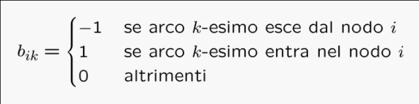
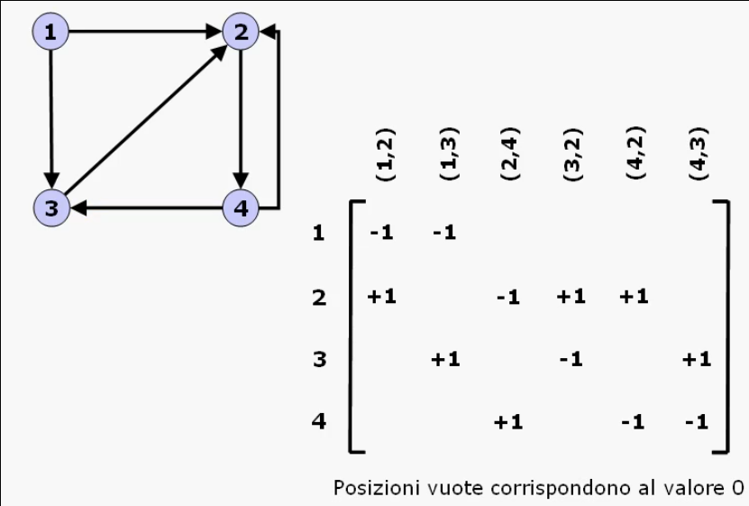
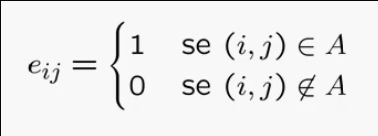
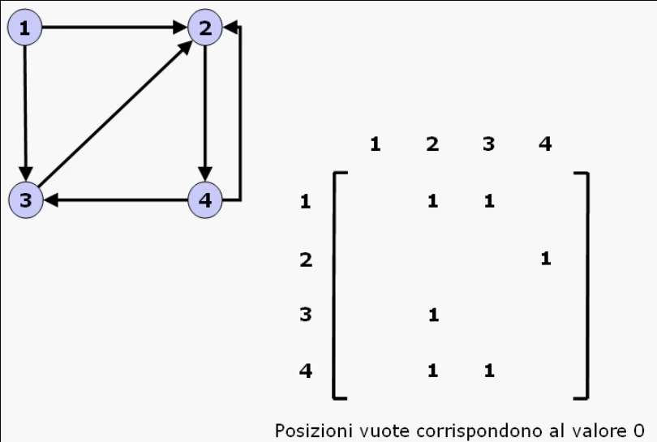
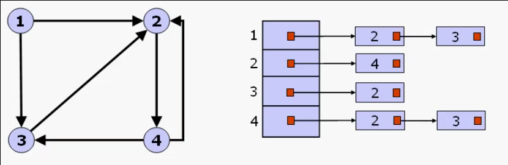

# Organizzazione dati di tipo reticolare

## Grafi

### Definizione e modelli

Definizione del modello matematico Grafo:
> Un **grafo orientato** e' una coppia _G = (N, A)_ dove:
> * _N_: insieme finito di elementi detti **nodi** o **vertici**;
> * _A_: insieme finito di coppie ordinate di nodi, detti **archi**.
> 
> Indichiamo con _n_ il numero di nodi ed _m_ il numero di archi; otteniamo quindi _0 <= m <= n(n - 1)_ poiche' da ogni nodo possono uscire al piu' _n - 1_ archi.
> 
> Un **grafo non orientato** e' un grafo dove l'insieme _A_ e' composto da coppie non ordinate _[i, j]_:
> * La coppia di archi **non orientati** _[i, j]_ e _[j, i]_ individuano lo stesso arco;
> * Nei grafi orientati, la coppia di archi _(i, j)_ e _(j, i)_ indicano due archi diversi.
>
> I grafi non orientati servono per **modellare relazioni simmetriche tra oggetti**.

#### Cammini e catene

Definizione di cammino in un grafo orientato:
> Dato un grafo orientato _G_, un **cammino** e' una sequenza di nodi _u<sub>0</sub>, ..., u<sub>k</sub>_ tale che l'arco _(u<sub>i</sub>, u<sub>i+1</sub>)_ ϵ _A_, per _i = 0, ..., k - 1_:
> * Se non ci sono nodi ripetuti, ovvero _u<sub>i</sub> != u<sub>j</sub>_, con _0 <= i < j <= k_, il cammino e' detto **semplice**;
> * Se _u<sub>0</sub> = u<sub>k</sub>_ allora il cammino e' detto **chiuso**;
> * Un cammino semplice e chiuso, con unica ripetizione _u<sub>0</sub> = u<sub>k</sub>_, e' detto **ciclo**.

Definizione di catena in un grafo non orientato:
> Dato un grafo non orientato _G'_, una **catena** e' una sequenza di nodi _u<sub>0</sub>, ..., u<sub>k</sub>_ tale che _[u<sub>i</sub>, u<sub>i+1</sub>]_ ∈ _A_, per _i = 0, ..., k - 1_:
> * Se non ci sono nodi ripetuti, ovvero _u<sub>i</sub> != u<sub>j</sub>_, con _0 <= i < j <= k_, la catena e' detto **semplice**;
> * Se _u<sub>0</sub> = u<sub>k</sub>_ allora la catena e' detta **chiusa**;
> * Una catena semplice e chiusa, con unica ripetizione _u<sub>0</sub> = u<sub>k</sub>_, e' detta **circuito**.

#### Connessioni

> Un grafo orientato e' **fortemente connesso** se per ogni coppia di nodi _u_ e _v_ esiste almeno un cammino da _u_ a _v_ ed almeno un cammino da _v_ a _u_.
> 
> Qualora la condizione non si verifichi il grafo non si puo' dire fortemente connesso.

> Un grafo non orientato e' **connesso** se per ogni coppia di nodi distinti _u_ e _v_ esiste una catena tra _u_ e _v_.


#### Relazioni con gli alberi

Esiste una relazione tra grafi non orientati ed alberi in quanto:
* Un albero e' detto **libero** quando non e' individuato un nodo come radice;
* Un grafo non orientato e' un albero libero se e' connesso e per ogni coppia di nodi esiste una ed una sola catena semplice;
* Un albero libero e' un grafo connesso con minimo numero di archi, cioe' _n - 1_.

___

### Specifica e realizzazioni

**Specifica sintattica**:
* creagrafo: `() -> grafo`;
* grafovuoto: `(grafo) -> booleano`;
* insnodo: `(nodo, grafo) -> grafo`;
* insarco: `(nodo, nodo, grafo) -> grafo`;
* cancnodo: `(nodo, grafo) -> grafo`;
* cancarco: `(nodo, nodo, grafo) -> grafo`;
* adiacenti: `(nodo, grafo) -> insieme`;


**Specifica semantica**:
* `creagrafo() = G`
  * post: _G = (N, A)_, con _N = A = Ø_
* `grafovuoto(G) = b`
  * post: _b = true_ solo se _N = A = Ø_
* `insnodo(u, G) = G'`
  * pre: _G = (N, A)_, con _u ∉ N_
  * post: _G' = (N', A)_, con _N' = N ∪ {u}_
* `insarco(u, v, G) = G'`
  * pre: _G = (N, A)_, con _u, v ∈ N_ e _(u, v) ∉ A_
  * post:  _G' = (N, A')_, con _A' = A ∪ { (u, v) }_
* `cancnodo(u, G) = G'`
  * pre: _G = (N, A)_, con _u ∈ N_ e _∃! v_ tale che _(u, v) ∈ A o (v, u) ∈ A_
  * post: _G' = (N', A)_, con _N' = N \\ {u}_
* `cancarco(u, v, G) = G'`
  * pre: _G = (N, A)_, con _u, v ∈ N_ e _(u, v) ∈ A_
  * post: _G' = (N, A')_, con _A' = A \\ { (u, v) }_
* `adiacenti(u, G) = A(u)`
  * pre: _G = (N, A)_, con _u ∈ N_
  * post: _A(u) = { v ∈ N : (u, v) ∈ A }_

#### Applicazioni
In molte applicazioni ai nodi e/o agli archi possono essere associate una serie di informazioni aggiuntive dette **etichette** o **pesi**;

In tal caso la specifica data dovra' essere estesa con gli operatori adatti a manipolare tali informazioni, ad esempio:
* `insnodo(p, u, G) = G'`
  * pre: _G = (N, A)_, con _u ∉ N_ e _p ∈ **N**_
  * post: _G' = (N', A)_, con _N' = N ∪ {u} e p<sub>u</sub> = p_


#### Realizzazioni
La realizzazione piu' intuitiva di un grafo e' quella che fa uso di matrici per rappresentare le relazioni tra nodi e/o archi, in particolare distinguiamo due realizzazioni:
* Matrice di **incidenza** nodi-archi;
* Matrice di **adiacenza** nodi-nodi.

##### Matrice di incidenza nodi-archi
E' una matrice rettangolare _B = [b<sub>ik</sub>]_ di dimensione _n x m_, dove:
* Ciascuna **riga** rappresenta un **nodo**;
* Ciascuna **colonna** rappresenta un **arco**.



Esempio:



Osserviamo che:
* Lo **spazio di memoria** occupato e' _O(nm)_;
* Determinare l'insieme di adiacenza e' complicato:
  * Occorre scandire la riga corrispondente al nodo _u_ di _B_ per trovare le posizioni con valore pari a _-1_;
  * Per ciascuna di queste posizioni occorre poi scandire la colonna per trovare i valori a _+1_.
* La **complessita' del calcolo di A(u)** e' _O(nm)_.

##### Matrice di adiacenza nodi-nodi
E' una matrice quadrata _E = [e<sub>ij</sub>]_ di dimensione _n x n_ tale che:



Esempio:



Osserviamo che: 
* Se si tratta di un grafo "non orientato" _E_ risulta simmetrica;
* Lo **spazio di memoria** occupato e' _O(n<sup>2</sup>)_;
* Il calcolo di _A(u)_ si semplifica notevolmente rispetto alle matrici di incidenza in quanto basta scandire la riga corrispondente;
* La scansione di tutti gli archi costa _O(n<sup>2</sup>)_;

Si possono apporre delle migliorie a questa rappresentazione mantenendo esplicitamente le **liste di adiacenza** per ogni nodo del grafo (caso particolare: **vettore di adiacenza**):



Supponendo di non dover inserire ne cancellare nodi, si possono usare i vettori di adiacenza:
* Vettore nodi:
  * Con _n + 1_ posizioni, le prime per gli _n_ nodi e l'ultima per la sentinella;
  * nodi[i] contiene un cursore alla posizione di archi a partire dal quale e' memorizzato _A(i)_.
* Vettore archi.


Nei casi di implementazione tramite liste o vettori di adiacenza:
* Lo **spazio di memoria** occupato e' _O(n + m)_;
* La **scansione di A(u)** e' _O( |A(u)| )_;
* L'**appartenenza ad un arco (u, v)** e' _O( |A(u)| )_.

Verra' utilizzato un **costrutto speciale**:
```C
for each v ∈ A(u) {
    /* elaborazione su nodo v */
}
```
Se non indicato diversamente, la scansione di _A(u)_ si effettua scorrendo i nodi per etichetta crescente.