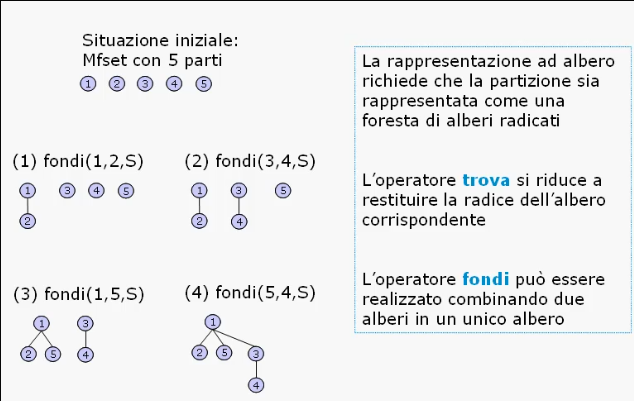
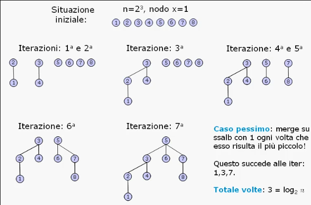

# Organizzazione dati di tipo orizzontale

## Insiemi

### Specifica e realizzazioni

Definizione:
> Un inieme e' una collezione di elementi **distinti** ma dello **stesso tipo**.
> E' la struttura matematica fondamentale e puo' essere descritto in due modi:
> * Elencando tutti gli elementi: _X = {1, 2, 3}_;
> * Definendo una proprieta' che caratterizza tutti gli elementi: _X = {x ∈ N : 1 <= x <= 3}_.

Ci sono delle affinita' tra gli insiemi e le liste, ma anche delle differenze sostanziali:
* Gli elementi di un insieme non sono caratterizzati da una posizione realativa;
* Non sono ammesse puo' copie dello stesso elemento nel medesimo insieme.

Gli insiemi, in quanto strutture matematiche dispongono di operatori specifici:
* Appartenenza: _x ∈ A_;
* Non-appartenenza: _x ∉ A_;
* Inclusione stretta: _A ⊆ B_;
* Non-inclusione stretta: _A ⊈ B_;
* Inclusione: _A ⊂ B_;
* Non-inclusione: _A ⊄ B_;
* Unione: _A ⋃ B_;
* Intersezione: _A ⋂ B_;
* Differenza: _A − B_.

Specifica sintattica:
* creainsieme: `() -> insieme`;
* insiemevuoto: `(insieme) -> booleano`;
* appartiene: `(tipoelem, insieme) -> booleano`;
* unione: `(insieme, insieme) -> insieme`;
* intersezione: `(insieme, insieme) -> insieme`;
* differenza: `(insieme, insieme) -> insieme`;
* inserisci: `(tipoelem, insieme) -> insieme`;
* cancella: `(tipoelem, insieme) -> insieme`.

Specifica semantica:
* `creainsieme() = A`
  * post: _A = ∅_
* `insiemevuoto(A) = b`
  * post: _b = true_ solo se _A = ∅_
* `appartiene(x, A) = b`
  * post: _b = true_ solo se _x ∈ A_
* `unione(A, B) = C`
  * post: _C = A ⋃ B_
* `intersezione(A, B) = C`
  * post: _C = A ⋂ B_
* `differenza(A, B) = C`
  * post: _C = A − B_
* `inserisci(x, A) = A'`
  * post: _A' = A ⋃ {x}_; se _x ∈ A_ allora _A' == A_
* `cancella(x, A) = A'`
  * post: _A' = A \ {x}_; se _x ∉ A_ allora _A' == A_

#### Realizzazione con vettore booleano:
* Si suppone che gli elementi dell'insieme siano identificabili univocamente con i numeri compresi tra _0_ e _n - 1_;
* Un insieme _A_ allora puo' essere rappresentato con un vettore booleano di _n_ posizioni in un cui la _k-esima_ posizione e' _true_ (1) se _k ∈ A_, altrimenti _false_ (0);

Con questa rappresentazione:
* Gli operatori `appartiene`, `inserisci` e `cancella` hanno complessita' _O(1)_;
* Tutti gli altri operatori invece sono O(n);
* La realizzazione risulta efficace solo per **strutture statiche** ovvero non vengono usati operatori di tipo `unione`, ecc;
* In generale c'e' un grande spreco di memoria che rende questa rappresentazione poco efficiente.

#### Realizzazione con liste non ordinate:
* Con un struttura dinamica non c'e' spreco di memoria;
* Gli elementi dell'insieme possono essere di un tipo qualsiasi;
* Gli oprtatori `creainsieme` e `insiemevuoto` sono _O(1)_;
* Gli operatori `appartiene`, `inserisci` e `cancella` sono _O(n)_;
* Gli operatori `unione`, `intersezione` e `differenza` sono _O(nm)_.
* Si tratta dunque di un'implementazione poco efficiente.

#### Realizzazione con liste ordinate:
* Se sugli elementi dell'insieme e' definita una relazione di ordinamento totale (ad esempio "<="), l'insieme puo' essere rappresentato con una lista ordinata per valori crescenti degli elementi;
* Gli operatori _O(nm)_ con liste non ordinate, migliorano a _O(n+m)_ che risulta essere ottima in quanto il problema della fusione di due sequenze ordinate ha complessita' _Ω(n+m)_;
* Gli oepratori lineari non modificano pero' la loro complessita'.

___

### Programmare con gli insiemi

#### Problema 
Dato un vettore di _n_ posizioni a valori in 0 e 1, scrivere due procedure per convertire il vettore nel corrispondente insieme realizzato con una lista non ordinata e una lista ordinata, rispettivamente.

#### Complessita' del problema
* Dimensione dell'input:
  * Il numero minimo di operazioni che qualsiasi algoritmo deve fare e' quello di scandire l'intero vettore per determinare l'appartenenza degli elementi all'ineieme, quinid risulta _Ω(n)_;
* Eventi contabili:
  * Per creare l'insieme occorron almeno _n_ inserimenti, risulta quindi:
    * _Ω(n)_ con le liste non ordinate;
    * _Ω(n<sup>2</sup>)_ con le liste ordinate.


#### Realizzazione in C

```C
insieme * creainsieme(vettore *V, int n) {
    int i;
    insieme *A;

    creainsieme(A);

    for(i = 0; i < n; i++)
        if(V[i])
            /* L'implementazione dell'operatore inserisci determina la complessita' della procedura */
            inserisci(i, A);
    
    return(A);
}

/* Per liste non ordinate */
void inserisci(tipoelem x, insieme A) {
    inslista(x, primolista(A), A);
}

/* Per liste ordinate */
void inserisci(tipoelem x, insieme A) {
    posizione p = primolista(A);

    while(leggilista(p, A) < x && !finelista(succlista(p, A), A))
        p = succlista(p, A);
    
    inslista(x, p, A);
}
```

#### Osservazioni
L'operatore `inserisci` nel caso di liste non ordinate ha complessita' costante, mentre nel caso di liste ordinate ha complessita' lineare.

L'algoritmo risulta avere complessita' ottima in entrambi i casi:
  * _O(n)_ con le liste non ordinate;
  * _O(n<sup>2</sup>)_ con le liste ordinate.

___

### Mfset
L'Mfset e' una particolare realizzazione per il tipo di dato insieme e sta per **Merge-Find-Set**.

Definizione:
> L'Mfset rappresenta una partizione di un insieme finito in sottoinsiemi disguinti, dette **componenti** o **parti**.
> Le operazioni ammesse permettono di stabilire a quale componente appartiene un generico elemento e di unire due componenti distinte.

Specifica sintattica:
* creamfset: `(insieme) -> mfset`;
* trova: `(tipoelem, mfset) -> componente`;
* fondi: `(tipoelem, tipoelem, mfset) -> mfset`.

Specifica semantica:
* `creamfset(A) = S`
  * post: _S_ e' partizione di sottoinsiemi _C<sub>i</sub>_ con _i = 1, ..., n_ ed _n = | A |_ di _A_
* `trova(x, S) = C`
  * pre: _∃ i = 1, ..., n : x ∈ C<sub>i</sub>_
  * post: _C = C<sub>i</sub>_
* `fondi(x, y, S) = S'`
  * pre: _trova(x, S) != trova(y, S)_
  * post: _S'_ e' composto da _S_ meno le componenti che contengono _x_ e _y_ piu' una nuova componente creata unendo le componenti che contengono _x_ e _y_

In particolare l'Mfset:
* Non prevede la cancellazione e l'inserzione di elementi;
* L'unica inserzione e' quella in fase di creazione con l'operatore `creamfset`.
  
L'implementazione efficiente con operatori Mfset realizza ogni componente _C<sub>i</sub>_ come un albero.



#### Complessita'

Per realizzare gli operatori ipotizziamo che sia possibile accedere direttamente ai nodi di ogni albero (o componente):
* L'operatore `trova` si realizza salendo i padri lungo un percorso da un generico nodo sino ad arrivare alla radice;
* L'operatore `fondi` si comporta in maniera analoga imponendo che una delle due radici divenga il nuovo figlio dell'altra.

Vediamo come entrambi gli operatori prevedono di risalire il cammino nodo-radice, dunque una misura di complessita' degli operatori e' data dal livello massimo delle foglie di ciascun albero.

Per ridurre il livello massimo delle foglie basta scegliere come radice di una "fondi" quella relativa alla componente con maggior numero di nodi, imponendo quindi che la radice dell'abero con minor numero di nodi divenga un nuovo figlio della radice di quello piu' grande.

In una sequenza di fusioni nelle quali un generico elemento _x_ puo' essere coinvolto, il livello di _x_ puo':
* **Non variare** se _x_ appartiene all'albero piu' grande;
* **Aumenta di 1** se _x_ appartiene all'albero piu' piccolo:
  * In particolare il numero di nodi della nuova componente ottenuta con "fondi" e' almeno il doppio di quelli dell'albero a cui apparteneva _x_.

Considerato che inizialmente ci sono _n = |A|_ componenti di un unico elemento, le componenti piu' piccole alle quali _x_ puo' appartenere e che saranno impegnate in una fusione, sono al piu' **_O(logn)_**.

Vediamo in un esempio quante volte, un generico nodo _x_, viene coinvolto in un `fondi` che alza il livello del nodo _x_.



Considerato che inizialmente il generico elemento _x_ e' al livello _0_ e ad ogni fusione il livello delle foglie dell'albero piu' piccolo aumenta di _1_, allora il **livello del nodo _x_** risulta essere **_O(logn) nel caso pessimo_**.

Quindi la complessita' degli operatori `trova` e `fondi` e' _O(logn)_.

#### Realizzazione
Supponiamo che l'insieme sia formato dagli interi da _1 a n_ e che l'insieme _A_ denoti anche la sua cardinalita', quindi _A = n_.

La foresta di alberi che modella le componenti di un Mfset puo' essere **rappresentata con un unico vettore dei padri** in cui ciascun nodo, ogni volta che diventa radice, puntera' a se stesso.

Il vettore `dim` sara' utilizzato per mantenere le dimensioni di ogni singola componente individuata tramite il valore della propria radice.

```C
# define maxlung 100

typedef int tipoelem;
typedef tipoelem, insieme, componente, cardinalita;

typedef struct _mfset {
    tipoelem padre;
    cardinalita dim;
} mfset;

insieme A;
mfset S[maxlung];

void creamfset(insieme A, mfset *S) {
    tipoelem i;

    for(i = 0; i < A; i++) {
        S[i].padre = i;
        S[i].dim = 1;
    }
}

componente trova(tipoelem x, mfset *S) {
    componente y;

    if(S[x].padre == x)
        y =x;
    else
        y = trova(S[x].padre, S);

    return(y);
}

void fondi(tipoelem x, tipoelem y, mfset *S) {
    componente i = trova(x, S);
    componente j = trova(y, S);

    if(i != j) {
        if(S[i].dim < S[j].dim) {
            S[i].padre = j;
            S[i].dim += S[i].dim;
        } else {
            S[j].padre = i;
            S[i].dim += S[j].dim;
        }
    }
}
```

La **tecnica di compressione dei percorsi** e' uno strumento per ridurre la complessita' media: consiste nel rendere figlio della radice ogni nodo che viene incontrato da `trova` nel percorso di risalita dal generico nodo _x_ alla radice.

Il blocco `else` viene modificato:

```C
componente trova(tipoelem x, mfset *S) {
    componente y;

    if(S[x].padre == x)
        y =x;
    else
        y = S[x].padre = trova(S[x].padre, S);

    return(y);
}
```

___

## Dizionari

#### Dizionari con vettori ordinati

Un dizionario e' un caso particolare del tipo di dato "insieme", dove gli elementi sono detti **chiavi**, in cui e' possibile:
* Verificare l'appartenenza di una chiave;
* Inserire una nuova chiave;
* Cancellare una chiave.

Le specifiche dei dizionari sono identiche a quelle degli insiemi.

La realizzazione con vettori ordinati prevede un cursore che punta all'ultima posizione occupata e le chiavi sono **memorizzate** in posizioni contigue e in ordine crescente a partire dalla prima posizione.

La peculiarita' del tipo di dato dizionario e' quella di trarre vantaggio dall'ordinamento delle chiavi per verificare l'appartenenza di una una generica chiave _k_ tramite **ricerca binaria**.

Supponendo che _v_ sia la chiave mediana rispetto all'ordinamento:
* Se _v < k_: la chiave _k_ appartiene all'intervallo a destra di _v_;
* Se _v > k_: la chiave _k_ appartiene all'intervallo a sinistra di _v_;
* Se _v = k_: trovata la chiave _k_.

Una possibile implementazione del tipo di dato dizionario e dell'operatore `ricercabinaria`:

```C
#define TRUE 1;
#define FALSE 0;
#define DIM 100;

typedef short boolean;

typedef struct diz {
    tipoelem chiavi[dim];
    int ultimo;
} dizionario;

dizionario D;


boolean ricercabinaria(dizionario *D, chiave k, int i, int j) {

    int m;

    if(i>j)
        return(FALSE);
    else {
        m = (i + j)/2
        if(k == D.chiavi(m))
            return(TRUE);
        else {
            if(k < D.chiavi[m])
                ricercabinaria(D, k, i, m-1);
            else
                ricercabinaria(D, k, m+1, j);
        }
    }
}
```

La complessita' dell'operatore `ricercabinaria` dipende dal numero di contronti tra la chiave e valore mediano ed e' _O(logn)_.

L'operatore `appartiene` utilizza la ricerca binaria per identificare la chiave. Ha quindi complessita' logaritmica rispetto a quella lineare del corrispettivo operatore degli insiemi.

Se le chiavi sono uniformemente distribuite, `appartiene` e' riducibile a _O(loglogn)_ applicando la formula per la determinazione del valore mediano:
`m = i + (k - D[i]) * (j - i) / (D[j] - D[i])`

___

### Tabelle di Hash

E' possibile realizzare il tipo di dato dizionario attraverso le tabelle hash con l'idea di ricavare la posizione della chiave a partire dal valore della chiave stessa.

Con questa realizzazione gli operatori avranno complessita' _O(1)_ nel caso medio e _O(n)_ nel caso pessimo.

Definizione:
> Sia _K_ l'insieme di tutte le chiavi distinte e si memorizzi il dizionario in un vettore _D_ di dimensione _m_:
> * La soluzione e' quella di possedere una **funzione d'accesso**: _H : K -> {1, ..., m}_;
> * La funzione d'accesso permette di ricavare la posizione _H(k)_ della chiave _k_ nel vettore _D_, in modo che: _k<sub>1</sub>, k<sub>2</sub> ∈ K, k<sub>1</sub> != k<sub>2</sub> => H(k<sub>1</sub>) != H(k<sub>2</sub>)_ (Proprieta1).

Per la Proprieta1, la dimensione del vettore dizionario D e' uguale alla cardinalita' dell'insieme _K_: per valori grandi di _m_ si avra' un notevole spreco di memoria.
Si dovra' dunque tarare _h_ sul numero di **chiavi attese** e non su tutte quelle possibili:
_k<sub>1</sub>, k<sub>2</sub> ∈ K, k<sub>1</sub> != k<sub>2</sub> => H(k<sub>1</sub>) == H(k<sub>2</sub>)_ (Proprieta2).

La soluzione per _m = 1_ minimizza l'occupazione di memoria, ma tutti gli operatori sono _O(n)_; la soluzione di compromesso e' che _1 < m << K_ in cui possiamo avere operatori efficienti.

#### Problema della collisione
Quando si verifica la Proprieta2, per due valori distinti, otteniamo la stessa posizione nel dizionario, dunque la stessa chiave.

Per avere degli operatori efficienti occore:
* Una **funzione hash** _H(k)_ tale che:
  * Sia calcolabile efficientemente, _O(1)_;
  * Distribuisca uniformemente le chiavi nel vettore _D_ al fine di ridurre il numero di collisioni;
* Un **metodo di scansione** tale che:
  * Permetta di posizionare e reperire le chiavi che hano trovato la propria posizione occupata;
  * Permetta di esplorare tutto il vettore _D_;
  * Non provochi la formazione di agglomerati di chiavi;
* Che _m_ sia una **sovrastima** del numero di chiavi attese per evitare di riempire _D_ (tipicamente _m_ e' pari al doppio delle chiavi attese).

#### Funzione hash
La funzione hash _H()_ genera un valore intero _H(k)_ partendo dalla chiave _k_.

L'algoritmo che calcola _H(k)_ e' tale che:
* La chiave e' generata nel modo piu' casuale possibile;
* La generazione della chiave e' ripetibile.

Supponiamo che:
* Gli elementi di _D_ siano da _0_ a _m - 1_;
* La rappresentazione binaria di _k_ sia **_bin(k)_**;
* La rappresentazione intera del binario _b_ sia **_int(b)_**.

Una possibile funzione di hash e' _H(k) = int(b)_ dove:
* _b_ e' il sottoinsieme centrale di _p_ bit di _bin(k)_;
* _b_ e' la somma a modulo 2 dei sottoinsiemi di _p_ bit di _bin(k)_;
* _b_ e' sottoinsieme di _p_ bit estratti in posizione centrale da _bin(int(bin(k))<sup>2</sup>)_.

#### Metodi di scansione
I metodi di scansione si distinguono in:
* **Esterni**:
  * Liste di trabocco;
* **Interni**:
  * Scansione lineare/quadratica/pseudocasuale;
  * Hashing doppio.

I metodi esterni sono piu' efficienti dei quelli interni.

##### Liste di trabocco
Nelle liste di trabocco si associa ad ogni posizione _H(k)_ del dizionario una lista **V[H(k)]** detta appunto "di trabocco".

Le liste di trabocco hanno un duplice vantaggio:
* Nessun limite alla capacita' del dizionario;
* Evita completamente gli agglomerati.

Gli operatori hanno complessita' _O(|V[H(k)]|)_.

##### Scansione interna
Nei metodi a scansione interna bisogna scandire le posizioni libere in _D_ per trovare una libera per la chiave _k_.

Sia _f<sub>i</sub>_ la funzione che permette di trovare, con l'_i-esima_ applicazione, l'_i-esima_ posizione occupata partendo da _H(k)_, con _i >= 1_ tale che _f<sub>i</sub>_ deve toccare tutte le posizioni di _D_:
* Scansione lineare:
  * _f<sub>i</sub> = (H(k) + hi)mod m_ dove _h_ e' primo con _m_;
* Scansione quadratica:
  * _f<sub>i</sub> = (H(k) + hi + i(i - 1)/2)mod m_ con _m_ primo;
* Hashing doppio:
  * _f<sub>i</sub> = (H(k) + iF(k))mod m_ con _F(k)_ funzione di hash diversa da _H(k)_.


Nei casi di scansione interna bisogna avere un metodo per evitare e distruggere gli agglomerati creati, questa funzione e' detta **ristrutturazione dell'hash**.

Superata una cerca soglia rispetto alla dimensione attuale _m_, si "ristruttura" il dizionario:
* Dichiarando un nuovo dizionario di dimensione _m' = 2m_;
* Ricollocando al suo interno tutte le chiavi che pero' varieranno per il fatto che la dimensione del dizionario e' raddoppiata.

___

## Alberi bilanciati di ricerca

Le realizzazioni del tipo di dato insieme (vettore booleano, liste, vettore ordinato, tabelle hash) prediligono l'efficienza di alcuni operatori rispetto ad altri.

L'albero bilanciato di ricerca e' una realizzazione alternativa del tipo di dato insieme che garantisce l'efficienza degli operatori:
* `appartiene`;
* `inserisci`;
* `cancella`, `min` e `cancellamin`


Gli elementi di un insieme _A_ possono essere contenuti nei nodi di un albero binario _B_ detto albero binario di ricerca, che verifica le seguenti proprieta':
* Proprieta1: Per ogni nodo _u_, tutti gli elementi contenuti nel sottoalbero radicato nel **figlio sinistro** di _u_ sono **minori** dell'elemento contenuto in _u_;
* Proprieta2: Per ogni nodo _u_, tutti gli elementi contenuti nel sottoalbero radicato nel **figlio destro** di _u_ sono **maggiori** dell'elemento contenuto in _u_.

La rappresentazione dell'insieme _A_ tramite l'albero binario di ricerca _B_ con Proprieta1 e Proprieta2 ha l'obiettivo di **agevolare la ricerca** nell'insieme _A_. Lo schema di ricerca e' simile a quello della ricerca binaria:
* Si **confronta** l'elemento corrente con quello che si cerca;
* Se non corrisponde si **cerca nel sottoalbero** a sinistra[destra] del nodo corrente, se l'elemento cercato e' minore[maggiore].

L'operatore `appartiene` puo' essere implementato come una ricerca binaria sull'albero e poiche' tale ricerca si basa sulla visita di un cammino radice-foglia, la complessita' e' _O(h)_ con _h_ il massimo livello delle foglie.

L'operatore `min` allo stesso modo di `appartiene` effettua una ricerca nel cammino radice-foglia entrando sempre nel figlio sinistro. La complessita' anche in questo cosa e' _O(h)_.

Per realizzare l'operatore `inserisci` occore prima **verificare l'appartenenza** dell'elemento all'insieme con una ricerca, la quale ci indica, in caso di non appartenenza, in quale sottoalbero inserire l'elemento. La complessita' e' _O(h)_.

Per gli operatori `cancella` e `cancellamin` bisogna verificare l'appartenenza dell'elemento _u_ per individuarne la posizione, a questo punto ci sono 3 casi possibili:
* Se _u_ non ha figli, si rimuove il nodo;
* Se _u_ ha un solo figlio _f_, si rimuove _u_ rendendo _f_ figlio del padre di _u_;
* Se _u_ ha due figli, ci si riconduce ai casi precedenti, sostituendo l'elemento da cancellare _x_ con il piu' piccolo elemento _y_, tale che _y > x_:
  * _y_ sta nel nodo _v_ che rappresenta il `min` del sottoalbero radicato nel figlio destro di _u_;
  * Si scambiano _y_ con _x_ ed _x_ viene cancellato.

Dunque sia `cancella` che `cancellamin` sono _O(h)_.

#### Problema del bilanciamento
Il livello massimo delle foglie non e' limitato superioremente da _log<sub>2</sub>n_ ma da _n_, dunque successivi inserimenti e cancellazioni possono portare ad un albero non bilanciato ma allungato, che, nel caso pessimo, ha lunghezza _O(n)_.

L'operatore `rotazione` ad esempio si occupa di diminuire la disparita' di livello tra i nodi dell'albero.