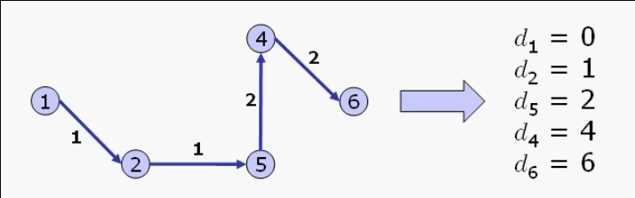

# Impatto delle strutture dati sulla complessita' di un algoritmo

## Cammini minimi

### Problema dei cammini minimi (parte 1)

Introduciamo il problema computazionale del cammino minimo (o Shortest Path Tree **SPT**) e attraverso le **condizioni di Bellman** ne caratterizzeremo la soluzione che ci portera' a definire una **procedura** di soluzione generale.

#### Definizione del problema
> Sia dato un grafo orientato **G = (N, A)** con pesi **c<sub>ij</sub>** sugli archi, per ogni arco _(i, j) ∈ A_, e dato un nodo _r ∈ N_ trovare un **cammino da _r_ a _u_**, per ogni _u ∈ N_, tale che la somma dei pesi sugli archi del cammino sia la piu' piccola possibile.

##### Notazione
* Il **peso c<sub>ij</sub>** modella in genere **distanze o lunghezze** tra punti diversi di un grafo;
* Denoteremo con:
  * **P<sub>ru</sub>**: un cammino dal nodo _r_ al nodo _u_;
  * **C(P<sub>ru</sub>)**: il costo del cammino _P<sub>ru</sub>_;
  * **C(P<sub>ru</sub>) = Σ<sub>(i, j) ∈ P<sub>ru</sub></sub> c<sub>ij</sub>**: il costo del cammino e' dato dalla somma del costo dei singoli archi appartenenti al cammino.

#### Caratterizzazione della soluzione
Una soluzione ammissibile:
* Sara' composta da _n - 1_ cammini da _r_ a _u ∈ N \\ {r}_;
* Ogni nodo _u ∈ N \\ {r}_ deve essere raggiungibile da _r_ con un cammino.

In presenza di cicli:
* Se ci sono **cicli con costo negativo c<sub>N</subZ** non esiste una soluzione con un ottimo limitato:
  * Data una qualsiasi soluzione e' possibile ottenerne un'altra di costo minore alla precedente aggiungendo **un giro** del ciclo negativo;
* Non devono dunque esistere cicli di costo negativo.

Tipologia della soluzione:
* Due cammini distinti, che partono entrambi dal nodo _r_, possono coincidere nella loro parte iniziale;
* Viceversa non possono coincidere nella parte finale:
  * Se cosi' fosse esisterebbero due cammini distinti che raggiungono gli stessi nodi, mentre il problema ne richiede uno solo.
* Una soluzione ammissibile e' un **albero di copertura _T_** di **_G_** radicato in _r_ che include un cammino da _r_ per ogni _u ∈ N \\ {r}_;

##### Etichette d<sub>u</sub>
L'etichetta _d<sub>u</sub> ∈ Z_ viene posta sul generico nodo _u ∈ N_ e rappresenta:
> La distanza nel nodo _u_ dal nodo _r_ nell'albero di copertura _T_.

L'etichetta _d<sub>u</sub>_ e' dunque uguale al costo del cammino che va da _r_ ad _u_: **d<sub>u</sub> = C(P<sub>ru</sub>) = Σ<sub>(i, j) ∈ P<sub>ru</sub></sub> c<sub>ij</sub>**.



##### Teorema di Bellman
La soluzione **ammissibile** individuata dal generico albero di copertura _T_ e' **ottima** se e solo se per ogni _(i, j) ∈ A_ valgono le **condizioni**:
* (a) d<sub>i</sub> + c<sub>ij</sub> = d<sub>j</sub>, per ogni (i, j) ∈ T;
* (b) d<sub>i</sub> + c<sub>ij</sub> >= d<sub>j</sub>, per ogni (i, j) ∉ T.

Lo **schema di algoritmo** per il problema dei cammini minimi si basa sulla verifica, arco per arco, delle condizioni di Bellman, con conseguente sostituzione degli archi che violano le condizioni.

##### Schema di algoritmo

```C
void SPT(grafo G, nodo r) {
    {T albero di copertura di G radicato in r}

    while(∃ (i, j) : d(i) + c(ij) < d(j)) {
        d(j) = d(i) + c(ij);

        T = T ⋃ {(i, j)} \ {(h, j)}
    }
}
```

Grazie alla caratterizzazione data all'algoritmo dalle condizioni di Bellman, l'algoritmo `SPT` ha come passo cruciale quello della selezione dell'arco _(i, j)_ che viola le condizioni di Bellman.

Nell'implementazione impiegheremo un insieme _S_ di nodi inizializzato ad _{r}_.

Poi, al generico passo:
* Si estrare _u ∈ S_;
* Si visitano tutti gli archi _(u, v)_ con _v ∈ A(u)_ verificando l'eventuale violazione delle condizioni di Bellman;
* Per ogni _(u, v)_ che viole le condizioni aggiorno l'etichetta _d<sub>v</sub> perche' migliorata e _v_ viene inserito nell'insieme _S_.

Rappresentaimo la soluzione _T_ come un albero dei padri:
* _T_ e' inizializzato ad un albero fittizio con tutti i nodi figli della radice _r_;
* Le etichette _d<sub>u</sub>_ sono inizializzate a valori molto alti, ad esempio il massimo intero.

#### Algoritmo generale SPT

```
void SPT(grafo G, nodo r) {
    albero T;
    insieme S;
    int d[n];
    int k;
    nodo u;
    nodo v;

    /* Inizializzazione etichette e vettore dei padri */

    for(k = 0; k < n; k++) {
        T[k] = r;
        d[k] = MAXINT;
    }

    T[r] = r;
    d[r] = 0;

    /* Inizializzazione insieme S */

    creainsieme(S);
    inserisci(r, S);


    while(!insiemevuoto(S)) {

        /* Estrazione del nodo u dall'insimee S */

        u = leggi(S);
        cancella(u, S);

        /* 
         * Visita adiacenti di u;
         * Verifica delle condizioni di Bellman;
         * Aggiornamento etichetta.
         */

        for each v ∈ A(u) {

            if(d[u] + c[u,v] < d[v]) {
                T[v] = u;
                d[v] = d[u] + c[u,v];

                if(v ∉ S)
                    inserisci(v, S);

            }
        }
    }
}
```

___

### Problema dei cammini minimi (parte 2)

[Dimostrazione_teorema_bellman](md_resources/ARI_M6_U1_L1_2.pdf)