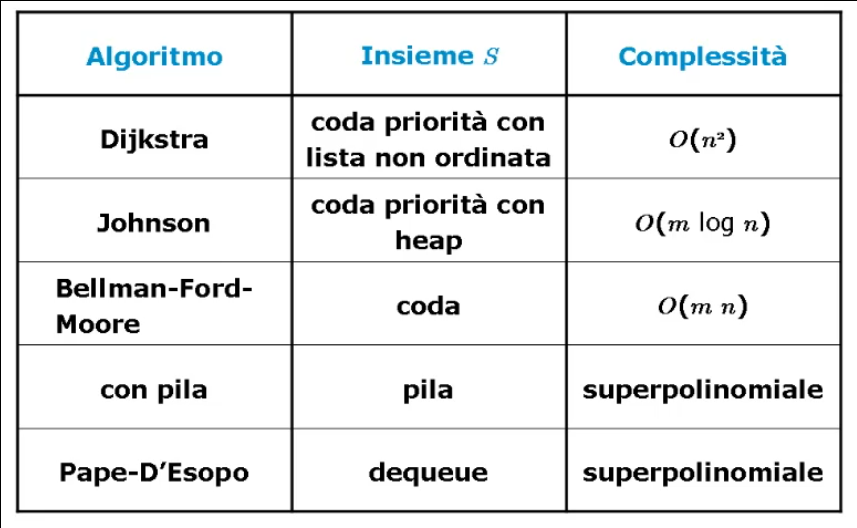

# Impatto delle strutture dati sulla complessita' di un algoritmo

## Cammini minimi

### Problema dei cammini minimi (parte 1)

Introduciamo il problema computazionale del cammino minimo (o Shortest Path Tree **SPT**) e attraverso le **condizioni di Bellman** ne caratterizzeremo la soluzione che ci portera' a definire una **procedura** di soluzione generale.

#### Definizione del problema
> Sia dato un grafo orientato **G = (N, A)** con pesi **c<sub>ij</sub>** sugli archi, per ogni arco _(i, j) ∈ A_, e dato un nodo _r ∈ N_ trovare un **cammino da _r_ a _u_**, per ogni _u ∈ N_, tale che la somma dei pesi sugli archi del cammino sia la piu' piccola possibile.

##### Notazione
* Il **peso c<sub>ij</sub>** modella in genere **distanze o lunghezze** tra punti diversi di un grafo;
* Denoteremo con:
  * **P<sub>ru</sub>**: un cammino dal nodo _r_ al nodo _u_;
  * **C(P<sub>ru</sub>)**: il costo del cammino _P<sub>ru</sub>_;
  * **C(P<sub>ru</sub>) = Σ<sub>(i, j) ∈ P<sub>ru</sub></sub> c<sub>ij</sub>**: il costo del cammino e' dato dalla somma del costo dei singoli archi appartenenti al cammino.

#### Caratterizzazione della soluzione
Una soluzione ammissibile:
* Sara' composta da _n - 1_ cammini da _r_ a _u ∈ N \\ {r}_;
* Ogni nodo _u ∈ N \\ {r}_ deve essere raggiungibile da _r_ con un cammino.

In presenza di cicli:
* Se ci sono **cicli con costo negativo c<sub>N</subZ** non esiste una soluzione con un ottimo limitato:
  * Data una qualsiasi soluzione e' possibile ottenerne un'altra di costo minore alla precedente aggiungendo **un giro** del ciclo negativo;
* Non devono dunque esistere cicli di costo negativo.

Tipologia della soluzione:
* Due cammini distinti, che partono entrambi dal nodo _r_, possono coincidere nella loro parte iniziale;
* Viceversa non possono coincidere nella parte finale:
  * Se cosi' fosse esisterebbero due cammini distinti che raggiungono gli stessi nodi, mentre il problema ne richiede uno solo.
* Una soluzione ammissibile e' un **albero di copertura _T_** di **_G_** radicato in _r_ che include un cammino da _r_ per ogni _u ∈ N \\ {r}_;

##### Etichette d<sub>u</sub>
L'etichetta _d<sub>u</sub> ∈ Z_ viene posta sul generico nodo _u ∈ N_ e rappresenta:
> La distanza nel nodo _u_ dal nodo _r_ nell'albero di copertura _T_.

L'etichetta _d<sub>u</sub>_ e' dunque uguale al costo del cammino che va da _r_ ad _u_: **d<sub>u</sub> = C(P<sub>ru</sub>) = Σ<sub>(i, j) ∈ P<sub>ru</sub></sub> c<sub>ij</sub>**.


##### Teorema di Bellman
La soluzione **ammissibile** individuata dal generico albero di copertura _T_ e' **ottima** se e solo se per ogni _(i, j) ∈ A_ valgono le **condizioni**:
* (a) d<sub>i</sub> + c<sub>ij</sub> = d<sub>j</sub>, per ogni (i, j) ∈ T;
* (b) d<sub>i</sub> + c<sub>ij</sub> >= d<sub>j</sub>, per ogni (i, j) ∉ T.

Lo **schema di algoritmo** per il problema dei cammini minimi si basa sulla verifica, arco per arco, delle condizioni di Bellman, con conseguente sostituzione degli archi che violano le condizioni.

##### Schema di algoritmo

```C
void SPT(grafo G, nodo r) {
    {T albero di copertura di G radicato in r}

    while(∃ (i, j) : d(i) + c(ij) < d(j)) {
        d(j) = d(i) + c(ij);

        T = T ⋃ {(i, j)} \ {(h, j)}
    }
}
```

Grazie alla caratterizzazione data all'algoritmo dalle condizioni di Bellman, l'algoritmo `SPT` ha come passo cruciale quello della selezione dell'arco _(i, j)_ che viola le condizioni di Bellman.

Nell'implementazione impiegheremo un insieme _S_ di nodi inizializzato ad _{r}_.

Poi, al generico passo:
* Si estrare _u ∈ S_;
* Si visitano tutti gli archi _(u, v)_ con _v ∈ A(u)_ verificando l'eventuale violazione delle condizioni di Bellman;
* Per ogni _(u, v)_ che viole le condizioni aggiorno l'etichetta _d<sub>v</sub> perche' migliorata e _v_ viene inserito nell'insieme _S_.

Rappresentaimo la soluzione _T_ come un albero dei padri:
* _T_ e' inizializzato ad un albero fittizio con tutti i nodi figli della radice _r_;
* Le etichette _d<sub>u</sub>_ sono inizializzate a valori molto alti, ad esempio il massimo intero.

#### Algoritmo generale SPT

```
void SPT(grafo G, nodo r) {
    albero T;
    insieme S;
    int d[n];
    int k;
    nodo u;
    nodo v;

    /* Inizializzazione etichette e vettore dei padri */

    for(k = 0; k < n; k++) {
        T[k] = r;
        d[k] = MAXINT;
    }

    T[r] = r;
    d[r] = 0;

    /* Inizializzazione insieme S */

    creainsieme(S);
    inserisci(r, S);


    while(!insiemevuoto(S)) {

        /* Estrazione del nodo u dall'insimee S */

        u = leggi(S);
        cancella(u, S);

        /* 
         * Visita adiacenti di u;
         * Verifica delle condizioni di Bellman;
         * Aggiornamento etichetta.
         */

        for each v ∈ A(u) {

            if(d[u] + c[u,v] < d[v]) {
                T[v] = u;
                d[v] = d[u] + c[u,v];

                if(v ∉ S)
                    inserisci(v, S);

            }
        }
    }
}
```

___

### Problema dei cammini minimi (parte 2)

[Dimostrazione_teorema_bellman](md_resources/ARI_M6_U1_L1_2.pdf)

___

### Algoritmi di Dijkstra e Johnson

La complessita' della procedura `SPT` dipende dalla realizzazione dell'insieme _S_.

E' possibile implementare _S_ come una **coda di priorita'** per permettere l'estrazione efficiente del nodo con l'etichetta minima.

#### Algoritmo di Dijkstra (1959)
La realizzazione dell'insieme _S_ avviene con una coda di priorita' implementata con una **lista non ordinata**:
* Gli elementi di _S_ sono i nodi _u_ con priorita' data dal valore dell'etichetta _d<sub>u</sub>_;
* Ad ogni iterazione estraggo da _S_ il nodo con etichetta minima con gli operatori `min` e `cancellamin`.

Se i costi sugli archi _c<sub>uv</sub>_ sono tutti positivi allora l'algoritmo ha complessita' polinomiale in quanto ogni nodo viene estratto da _S_ una ed una sola volta.

Dunque:
* Il ciclo `while` viene eseguito _n_ volte;
* All'interno del ciclo le operazioni piu' costose sono `min` e `cancellamin` che risultano essere _O(n)_;

L'algoritmo di Dijkstra ha complessita' _O(n<sup>2</sup>_.

#### Algoritmo di Johnson (1977)
La realizzazione dell'insieme _S_ avviene con una coda di priorita' implementata con un **heap**:
* La difficolta' principale consiste nel mantenere aggiornata la struttura heap al variare delle proprieta' degli elementi:
  * Le priorita' variano ad ogni nuovo assegnamento: **d<sub>v</sub> = d<sub>u</sub> + c<sub>uv</sub>**.

La soluzione consiste nell'introdurre l'operatore `decrementa` per lo heap:
* `(elemento, priorita', prioricoda) -> prioricoda`;
* `decrementa(u, p, S) = S'`
  * pre: _u ∈ S_; _p <= d<sub>u</sub>_
  * post: _d<sub>u</sub> = p_

Se i costi sugli archi _c<sub>uv</sub>_ sono tutti positivi allora l'algoritmo ha complessita' polinomiale in quanto ogni nodo viene estratto da _S_ una ed una sola volta.

Dunque:
* Il ciclo `while` viene eseguito _n_ volte;
* Gli operatori dell'heap sono _O(log n)_;
* Costo dell'operatore `decrementa`:
  * Nel caso pessimo l'operatore viene chiamato ad ogni iterazione su tutti i nodi in _A(u)_;
  * Indichiamo con _m_ la sommatoria di tutti i nodi appartenenti ad _S_ con cardinalita' l'insieme degli adiacenti _A(u)_.

La complessita' dell'algoritmo e' _O(mlog n)_.

___

### Algoritmi di Bellman-Ford-Moore, con pila e di Pape-D'Esopo

La complessita' della procedura `SPT` dipende dalla realizzazione dell'insieme _S_.

E' possibile implementare _S_ come una **coda**, come **pila** e come **double-ended-queue**.

#### Algoritmo di Bellman-Ford-Moore
L'algoritmo si ottiene dalla procedura `SPT` sostituendo gli operatori su _S_ con `creacoda`, `incoda`, `codavuota`, `leggicoda` e `fuoricoda`.

L'operatore `appartiene` si implementa mediante vettore booleano.

Se l'insieme _S_ e' una coda si ottiene un algoritmo di complessita' polinomiale anche nel caso in cui il costo dell'arco _c<sub>uv</sub> e' negativo.

La struttura dell'algoritmo e' **simile ad una visita BFS** in cui la "marcatura" del nodo _u_ consiste nel diminuire l'etichetta _d<sub>u</sub>_.

Analizziamo la complessita':
* Ogni nodo viene estratto dalla coda al piu' _n - 1_ volte (dimostrabile per induzione);
* Tutti gli operatori all'interno del ciclo `while` sono costanti e, nel caso pessimo, vengono ripetuti _m_ volte, ossia una per ogni arco.

La complessita' dell'algoritmo e' _O(nm)_.

#### Algoritmo con pila
Se l'insieme _S_ e' una pila, la complessita' dell'algoritmo diventa superpolinomiale.

Il caso pessimo si ottiene con un particolare grafo aciclico nel quale l'estrazione di un nodo _u_ da _S_ e l'aggiornamento della sua etichetta determina l'inserimento di tutti i nodi _v_ piu' grandi di _u_: ne consegue che ogni nodo puo' essere inserito nella pila un numero di volte esponenziale.

#### Algoritmo di Pape-D'Esopo (1974)
L'algoritmo si ottiene modellando _S_ come una double-ended-queue (una coda dove e' possibile inserire sia in testa che in coda):
* Ogni nodo _u_ viene inserito la prima volta in coda ed testa le volte successive;
* L'idea dell'inserimento in testa e' quella di sfruttare immediatamente il miglioramento dell'etichetta affinche' esso si propaghi ai nodi vicini.

Purtroppo questo algoritmo nel caso pessimo si comporta come una pila, dunque ha complessita' superpolinomiale.

L'algoritmo e' pero' particolarmente efficiente su grafi che modellano **reti di comunicazione stradali** ovvero **grafi sparsi e planari**.

Un grafo e' planare quando, disegnato su un piano, le linee corrispondenti a due archi distinti non si sovrappongono mai.

___

#### Confronto della complessita'
Confrontiamo gli algoritmi per i cammini minimi al variare dell'implementazione dell'insieme _S_.



##### Grafi sparsi
Un grafo si dice **sparso** se il numero di archi _m_ e' dello stesso ordine di grandezza nel numero dei nodi _n_, ovvero _O(n)_.

##### Grafi densi
Un grafo si dice **denso** se il numero di archi _m_ e' _O(n<sup>2</sup>)_.

##### Dijkstra vs Johnson
Nel caso di:
* Grafi sparsi Johnson e' meglio di Dijkstra perche':
  * Dijkstra e' _O(n<sup>2</sup>)_;
  * Johnson e' _O(n logn)_.
* Grafi densi Dijkstra e' meglio di Johnson perche':
  * Dijkstra e' _O(n<sup>2</sup>)_;
  * Johnson e' _O(n<sup>2</sup> logn)_.

##### Coda vs Coda di priorita'
Nel caso di:
* Grafi sparsi: heap < lista non ordinata = coda
  * Dijkstra e' _O(n<sup>2</sup>)_;
  * Johnson e' _O(n logn)_;
  * Bellman-Ford-Moore e' _O(n<sup>2</sup>)_.
* Grafi densi: lista non ordinata < heap < coda
  * Dijkstra e' _O(n<sup>2</sup>)_;
  * Johnson e' _O(n<sup>2</sup> logn)_;
  * Bellman-Ford-Moore e' _O(n<sup>3</sup>)_.

##### Coda vs Pila
La **variazione della complessita'** da polinomiale (coda) a superpolinomiale (pila) non dipende dalla complessita' degli operatori della pila (che sono tutti costanti come quelli della coda) bensi' dalla regola di esplorazione del grafo che le due strutture sottintendono.

##### Coda vs Dequeue
Essendo la Dequeue un caso particolare di coda ci si aspetterebbe un comportamento simile, invece l'algoritmo e' superpolinomiale.
Nel caso pessimo prevale la politica LIFO (quella delle pile) rispetto a alla FIFO (quella delle code).

Il caso efficiente in cui i grafi sono sparsi e planari e' quello in cui e' possibile sfruttare subito il miglioramento di un'etichetta (politica LIFO) che e' vincente su questa tipologia di grafo, in cui il numero di archi _m_ e' basso.

In generale nei grafi sparsi il numero di archi e' dello stesso ordine di grandezza del numero dei nodi, inoltre la planarita' riduce ulteriormente il numero degli archi.

___

### Applicazione dei cammini minimi

Vediamo come e' possibile applicare, adattandolo, il modello di calcolo dei cammini minimi ad un problema specifico, prestando particolare attenzione a:
* Definire i costi _c<sub>uv</sub>_ sugli archi;
* Definire le etichette _d<sub>u</sub>_ sui nodi specificando il loro significato;
* Adattare le condizioni SPT o di Bellmann.

#### Problema 1: numero minimo di hop
> Sia dato un grafo _G(N, A)_ con _|N| = n_ e _|A| = m_.
>
> Il grafo _G_ modella una **rete di telecomunicazione** nella quele ogni nodo _u_ rappresenta un router della rete ed un arco _(u, v)_ la possibilita' di trasferire pacchetti dal nodo _u_ al nodo _v_.
>
> Il **numero di hop** corrisponde al numero di router attraversati nella rete a partire dal nodo _r_ per raggiungere un certo nodo _u_.
>
> Proporre un algoritmo per il calcolo dei cammini da _r_ ad _u_ (per ogni _u ∈ N \\ {r}_) che minimizzano il numero di hop.

Usiamo l'approccio SPT:
* Fissiamo il costo dell'arco _(u, v)_ come _c<sub>uv</sub> = 1_ per ogni _(u, v) ∈ A_;
* Le etichette _d<sub>u</sub>_ rappresentano il numero minimo di hop da _r_ a _u_;
* Le condizioni SP rimangono invariate;
* Il costo sul cammino e' dato sempre dalla somma dei costi dei singoli archi come nelle condizioni di Bellman originali;
* Considerato che i costi sono unitari, se l'algoritmo SPT usa una coda otteniamo una visita di tipo BFS del grafo:
  * La verifica delle condizioni di Bellman **equivale** quindi al controllo del nodo visitato/non-visitato.


#### Problema 2: portata massima
> Sia dato un grafo _G(N, A)_ con _|N| = n_ e _|A| = m_.
>
> Il grafo _G_ modella una **rete di telecomunicazione** nella quale:
> * Ogni nodo _u_ rappresenta un router della rete;
> * Ogni arco _(u, v)_ rappresenta la possibilita' di trasferire paccheti dal nodo _u_ al nodo _v_.
>
> Ogni arco ha una portata massima _f<sub>uv</sub>.
> La **portata** _F<sub>P</sub>_ di un cammino _P_ risulta quindi definita come:
>
> _F(P) = min{f<sub>ij</sub> : (i, j) ∈ P}_.
>
> Proporre un algoritmo per il calcolo dei cammini da _r_ ad _u_ (per ogni _u ∈ N \\ {r}_) di massima portata.

Usiamo l'approccio SPT:
* Fissiamo il costo dell'arco _(u, v)_ come _c<sub>uv</sub> = f<sub>uv</sub> per ogni (u, v) ∈ A_;
* Le etichette _d<sub>u</sub>_ rappresentano la massima portata (data dall'arco con f<sub>uv</sub> minimo) nel cammino da _r_ ad _u_:
  * L'inizializzazione delle etichette sara':
    * _d<sub>r</sub> = +∞_;
    * _d<sub>u</sub> = 0_ per ogni _u ∈ N \\ {r}_.
* Le condizioni SPT variano:
  * _d<sub>v</sub> >= min{ d<sub>u</sub>, f<sub>uv</sub>}_.


___

## Impatto delle strutture dati sulla complessita' di un algoritmo

### Progetto di algoritmi

In generale non esistono ricette per progettare algoritmi efficienti che risolvono un problema computazionale dato; tuttavia esiste uno **schema di progettazione** di algoritmi che puo' portare a risultati accettabili in termini di efficienza.

Durante la fase di progettazione di un algoritmo si possono individuare quattro fasi distinte:
* **Classificazione del problema**;
* **Caratterizzazione della soluzione**;
* **Tecnica di progetto**;
* **Scelta delle strutture dati**.

#### Classificazione del problema
In questa fase si cerca di verificare l'appartenenza del problema ad una classe piu' generale avente caratteristiche comuni.
La comprensione del tipo di problema indirizza la progettazione dell'algoritmo di soluzione.

Classi di problemi:
* Problemi decisionali;
* Problemi di ricerca;
* Problemi di ottimizzazione.

#### Caratterizzazione della soluzione
La caratterizzazione matematica della soluzoine, quando e' possibile, suggerisce algoritmi di soluzione talvolta semplici.

**Esempio 1**: Dire se un intero _p > 1_ e' primo.

**Caratterizzazione 1**: _p_ e' primo se e solo se e' divisibile solo per se stesso ed _1_.

**Esempio 2**: Problema dei cammini minimi su un grafo.

**Caratterizzazione 2**: condizioni di Bellman.

#### Tecnica di progetto
Esistono delle tecniche di progetto di algoritmi che possono rendere gli stessi piu' efficienti:
* **Divide et impera**;
* **Backtrack**;
* **Greedy**;
* **Programmazione dinamica**;
* **Ricerca locale**.

#### Scelta delle strutture dati
L'impiego di opportune strutture di dati per organizzare l'input del problema puo' migliorare l'efficienza di un algoritmo.

**Esempio 1**: L'utilizzo di uno **heap** per migliorare l'efficienza dell'algoritmo **SelectionSort**.

**Esempio 2**: La modellazione dell'**insieme _S_** nell'algoritmo generale **SPT**.