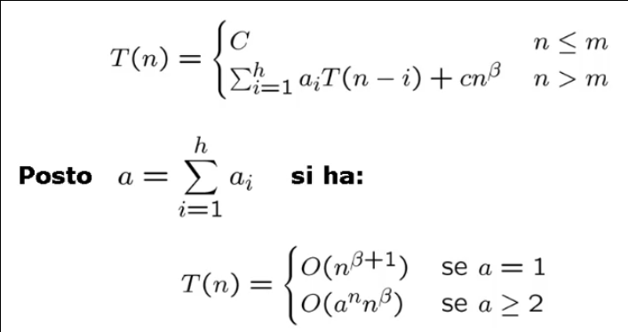
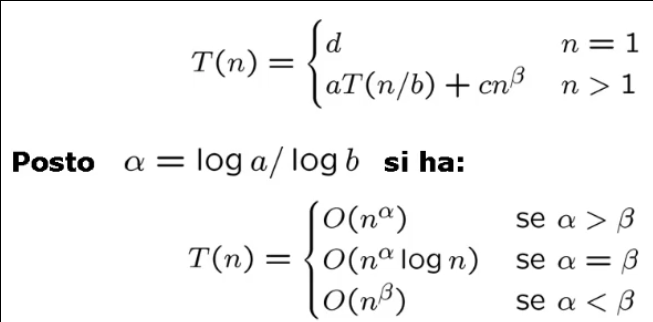
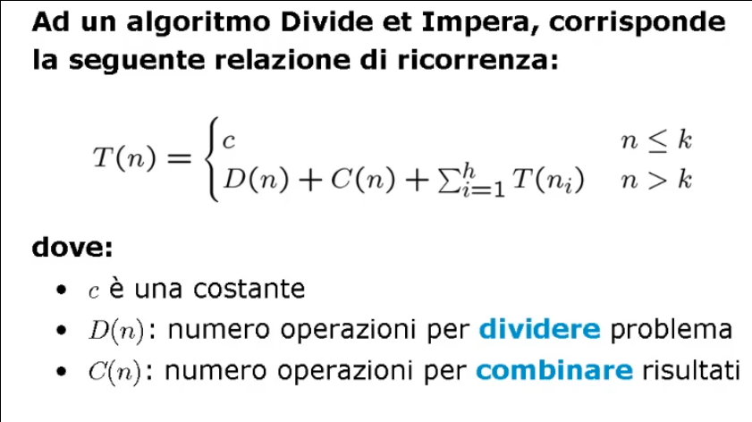

# Divide et Impera

## Schema generale

### Complessita' di algoritmi ricorsivi

La tecnica di progetto **Divide et Impera** fa uso di algoritmi ricorsivi, per questo introduciamo due **teoremi** che ci permettono di calcolare con maggiore semplicita' la complessita' dei suddetti algoritmi.

Le **relazioni di ricorrenza** hanno generalmente la forma **_a<sub>i</sub>T(n - i) + cn<sup>β</sup>_** dove:
* _a<sub>i</sub> >= 1_ indica che viene fatta almeno una chiamata ricorsiva;
* _i >= 1_ indica che la dimensione dell'input e' almeno _1_;
* _c > 0_ e _β >= 0_ indicano che viene eseguita almeno un'altra operazione oltre alla chiamata ricorsiva.

Piu' generalmente la relazione di ricorrenza puo' essere indicata come **_Σ<sub>i=0</sub><sup>h</sup> a<sub>i</sub>T(n - i) + cn<sup>β</sup>_**; questa relazione e' detta:
* **Lineare** perche' _n_ ha grado _1_ nei termini di _T(n - i)_;
* **A coefficienti costanti** in quanto gli _a<sub>i</sub>_ sono costanti;
* **Di ordine costante** perche' _h_ e' costante.

#### Teorema delle ricorrenze lineari di ordine costante
Siano:
* _a<sub>1</sub>, ..., a<sub>h</sub>_ costanti intere positive;
* _h_ costante positiva;
* _c > 0_ e _β >= 0_ costanti reali



Esempio su una procedura del calcolo del minimo:

```C
int min_r (int *a, int j, int k) {
    int m;
    if(j == k)
        m = a[j];
    else {
        m = min_r(a, j + 1, k);
        m = (a[j] < m ? a[j] : m);
    }
    return(m);
}
```

In questa procedura abbiamo _a = 1_ e _β = 0_, la complessita' risultante e' _O(n)_.

##### Osservazione 1
Nel caso di relazioni di ricorrenza lineari di ordine costante, la polinomialita' e' garantita dal fatto di effettuare **una sola** chiamata ricorsiva (_a = 1_).

##### Osservazione 2
Il risultato finale non dipende da _c_, quindi all'interno della ricorsione posso fare piu' di un ciclo di analisi dei dati.

#### Partizioni bilanciate
Esistono particolari relazioni di ricorrenza lineari caratterizzate dal fatto che esse **partizionano** i dati in maniera **bilanciata**.

Il problema iniziale di dimensione _n_ viene **suddiviso** in _a_ sottoproblemi di dimensione _n / b_.

Quindi se si riesce a dividere i dati e/o a ricombinarli in tempo polinomiale, la funzione di complessita' _T(n)_ puo' essere espressa in termini di **_aT(n / b) + cn<sup>β</sup>_** dove:
* _a >= 1_ indica che viene fatta **una sola** chiamata ricorsiva;
* _b >= 1_ indica che il problema viene separato in _2__ due sottoproblemi;
* _c > 0_ e _β >= 0_ _∈ R_.

#### Teorema delle ricorrenze lineari con partizione bilanciata
Siano:
* _a >= 1_ e _b >= 2_ costanti intere;
* _c > 0_, _d >= 0_ e _β >= 0_ costanti reali;



Esempio della ricerca binaria di una chiave su un dizionario:
```C
boolean ricbin(dizionario *D, chiave k, int i, int j) {
    int m;

    if(i > j)
        return(FALSE);
    else {
        m = (i + j) / 2;

        if(k == D.chiavi[m])
            return(TRUE);
        else {
            if(k < D.chiavi[m])
                ricbin(D, k, i, m - 1);
            else
                ricbin(D, k, m + 1, j);
        }
    }
}
```

Per la ricerca binaria _T(n) <= T(n/2) + c_, ed essendo _a = 1_ e _b = 2_ abbiamo che _α = β = 0_. Dunque _T(n)_ e' _O(logn)_.

##### Osservazione 1
Un **buon bilanciamento** prevede un numero di chiamate ricorsive _a_ pari al numero di parti _b_ in cui viene suddiviso l'input.

Se _a = b_ abbiamo _α = 1_; al variare di _β_ risulta complessita':
* _O(n)_ per _β = 0_;
* _O(nlogn) per _β = 1_;
* _O(n<sup>β</sup>) per _β > 1_.

##### Osservazione 2
Il risultato finale non dipende da _c_, quindi all'interno della ricorsione posso fare piu' di un ciclo di analisi dei dati.

___

### Progetto di algoritmi Divide et Impera

Vediamo come:
* **Partizionare** il problema in sottoproblemi piu' piccoli dello stesso tipo;
* **Risolvere** i sottoproblemi;
* **Ricombinare** le soluzioni parziali per ottenere la soluzione del problema originale.

Schema generale della procedura:

```C
void DivideEtImpera(P, n) {
    if(n <= k)
        {risolvi direttamente P}
    else {
        {dividi P in P1, P2, ..., Ph di dimensione n1, n2, ..., nh}

        for(i = 1; i <= h; i++)
            DivideEtImpera(Pi, ni);

        {combina la soluzione di P1, ..., Ph per soluzione di P}
    }
}
```




#### Efficienza
L'efficienza della tecnica dipende da come vengono partizionati i sottoproblemi, dunque dalla loro **dimensione**.

Nella relazione di ricorrenza, il **bilanciamento della dimensione** dei sottoproblemi e' la chiave per ottenere algoritmi efficienti.
