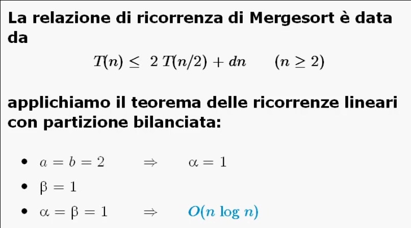

# Divide et Impera

## Schema generale

### Complessita' di algoritmi ricorsivi

La tecnica di progetto **Divide et Impera** fa uso di algoritmi ricorsivi, per questo introduciamo due **teoremi** che ci permettono di calcolare con maggiore semplicita' la complessita' dei suddetti algoritmi.

Le **relazioni di ricorrenza** hanno generalmente la forma **_a<sub>i</sub>T(n - i) + cn<sup>β</sup>_** dove:
* _a<sub>i</sub> >= 1_ indica che viene fatta almeno una chiamata ricorsiva;
* _i >= 1_ indica che la dimensione dell'input e' almeno _1_;
* _c > 0_ e _β >= 0_ indicano che viene eseguita almeno un'altra operazione oltre alla chiamata ricorsiva.

Piu' generalmente la relazione di ricorrenza puo' essere indicata come **_Σ<sub>i=0</sub><sup>h</sup> a<sub>i</sub>T(n - i) + cn<sup>β</sup>_**; questa relazione e' detta:
* **Lineare** perche' _n_ ha grado _1_ nei termini di _T(n - i)_;
* **A coefficienti costanti** in quanto gli _a<sub>i</sub>_ sono costanti;
* **Di ordine costante** perche' _h_ e' costante.

#### Teorema delle ricorrenze lineari di ordine costante
Siano:
* _a<sub>1</sub>, ..., a<sub>h</sub>_ costanti intere positive;
* _h_ costante positiva;
* _c > 0_ e _β >= 0_ costanti reali


Esempio su una procedura del calcolo del minimo:

```C
int min_r (int *a, int j, int k) {
    int m;
    if(j == k)
        m = a[j];
    else {
        m = min_r(a, j + 1, k);
        m = (a[j] < m ? a[j] : m);
    }
    return(m);
}
```

In questa procedura abbiamo _a = 1_ e _β = 0_, la complessita' risultante e' _O(n)_.

##### Osservazione 1
Nel caso di relazioni di ricorrenza lineari di ordine costante, la polinomialita' e' garantita dal fatto di effettuare **una sola** chiamata ricorsiva (_a = 1_).

##### Osservazione 2
Il risultato finale non dipende da _c_, quindi all'interno della ricorsione posso fare piu' di un ciclo di analisi dei dati.

#### Partizioni bilanciate
Esistono particolari relazioni di ricorrenza lineari caratterizzate dal fatto che esse **partizionano** i dati in maniera **bilanciata**.

Il problema iniziale di dimensione _n_ viene **suddiviso** in _a_ sottoproblemi di dimensione _n / b_.

Quindi se si riesce a dividere i dati e/o a ricombinarli in tempo polinomiale, la funzione di complessita' _T(n)_ puo' essere espressa in termini di **_aT(n / b) + cn<sup>β</sup>_** dove:
* _a >= 1_ indica che viene fatta **una sola** chiamata ricorsiva;
* _b >= 1_ indica che il problema viene separato in _2__ due sottoproblemi;
* _c > 0_ e _β >= 0_ _∈ R_.

#### Teorema delle ricorrenze lineari con partizione bilanciata
Siano:
* _a >= 1_ e _b >= 2_ costanti intere;
* _c > 0_, _d >= 0_ e _β >= 0_ costanti reali;


Esempio della ricerca binaria di una chiave su un dizionario:
```C
boolean ricbin(dizionario *D, chiave k, int i, int j) {
    int m;

    if(i > j)
        return(FALSE);
    else {
        m = (i + j) / 2;

        if(k == D.chiavi[m])
            return(TRUE);
        else {
            if(k < D.chiavi[m])
                ricbin(D, k, i, m - 1);
            else
                ricbin(D, k, m + 1, j);
        }
    }
}
```

Per la ricerca binaria _T(n) <= T(n/2) + c_, ed essendo _a = 1_ e _b = 2_ abbiamo che _α = β = 0_. Dunque _T(n)_ e' _O(logn)_.

##### Osservazione 1
Un **buon bilanciamento** prevede un numero di chiamate ricorsive _a_ pari al numero di parti _b_ in cui viene suddiviso l'input.

Se _a = b_ abbiamo _α = 1_; al variare di _β_ risulta complessita':
* _O(n)_ per _β = 0_;
* _O(nlogn) per _β = 1_;
* _O(n<sup>β</sup>) per _β > 1_.

##### Osservazione 2
Il risultato finale non dipende da _c_, quindi all'interno della ricorsione posso fare piu' di un ciclo di analisi dei dati.

___

### Progetto di algoritmi Divide et Impera

Vediamo come:
* **Partizionare** il problema in sottoproblemi piu' piccoli dello stesso tipo;
* **Risolvere** i sottoproblemi;
* **Ricombinare** le soluzioni parziali per ottenere la soluzione del problema originale.

Schema generale della procedura:

```C
void DivideEtImpera(P, n) {
    if(n <= k)
        {risolvi direttamente P}
    else {
        {dividi P in P1, P2, ..., Ph di dimensione n1, n2, ..., nh}

        for(i = 1; i <= h; i++)
            DivideEtImpera(Pi, ni);

        {combina la soluzione di P1, ..., Ph per soluzione di P}
    }
}
```


#### Efficienza
L'efficienza della tecnica dipende da come vengono partizionati i sottoproblemi, dunque dalla loro **dimensione**.

Nella relazione di ricorrenza, il **bilanciamento della dimensione** dei sottoproblemi e' la chiave per ottenere algoritmi efficienti.


___

## Due algoritmi di ordinamento

### Mergesort

Mergesort e' un algoritmo di ordinamento di un vettore di _n_ elementi che si basa sulla tecnica di Divide et Impera.

Poiche' sappiamo fondere due sequenze ordinate in tempo ottimo _O(n)_, quindi possiamo **separare** in due parti l'input (ripetiamo la separazione fino a quando non otteniamo sequenze di un elemento che per definizione sono ordinate) e poi **ricomponiamo** le sequenze ordinate in una sequenza piu' grande e cosi' via.

La tecnica prevede:
* **Separazione**: partizionare in due la sequenza;
* **Ricomposizione**: fusione di due sequenze ordinate.

```C
void mergesort(int *A, int first, int last) {
    int m;

    if(first < last) {
        m = (first + last) / 2;

        mergesort(A, first, m);
        mergesort(A, m + 1, last);
        
        merge(A, first, last, m);
    }
}
``` 

La funzione `merge(...)` serve a ricombinare i risultati ottenuti dalla soluzione dei sottoproblemi.

Quando la funzione rientra dalle due chiamate ricorsive, il vettore _A[.]_ risulta composto di due sequenze ordinate, quindi la combinazione dei risultati consiste nel fondere due sequenze ordinate.

La funzione `merge` fa uso di un vettore esterno _B_ di appoggio.

```C
void merge(int *A, int first, int last, int m) {
    int i, j, k, h;

    i = k = first;

    j = m + 1;

    while(i <= m && j <= 1) {
        if(A[i] <= A[j])
            B[k] = A[i++];
        else
            B[k] = A[j++];
        k++;
    }

    j = k;
    for(h = i; h <= m; h++)
        A[j++] = A[h];

    for(j = first; j <= k - 1; j++)
        A[j] = B[j];
}
```

Nel ciclo `while` avviene la fusione delle due sottosequenze _A[first, m]_ e _A[m + 1, last]_. Se _i >= m_ allora la sequenza _A[m + 1, last]_ e' al posto giusto.

#### Complessita'



___

### Quicksort

Quicksort e' un algoritmo di ordinamento di un vettore di _n_ elementi che si basa sulla tecnica di Divide et Impera.

L'idea di base dell'algoritmo Quicksort consiste nel selezionare un elemento del vettore, detto **perno**, attorno al quale riarrangiare gli elementi:
* Gli elementi **piu' piccoli** del perno sono spostati in posizioni precedenti a quella del perno;
* Gli elementi **piu' grandi** del perno sono spostati in posizioni successive a quella del perno.

```C
void quicksort(int *A, int first, int last) {
    int j;

    if(first < last) {
        j = perno(A, first, last);

        quicksort(A, first, j - 1);
        quicksort(A, j + 1, last);
    }
}
```

La **ricomposizione** e' ottenuta automaticamente in quanto per come e' effettuata la procedura `perno(...)` risulta che quando soddisferemo la condizione `first == last` il vettore risultera' gia' ordinato.

La procedura `perno` deve scegliere un elemento _x_ in posizione _j_ per poi permutare gli elementi affinche' risulti che:
* _A[i] <= x_ per _i < j_;
* _A[i] >= x_ per _i > j_.

Supponiamo che `perno` scelga come perno sempre l'elemento in prima posizione.

```C
int perno(int *A, int first, int last) {
    int i, x, temp;

    x = A[first];
    
    j = first;

    for(i = first; i <= last; i++) {
        
        if(A[i] < x) {
            temp = A[++j];
            A[j] = A[i];
            A[i] = temp;
        }
    }

    A[first] = A[j];
    A[j] = x;
    return(j);
}
```

Nel ciclo `for`:
* Il cursore _i_ punta all'elemento non ancora esaminato;
* Il cursore _j_ mantiene la posizione finale nella quale si sposta il perno;
* Ad ogni passo, se _A[i] < x_ allora si sposta l'elemento _A[i]_ con il primo elemento tra quelli maggiori o uguali ad _x_;
* Alla fine si sposta il perno in posizione _j_.

#### Complessita'


In particolare l'algoritmo Quicksort risulta molto efficiente nel caso medio: _O(nlogn)_.

Il miglioramento dell'efficienza si ottiene:
* Con una scelta accurata del perno: ad esempio il mediano tra _first_, _last_ e l'elemento di mezzo;
* Con un'implementazione piu' efficiente della procedura `perno` utilizzando due cursori per scambiare gli elementi.