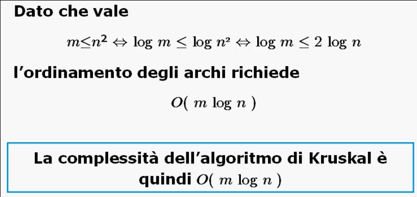
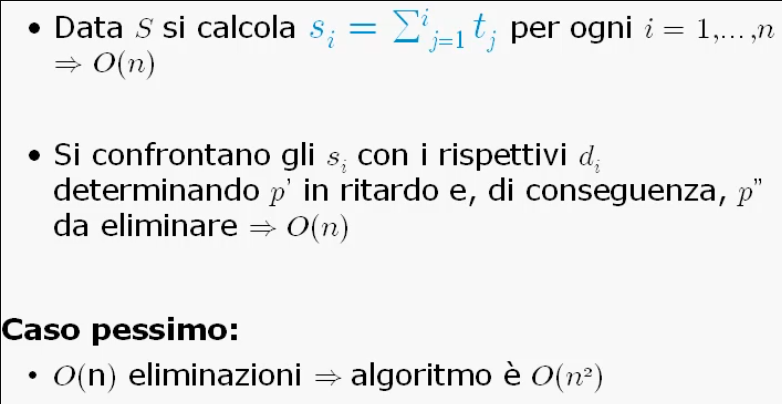
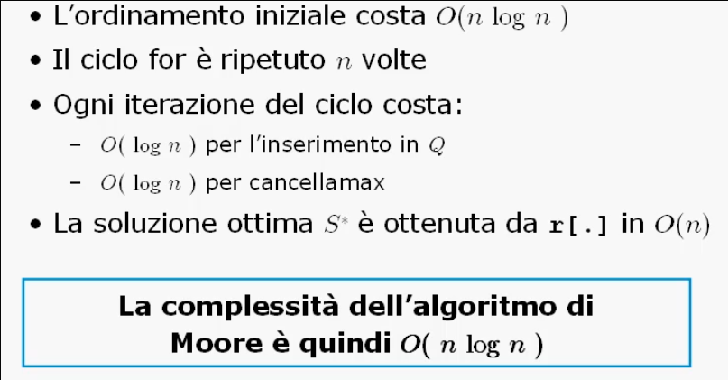

# Greedy

## Schema generale

### Progetto di algoritmi Greedy

La tecnica Greedy si basa sulla **strategia dell'ingordo**:
> Compiere, ad ogni passo, la scelta migliore nell'immediato piuttosto che adottare una strategia a lungo termine.

Gli algoritmi di tipo Greedy in genere non forniscono una soluzione ottima, ma una buona soluzione iniziale per altri algoritmi piu' sofisticati.

E' una tecnica indicata per la soluzione di problemi nei quali si prevede di selezionare in maniera ottima un sottoinsieme di elementi da un insieme dato.

Il **criterio di ottimalita'** viene fornito da una funzione che ha come parametri il valore dei singoli oggetti.

Un algoritmo Greedy di base si ottiene specificando **l'ordinamento** e la **costruzione dell'insieme _S_**.

```C
void Greedy(insieme *A) {
    /* A = {a1, ..., an} */

    S = ∅;

    {ordina ai ∈ A rispetto al criterio ottimo};

    for(i = 1; i <= n; i++)
        if(S ⋃ {ai} = soluzione valida)
            S = S ⋃ {ai};

    return(S);
}
```

Dunque un algoritmo Greedy:
* Dapprima **ordina** gli oggetti in base al criterio di ottimalita';
* Costruisce la soluzione del problema **in modo incrementale** considerando gli oggetti uno alla volta e aggiungendo, se possibile, l'oggetto migliore secondo il criterio di ottimalita'.

In particolare le scelte sono fatte in base ad un principio di **ottimalita' locale**:
* Ad ogni passo viene risolto un sottoproblema di dimensioni sempre piu' piccole;
* La sua soluzione dipende dalle **scelte passate** e non da quelle future;
* Affinche' un algoritmo Greedy fornisca la soluzione ottimale di un dato problema occorre che siano verificate due proprieta' tra loro correlate:
  * **Scelta Greedy**;
  * **Sottostruttura ottima**.

#### Proprieta': Scelta Greedy

Data una caratterizzazione matematica della soluzione, occorre dimostrare che tale soluzione puo' essere modificata in modo da utilizzare una prima scelta Greedy per ridurre il problema ad un sottoproblema piu' piccolo dello stesso tipo.

> Si cerca di dimostrare che la soluzione costruita come sequenza di scelte Greedy e' ottima.

La struttura matematica che ci consente di capire quando un algoritmo Greedy fornisce una soluzione ottima si chiama **matroide**.

#### Proprieta': Sottostruttura ottima

Per mostrare che una scelta Greedy riduce il problema ad un sottoproblema piu' picolo dello stesso tipo, occorre dimostrare che una soluzione ottima del problema contiene al suo interno le soluzioni ottime dei sottoproblemi.

> Le successive configurazioni dell'insieme _S_ sono soluzioni ottime per il sottoproblema considerato.

___

## Minimo albero di copertura

### Algoritmo di Kruskal

Studiamo il problema dell'**albero di copertura di costo minimo** o **MST** (Minimum Spanning Tree).

Problema:
> Dato un grafo non orientato e connesso _G = (N, A)_, con pesi _p<sub>a</sub> >= 0_ sull'arco _a = [i, j]_, trovare un albero di copertura _T_ per _G_ tale che la somma dei pesi degli archi in _T_ sia minima.

In particolare _T_ deve avere tutti gli _n_ nodi e solo _n - 1_ archi.

Esistono vari algoritmi che risolvono all'ottimo il problema dell'MST, i piu' noti sono:
* Algoritmo di Kruskal (1956) che si basa sulla tecnica Greedy;
* Algoritmo di Prim (1957).

L'algoritmo di Kruskal essendo un algoritmo Greedy e' progettato descrivendo:
* Metodo di ordinamento:
  * Ordinamento degli archi _a_ crescente rispetto al peso _p<sub>a</sub>_.
* Metodo di inserimento nell'insieme _S_:
  * Aggiungo _a_ in _S_ se _a_ non determina alcun circuito in _T_.

```C
void kruskal(grafo G) {
    T = ∅;

    {ordina a ∈ A per p crescente};

    for each a ∈ A {
        if (a non forma un circuito)
            T = T ⋃ {a};
    }
}
```

L'algoritmo costruisce la soluzione per **unione di componenti connesse**.

Sia _F<sub>k</sub>_ la minima foresta di copertura _G_, formata da _k_ componenti connesse (ovvero _k_ alberi). Per **induzione** si mostra che sono calcolate in ordine da _F<sub>n</sub>_ ad _F<sub>1</sub>_ (foreste minime di copertura) dove in ciascuna _A<sub>n</sub> = ∅_, _A<sub>k</sub> ⋃ {[i, j]}_ con _i_ e _j_ che appartengono a due **diverse** componenti connesse di _F<sub>k</sub>_.


#### Complessita

Per una efficiente implementazione dell'algoritmo di Kruskal bisogna implementare con attenzione:
* L'ordinamento degli archi;
* Nel test di verifica bisogna controllare che l'aggiunta di un nuovo arco non determini un circuito:
  * Si ricorre agli insiemi **Mfset**: se l'insieme dei nodi dei _k_ alberi di _F<sub>k</sub>_ sono rappresentati tramite Mfset, allora l'appartenenza dei nodi _i_ e _j_ dell'arco _[i, j]_ costa _O(logn)_;
  * Il test viene ripetuto per gli _m_ archi, quindi abbiamo _O(mlogn)_.




Codice della procedura kruskal:
```C
/* il grafo G viene rappresentato come un array di archi */
typedef struct _arco {
    int i, j;
    long p;
} arco;

arco G[MAX_DIM];

/* l'insieme T viene rappresetato come una lista non ordinata */

void kruskal(grafo G, int n, int m, insieme *T) {
    int h, k;
    mfset S;

    creainsieme(T);
    creamfset(n, S);

    /* ordina gli archi in maniera crescente rispetto al loro peso */
    {ordina archi t.c. G[0].p <= ... <= G[m-1].p};

    h = k = 0;

    /* il ciclo while va avanti finche' non raggiungiamo la cardinalita' dell'albero (n - 1 nodi) oppure abbiamo scandito tutti gli m archi */
    while(k < n -1 && h < m) {

        /* controllo che i e j appartengano a due componenti connesse diverse, quindi non determinano la creazione di un circuito */
        if(trova(G[h].i, S) != trova(G[h].j, S)) {
            fondi(G[h].i, G[h].j, S);
            inserisci(G[h], T);
            k++;
        }
        h++;
    }
}
```

___

## Scheduling di programmi

### Algoritmo di Moore

Problema:
> Dati _n_ programmi _p<sub>1</sub>, ..., p<sub>n</sub>_ tali che ciascun programma _p<sub>i</sub>_ richiede _t<sub>i</sub>_ unita' di tempo per la sua esecuzione e deve essere completato entro una certa scadenza _d<sub>i</sub>_, trovare un **ordine _S_** in cui eseguirli tutti in modo da minimizzare il numero dei programmi per i quali la scadenza non e' rispettata.

 L'algoritmo di Moore fa uso della tecnica Greedy quindi e' necessario specificare:
 * Ordinamento:
   * I programmi _p<sub>1</sub>, ..., p<sub>n</sub>_ sono ordinati in una sequenza _S_ tale che _d<sub>i</sub> <= d<sub>i + 1</sub>_ per _i = 1, ..., n + 1,_;
 * Insieme _S_:
   * Si scorre la lista per identificare il primo programma _p'_ in ritardo;
   * Si **elimina** il programma _p''_ piu' lungo che precede _p'_, ovvero _S' = S \\ {p''}_;
   * Si itera il procedimento fino ad ottenere una sequenza _S*_ **prima di programmi in ritardo**;
   * La sequenza _S*_ ottima e' ottenuta aggiungendo in coda ad _S*_ in un ordine qualsiasi i programmi precedentemente eliminati.

#### Complessita



Per migliorare la complessita' dell'algoritmo di Moore e' possibile utilizzare una coda di priorita' _Q_ realizzata attraverso uno **heap modificato**:
* Un programma alla volta viene inserito in _Q_ con chiave _t<sub>i</sub>_;
* Se _s<sub>i</sub> >= d<sub>i</sub>_ (_p<sub>i</sub>_ in ritardo), si estrae dalla coda il programma _p<sub>j</sub>_ con chiave _t<sub>j</sub>_ massima e si aggiorna _s<sub>i</sub>_.

Esempio della procedura `moore` che ritorna il numero dei programmi in ritardo:
```C
/*
 * Il puntatore d rappresenta le scadenze di ogni singolo programma;
 * Il puntatore t rappresenta le durate di ogni singolo programma;
 * L'intero n indica i programmi da schedulare;
 * Il puntatore r indica la soluzione di quali programmi saranno in ritardo e quelli che non lo saranno.
 */
int moore(int *d, int *t, int n, boolean *r) {
  prioricoda Q;
  int i, j, k=0, T=0;

  creaprioricoda(Q);

  for(i = 0; i < n; i++) {
    r[i] = false;

    {ordina i programmi per scadenza ascendente};

    for(i = 0; i < n; i++) {
      inserisci(i, t[i], Q);
      T += t[i];

      if(T >= d[i]) {
        j = max(Q);
        cancellamax(Q);

        T -= t[j];
        r[j] = true;
        k++;
      }
    }

    return(k);
  }
}
```

