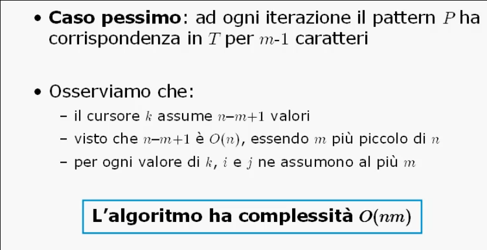
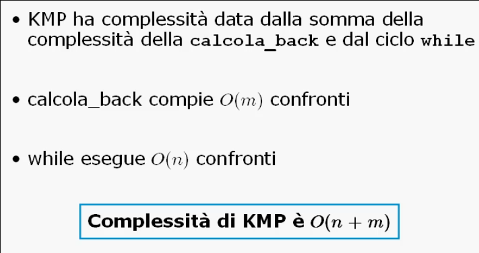

# Backtrack

## Schema generale

### Progetto di algoritmi backtrack

La tecnica e' costituita da due fasi:
* La prima in cui viene **costruita la soluzione**;
* La seconda in cui viene **distrutta la soluzione**.

Un algoritmo puo' dunque essere classificato di tipo Backtrack quando in esso sono previsti strumenti per la costruzione e la distruzione (di una parte) della soluzione.

Ad esempio tutti gli algoritmi di visita di un albero sono di tipo Backtrack in quanto l'elaborazione su un nodo **dipende** dal risultato della visita dei suoi sottoalberi.

Anche la visita di un grafo di tipo DFS e' un algoritmo di tipo Backtrack.

#### Contronto tra Backtrack e Greedy

Dato un problema di selezionare un sottoinsieme di elementi _S_ da un insieme _M_, con _S ⊂ M_:
* Un algoritmo **Greedy costruttivo** calcola una soluzione _S_, inzializzata all'insieme vuoto, **aggiungendo** ad ogni passo un elemento con una scelta di tipo Greedy;
* Un algoritmo **Greedy distruttivo** calcola una soluzione _S_ inizializzata ad _M_, **eliminando** ad ogni passo un elemento con una scelta di tipo Greedy;
* La tecnica **Backtrack** cerca di mettere insieme le due possibilita' in un unico schema.

La tecnica Backtrack e' la tecnica di progetto utilizzata del **algoritmi di enumerazione**, quella classe di algoritmi che provano tutte le possibilita' per ottenere una soluzione o la migliore soluzione per il problema dato. GLi algoritmi di enumerazione sono la piu' importante applicazione di tale tecnica dal punto di vista teorico e pratico.

___

## String Matching

### Algoritmi per lo String Matching

#### Problema dello String Matching
> Data una sequenza _T_ di _n_ caratteri, detta **testo**, ed una sequenza _P_ di _m_ caratteri (_m < n_), detta **pattern**, il problema dello String Matching consiste nel trovare almeno un'occorrenza di _P_ all'interno di _T_.

Formulazione alternativa:
> Esiste un indice _k_ con _1 <= k <= n - m + 1_, tale che il _j_-esimo carattere di _P_ sia uguale al (_k + j - 1_)-esimo carattere di _T_ per _j = 1, ..., m_.

#### Algoritmo di Ricerca Bruta
Si tratta di un algoritmo intuitivo di Backtrack:
* Si cerca di riconoscere il pattern partendo dalla prima posizione del testo e scandendo le successive _m_ posizioni;
* Se il pattern non e' individuato, si fa backtrack sulla posizione successiva.

Ipotizziamo di numerare le posizioni del vettore dalla numero 1.

Si fa uso di 3 cursori:
* _k_: che misura l'avanzare in _T_ della verifica dell'eventuale matching;
* _i_: che misura la scansione all'interno del testo;
* _j_: che misura la scansione all'interno del pattern.

```C
int ricercabruta(char *P, char *T, int n, int m) {
    int i, j, k;
    i = j = k = 1;

    while(i <= n && j <= m) {
        if(T[i] == P[j]) {
            i++; j++;
        } else {
            k++;
            i = k = j = 1;
        }
    }

    return ((j > m ? k : i));
}
```

#### Analisi della complessita' dell'algoritmo di Ricerca Bruta


#### Efficienza dell'algoritmo di Backtrack Ricerca Bruta
Se l'algoritmo non riconosce _P_ in _T_ a partire da _k_, viene effettuato un backtrack sugli indici _i_ e _j_;
Questo tipo di backtrack non e' il piu' efficiente.

E' possibile migliorare l'efficienza dell'algoritmo ed ottenere una complessita' _O(n + m)_ tramite l'algoritmo di **Knut Morris Pratt**:

L'idea principale e' di trarre giovamento dalla computazione appena svolta prima di fare backtrack.

E' necessario dunque calcolare il nuovo valore di backtrack _back[j]_ da assegnare all'indice _j_. Tale valore e' dato da:

_max{h : h < j - 2 e P[1...h -1]_ = _P[j - h + 1...j - 1]_.

Il confronto e' fatto con _P_ stesso dal momento che per le prime _j - 1_ posizioni _P_ e _T_ coincidono. Dunque la computazione puo' essere portata fuori dal ciclo di ricerca principale; il risultato e' invarante rispetto a _j_.

Come inizializzazione _back[1] = 0_.

```C
int KMP(char *P, char *T, int n, int m) {
    int i, j, *back;
    /* back viene allocato come vettore */
    calcola_back(P, back, m);

    i = j = 1;

    while(i <= n && j <= m) {
        if(j == 0 || T[i] == P[j]) {
            i++; j++;
        } else
            j = back[j];
    }

    return ((j > m ? i - m : i));
}


int calcola_back(char *P, int *back, int m) {
    int j, h;

    back[1] = 0;
    j = 1;
    h = 0;

    while (j <= m) {
        if(h == 0 || P[j] == P[h]) {
            j++; h++;
            back[j] = (P[j] == P[h] ? back[h] : h);
        } else
            h = back[h];
    }
}
```

#### Analisi della complessita' dell'algoritmo KMP


