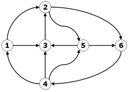

### Tempo di calcolo
Il tempo di calcolo T(n) di un algoritmo e' dato dal costo complessivo delle operazioni elementari in funzione della dimensione n dei dati in input.
Le operazioni elementari sono tutte le operazioni aritmetiche, logiche, di confronto e di assegnamento che possono essere svolte all'interno di un algoritmo.

### Complessita' di un programma
La complessita' computazionale indica la quantita' di risorse richieste per l'esecuzione di un algoritmo in termini di tempo e spazio.
In particolare viene effettuata un'analisi asintotica associata dalla notazione O-grande in funzione delle risorse di tempo e spazio necessarie al crescere della dimensione dell'input.
L'esito di questa analisi e' una classificazione dell'algoritmo in questione.

### Definizione formale notazione O-grande
#### O-grande
`f(n) ∈ O(g(n)) per n->∞` : g e' un limite asintotico superiore di f (fino ad un fattore costante)

`∃ k > 0, ∃ n0 ∀ n > n0 : 0 ≤ | f(n) | ≤ k ⋅ g(n) `

#### Omega
`f(n) ∈ Ω(g(n)) per n->∞` : g e' un limite asintotico inferiore di f

`∃ k > 0, ∃ n0 ∀ n > n0 : f(n) ≥ k ⋅ g(n) ≥ 0`

#### Theta
`f(n) ∈ Θ(g(n)) per n->∞` : g e' limite asintotico superiore ed inferiore di f

`∃ k1 > 0, ∃ k2 > 0, ∃ n0 ∀ n > n0 : k1 ⋅ g(n) ≤ f(n) ≤ k2 ⋅ g(n)`

#### o-piccoloΘuperiore stretto di f

`∃ k > 0, ∃ n0 ∀ n > n0 : 0 < | f(n) | < k ⋅ g(n)`

#### omega-piccolo
`f(n) ∈ ω(g(n)) per n->∞` : g e' un limite asintotico inferiore stretto di f

`∃ k > 0, ∃ n0 ∀ n > n0 : f(n) > k ⋅ g(n) > 0`


### Struttura dati Heap
L'Heap binario e' un'implementazione efficiente del tipo di dato coda di priorita' verificando le proprieta':
* Se h e' il livello massimo delle foglie, allora ci sono 2^(h) - 1 nodi di livello minore di h;
* Tutte le foglie di livello h sono addossate a sinistra;
* Ogni nodo diverso dalla radice contiene un elemento della coda di priorita' che soddisfa la relazione d'ordine applicata.

Nel Max-Heap le chiavi di chiascun nodo sono sempre maggiori o uguali a quelle dei figli, con valore massimo nella radice.

Nel Min-Heap le chiavi di ciascun nodo sono sempre minori o uguali a quelle dei figli, con valore minimo nella radice.

Assumendo la struttura dati Min-Heap:
* Ricerca del minimo ∈ Θ(1)
* Rimozione del minimo ∈ Θ(log(n))
* Inserimento ∈ Θ(log(n))
* Decremento di priorita' ∈ Θ(log(n))


### Heapsort
A partire da un array in ingresso si costruisce l'albero binario associato:

```
[3, 7, 1, 8, 2, 5, 9, 4, 6]

                        3
            7                           1
    8               2           5               9
4       6

```

Invoco la procedura heapify per costruire una struttura dati Max-Heap a partire dall'albero binario ottenuto (partendo dall'ultimo nodo padre):

```
Iterazione 1: il nodo 8 verifica le proprieta' di heap

                        3
            7                           1
    8               2           5               9
4       6

Iterazione 2: il nodo 1 viene scambiato con il suo figlio piu' grande (9)

                        3
            7                           9
    8               2           5               1
4       6

Iterazione 3: 7 viene scambiato con il suo figlio piu' grande (8) 

                        3
            8                           9
    7               2           5               1
4       6
-> vengono riverificate le proprieta' di heap nel sottoalbero di 7

Iterazione 4: 3 viene scambiato con il suo figlio piu' grande

                        9
            8                           3
    7               2           5               1
4       6
-> vengono riverificate le proprieta' di heap nel sottoalbero di 3: 3 viene scambiato con il suo figlio piu grande (5)

                        9
            8                           5
    7               2           3               1
4       6

Ora l'albero binario soddisfa le proprieta' di Max-Heap ed e' rappresentato dall'array:
[9, 8, 5, 7, 2, 3, 1, 4, 6]
```

Ordinamento dell'array:

```
Step 1: scambio la radice (9) con l'ultimo elemento dell'array / ultimo figlio (6)

                        6
            8                           5
    7               2           3               1
4       9

[6, 8, 5, 7, 2, 3, 1, 4, 9]

Step 2: rimuovo l'ultimo figlio dalla visualizzazione heap in quanto nell'array l'elemento si trova gia' nella sua posizione ordinata

                        6
            8                           5
    7               2           3               1
4

[6, 8, 5, 7, 2, 3, 1, 4, 9]

Step 3: restauro la condizione di heap 

(scambio 6 con 8)
                        8
            6                           5
    7               2           3               1
4

(scambio 6 con 7)
                        8
            7                           5
    6               2           3               1
4

```

A questo punto basta ripetere gli Step 1-3 per completare l'ordinamento all'interno dell'array rimuovendo dalla visualizzazione dell'heap un nodo alla volta.

Procedura in C:
```C
// O(nlogn) time complexity
// O(n) total, O(1) auxiliary space complexity
// In place, not stable

// Unlike selection sort, heapsort doesn't do a linear-time scan of the unsorted region
// rather it maintains the unsorted region in a binary heap data structure.

void heapSort(int array[], int length)
{
    // Build heap (rearrange array)
    for (int i=(length/2)-1; i>=0; i--)
    {
        heapify(array, length, i);
    }

    // Extract elements from the heap one by one
    for(int i=length-1; i>0; i--)
    {
        // Move current to the end
        swap(array[0], array[i]);

        // Max heapify the reduced heap
        heapify(array, i, 0);
    }
}

// Heapify a subtree rooted with node i 
void heapify(int array[], int length, int i)
{
    int largest = i;        // Initialize the largest as root
    int left = 2*i + 1;
    int right = 2*i + 2;

    // If left child is larger than root
    if (left < length && array[left] > array[largest])
    {
        largest = left;
    }

    // If right child is larger than root
    if (right < length && array[right] > array[largest])
    {
        largest = right;
    }

    // If largest is not root
    if (largest != i)
    {
        swap(array[i], array[largest]);

        // Recursively heapify the affected sub-tree
        heapify(array, length, largest);
    }
}
```


### Insiemi disgiunti
Gli insiemi disgiunti sono insiemi la cui intersezione è vuota.
Una struttura che opera su insiemi disgiunti è la mfset(merge-find-set).
Mfset è una partizione di un insieme finito in sottoinsiemi disgiunti dette parti.
Le operazioni possibili per effettuare mfset sono:

* `makeMFset`(INSIEME)--> mfset
* `find`(tipoelem,mfset)-->componente  
* `merge`(tipoelem,tipoelem,mfset)-->mfset
	
`find` permette di stabilire a quale componente appartiene un elemento mentre `merge` unisce 2 componenti distinte in una sola componente distruggendo le 2 vecchie componenti ma lasciando inalterate le rimanenti. 
In un mfset non è previsto inserimento o cancellazione di un elemento.


#### Realizzazione con liste 
Nella realizzazione con liste mfset consiste nel creare una lista per ognuno degli insiemi. Utilizzando puntatori a testa e coda, `merge` può concatenare 2 liste in tempo di O(1) mentre in questo caso la `find` però richiede O(n) nel caso peggiore.
Per evitare ciò si può pensare di mettere un puntatore alla testa della lista in ogni cella, ma sposta il problema alla `merge` in quanto poi vanno aggiornati tutti i puntatori ed il costo diventa O(n).

#### Realizzazione con foresta
Mfset può essere realizzato efficientemente come un albero radicato, dove ciascuna componente è ospitata in un nodo dell'albero. Pertanto tutti i componenti disgiunti possono essere considerati una foresta.
Pertanto l'operatore `find` restituisce la radice dell'albero mentre `merge` viene realizzato combinando 2 alberi in un unico albero.

`merge` lavora in questo modo:

`merge(a,b,S)` restituisce un albero dove l'elemento che fa riferimento ad `a` sarà l'albero su cui si fonderà l'albero `b`.

Per abbassare la complessità degli operatori `find` e `merge` è opportuno scegliere come radice sempre quella più grande.

I costi delle 3 funzioni pertanto sono i seguenti:
* `makeMFset`     	-->O(n)
* `find`		-->O(h) dove h dipende dall'altezza dell'albero
* `merge`		-->O(h) dove h dipende dall'altezza dell'albero
	
Teniamo a precisare però che in casi sfortunati di `merge` l'altezza dell'albero potrebbe essere n,	portanto quindi il costo di `find` e `merge` e' O(n).

### Euristiche Mfset
#### Euristica del Rango
Per ovviare alla problematica di un'unione (`merge`) sbilanciata viene utilizzata una tecnica nota come 
euristica del rango, che tende ad abbassare la complessità mantenendo il livello dell'albero 
il più possibile ridotto. Per fare ciò quindi dobbiamo mantenere nell'operazione di `merge` come radice quella con l'altezza maggiore.

L'euristica del rango prevede di mantenere una informazione ulteriore in un vettore rango per ogni nodo, dove viene appunto memorizzato quanto segue:
> Se `r` è la radice dell'albero contenente l'elemento `x` , allora `rango[x]=h`, dove `h` è l'altezza di quell'albero.

Se, dati `x e y`, risulta che `r[x]>r[y]`, allora si appende la componente radicata in `r[y]` alla componente radicata in `r[x]` (altrimenti il contrario).

#### Compressione dei percorsi
Un'altra tecnica di euristica, chiamata compressione dei percorsi consiste nel modificare la funzione `find` in modo che alteri l'albero durante la propria esecuzione.
In pratica, nella risalita durante la ricerca, ogni nodo che viene incontrato da `find` viene reso figlio 
della radice.

## Dizionari
Un Dizionario o mappa, rappresenta il concetto matematico di relazione tra elementi di un Dominio a quelli di un Codominio. 
Gli elementi del Dominio si chiamano _chiavi_ mentre quelli del Codominio _valori_.

### Tabelle di hash
Le tabelle di hash sono un metodo per la realizzazione di dizionari e insiemi (alternativo agli alberi bilanciati). L'idea è di ricavare direttamente dal valore della chiave la posizione che la chiave dovrebbe occupare in un vettore. Con questa realizzazione, pur avendo complessità O(n) nel caso pessimo, otteniamo O(1) nel caso medio.

Sia `U` l'universo delle chiavi e `H` la funzione che permette di ricavare la posizione `H(k)` con `k ∈ U`.
La soluzione ideale sarebbe quella di possedere una funzione (iniettiva) `H` tale che permetta di ricavare la posizione `H(k)` della chiave in modo che per ogni `k1,k2 ∈ U con k1!=k2 risulti che H(k1)!=H(k2)`. 
Questo meccanismo si chiama tabella ad accesso diretto. Da notare però che questo metodo ha funziona con un universo di chiavi che non sia troppo grande, oppure se la dimensione dell'insieme delle chiavi non è dissimile dalla dimensione di U , nel caso contrario avremmo un grande spreco di memoria.

Per evitare sprechi rinunciamo all'iniettività della funzione, pertanto potremmo ottenere H(k1)=H(k2) con k1!=k2.
Abbiamo dunque il problema delle collisioni, dove applicando la funzione `H` a due chiavi distinte otteniamo lo stesso risultato. Occorre trovare un meccanismo per come memorizzare le 2 chiavi che sarebbero salvate nello stesso indirizzo.

Per realizzare efficientemente un dizionario con tabella hash abbiamo bisogno di:
1. Una funzione `H` che sia calcolabile in O(1) e che distribuisca uniformemente le chiavi al fine di ridurre le collisioni;
2. Un metodo di scansione per reperire le chiavi inserite che hanno subito una collisione;
3. La dimensione `m` della tabella di hash dove andremo a salvare le chiavi deve essere sovrastimata rispetto le chiavi attese


### Metodi di scansione
Esistono metodi di scansione interni ed esterni.
Il metodo esterno per eccellenza si basa sulle **liste di trabocco** mentre i metodi interni si basano su
* Scansione lineare;
* Scansione qudratica;
* Scansione pseudocasuale;
* Hashing doppio

#### Liste di trabocco
Le liste di trabocco sono quelle sicuramente migliori in quanto presentano il duplice vantaggio di non imporre limiti alla capacità del dizionario ed evitare la formazione di agglomerati.
Le operazioni `lookup`, `insert` e `remove` per una chiave k si riducono a procedure di ricerca, inserimento e cancellazione in testa nella lista `A[H(k)]`.

Va scelto in modo appropriato la dimensione di `m` di A, al fine di evitare troppe liste che potrebbero risultare vuote.

#### Scansione lineare
> H(k,i)=(H(k) + h*i) mod m  
Il modulo m permette la circolarità nel vettore mentre la i viene incrementata di h volte ad ogni collisione. Con `h=1` si ottiene una scansione _passo-passo_. 

#### Scansione qudratica
> H(k,i)=(H(k) + h*i<sup>2</sup>) mod m
Il modulo m permette la circolarità nel vettore mentre la i<sup>2</sup> viene incrementata di h volte ad ogni collisione.
_Esempio h=2 abbiamo : prima iterazione 2 seconda iterazione 2<sup>2</sup>*2=8 terza iterazione 3<sup>2</sup>*2, ..._

#### Scansione pseudocasuale
> H(k,i)=(H(k) + r<sub>i</sub>) mod m
Il modulo m permette la circolarità nel vettore mentre r<sub>i</sub> è l'iesimo numero generato da un 
generatore di numeri casuali.

#### Hashing doppio
> H(k,i)=(H(k) + i*H'(k)) mod m
Il modulo m permette la circolarità nel vettore mentre mentre `H'(k)` è una ulteriore funzione di hash che ci permette, nel caso di collisione di `H(k)`, di evitare la formazione di agglomerati.

### Complessita' media
A differenza delle altre strutture dati le tabelle di hash forniscono un accesso diretto al dizionario dunque possono garantire un tempo medio di ricerca piuttosto basso. La probabilita' di avere un accesso nel con tempo medio dipendono dal _fattore di carico_ definito dal rapporto tra il numero di chiavi presenti nel dizionario e la dimensione del dizionario stesso (`n/m`).

### Alberi
Un albero è una struttura dati sulla quale vige una relazione di ordinamento. 

Ogni elemento dell'albero si chiama nodo. Se l'albero non è vuoto allora un nodo è designato come radice. I successivi nodi, se esistono, sono a loro vuota _partizionati_ in insiemi ordinati disgiunti.
Questi nodi sono sottoalberi dove i nodi discendenti sono figli mentre quelli antenati sono i padri.
I nodi senza figli vengono chiamati foglie mentre la radice è l'unico elemento senza padre.

Sugli alberi è stabilito un doppio ordinamento tra i nodi:
* Ordinamento verticale per livelli in base alla distanza dalla radice:
  * La radice è al livello 0 tutti i figli della radice sono a livello 1 e così via fino alle foglie. Il massimo livello di un albero è detta **altezza**.
* Ordinamento orizzontale tra i nodi che stanno sullo stesso livello:
  * Distinguendo così il primo figlio (maggiore) e i successivi.

La realizzazione della struttura dati albero può essere sviluppata in vari modi.
Indichiamo tra queste :
-	vettore dei padri
-	liste dei figli
-	P/P/F (padre/primofiglio/fratello)

### Visite alberi
Le visite ad un albero sono le seguenti:
-	previsita
-	postvisita
-	invisita (visita simmetrica)

La Previsita consiste nell'esaminare r e poi effettuare ricorsivamente la previsita degli altri nodi
```
						1
						
		2				5				7
		
	3		4			6			8		9


```

La Postvisita consiste nell'effettuare in ordine la postvisita dei sottoalberi T1,...,Tk e poi esaminare r

```
						9
						
		3				5				8
		
	1		2			4			6		7
```

La invisita, fissato un `i >= 1`, consiste nell'effettuare nell'ordine la invisita di T<sub>1</sub>, T<sub>i</sub>, esaminare la radice, T<sub>i+1</sub>, T<sub>k</sub>
```
						4
						
		2				6				8
		
	1		3			5			7		9
```


## Grafi
### Struttura
Un Grafo G e' definito da un insieme di nodi V e da un insieme di archi E.

In un grafo orientato G, un cammino tra due nodi e' indicato da una sequenza di nodi connessi da archi:
* Se non ci sono nodi ripetuti il cammino e' detto **semplice**;
* Se non ci sono nodi ripetuti tranne il primo e l'ultimo, il cammino e' detto **chiuso**
* Se un cammino e' _sia semplice che chiuso_ e' detto **ciclo**.

(In un grafo non orientato il cammino si dice **catena** e il ciclo si dice **circuito**).

Un grafo orientato G e' fortemente connesso se per ogni coppia di nodi _u e v_ esiste almeno un cammino da _u a v_ e da _v ad u_. (In un grafo non orientato le coppie di archi coincidono).

Un grafo orientato G' e' una componente fortemente connessa di G se e solo se e' un sottografo di G fortemente connesso e massimale:
* G' e' un sottografo di G se V' e' incluso in V, E' e' incluso in E
* G' e' massimale se non e' possibile trovare un sottografo G'' che sia fortemente connesso di dimensione maggiore di G'.

(In un grafo non orientato G e' connesso se per ogni coppia di nodi _u e v_ esiste una catena ed e' una componente connessa di G se e' un sottografo di G' connesso e massimale).

In un grafo orientato G, un nodo _v_ si dice adiacente ad un nodo _u_ se esiste un arco (u, v) ∈ E.
Tale arco si dice _incidente da u in v_.
Il **grado** entrante/uscente di un nodo u e' il numero di archi incidenti in/da u. 

### Realizzazione
#### Con Matrici di adiancenza

E' possibile rappresentare un grafo con:
* Una matrice di adiacenza quadrata _nodi-nodi_ di dimensione _n x n_;
* Una matrice di adiacenza rettangolare _nodi-archi_ di dimensione _n x m_;
* Una matrice di incidenza rettangolare _nodi-archi_ di dimensione _n x m_;

Con questa rappresentazione lo spazio occupato in memoria e' Θ(nm).
Per calcolare gli elementi adiacenti di un nodo _u_ il tempo di ricerca ha un costo di Θ(nm).

#### Con Liste di adiancenza
(realizzazione analoga alle liste di trabocco per le tabelle di hash)
Lo spazio in memoria e' Θ(n) per ciascuna lista, per un totale di Θ(n + m) che e' ottimo.
La scansione di tutti gli elementi del grafo richiede un tempo ottimo Θ(n + m), ma il calcolo degli elementi di adiancenza richiede Θ(nm).

#### Con Vettori di adiacenza
Lo spazio in memoria e' sempre Θ(n + m) come per le liste di adiacenza.

Rispetto alle liste sono assenti i campi per i puntatori nelle celle delle liste.

### BFS
```
bfs(Graph G, Node r) 
    Queue S <- Queue()
    S.enqueue(r)
    boolean[] visitato <- new boolean[1..G.n]
    foreach u ∈ G.V() - {r} do visitato[u] <- false
    visitato[r] <- true
    while not S.isEmpty() do 
        Node u <- S.dequeue()
        {esamina il nodo u}
        foreach v ∈ G.adj(u) do
            {esamina l'arco (u, v)}
            if not visitato[v] then
                visitato[v] <- true
                S.enqueue(v)
```


`[ 1 (1,2) (1,3) 2 (2,5) (2,6) 3 (3,2) 5 (5,3) (5,6) 6 (6,4) 4 (4,1) (4,3) (4,5) ]`

#### BFS - Albero di copertura 
Tutti i figli di un nodo u dell'albero di copertura sono tutti i nodi v scoperti durante la visita di (u,v). Il cammino nell'albero unisce il nodo r ad un nodo s seguendo l'orientamento del grafo.
```
                                1
                2                              3
        5               6
                    4     
```     

### DFS
```
dfs(Graph G, Node u, boolean[] visitato)
    visitato[u] <- true
    {esamina nodo u in previsita}
    foreach v ∈ G.adj(u) do 
        {esamina l'arco (u, v)}
        if not visitato[v] then
            dfs(G, v, visitato)
    {esamina il nodo u in postvisita}
```


`[ 1 (1,2) 2 (2,5) 5 (5,3) 3 (3,2) (5,6) 6 (6,4) 4 (4,1) (4,3) (4,5) (2,6) (1,3) ]`

#### DFS - Albero di copertura
Qualora non tutti i nodi siano raggiungibili dalla radice (ovvero dal nodo di partenza r), poiche' il grafo non e' fortemente connesso, allora una visita completa del grafo si ottiene richiamando iterativamente la DFS (in questo caso si parla di _foresta di copertura_).

Gli archi di T possono essere divisi in 4 classi:
1. Archi dell'albero (tree)
2. Archi all'indietro (back)
3. Archi in avanti (forward)
4. Archi di attraversamento (cross)

Nel caso in cui il grafo in analisi non e' orientato, ogni arco si considera come un arco uscente e uno entrante, ma la tipologia di classi disponibili sono solo archi dell'albero e archi all'indietro.

#### DFS - Ordinamento topologico
Un DAG (Direct Acyclic Graph ) è un grafo orientato che non contiene un ciclo orientato.
Un ordinamento topologico di un grafo orientato G = (V, E) è un ordinamento dei suoi nodi `v1, v2, …, vn` tale che per ogni arco `(vi, vj) vale i < j`.