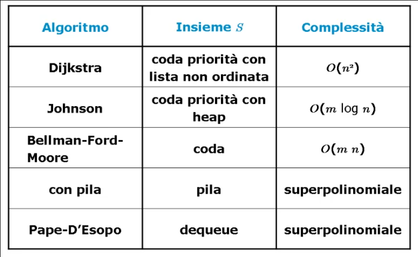
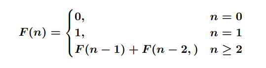
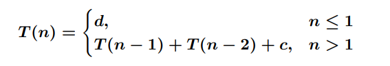
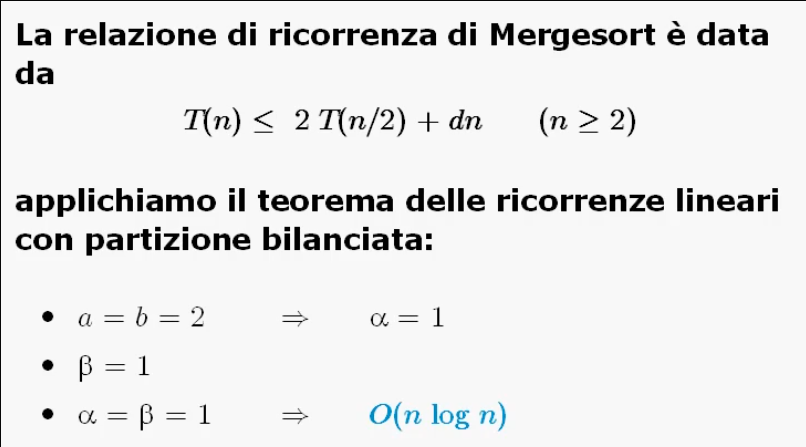
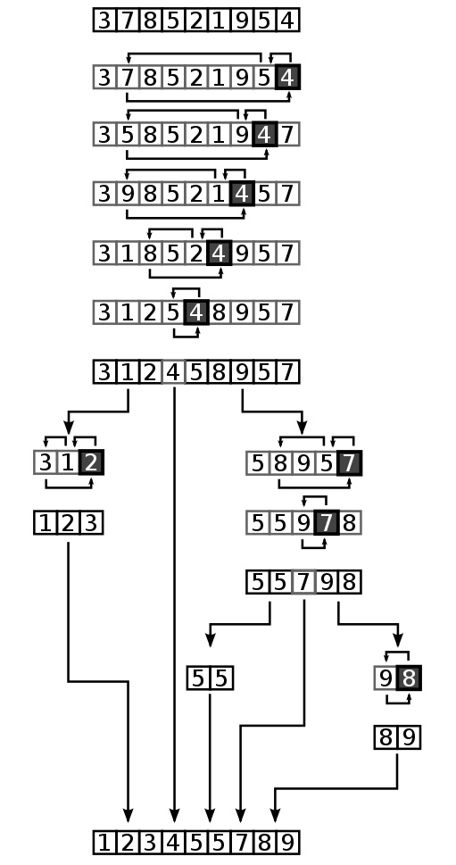
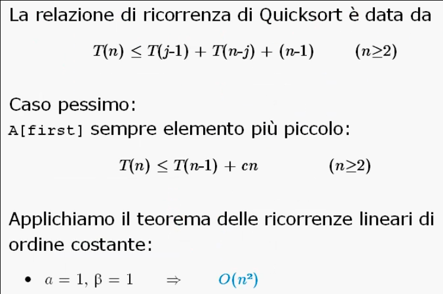
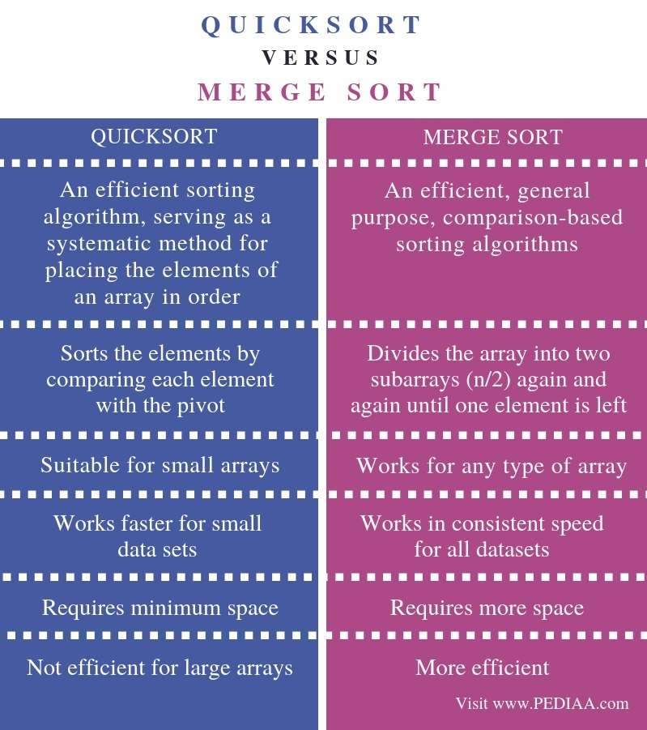

## Progettazione di algoritmi

## M6: Cammini minimi
Dato un grafo orientato _G=(V,E)_, ogni coppia di nodi _u, v ∈ E_ avra' associato un costo _w(u, v)_ detto peso.

Dato un cammino _c che collega v<sub>k</sub> nodi_ (con _k > 1_) il peso totale del cammino e' dato da:
> **w(c) = Σ<sub>i = 2 <= k</sub> w(v<sub>i-1</sub>, v<sub>i</sub>)**

Il problema dei cammini minimi e' quello di trovare un cammino da un nodo detto _radice_ ad ogni altro nodo _u ∈ V_ tale che il costo sia minimo.

La soluzione al problema e' data da _n - 1_ cammini ognuno dei quali parte da _r_ e giunge ad uno e uno solo dei rimanenti nodi: si tratta dunque di un albero di copertura.

Si evidenziano le condizioni di fattibilita':
* Il nodo _u_ deve essere raggiungibile da _r_ con un cammino;
* Non sono ammessi pesi negativi in quanto, in caso di cicli, potrebbe esistere un cammino che include tale ciclo con peso totale negativo (il peso di un cammino per un nodo _u_ potrebbe non essere inferiormente limitato).

#### Teorema di Bellman
La soluzione **ammissibile** individuata dal generico albero di copertura _T_ e' **ottima** se e solo se per ogni _(u, v) ∈ V_ valgono le **condizioni**:
* (a) d<sub>u</sub> + w(u, v) = d<sub>v</sub>, per ogni (u, v) ∈ T;
* (b) d<sub>u</sub> + w(u, v) >= d<sub>v</sub>, per ogni (u, v) ∉ T.

### Dijkstra
Se la struttura dati utilizzata e' una coda di priorita' implementata con una lista o un vettore non ordinati, si ottiene un algoritmo attribuito a Dijkstra nel 1959.

Il peso di ogni arco deve essere positivo altrimenti la complessita' e' superpolinomiale.

Ogni nodo del grafo viene estratto dalla coda di priorita' una sola volta, quando avra' la distanza minima dalla radice _r_.
```C
// L'albero minimo di copertura T viene rappresentato come vettore dei padri
// Il vettore d identifica il vettore delle distanze dalla radice r
// Il vettore b identifica il vettore di booleani visitato/non-visitato per ogni nodo

dijkstra(graph G, node r, integer[] T) {
    integer[] d <- new integer[1 ... G.n]
    boolean[] b <- new boolean[1 ... G.n]
    foreach u ∈ G.V() - {r} do
        T[u] <- nil
        d[u] <- +∞
        b[u] <- false

    T[r] <- nil
    d[r] <- 0
    b[r] <- true

    PriorityQueue S <- PriorityQueue(); S.insert(r, 0)
    while not S.isEmpty() do
        node u <- S.deleteMin()
        b[u] <- false
        foreach v ∈ G.adj(u) do
            if(d[u] + w(u, v) < d[v]) then
                if not b[v] then
                    S.insert(v, d[u] + w(u, v))
                    b[v] <- true
                else
                    S.decrease(v, d[u] + w(u, v))
                
                T[v] <- u
                d[v] <- d[u] + w(u, v)
}
```

Operazioni:
* `S.deleteMin()` ha costo _O(n)_ in quanto la struttura dati utilizzata non e' ordinata;
* `S.insert(nodo, distanza)` ha costo _O(1)_ perche' non e' necessario inserire in una posizione precisa (qualora il nodo fosse gia' presente nella lista e' possibile saperlo a priori in quanto compare come visitato nel _vettore di booleani b_).

L'algoritmo ha complessita' _O(n<sup>2</sup>)_.


### Johnson
Se la struttura dati utilizzata e' una coda di priorita' implementata con un heap binario, si ottiene un algoritmo attribuito a Johnson nel 1977.

```C
// L'albero minimo di copertura T viene rappresentato come vettore dei padri
// Il vettore d identifica il vettore delle distanze dalla radice r
// Il vettore b identifica il vettore di booleani visitato/non-visitato per ogni nodo

johnson(graph G, node r, integer[] T) {
    integer[] d <- new integer[1 ... G.n]
    boolean[] b <- new boolean[1 ... G.n]
    foreach u ∈ G.V() - {r} do
        T[u] <- nil
        d[u] <- +∞
        b[u] <- false

    T[r] <- nil
    d[r] <- 0
    b[r] <- true

    PriorityQueue S <- PriorityQueue(); S.insert(r, 0)
    while not S.isEmpty() do
        node u <- S.deleteMin()
        b[u] <- false
        foreach v ∈ G.adj(u) do
            if(d[u] + w(u, v) < d[v]) then
                if not b[v] then
                    S.insert(v, d[u] + w(u, v))
                    b[v] <- true
                else
                    S.decrease(v, d[u] + w(u, v))
                
                T[v] <- u
                d[v] <- d[u] + w(u, v)
}
```

Operazioni:
* `S.deleteMin()` e `S.decrease(nodo, distanza)` hanno costo _O(log n)_;
* Se nel caso pessimo `S.decrease(nodo, distanza)` viene chiamata ad ogni iterazione su tutti i nodi adiacenti, la complessita' totale e': _O(n log n  + ( Σ<sub>u ∈ G.V()</sub> ) | G.adj(u) | log n )_.

La complessita' dell'algoritmo e' _O(m log n)_.

### Dijkstra vs Johnson
Definizioni:
* Grafo denso: |E| e' _O(V<sup>2</sup>)_
* Grafo sparso: |E| e' _O(V)_ (dello stesso ordine di grandezza nel numero dei nodi)

Se il grafo in esame e' un grafo sparso l'algoritmo di Johnson ha complessita' _O(n log n)_ in quanto il numero di archi _m_ e' _O(n)_.

Se il grafo in esame e' un grafo denso l'algoritmo di Johnson ha complessita' _O(n<sup>2</sup> log n)_ in quanto il numero di archi _m_ e' _Ω(n<sup>2</sup>)_. Dunque l'algoritmo di Dijkstra risulterebbe piu' efficiente .

### Bellman-Ford-Moore
Se la struttura dati utilizzata e' una coda, si ottiene l'algoritmo di Bellman-Ford-Moore.

La peculiarita' di questa implementazione e' che l'algoritmo ha complessita' polinomiale anche se sono presenti archi di peso negativo.

La struttura dell'algoritmo e' simile ad una BFS per cui la "marcatura" di un nodo consiste nel diminuirne la distanza: il medesimo nodo puo' essere visitato (estratto dalla coda) al piu' _n - 1_ volte.

```C
// L'albero minimo di copertura T viene rappresentato come vettore dei padri
// Il vettore d identifica il vettore delle distanze dalla radice r
// Il vettore b identifica il vettore di booleani visitato/non-visitato per ogni nodo
bfm(graph G, node r, integer[] T) {
    integer[] d <- new integer[1 ... G.n]
    boolean[] b <- new boolean[1 ... G.n]
    foreach u ∈ G.V() - {r} do
        T[u] <- nil
        d[u] <- +∞
        b[u] <- false

    T[r] <- nil
    d[r] <- 0
    b[r] <- true

    Queue S <- Queue(); S.enqueue(r)
    while not S.isEmpty() do
        node u <- S.dequeue()
        b[u] <- false
        foreach v ∈ G.adj(u) do
            if(d[u] + w(u, v) < d[v]) then
                if not b[v] then
                    S.enqueue(v, d[u] + w(u, v))
                    b[v] <- true
               
                T[v] <- u
                d[v] <- d[u] + w(u, v)
}
```

Poiche' ad ogni "passata" la coda S contiene al piu' tutti i nodi e ad ogni passata si esaminano al piu' tutti gli archi, la complessita' dell'algoritmo e' _O(nm)_.

### Pila
Se la struttura dati utilizzata e' una pila, la complessita' dell'algoritmo diventa superpolinomiale.

Il caso pessimo si ottiene con un particolare grafo aciclico nel quale l'estrazione di un nodo _u_ da _S_ e l'aggiornamento della sua distanza determina l'inserimento di tutti i nodi _v_ piu' grandi di _u_: ne consegue che ogni nodo puo' essere inserito nella pila un numero di volte esponenziale.

### Pape - D'Esopo
Se la struttura dati utilizzata e' una _dequeue_ (double-ended-queue):
* Ogni nodo _u_ viene inserito la prima volta in coda ed testa le volte successive;
* L'idea dell'inserimento in testa e' quella di sfruttare immediatamente l'aggiornamento della distanza affinche' esso si propaghi ai nodi vicini.

L'algoritmo ha complessita' superpolinomiale ma e' stato verificato sperimentalmente che nella pratica esso risulta il piu' veloce di tutti, in particolare per grafi sparsi e planari (come quelli che rappresentano delle vere reti di comunicazione stradale).

Definizioni:
* Grafo sparso: |E| e' _O(V)_ (dello stesso ordine di grandezza nel numero dei nodi)
* Grafo planare: puo' essere disegnato sul piano in modo che le linee corrisponenti a due archi distinti non si sovrappongono mai (verificare la planarita' di una grafo G richiede _O(n + m)_ tempo).


### Confronto della complessita'
Confrontiamo gli algoritmi per i cammini minimi al variare dell'implementazione dell'insieme _S_.



In particolare, nel caso di:
* Grafi sparsi: heap < lista non ordinata = coda
  * Dijkstra e' _O(n<sup>2</sup>)_;
  * Johnson e' _O(n logn)_;
  * Bellman-Ford-Moore e' _O(n<sup>2</sup>)_.
* Grafi densi: lista non ordinata < heap < coda
  * Dijkstra e' _O(n<sup>2</sup>)_;
  * Johnson e' _O(n<sup>2</sup> logn)_;
  * Bellman-Ford-Moore e' _O(n<sup>3</sup>)_.
___

## M7: Divide et Impera

### Teorema delle ricorrenze lineari di ordine costante
Un algoritmo ricorsivo chiama se stesso un numero costante di volte _a<sub>i</sub>_.
La dimensione dell'input e' _n - i_ con _i_ costante.
Le chiamate ricorsive possono essere effettuate prima o dopo aver svolto un numero polinomiale di operazioni.

La complessita' di un algoritmo ricorsivo puo' essere espressa nella forma: 
> **T(n) = a<sub>i</sub>T(n - i) + cn<sup>β</sup>**

Variabili:
* _a<sub>i</sub> >= 1_ perche' viene fatta almeno una chiamata ricorsiva;
* _i >= 1_ perche' la dimensione del problema deve essere diminuita almeno di 1 (ad ogni chiamata ricorsiva);
* _c > 0_ e _β >= 0_ fanno riferimento alle operazioni svolte oltre alle chiamate ricorsive. 

Se generalizziamo la costante _a<sub>i</sub>_ la formula possiamo rappresentare la complessita' nella forma:
> **T(n) = Σ<sub>1<=i<=h</sub>  a<sub>i</sub>T(n - i) + cn<sup>β</sup>**

**Teorema**


Una relazione di ricorrenza di questo tipo si dice dunque:
* Lineare: perche' _n_ compare nei _T(n - 1)_ con grado 1;
* A coefficienti costanti: perche' _a<sub>i</sub>_ e' costante;
* Di ordine costante: perche' _h_ e' costante;
* Con lavoro polinomiale di suddivisione/ricombinazione: perche' _cn<sup>β</sup>_ e' un polinomio.

### Ricerca binaria vs ricerca per interpolazione
```C
// A recursive binary search function. It returns 
// location of x in given array arr[l..r] is present, 
// otherwise -1
// The x variable represents the number I'm looking for
int binarySearch(int arr[], int l, int r, int x) 
{ 
    if (r >= l) { 
        int mid = l + (r - l) / 2; 
  
        // If the element is present at the middle 
        // itself 
        if (arr[mid] == x) 
            return mid; 
  
        // If element is smaller than mid, then 
        // it can only be present in left subarray 
        if (arr[mid] > x) 
            return binarySearch(arr, l, mid - 1, x); 
  
        // Else the element can only be present 
        // in right subarray 
        return binarySearch(arr, mid + 1, r, x); 
    } 
  
    // We reach here when element is not 
    // present in array 
    return -1; 
} 
```

Siano le _n_ chiavi presenti nel vettore numeriche ed uniformemente distribuite in nell'intervallo _[k<sub>min</sub>, k<sub>max</sub>]_. Dovendo ricercare la chiave _k_ nel vettore _A[1...n]_, anziche' provare nella posizione centrale e' ragionevole tentare in quella piu' vicina a:
> **(n(k - k<sub>min</sub>) / (k<sub>max</sub> - k<sub>min</sub>)**

Il metodo di ricerca risultante e' detto di **interpolazione**.

```C
int interpolation(int arr[], int l, int r, int x) 
{ 
    if (r >= l) { 
        int mid = i + floor[(k - A[l]) * (r - l)/(A[r] - A[l]) ]; 
  
        // If the element is present at the middle 
        // itself 
        if (arr[mid] == x) 
            return mid; 
  
        // If element is smaller than mid, then 
        // it can only be present in left subarray 
        if (arr[mid] > x) 
            return binarySearch(arr, l, mid - 1, x); 
  
        // Else the element can only be present 
        // in right subarray 
        return interpolation(arr, mid + 1, r, x); 
    } 
  
    // We reach here when element is not 
    // present in array 
    return -1; 
} 
```

Sotto un'uniforme distribuzione delle chiavi all'interno dell'array la complessita' della ricerca interpolata e' _O(log log n)_.

Se ci sono poche chiavi oppure se le chiavi non sono uniformemente distribuite allora e' piu' conveniente usare la ricerca binaria (che ha complessita' _O(log n)_).


### Teorema delle ricorrenze lineari con partizione bilanciata
Per gli algoritmi divide-et-impera il problema originario di dimensione _n_ viene diviso in _a_ sottoproblemi di dimensione _n/b_ ciascuno.

La funzione di complessita':
> **T(n) = aT(n/b) + cn<sup>β</sup>**

Variabili:
* _a_ e' il numero di chiamate, dunque _a >= 1_;
* _b_ e' il numero di sottoproblemi, dunque _b >= 2_;
* _c > 0_ e _β >= 0_ fanno riferimento alle operazioni svolte oltre alle chiamate ricorsive.

**Teorema**


Una relazione di ricorrenza di questo tipo si dice dunque:
* Lineare: perche' _n_ compare nei _T(n - 1)_ con grado 1;
* A coefficienti costanti: perche' _a<sub>i</sub>_ e' costante;
* Con partizione bilanciata: perche' _n_ e' diviso per una costante _b_;
* Con lavoro polinomiale di suddivisione/ricombinazione: perche' _cn<sup>β</sup>_ e' un polinomio.

### Fibonacci iterativo vs ricorsivo
La relazione di ricorrenza che definisce i numeri di Fibonacci e':



#### Fibonacci Iterativo
L'algoritmo iterativo fa uso di un vettore di appoggio dove salvare i numeri di Fibonacci necessari al calcono di F(n).
```C
long F_i( long n ) {
    long *F, i;
    F = (long *) malloc( (n+1) * sizeof(long) );
    F[0] = 0; F[1] = 1;
    for( i=2; i<=n; i++ ) 
        F[i] = F[i-1] + F[i-2];
    return( F[n] );
}
```

La funzione del tempo di calcolo e' **T(n) = 3(n - 2) + 3** dunque la complessita' e' O(n).

#### Fibonacci ricorsivo
La funzione ricorsiva si basa sulla definizione della relazione di ricorrenza.
```C
long F_r( long n ) {
    if ( n<=1 )
        return( (n==0) ? 0 : 1 );
    else
        return( F_r(n-1) + F_r(n-2) );
}
```


Applicando il teorema delle ricorrenze lineari di ordine costante otteniamo:
* _a = 2_
* _β = 0_

Dunque la complessita' e' O(2<sup>n</sup>).


### MergeSort + relazione di ricorrenza
Poiche' sappiamo fondere due sequenze ordinate in tempo ottimo _O(n)_, quindi possiamo **separare** in due parti l'input (ripetiamo la separazione fino a quando non otteniamo sequenze di un elemento che per definizione sono ordinate) e poi **ricomponiamo** le sequenze ordinate in una sequenza piu' grande e cosi' via.

La tecnica prevede:
* **Separazione**: partizionare in due la sequenza;
* **Ricomposizione**: fusione di due sequenze ordinate.

```C
// O(nlogn) time complexity
// O(n) total with O(n) auxiliary, O(1) auxiliary with linked lists
// Not in place, stable

// Divide and Conquer algorithm

// Left and right are the fist and last indexes of the subarray of array to be sorted
void merge_sort(int array[], int left, int right)
{
    if (left < right)
    {
        // Same as (right+left)/2 but avoids overflow for large left and right
        int median = left + (right - left) / 2;

        // Sort first and second halves
        merge_sort(array, left, median);
        merge_sort(array, median+1, right);

        merge(array, left, median, right);
    }
}

// Merges two subarray of array[]
void merge(int array[], int left, int median, int right)
{
    int i, j, k;
    int n1 = median - left + 1;
    int n2 = right - median;

    // Create temp arrays
    int L[n1], R[n2];

    // Copy data to temp arrays
    for (i = 0; i < n1; i++)
        L[i] = array[left+i];
    for (j = 0; j < n2; j++)
        R[j] = array[median+1+j];

    // Merge the temp arrays back into the main array
    i = 0; 
    j = 0; 
    k = left;

    while (i < n1 && j < n2)
    {
        if (L[i] <= R[j]) 
        {
            array[k] = L[i];
            i++;
        }

        else
        {
            array[k] = R[j];
            j++;
        }

        k++;
    }

    /* Copy the remaining elements of L[], if there are any */
    while (i < n1) {
        array[k] = L[i];
        i++;
        k++;
    }

    // Copy the remaining elements of R[] if there are any
    while (j < n2)
    {
        array[k] = R[j];
        j++;
        k++;
    }
}
```




### Quicksort + relazione di ricorrenza
L'idea di base dell'algoritmo Quicksort consiste nel selezionare un elemento del vettore, detto **perno**, attorno al quale riarrangiare gli elementi:
* Gli elementi **piu' piccoli** del perno sono spostati in posizioni precedenti a quella del perno;
* Gli elementi **piu' grandi** del perno sono spostati in posizioni successive a quella del perno.

La **ricomposizione** e' ottenuta automaticamente in quanto per come e' effettuata la procedura risulta che quando soddisferemo la condizione `low == high` il vettore risultera' gia' ordinato.

```C
// O(n2) time complexity
// O(n) or O(logn) auxiliary space complexity
// In place, not stable

// Divide and Conquer algorithm


// Low is the starting index and high is the ending index of the array
void quick_sort(int array[], int low, int high)
{
    if (low < high)
    {
        // pi is the Partition Index
        int pi = partition(array, low, high);

        // Separately sort elemenets before and after the partition index
        quick_sort(array, low, pi - 1);
        quick_sort(array, pi + 1, high);
    }
}

// This function takes the last element of the subarray as pivot
// Then places the pivot element at its correct position
// Every element smaller than the pivot is placed before it
// Every element bigger than the pivot is placed after it
int partition(int array[], int low, int high) 
{
    int pivot = array[high];
    int i = (low - 1);

    for(int j = low; j <= high - 1; j++)
    {
        if(array[j] < pivot)
        {
            i++;
            swap(&array[i], &array[j]);
        }
    }
    swap(&array[i+1], &array[high]);
    return (i+1);
}
```




In particolare l'algoritmo Quicksort risulta molto efficiente nel caso medio: _O(nlogn)_.

Il miglioramento dell'efficienza si puo' ottenere con una scelta accurata del perno: ad esempio il mediano tra _low_, _high_ e l'elemento di mezzo.

### Quicksort vs Mergesort



### Domandacce:
* Si supponga di avere una variante dell'algoritmo MergeSort che suddivide l'array da ordinare in k parti, le ordina applicando ricorsivamente questa variante del MergeSort e unifica le k parti tramite una variante del Merge. Qual è la complessità di tale variante? Si richiede di fornire una risposta dettagliata e precisa.


___


## M8: Greedy
La tecnica Greedy si basa sulla **strategia dell'ingordo**:
> Compiere, ad ogni passo, la scelta migliore nell'immediato piuttosto che adottare una strategia a lungo termine.

Gli algoritmi di tipo Greedy in genere non forniscono una soluzione ottima, ma una buona soluzione iniziale per altri algoritmi piu' sofisticati.

E' una tecnica indicata per la soluzione di problemi nei quali si prevede di selezionare in maniera ottima un sottoinsieme di elementi da un insieme dato.

### Criterio di ottimalita'
Il **criterio di ottimalita'** viene fornito da una funzione che ha come parametri il valore dei singoli oggetti.

```C
void Greedy(insieme *A) {
    /* A = {a1, ..., an} */

    S = ∅;

    {ordina ai ∈ A rispetto al criterio ottimo};

    for(i = 1; i <= n; i++)
        if(S ⋃ {ai} = soluzione valida)
            S = S ⋃ {ai};

    return(S);
}
```

Dunque un algoritmo Greedy:
* Dapprima **ordina** gli oggetti in base al criterio di ottimalita';
* Costruisce la soluzione del problema **in modo incrementale** considerando gli oggetti uno alla volta e aggiungendo, se possibile, l'oggetto migliore secondo il criterio di ottimalita'.

In particolare le scelte sono fatte in base ad un principio di **ottimalita' locale**:
* Ad ogni passo viene risolto un sottoproblema di dimensioni sempre piu' piccole;
* La sua soluzione dipende dalle **scelte passate** e non da quelle future;
* Affinche' un algoritmo Greedy fornisca la soluzione ottimale di un dato problema occorre che siano verificate due proprieta' tra loro correlate:
  * **Scelta Greedy**;
  * **Sottostruttura ottima**.


### Scelta Greedy
Data una caratterizzazione matematica della soluzione, occorre dimostrare che tale soluzione puo' essere modificata in modo da utilizzare una prima scelta Greedy per ridurre il problema ad un sottoproblema piu' piccolo dello stesso tipo.

> Si cerca di dimostrare che la soluzione costruita come sequenza di scelte Greedy e' ottima.

La struttura matematica che ci consente di capire quando un algoritmo Greedy fornisce una soluzione ottima si chiama **matroide**.

### Sottostruttura ottima
Per mostrare che una scelta Greedy riduce il problema ad un sottoproblema piu' picolo dello stesso tipo, occorre dimostrare che una soluzione ottima del problema contiene al suo interno le soluzioni ottime dei sottoproblemi.

> Le successive configurazioni dell'insieme _S_ sono soluzioni ottime per il sottoproblema considerato.

### Kruskal - minimo albero di copertura
Studiamo il problema dell'**albero di copertura di costo minimo** o **MST** (Minimum Spanning Tree).

Problema:
> Dato un grafo non orientato e connesso _G = (N, A)_, con pesi _p<sub>a</sub> >= 0_ sull'arco _a = [i, j]_, trovare un albero di copertura _T_ per _G_ tale che la somma dei pesi degli archi in _T_ sia minima.

In particolare _T_ deve avere tutti gli _n_ nodi e solo _n - 1_ archi.

L'algoritmo di Kruskal essendo un algoritmo Greedy e' progettato descrivendo:
* Metodo di ordinamento:
  * Ordinamento degli archi _a_ crescente rispetto al peso _p<sub>a</sub>_.
* Metodo di inserimento nell'insieme _S_:
  * Aggiungo _a_ in _S_ se _a_ non determina alcun circuito in _T_.


L'algoritmo costruisce la soluzione per **unione di componenti connesse**.

```C
typedef struct Arco {
    struct *nodo u, v;
    int peso;
} Arco;


// A rappresenta l'insieme degli archi per un dato grafo G
// n rappresenta  le componenti distinte
// m rappresenta il numero di archi
Set kruskal(Arco[] A, integer n, integer m) {
    Set T <- Set()
    MFSet M <- Mfset(n)
    { ordina A in modo che A[1].peso <= ... <= A[m].peso }

    integer c <- 0
    integer i <- 1
    while (c < n-1 && i <= m) {
        // controllo che le componenti trovate siano distinte
        if(M.find(A[i].u) != M.find(A[i].v)) {
            M.merge(A[i].u, A[i].v)
            T.insert(A[i])
            c <- c + 1
        }
        i <- i + 1
    }
    return T 
}
```

Per una efficiente implementazione dell'algoritmo di Kruskal bisogna implementare con attenzione:
* L'ordinamento degli archi;
* L'aggiunta di un nuovo arco all'albero di copertura non deve determinatre un circuito:
  * Si ricorre agli insiemi **Mfset**: se l'insieme dei nodi dei _k_ alberi di _F<sub>k</sub>_ sono rappresentati tramite Mfset, allora l'appartenenza dei nodi _i_ e _j_ dell'arco _[i, j]_ costa _O(logn)_;
  * Il test viene ripetuto per gli _m_ archi, quindi la complessita' dell'algoritmo e' _O(mlogn)_.

### Moore - scheduling dei programmi
L'algoritmo di Moore fa uso della tecnica greedy per risolvere problemi di scheduling dei programmi.

Step:
1. I programmi sono ordinati in una sequenza S per scadenze crescenti;
2. Si cerca il primo programma p in ritardo;
3. Si elimina il programma p' piu' lungo nella sottosequenza iniziale di S che termina con p;
4. La procedura e' iterata in modo da eseguire per primi i programmi che possono essere terminati entro la loro di scadenza, per poi eseguire tutti quelli scaduti in ordine qualsiasi.

#### Complessita' senza heap modificato O(n<sup>2</sup>)
A seconda della scelta implementativa si puo' ottenere un algoritmo non efficiente che costa O(n<sup>2</sup>): 
* Per tutti i programmi p della sequenza S vengono calcolati gli istanti in cui terminano la loro esecuzione -> O(n);
* Si confrontano gli instanti di terminazione dei programmi con le relative scadenze per determinare il programma p in ritardo e quindi eliminare il programma p'piu' lungo -> O(n);
   * Poiche' la procedura di cancellazione va iterata per O(n) volte -> O(n<sup>2</sup>).

#### Complessita' con heap modificato O(nlogn)
Se invece si utilizza una procedura che fa uso di una struttura dati heap modificata affinche' possa trattare programmi e non elementi normali tenendo conto della priorita' per far scendere la complessita' totale a O(nlogn):
* L'ordinamento iniziale costa O(nlogn);
* L'inserimento dei programmi all'interno della coda di priorita' e il relativo controllo di superamento delle scadenze costa O(nlogn) in quanto l'inserimento e la cancellazione richiedono O(logn).

```C
// d = scadenze da rispettare dei programmi
// t = tempi di esecuzione dei programmi
// n = numero di programmi
// r = eventuali ritardi dei programmi
int moore(integer[] d, integer[] t, int n, boolean[] r) {
    PriorityQueue Q = PriorityQueue();
	
    int i;      //indice programma corrente
    int j;      //var di appoggio per programmi con costo elevato
    int k = 0;  //numero dei programmi in ritardo
    int T = 0;  //somma dei tempi di esecuzione dei programmi precedenti
    
    for(i = 0; i < n; i++)
        r[i] = false;
        
	{ ordina il vettore d ed il vettore t per scadenze crescenti }
    
    for(i = 0; i < n; i++) {
		Q.Insert(i, t[i])
        T += t[i]
        
        if (T >= d[i]) {
			// estrae e cancella da Q il programma con tempo di esecuzione maggiore
            j = Q.deleteMax()
            
            T -= t[j]
            r[j] = true
            k++
        }
    } 
    return k
}
```
___

## M9: Backtrack

### Confronto Backtrack vs Greedy

### Bruteforce

### Knuth-Morris-Pratt

___

## M10: Programmazione dinamica

### Floyd-Warshall

