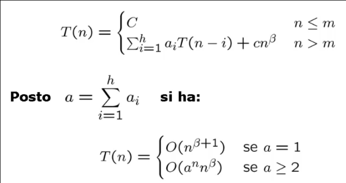

## Progettazione di algoritmi
In generale non esistono ricette per progettare algoritmi efficienti che risolvono un problema computazionale dato; tuttavia esiste uno **schema di progettazione** di algoritmi che puo' portare a risultati accettabili in termini di efficienza.

Durante la fase di progettazione di un algoritmo si possono individuare quattro fasi distinte:
* **Classificazione del problema**;
* **Caratterizzazione della soluzione**;
* **Tecnica di progetto**;
* **Scelta delle strutture dati**.

### Classificazione del problema
In questa fase si cerca di verificare l'appartenenza del problema ad una classe piu' generale avente caratteristiche comuni.
La comprensione del tipo di problema indirizza la progettazione dell'algoritmo di soluzione.

Classi di problemi:
* Problemi decisionali: la cui risposta e' "SI" o "NO" a seconda che il dato d'ingresso soddisfi o no una certa proprieta';
* Problemi di ricerca: dove tra tutte le possibili soluzioni si vuole trovare una certa _soluzione ammissibile_ che soddisfi una certa condizione;
* Problemi di ottimizzazione: alle soluzioni ammissibili e' associata una misura (costo o obiettivo) e si vuole trovare una _soluzione ottima_.

### Caratterizzazione della soluzione
La caratterizzazione matematica della soluzione, quando e' possibile, suggerisce algoritmi di soluzione talvolta semplici.

**Esempio 1**: Dire se un intero _p > 1_ e' primo.

**Caratterizzazione 1**: _p_ e' primo se e solo se e' divisibile solo per se stesso ed _1_.

**Esempio 2**: Problema dei cammini minimi su un grafo.

**Caratterizzazione 2**: condizioni di Bellman.

### Tecnica di progetto
Esistono delle tecniche di progetto di algoritmi che possono rendere gli stessi piu' efficienti:
* **Divide et impera**;
* **Backtrack**;
* **Greedy**;
* **Programmazione dinamica**;
* **Ricerca locale**.

### Scelta delle strutture dati
L'impiego di opportune strutture di dati per organizzare l'input del problema puo' migliorare l'efficienza di un algoritmo.

**Esempio 1**: L'utilizzo di uno **heap** per migliorare l'efficienza dell'algoritmo **SelectionSort**.

**Esempio 2**: La modellazione dell'**insieme _S_** nell'algoritmo generale **SPT**.

## M6: Cammini minimi
Dato un grafo orientato _G=(V,E)_, ogni coppia di nodi _u, v ∈ E_ avra' associato un costo _w(u, v)_ detto peso.

Dato un cammino _c che collega v<sub>k</sub> nodi_ (con _k > 1_) il peso totale del cammino e' dato da:
> **w(c) = Σ<sub>i = 2 <= k</sub> w(v<sub>i-1</sub>, v<sub>i</sub>)**

Il problema dei cammini minimi e' quello di trovare un cammino da un nodo detto _radice_ ad ogni altro nodo _u ∈ V_ tale che il costo sia minimo.

La soluzione al problema e' data da _n - 1_ cammini ognuno dei quali parte da _r_ e giunge ad uno e uno solo dei rimanenti nodi: si tratta dunque di un albero di copertura.

Si evidenziano le condizioni di fattibilita':
* Il nodo _u_ deve essere raggiungibile da _r_ con un cammino;
* Non sono ammessi pesi negativi in quanto, in caso di cicli, potrebbe esistere un cammino che include tale ciclo con peso totale negativo (il peso di un cammino per un nodo _u_ potrebbe non essere inferiormente limitato).

#### Teorema di Bellman
La soluzione **ammissibile** individuata dal generico albero di copertura _T_ e' **ottima** se e solo se per ogni _(u, v) ∈ V_ valgono le **condizioni**:
* (a) d<sub>u</sub> + w(u, v) = d<sub>v</sub>, per ogni (u, v) ∈ T;
* (b) d<sub>u</sub> + w(u, v) >= d<sub>v</sub>, per ogni (u, v) ∉ T.

### Dijkstra
Se la struttura dati utilizzata e' una coda di priorita' implementata con una lista o un vettore non ordinati, si ottiene un algoritmo attribuito a Dijkstra nel 1959.

Il peso di ogni arco deve essere positivo altrimenti la complessita' e' superpolinomiale.

Ogni nodo del grafo viene estratto dalla coda di priorita' una sola volta, quando avra' la distanza minima dalla radice _r_.
```C
// L'albero minimo di copertura T viene rappresentato come vettore dei padri
// Il vettore d identifica il vettore delle distanze dalla radice r
// Il vettore b identifica il vettore di booleani visitato/non-visitato per ogni nodo

dijkstra(graph G, node r, integer[] T) {
    integer[] d <- new integer[1 ... G.n]
    boolean[] b <- new boolean[1 ... G.n]
    foreach u ∈ G.V() - {r} do
        T[u] <- nil
        d[u] <- +∞
        b[u] <- false

    T[r] <- nil
    d[r] <- 0
    b[r] <- true

    PriorityQueue S <- PriorityQueue(); S.insert(r, 0)
    while not S.isEmpty() do
        node u <- S.deleteMin()
        b[u] <- false
        foreach v ∈ G.adj(u) do
            if(d[u] + w(u, v) < d[v]) then
                if not b[v] then
                    S.insert(v, d[u] + w(u, v))
                    b[v] <- true
                else
                    S.decrease(v, d[u] + w(u, v))
                
                T[v] <- u
                d[v] <- d[u] + w(u, v)
}
```

Operazioni:
* `S.deleteMin()` ha costo _O(n)_ in quanto la struttura dati utilizzata non e' ordinata;
* `S.insert(nodo, distanza)` ha costo _O(1)_ perche' non e' necessario inserire in una posizione precisa (qualora il nodo fosse gia' presente nella lista e' possibile saperlo a priori in quanto compare come visitato nel _vettore di booleani b_).

L'algoritmo ha complessita' _O(n<sup>2</sup>)_.


### Johnson
Se la struttura dati utilizzata e' una coda di priorita' implementata con un heap binario, si ottiene un algoritmo attribuito a Johnson nel 1977.

```C
// L'albero minimo di copertura T viene rappresentato come vettore dei padri
// Il vettore d identifica il vettore delle distanze dalla radice r
// Il vettore b identifica il vettore di booleani visitato/non-visitato per ogni nodo

johnson(graph G, node r, integer[] T) {
    integer[] d <- new integer[1 ... G.n]
    boolean[] b <- new boolean[1 ... G.n]
    foreach u ∈ G.V() - {r} do
        T[u] <- nil
        d[u] <- +∞
        b[u] <- false

    T[r] <- nil
    d[r] <- 0
    b[r] <- true

    PriorityQueue S <- PriorityQueue(); S.insert(r, 0)
    while not S.isEmpty() do
        node u <- S.deleteMin()
        b[u] <- false
        foreach v ∈ G.adj(u) do
            if(d[u] + w(u, v) < d[v]) then
                if not b[v] then
                    S.insert(v, d[u] + w(u, v))
                    b[v] <- true
                else
                    S.decrease(v, d[u] + w(u, v))
                
                T[v] <- u
                d[v] <- d[u] + w(u, v)
}
```

Operazioni:
* `S.deleteMin()` e `S.decrease(nodo, distanza)` hanno costo _O(log n)_;
* Se nel caso pessimo `S.decrease(nodo, distanza)` viene chiamata ad ogni iterazione su tutti i nodi adiacenti, la complessita' totale e': _O(n log n  + ( Σ<sub>u ∈ G.V()</sub> ) | G.adj(u) | log n )_.

La complessita' dell'algoritmo e' _O(m log n)_.

### Dijkstra vs Johnson
Definizioni:
* Grafo denso: |E| e' _O(V<sup>2</sup>)_
* Grafo sparso: |E| e' _O(V)_ (dello stesso ordine di grandezza nel numero dei nodi)

Se il grafo in esame e' un grafo sparso l'algoritmo di Johnson ha complessita' _O(n log n)_ in quanto il numero di archi _m_ e' _O(n)_.

Se il grafo in esame e' un grafo denso l'algoritmo di Johnson ha complessita' _O(n<sup>2</sup> log n)_ in quanto il numero di archi _m_ e' _Ω(n<sup>2</sup>)_. Dunque l'algoritmo di Dijkstra risulterebbe piu' efficiente .

### Bellman-Ford-Moore
Se la struttura dati utilizzata e' una coda, si ottiene l'algoritmo di Bellman-Ford-Moore.

La peculiarita' di questa implementazione e' che l'algoritmo ha complessita' polinomiale anche se sono presenti archi di peso negativo.

La struttura dell'algoritmo e' simile ad una BFS per cui la "marcatura" di un nodo consiste nel diminuirne la distanza: il medesimo nodo puo' essere visitato (estratto dalla coda) al piu' _n - 1_ volte.

```C
// L'albero minimo di copertura T viene rappresentato come vettore dei padri
// Il vettore d identifica il vettore delle distanze dalla radice r
// Il vettore b identifica il vettore di booleani visitato/non-visitato per ogni nodo
bfm(graph G, node r, integer[] T) {
    integer[] d <- new integer[1 ... G.n]
    boolean[] b <- new boolean[1 ... G.n]
    foreach u ∈ G.V() - {r} do
        T[u] <- nil
        d[u] <- +∞
        b[u] <- false

    T[r] <- nil
    d[r] <- 0
    b[r] <- true

    Queue S <- Queue(); S.enqueue(r)
    while not S.isEmpty() do
        node u <- S.dequeue()
        b[u] <- false
        foreach v ∈ G.adj(u) do
            if(d[u] + w(u, v) < d[v]) then
                if not b[v] then
                    S.enqueue(v, d[u] + w(u, v))
                    b[v] <- true
               
                T[v] <- u
                d[v] <- d[u] + w(u, v)
}
```

Poiche' ad ogni "passata" la coda S contiene al piu' tutti i nodi e ad ogni passata si esaminano al piu' tutti gli archi, la complessita' dell'algoritmo e' _O(nm)_.

### Pila
Se la struttura dati utilizzata e' una pila, la complessita' dell'algoritmo diventa superpolinomiale.

Il caso pessimo si ottiene con un particolare grafo aciclico nel quale l'estrazione di un nodo _u_ da _S_ e l'aggiornamento della sua distanza determina l'inserimento di tutti i nodi _v_ piu' grandi di _u_: ne consegue che ogni nodo puo' essere inserito nella pila un numero di volte esponenziale.

### Pape - D'Esopo
Se la struttura dati utilizzata e' una _dequeue_ (double-ended-queue):
* Ogni nodo _u_ viene inserito la prima volta in coda ed testa le volte successive;
* L'idea dell'inserimento in testa e' quella di sfruttare immediatamente l'aggiornamento della distanza affinche' esso si propaghi ai nodi vicini.

L'algoritmo ha complessita' superpolinomiale ma e' stato verificato sperimentalmente che nella pratica esso risulta il piu' veloce di tutti, in particolare per grafi sparsi e planari (come quelli che rappresentano delle vere reti di comunicazione stradale).

Definizioni:
* Grafo sparso: |E| e' _O(V)_ (dello stesso ordine di grandezza nel numero dei nodi)
* Grafo planare: puo' essere disegnato sul piano in modo che le linee corrisponenti a due archi distinti non si sovrappongono mai (verificare la planarita' di una grafo G richiede _O(n + m)_ tempo).


### Confronto della complessita'
Confrontiamo gli algoritmi per i cammini minimi al variare dell'implementazione dell'insieme _S_.


In particolare, nel caso di:
* Grafi sparsi: heap < lista non ordinata = coda
  * Dijkstra e' _O(n<sup>2</sup>)_;
  * Johnson e' _O(n logn)_;
  * Bellman-Ford-Moore e' _O(n<sup>2</sup>)_.
* Grafi densi: lista non ordinata < heap < coda
  * Dijkstra e' _O(n<sup>2</sup>)_;
  * Johnson e' _O(n<sup>2</sup> logn)_;
  * Bellman-Ford-Moore e' _O(n<sup>3</sup>)_.
___

## M7: Divide et Impera

### Teorema delle ricorrenze lineari di ordine costante
Un algoritmo ricorsivo chiama se stesso un numero costante di volte _a<sub>i</sub>_.
La dimensione dell'input e' _n - i_ con _i_ costante.
Le chiamate ricorsive possono essere effettuate prima o dopo aver svolto un numero polinomiale di operazioni.

La complessita' di un algoritmo ricorsivo puo' essere espressa nella forma: 
> **T(n) = a<sub>i</sub>T(n - i) + cn<sup>β</sup>**

Variabili:
* _a<sub>i</sub> >= 1_ perche' viene fatta almeno una chiamata ricorsiva;
* _i >= 1_ perche' la dimensione del problema deve essere diminuita almeno di 1 (ad ogni chiamata ricorsiva);
* _c > 0_ e _β >= 0_ fanno riferimento alle operazioni svolte oltre alle chiamate ricorsive. 

Se generalizziamo la costante _a<sub>i</sub>_ la formula possiamo rappresentare la complessita' nella forma:
> **T(n) = Σ<sub>1<=i<=h</sub>  a<sub>i</sub>T(n - i) + cn<sup>β</sup>**

**Teorema**



Una relazione di ricorrenza di questo tipo si dice dunque:
* Lineare: perche' _n_ compare nei _T(n - 1)_ con grado 1;
* A coefficienti costanti: perche' _a<sub>i</sub>_ e' costante;
* Di ordine costante: perche' _h_ e' costante;
* Con lavoro polinomiale di suddivisione/ricombinazione: perche' _cn<sup>β</sup>_ e' un polinomio.

### Ricerca binaria vs ricerca per interpolazione
```C
// A recursive binary search function. It returns 
// location of x in given array arr[l..r] is present, 
// otherwise -1
// The x variable represents the number I'm looking for
int binarySearch(int arr[], int l, int r, int x) 
{ 
    if (r >= l) { 
        int mid = l + (r - l) / 2; 
  
        // If the element is present at the middle 
        // itself 
        if (arr[mid] == x) 
            return mid; 
  
        // If element is smaller than mid, then 
        // it can only be present in left subarray 
        if (arr[mid] > x) 
            return binarySearch(arr, l, mid - 1, x); 
  
        // Else the element can only be present 
        // in right subarray 
        return binarySearch(arr, mid + 1, r, x); 
    } 
  
    // We reach here when element is not 
    // present in array 
    return -1; 
} 
```

Siano le _n_ chiavi presenti nel vettore numeriche ed uniformemente distribuite in nell'intervallo _[k<sub>min</sub>, k<sub>max</sub>]_. Dovendo ricercare la chiave _k_ nel vettore _A[1...n]_, anziche' provare nella posizione centrale e' ragionevole tentare in quella piu' vicina a:
> **(n(k - k<sub>min</sub>) / (k<sub>max</sub> - k<sub>min</sub>)**

Il metodo di ricerca risultante e' detto di **interpolazione**.

```C
int interpolation(int arr[], int l, int r, int x) 
{ 
    if (r >= l) { 
        int mid = i + floor[(k - A[l]) * (r - l)/(A[r] - A[l]) ]; 
  
        // If the element is present at the middle 
        // itself 
        if (arr[mid] == x) 
            return mid; 
  
        // If element is smaller than mid, then 
        // it can only be present in left subarray 
        if (arr[mid] > x) 
            return binarySearch(arr, l, mid - 1, x); 
  
        // Else the element can only be present 
        // in right subarray 
        return interpolation(arr, mid + 1, r, x); 
    } 
  
    // We reach here when element is not 
    // present in array 
    return -1; 
} 
```

Sotto un'uniforme distribuzione delle chiavi all'interno dell'array la complessita' della ricerca interpolata e' _O(log log n)_.

Se ci sono poche chiavi oppure se le chiavi non sono uniformemente distribuite allora e' piu' conveniente usare la ricerca binaria (che ha complessita' _O(log n)_).


### Teorema delle ricorrenze lineari con partizione bilanciata
Per gli algoritmi divide-et-impera il problema originario di dimensione _n_ viene diviso in _a_ sottoproblemi di dimensione _n/b_ ciascuno.

La funzione di complessita':
> **T(n) = aT(n/b) + cn<sup>β</sup>**

Variabili:
* _a_ e' il numero di chiamate, dunque _a >= 1_;
* _b_ e' il numero di sottoproblemi, dunque _b >= 2_;
* _c > 0_ e _β >= 0_ fanno riferimento alle operazioni svolte oltre alle chiamate ricorsive.

**Teorema**


Una relazione di ricorrenza di questo tipo si dice dunque:
* Lineare: perche' _n_ compare nei _T(n - 1)_ con grado 1;
* A coefficienti costanti: perche' _a<sub>i</sub>_ e' costante;
* Con partizione bilanciata: perche' _n_ e' diviso per una costante _b_;
* Con lavoro polinomiale di suddivisione/ricombinazione: perche' _cn<sup>β</sup>_ e' un polinomio.

### Fibonacci iterativo vs ricorsivo
La relazione di ricorrenza che definisce i numeri di Fibonacci e':


#### Fibonacci Iterativo
L'algoritmo iterativo fa uso di un vettore di appoggio dove salvare i numeri di Fibonacci necessari al calcono di F(n).
```C
long F_i( long n ) {
    long *F, i;
    F = (long *) malloc( (n+1) * sizeof(long) );
    F[0] = 0; F[1] = 1;
    for( i=2; i<=n; i++ ) 
        F[i] = F[i-1] + F[i-2];
    return( F[n] );
}
```

La funzione del tempo di calcolo e' **T(n) = 3(n - 2) + 3** dunque la complessita' e' O(n).

#### Fibonacci ricorsivo
La funzione ricorsiva si basa sulla definizione della relazione di ricorrenza.
```C
long F_r( long n ) {
    if ( n<=1 )
        return( (n==0) ? 0 : 1 );
    else
        return( F_r(n-1) + F_r(n-2) );
}
```


Applicando il teorema delle ricorrenze lineari di ordine costante otteniamo:
* _a = 2_
* _β = 0_

Dunque la complessita' e' O(2<sup>n</sup>).


### MergeSort + relazione di ricorrenza
Poiche' sappiamo fondere due sequenze ordinate in tempo ottimo _O(n)_, quindi possiamo **separare** in due parti l'input (ripetiamo la separazione fino a quando non otteniamo sequenze di un elemento che per definizione sono ordinate) e poi **ricomponiamo** le sequenze ordinate in una sequenza piu' grande e cosi' via.

La tecnica prevede:
* **Separazione**: partizionare in due la sequenza;
* **Ricomposizione**: fusione di due sequenze ordinate.

```C
// O(nlogn) time complexity
// O(n) total with O(n) auxiliary, O(1) auxiliary with linked lists
// Not in place, stable

// Divide and Conquer algorithm

// Left and right are the fist and last indexes of the subarray of array to be sorted
void merge_sort(int array[], int left, int right)
{
    if (left < right)
    {
        // Same as (right+left)/2 but avoids overflow for large left and right
        int median = left + (right - left) / 2;

        // Sort first and second halves
        merge_sort(array, left, median);
        merge_sort(array, median+1, right);

        merge(array, left, median, right);
    }
}

// Merges two subarray of array[]
void merge(int array[], int left, int median, int right)
{
    int i, j, k;
    int n1 = median - left + 1;
    int n2 = right - median;

    // Create temp arrays
    int L[n1], R[n2];

    // Copy data to temp arrays
    for (i = 0; i < n1; i++)
        L[i] = array[left+i];
    for (j = 0; j < n2; j++)
        R[j] = array[median+1+j];

    // Merge the temp arrays back into the main array
    i = 0; 
    j = 0; 
    k = left;

    while (i < n1 && j < n2)
    {
        if (L[i] <= R[j]) 
        {
            array[k] = L[i];
            i++;
        }

        else
        {
            array[k] = R[j];
            j++;
        }

        k++;
    }

    /* Copy the remaining elements of L[], if there are any */
    while (i < n1) {
        array[k] = L[i];
        i++;
        k++;
    }

    // Copy the remaining elements of R[] if there are any
    while (j < n2)
    {
        array[k] = R[j];
        j++;
        k++;
    }
}
```


### Quicksort + relazione di ricorrenza
L'idea di base dell'algoritmo Quicksort consiste nel selezionare un elemento del vettore, detto **perno**, attorno al quale riarrangiare gli elementi:
* Gli elementi **piu' piccoli** del perno sono spostati in posizioni precedenti a quella del perno;
* Gli elementi **piu' grandi** del perno sono spostati in posizioni successive a quella del perno.

La **ricomposizione** e' ottenuta automaticamente in quanto per come e' effettuata la procedura risulta che quando soddisferemo la condizione `low == high` il vettore risultera' gia' ordinato.

```C
// O(n2) time complexity
// O(n) or O(logn) auxiliary space complexity
// In place, not stable

// Divide and Conquer algorithm


// Low is the starting index and high is the ending index of the array
void quick_sort(int array[], int low, int high)
{
    if (low < high)
    {
        // pi is the Partition Index
        int pi = partition(array, low, high);

        // Separately sort elemenets before and after the partition index
        quick_sort(array, low, pi - 1);
        quick_sort(array, pi + 1, high);
    }
}

// This function takes the last element of the subarray as pivot
// Then places the pivot element at its correct position
// Every element smaller than the pivot is placed before it
// Every element bigger than the pivot is placed after it
int partition(int array[], int low, int high) 
{
    int pivot = array[high];
    int i = (low - 1);

    for(int j = low; j <= high - 1; j++)
    {
        if(array[j] < pivot)
        {
            i++;
            swap(&array[i], &array[j]);
        }
    }
    swap(&array[i+1], &array[high]);
    return (i+1);
}
```


In particolare l'algoritmo Quicksort risulta molto efficiente nel caso medio: _O(nlogn)_.

Il miglioramento dell'efficienza si puo' ottenere con una scelta accurata del perno: ad esempio il mediano tra _low_, _high_ e l'elemento di mezzo.

### Quicksort vs Mergesort


### Domandacce:
* Si supponga di avere una variante dell'algoritmo MergeSort che suddivide l'array da ordinare in k parti, le ordina applicando ricorsivamente questa variante del MergeSort e unifica le k parti tramite una variante del Merge. Qual è la complessità di tale variante? Si richiede di fornire una risposta dettagliata e precisa.


___


## M8: Greedy
La tecnica Greedy si basa sulla **strategia dell'ingordo**:
> Compiere, ad ogni passo, la scelta migliore nell'immediato piuttosto che adottare una strategia a lungo termine.

Gli algoritmi di tipo Greedy in genere non forniscono una soluzione ottima, ma una buona soluzione iniziale per altri algoritmi piu' sofisticati.

E' una tecnica indicata per la soluzione di problemi nei quali si prevede di selezionare in maniera ottima un sottoinsieme di elementi da un insieme dato.

### Criterio di ottimalita'
Il **criterio di ottimalita'** viene fornito da una funzione che ha come parametri il valore dei singoli oggetti.

```C
void Greedy(insieme *A) {
    /* A = {a1, ..., an} */

    S = ∅;

    {ordina ai ∈ A rispetto al criterio ottimo};

    for(i = 1; i <= n; i++)
        if(S ⋃ {ai} = soluzione valida)
            S = S ⋃ {ai};

    return(S);
}
```

Dunque un algoritmo Greedy:
* Dapprima **ordina** gli oggetti in base al criterio di ottimalita';
* Costruisce la soluzione del problema **in modo incrementale** considerando gli oggetti uno alla volta e aggiungendo, se possibile, l'oggetto migliore secondo il criterio di ottimalita'.

In particolare le scelte sono fatte in base ad un principio di **ottimalita' locale**:
* Ad ogni passo viene risolto un sottoproblema di dimensioni sempre piu' piccole;
* La sua soluzione dipende dalle **scelte passate** e non da quelle future;
* Affinche' un algoritmo Greedy fornisca la soluzione ottimale di un dato problema occorre che siano verificate due proprieta' tra loro correlate:
  * **Scelta Greedy**;
  * **Sottostruttura ottima**.


### Scelta Greedy
Data una caratterizzazione matematica della soluzione, occorre dimostrare che tale soluzione puo' essere modificata in modo da utilizzare una prima scelta Greedy per ridurre il problema ad un sottoproblema piu' piccolo dello stesso tipo.

> Si cerca di dimostrare che la soluzione costruita come sequenza di scelte Greedy e' ottima.

La struttura matematica che ci consente di capire quando un algoritmo Greedy fornisce una soluzione ottima si chiama **matroide**.

### Sottostruttura ottima
Per mostrare che una scelta Greedy riduce il problema ad un sottoproblema piu' picolo dello stesso tipo, occorre dimostrare che una soluzione ottima del problema contiene al suo interno le soluzioni ottime dei sottoproblemi.

> Le successive configurazioni dell'insieme _S_ sono soluzioni ottime per il sottoproblema considerato.

### Kruskal - minimo albero di copertura
Studiamo il problema dell'**albero di copertura di costo minimo** o **MST** (Minimum Spanning Tree).

Problema:
> Dato un grafo non orientato e connesso _G = (N, A)_, con pesi _p<sub>a</sub> >= 0_ sull'arco _a = [i, j]_, trovare un albero di copertura _T_ per _G_ tale che la somma dei pesi degli archi in _T_ sia minima.

In particolare _T_ deve avere tutti gli _n_ nodi e solo _n - 1_ archi.

L'algoritmo di Kruskal essendo un algoritmo Greedy e' progettato descrivendo:
* Metodo di ordinamento:
  * Ordinamento degli archi _a_ crescente rispetto al peso _p<sub>a</sub>_.
* Metodo di inserimento nell'insieme _S_:
  * Aggiungo _a_ in _S_ se _a_ non determina alcun circuito in _T_.


L'algoritmo costruisce la soluzione per **unione di componenti connesse**.

```C
typedef struct Arco {
    struct *nodo u, v;
    int peso;
} Arco;


// A rappresenta l'insieme degli archi per un dato grafo G
// n rappresenta  le componenti distinte
// m rappresenta il numero di archi
Set kruskal(Arco[] A, integer n, integer m) {
    Set T <- Set()
    MFSet M <- Mfset(n)
    { ordina A in modo che A[1].peso <= ... <= A[m].peso }

    integer c <- 0
    integer i <- 1
    while (c < n-1 && i <= m) {
        // controllo che le componenti trovate siano distinte
        if(M.find(A[i].u) != M.find(A[i].v)) {
            M.merge(A[i].u, A[i].v)
            T.insert(A[i])
            c <- c + 1
        }
        i <- i + 1
    }
    return T 
}
```

Per una efficiente implementazione dell'algoritmo di Kruskal bisogna implementare con attenzione:
* L'ordinamento degli archi;
* L'aggiunta di un nuovo arco all'albero di copertura non deve determinatre un circuito:
  * Si ricorre agli insiemi **Mfset**: se l'insieme dei nodi dei _k_ alberi di _F<sub>k</sub>_ sono rappresentati tramite Mfset, allora l'appartenenza dei nodi _i_ e _j_ dell'arco _[i, j]_ costa _O(logn)_;
  * Il test viene ripetuto per gli _m_ archi, quindi la complessita' dell'algoritmo e' _O(mlogn)_.

### Moore - scheduling dei programmi
L'algoritmo di Moore fa uso della tecnica greedy per risolvere problemi di scheduling dei programmi.

Step:
1. I programmi sono ordinati in una sequenza S per scadenze crescenti;
2. Si cerca il primo programma p in ritardo;
3. Si elimina il programma p' piu' lungo nella sottosequenza iniziale di S che termina con p;
4. La procedura e' iterata in modo da eseguire per primi i programmi che possono essere terminati entro la loro di scadenza, per poi eseguire tutti quelli scaduti in ordine qualsiasi.

#### Complessita' senza heap modificato O(n<sup>2</sup>)
A seconda della scelta implementativa si puo' ottenere un algoritmo non efficiente che costa O(n<sup>2</sup>): 
* Per tutti i programmi p della sequenza S vengono calcolati gli istanti in cui terminano la loro esecuzione -> O(n);
* Si confrontano gli instanti di terminazione dei programmi con le relative scadenze per determinare il programma p in ritardo e quindi eliminare il programma p'piu' lungo -> O(n);
   * Poiche' la procedura di cancellazione va iterata per O(n) volte -> O(n<sup>2</sup>).

#### Complessita' con heap modificato O(nlogn)
Se invece si utilizza una procedura che fa uso di una struttura dati heap modificata affinche' possa trattare programmi e non elementi normali tenendo conto della priorita' per far scendere la complessita' totale a O(nlogn):
* L'ordinamento iniziale costa O(nlogn);
* L'inserimento dei programmi all'interno della coda di priorita' e il relativo controllo di superamento delle scadenze costa O(nlogn) in quanto l'inserimento e la cancellazione richiedono O(logn).

```C
// d = scadenze da rispettare dei programmi
// t = tempi di esecuzione dei programmi
// n = numero di programmi
// r = eventuali ritardi dei programmi
int moore(integer[] d, integer[] t, int n, boolean[] r) {
    PriorityQueue Q = PriorityQueue();
	
    int i;      //indice programma corrente
    int j;      //var di appoggio per programmi con costo elevato
    int k = 0;  //numero dei programmi in ritardo
    int T = 0;  //somma dei tempi di esecuzione dei programmi precedenti
    
    for(i = 0; i < n; i++)
        r[i] = false;
        
	{ ordina il vettore d ed il vettore t per scadenze crescenti }
    
    for(i = 0; i < n; i++) {
		Q.Insert(i, t[i])
        T += t[i]
        
        if (T >= d[i]) {
			// estrae e cancella da Q il programma con tempo di esecuzione maggiore
            j = Q.deleteMax()
            
            T -= t[j]
            r[j] = true
            k++
        }
    } 
    return k
}
```
___

## M9: Backtrack
La tecnica e' costituita da due fasi:
* La prima in cui viene **costruita la soluzione**;
* La seconda in cui viene **distrutta la soluzione**.

Un algoritmo puo' dunque essere classificato di tipo Backtrack quando in esso sono previsti strumenti per la costruzione e la distruzione (di una parte) della soluzione.

Ad esempio tutti gli algoritmi di visita di un albero sono di tipo Backtrack in quanto l'elaborazione su un nodo **dipende** dal risultato della visita dei suoi sottoalberi.

Anche la visita di un grafo di tipo DFS e' un algoritmo di tipo Backtrack.

### Confronto Backtrack vs Greedy
Dato un problema di selezionare un sottoinsieme di elementi _S_ da un insieme _M_, con _S ⊂ M_:
* Un algoritmo **Greedy costruttivo** calcola una soluzione _S_, inzializzata all'insieme vuoto, **aggiungendo** ad ogni passo un elemento con una scelta di tipo Greedy;
* Un algoritmo **Greedy distruttivo** calcola una soluzione _S_ inizializzata ad _M_, **eliminando** ad ogni passo un elemento con una scelta di tipo Greedy;
* La tecnica **Backtrack** cerca di mettere insieme le due possibilita' in un unico schema.

La tecnica Backtrack e' la tecnica di progetto utilizzata per **algoritmi di enumerazione**, quella classe di algoritmi che provano tutte le possibilita' per ottenere una soluzione o la migliore soluzione per il problema dato.

### Permutazioni
[Esercizio permutazioni](backtrack_permutazioni.pdf)

### Problema dello string matching
Consiste nel trovare un'occorrenza di una sequenza P (_pattern_) di _m_ caratteri all'interno di un'altra sequenza T (_testo_) di _n_ caratteri.

### Bruteforce
Si cerca di riconoscere il pattern partendo dalla prima posizione del testo e scandendo le successive _m_ posizioni.

Se il pattern non e' individuato, si fa backtrack sulla posizione successiva.
```C
// *T testo in cui cercare
// n lunghezza del testo T

// *P pattern da cercare
// m lunghezza del pattern P

// k misura l'avanzare in T della verifica dell'eventuale matching
// i misura la scansione all'interno del testo T
// j misura la scansione all'interno del pattern P
int bruteforce(char *P, char *T, int n, int m) {
    int i, j, k;
    i = j = k = 1;

    while(i <= n && j <= m) {
        if(T[i] == P[j]) {
            i++; j++;
        } else {
            k++;
            i = k = j = 1;
        }
    }

    return ((j > m ? k : i));
}
```
Nel caso pessimo ad ogni iterazione, il pattern _P_ ha una corrispondenza in _T_ per _m - 1_ caratteri.

Complessita':
* Il cursore _k_ assume _n - m + 1_ valori, che e' _O(n)_;
* Per ogni valore assunto dal cursore _k_, gli indici _i_ e _j_ possono assumere al piu' _m_ valori;
* Pertanto la complessita' dell'algoritmo e' _O(mn)_.

### Knuth-Morris-Pratt
Se l'algoritmo non riconosce _P_ in _T_ a partire da _k_, viene effettuato un backtrack sugli indici _i_ e _j_: questo tipo di backtrack non e' il piu' efficiente.

E' necessario dunque calcolare il nuovo valore di backtrack _back[j]_ da assegnare all'indice _j_. Tale valore e' dato da:

_max{h : h < j - 2 e P[1...h -1]_ = _P[j - h + 1...j - 1]_.

```C
void KMPSearch(char *pat, char *txt)
{
    int M = strlen(pat);
    int N = strlen(txt);
 
    // create lps[] that will hold the longest prefix suffix
    // values for pattern
    int *lps = (int *)malloc(sizeof(int)*M);
    int j  = 0;  // index for pat[]
 
    // Preprocess the pattern (calculate lps[] array)
    computeLPSArray(pat, M, lps);
 
    int i = 0;  // index for txt[]
    while (i < N)
    {
      if (pat[j] == txt[i])
      {
        j++;
        i++;
      }
 
      if (j == M)
      {
        printf("Found pattern at index %d \n", i-j);
        j = lps[j-1];
      }
 
      // mismatch after j matches
      else if (i < N && pat[j] != txt[i])
      {
        // Do not match lps[0..lps[j-1]] characters,
        // they will match anyway
        if (j != 0)
         j = lps[j-1];
        else
         i = i+1;
      }
    }
    free(lps); // to avoid memory leak
}

// Longest Prefix Suffix
void computeLPSArray(char *pat, int M, int *lps)
{
    int len = 0;  // length of the previous longest prefix suffix
    int i;
 
    lps[0] = 0; // lps[0] is always 0
    i = 1;
 
    // the loop calculates lps[i] for i = 1 to M-1
    while (i < M)
    {
       if (pat[i] == pat[len])
       {
         len++;
         lps[i] = len;
         i++;
       }
       else // (pat[i] != pat[len])
       {
         if (len != 0)
         {
           // This is tricky. Consider the example 
           // AAACAAAA and i = 7.
           len = lps[len-1];
 
           // Also, note that we do not increment i here
         }
         else // if (len == 0)
         {
           lps[i] = 0;
           i++;
         }
       }
    }
}
```

L'algoritmo di Knuth-Morris-Pratt ha una complessita' data dalla somma delle complessita' della funzione _calcola-back_ (computeLPSArray) e dal ciclo `while`:
* Il calcolo del valore di backtrack compie _O(m)_ confronti;
* Il `while` esegue _O(n)_ confronti.
* La complessita' risultante e' _O(n + m)_

___

## M10: Programmazione dinamica
La programmazione dinamica e' un'estensione della tecnica Divide et Impera. Fu introdotta da Bellman nel 1957 per la soluzione di problemi di ottimizzazione.

L'idea principale consiste nello sfruttare tutte le soluzioni dei sottoproblemi piu' piccoli per la costruzione della soluzione dei problemi di dimensione maggiore.

Condizioni di applicazione:
* Sia possibile **ricombinare** la soluzione di problemi piccoli per ottenere quelle di problemi piu' grandi;
* La soluzione di un sottoproblema sia **invariante**.
* I sottoproblemi devono essere **dipendenti**.

Per avere complessita' al piu' polinomiale occorre:
* Un numero **polinomiale** di sottoproblemi da risolvere;
* Usare una **tabella** per memorizzare le soluzioni dei sottoproblemi a prescindere dal loro futuro utilizzo;
* Che il tempo per combinare le soluzioni e trovare la soluzione al problema piu' grande sia **polinomiale**.
  
### Programmazione dinamica vs Divide et Impera
A differenza della tecnica Divide et Impera, la programmazione dinamica:
* E' **iterativa**;
* Risolve sottoproblemi di dimensione crescente;
* Memorizza i risultati intermedi in una **tabella**.

In particolare risulta conveniente quando i sottoproblemi **non sono indipendenti** tra loro, in quanto la tenica risolvere i sottoproblemi comuni una volta soltanto e riutilizza la soluzione ottenuta ogni volta che e' necessario.

La tecnica di Divide et Impera e' conveniente quando i sottoproblemi sono indipendenti, in quanto ricalcolerebbe piu' volte la soluzione del sottoproblema in comune.

### String matching approssimato
Lo String Matching approssimato consiste nel cercare un pattern _P_ all'interno di un testo _T_ **ammettendo errori** tra _T_ e _P_:
* I corrispondenti caratteri in _P_ e in _T_ sono diversi;
* Un carattere in _P_ non compare in _T_;
* Un carattere in _T_ non compare in _P_;

Il problema quindi consiste nel trovare un'occorrenza _k-_approssimata di _P_ in _T_.

Supponiamo che sia _P_ che _T_ partano con un carattere vuoto in posizione 0.

Gli elementi di _P_ saranno indicati come _p<sub>0</sub>, p<sub>1</sub>, ..., p<sub>m</sub>_, mentre gli elementi di _T_ saranno _t<sub>0</sub>, t<sub>1</sub>, ..., t<sub>n</sub>_.

Definiamo una tabella o matrice _D[i, j]_ con _0 <= i <= m_ e _0 <= j <= n_:
> _D[i, j]_ = **minimo** numero di errori tra _p<sub>0</sub>, p<sub>1</sub>, ..., p<sub>m</sub>_ ed un segmento di _T_ che termina in _t<sub>j</sub>_.

Inizializziamo la matrice:
* _D[0, j] = 0_, per ogni _j_;
* _D[i, 0] = i_, per ogni _i_.

In base a cio, le posizioni di _i_ e _j_ all'interno della tabella _D[i, j]_ potra' essere uguale a:
* **_D[i - 1, j - 1]_** se _p<sub>i</sub> = t<sub>j</sub>_, altrimenti **_D[i - 1, j - 1] + 1_**: avanzando di un carattere sia in _P_ che in _T_, il numero di errori rimane invariato oppure incrementa di 1;
* **_D[i - 1, j] + 1_**: avanzando di un carattere in _P_ aumentano di 1 gli errori;
* **_D[i, j - 1] + 1_**: avanzando di un carattere in _T_ aumentano di 1 gli errori.


```C
int StringMatchingApprox(char *P, char *T, int n, int m) {
    /* D matrice [0..n]x[0..n] */
    int i, j, min;

    /* Inizializzazione della matrice */
    for(j = 0; j <= n ; j++) D[0,j] = 0;
    for(i = 0; i <= m ; i++) D[i,0] = i;

    /* Calcolo dei minimi delle posizioni adiacenti della posizione che stiamo calcolando */
    for(i = 0; i <= m ; i++)
        for(j = 1; j <= n ; j++) {
            
            min = D[i - 1, j - 1];
            min = (P[i] == T[j] ? min : min + 1);
            min = (D[i - 1, j] + 1 < min ? D[i - 1, j] + 1 : min);
            min = (D[i, j - 1] + 1 < min ? D[i, j - 1] + 1 : min);
            D[i,j] = min;
        }

        /* Viene scandita l'n-esima riga per cercare il numero minimo di differenze tra il pattern e il testo */
        min = D[m,0]; 
        i = 0;

        for(j = 1; j <= n; j++) 
            if(D[m,j] < min) {
                min = D[m,j];
                i = j;
            }
        
        return(i);
}
```

L'algoritmo riempie una matrice di dimensioni _n x m_. Ogni posizione della matrice, compresa la prima riga e la prima colonna e' calcolata in tempo costante.

La complessita' e' dunque _O(nm)_.

La procedura puo' essere modificata senza aumentarne la complessita' anche per ricavare l'occorrenza approssimata e i relativi errori.

## M11: Teoria della complessita'

### Problemi difficili
artendo dalla definizione di **Domino Limitato** e' possibile determinare quando un problema e' facile o difficile:
> Dati un intero positivo _n_ ed un insieme finito _D_ di _m_ tipi di **tessere orientate** e' possibile ricoprire un'area quadrata di lato _n_ con copie delle tessere in _d_ in modo che:
> * Nessuna tessera sia ruotata;
> * Una particolare tessera _d ∈ D_ occupi la posizione piu' in basso a sinistra;
> * Due tessere che si toccano abbiano i lati adiacenti dello stesso colore.

Una **tessera orientata** e' un quadrato di lato unitario diviso in quattro parti dalle diagonali, con ciascun quarto colorato con un colore.


Un algoritmo per la soluzione del domino limitato che prova tutte le combinazioni dovra' generare _m<sup>n<sup>2</sup>-1</sup>_ combinazioni, dunque ha una complessita' superpolinomiale.

Sfortunatamente, non e' noto un algoritmo di soluzione migliore di quello che prova tutte le soluzioni. Rientra dunque nella classe di **problemi difficili** come i problemi seguenti:
* **Problema della colorazione (versione decisionale)**:
  * Dato un grafo non orientato ed un intero _k_, e' possibile colorare i nodi del grafo usando al piu' _k_ colori in modo che ogni nodo sia colorato con un colore diverso da tutti i nodi adiacenti?
* **Problema della cricca (versione decisionale)**:
  * Dato un grafo non orientato ed un intero _k_, esiste un sottoinsieme di almeno _k_ nodi tutti mutuamente adiacenti (da ogni nodo posso andare in tutti gli altri nodi appartenenti alla cricca)?
* **Problema del commesso viaggiatore (versione decisionale)**:
  * Date _n_ citta' e le distanze tra di esse, ed un intero _k_, e' possibile partire da una citta', attraversare ogni citta' esattamente una volta, e ritornare alla citta' di partenza percorrendo una distanza complessiva non superiore a _k_?

I problemi introdotti appartengono alla stessa classe di problemi computazionalmente correlati, ognuno puo' essere risolto in tempo superpolinomiale, ma nessun in tempo polinomiale.

Se **uno solo** fosse risolubile in tempo polinomiale allora lo sarebbero tutti.

La **tesi non dimostrata** e' che tale algoritmo polinommiale non esiste.

La soluzione di un problema in forma decisionale e' la risposta **si o no** a seconda che il dato d'ingresso soddisfi una certa proprieta'.

### Certificati polinomiali
I problemi difficili hanno una caratteristica in comune, e' abbastanza facile certificare la corretteza di una soluzione.

Formalmente, per tutti questi problemi, esiste un **certificato polinomiale**: e' un algoritmo che, data una presunta soluzione del problema, verifica in tempo polinomiale che sia effettivamente una soluzione che fornisce la risposta **si**.

Esempio di certificato polinomiale per il problema del commesso viaggiatore: modellando il problema su grafo, una soluzione del problema e' una sequenza di _n_ nodi.

In **tempo lineare** si verifica che:
* Solo il nodo finale ed il nodo iniziale sono identici;
* I nodi sono tra loro effettivamente connessi;
* La somma delle distanze sia minore di _k_.


### Non determinismo

Un algoritmo non deterministico e' un algoritmo che, al momento di effettuare una **decisione**, effettua sempre quella migliore, ossia quella che porta alla soluzione corretta.

Utilizzeremo, per indicare le decisioni, 3 istruzioni speciali:
* `choice(I)`: che sceglie arbitrariamente il migliore elemento dall'insieme finito _I_;
* `failure`: che blocca la computazione in uno stato di fallimento;
* `success`: che blocca la computazione in uno stato di successo.

L'istruzione `choice` puo' essere paragonata ad un oracolo che ad ogni chiamata indovina sempre la scelta giusta. Questa scelta puo' essere vista come se la `choice` facesse tante copie dell'algoritmo con parametri diversi, per ognuna trovasse la soluzione corrispondente e tra tutte le soluzioni scegliesse quella migliore.


L'algoritmo non deterministico utilizza un certificato polinomiale per **certificare** la correttezza della soluzione generata da una sequenza choice.

Esempio di algoritmo non deterministico per il problema della cricca:
```C
void ndcricca(grafo G=(N, A), int n, int k) {
    int i, j, h;
    boolean S[n];

    // creazione non deterministica della soluzione
    for(i = 0; i < n; i++) S[i] = choice({true, false});

    h = 0;
    for(i = 0; i < n; i++) {
        if(S[i]) {
        
            h++;
            for(j = 0; j < i - 1; j++)
                if(S[j] && (i,j) ∉ A) failure;
        }
    }

    // certificato polinomiale
    if(h >= k)
        success;
    else
        failure;
}
```
Un algoritmo non deterministico e' caratterizzato da una computazione ad albero radicato, detto **albero delle scelte** dove:
* Un nodo interno rappresenta una **soluzione intermedia**;
* Una foglia rappresenta una **soluzione**.
  
### Enumerazione
Poiche' il non determinismo **non e' realistico** occorre **simulare** il comportamento di un algoritmo non deterministico con uno deterministico.

Ossia, **generare** ed **esplorare** deterministicamente lo spazio delle soluzioni, **visitando sistematicamente** l'albero delle scelte che ha un numero superpolinomiale di nodi.

Un algoritmo enumerativo e' dunque un algoritmo che esegue una visita, quanto piu' possibile intelligente, dell'albero delle scelte.

Supponiamo che tutti i parametri siano globali nell'esempio enumerativo per il problema della cricca:
```C
void enum_cricca(int i ,int h) {
    int j;
    boolean cricca;

    if(i <= n) {
        S[i] = false;
        enum_cricca(i + 1, h);

        S[i] = true;

        for(j = 0; j < i - 1; j++)
            if(S[j] && (i, j) ∉ A) cricca = FALSE;

        if(cricca)
            if(h + 1 = k)
                success;
            else 
                enum_cricca(i + 1, h + 1);
    }
}
```

Per ridurre l'esplorazione si puo' sostituire il controllo `i <= n` con `k - h <= n - i + 1` dove:
* `n - i + 1`: e' il numero di nodi ancora da considerare;
* `k - h`: e' il numero di nodi mancanti per completare la cricca.

### Classificazione dei problemi
Un problema e' **difficile** quando ammette solo un algoritmo enumerativo che, nel caso pessimo, esplora completamente l'albero delle scelte.

Un problema e' **facile** quando ammette un algoritmo capace di percorrere un cammino radice-foglia nell'albero delle scelte.  

Utilizziamo i concetti di problema facile e difficile per classificare i problemi computazionali rispetto al loro grado di difficolta'.

Un algoritmo polinomiale si comporta come un algoritmo non deterministico rispetto alla visita dell'albero delle scelte: ci si puo' chiedere se esiste una simulazione polinomiale di un algoritmo non deterministico, ma attualmente questo non e' noto.

Si e' individuata una classe di problemi detti **problemi NP-completi** per i quali:
* Si conoscono solo algoritmi polinomiali non deterministici;
* Non si conosce alcun algoritmo polinomiale deterministico;
* Se si trovasse un algoritmo polinomiale deterministico per uno solo dei problemi appartenenti alla classe, allora si potrebbe trovare un algoritmo per tutti gli altri problemi appartenenti alla classe.

La classe P e' la classe di tutti i problemi decisionali che sono risolvibili in tempo polinomiale con algoritmi **deterministici**.

La classe NP e' la classe di tutti i problemi decisionali che sono risolvibili in tempo polinomiale con algoritmi **non deterministici**.

### Riducibilita' polinomiale
Dati A e B due problemi decisionali, si dice che **A si riduce in tempo polinomiale a B**, e si scrive **_A ∝ B_** (A e' approssimativamente proporzionale a B, \propto), se esiste una funzione _f_ di trasformazione:
> _f: (dati ingresso A) -> (dati ingresso B)_
tale che:
* _f_ e' computabile in tempo **polinomiale** con un algoritmo deterministico;
* _x_ e' un dato di ingresso per cui A ha risposta **SI, se e solo se _f(x)_ e' un dato di ingresso per cui B ha risposta SI**.


Osserviamo che dati A e B due problemi decisionali in NP, se _A ∝ B_, allora significa che si trasforma un qualsiasi dato d'ingresso per A in un particolare ingresso per B. Inoltre:
* Se _B ∈ NP_ allora _A ∈ NP_;
* Se _B ∈ P_ allora _A ∈ P_;
* Se A e' _Ω(p(n))_ e _f_ e' _O(p(n))_ allora B e' _Ω(p(n))_.

### Teorema di Cook-Levin
Problema:
> Esiste un particolare problema decisionale in NP tale che se si dimostrasse la sua appartenenza a P, allora dovrebbe risultare sicuramente P = NP?

Il teorema di Cook-Levin osserva che:
> Ogni problema in NP si riduce in tempo polinomiale al Domino Limitato.

Da questo teorema si possono evincere le conseguenze:
* P = NP se e solo se _Domino Limitato ∈ P_;
* A e' detto **NP-arduo** se _B ∝ A_ per ogni _B ∈ NP_;
* A e' detto **NP-completo** se e' NP-arduo e _A ∈ NP_;


Grazie al teorema di Cook-Levin e' possibile derivare un procedimento per dimostrare che un problema decisionale A e' NP-completo:
* Dimostrare che _A ∈ NP_;
* Dimostrare che esiste un problema B NP-completo tale che _B ∝ A_.

Non e' dunque necessario mostrare ogni volta che _B ∝ A_ per ogni _B ∈ NP_.

Un albero di riduzioni tra problemi in NP:

