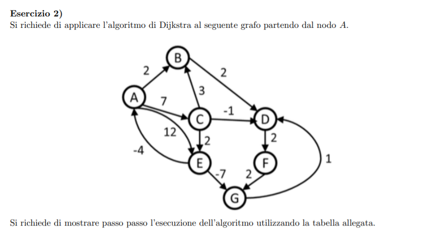

```
dijkstra(graph G, node r, integer[] T) {
    integer[] d <- new integer[1 ... G.n]
    boolean[] b <- new boolean[1 ... G.n]
    foreach u ∈ G.V() - {r} do
        T[u] <- nil
        d[u] <- +∞
        b[u] <- false

    T[r] <- nil
    d[r] <- 0
    b[r] <- true

    PriorityQueue S <- PriorityQueue(); S.insert(r, 0)
    while not S.isEmpty() do
        node u <- S.deleteMin()
        b[u] <- false
        foreach v ∈ G.adj(u) do
            if(d[u] + w(u, v) < d[v]) then
                if not b[v] then
                    S.insert(v, d[u] + w(u, v))
                    b[v] <- true
                else
                    S.decrease(v, d[u] + w(u, v))
                
                T[v] <- u
                d[v] <- d[u] + w(u, v)
}
```
___

```
partenza da A

d[] viene inizializzato per tutti i nodi del grafo a infinito
b[] viene  inizializzato per tutti i nodi del grafo a false

T (albero di copertura del grafo, salvato come vettore dei padri) 
T[r] = null // poiche' la radice non ha padri

d[r] = 0 // poiche' la distanza dalla radice e' nulla
b[r] =  true // poiche' il nodo e' stato scoperto

inizializza la coda di priorita' e inserisce la radice r

// prima iterazione del while
isEmpty? false
u = deleteMin() = r = A
b[u] = b[r] = b[A] = false // in quanto e' necessario poter rivisitare il nodo

// inizio iterazioni del foreach
// nodi adiacenti = B, C, E

// B
d[u] + w(u, v) < d[v] == 0 + 2 < +∞ ? true
    ! b[v] = b[B] ? true
        S.insert(B, 2)
        b[B] = true
    T[B] = A
    d[B] = 2

// C
d[u] + w(u, v) < d[v] == 0 + 7 < +∞ ? true
    ! b[v] = b[C] ? true
        S.insert(C, 7)
        b[C] = true
    T[C] = A
    d[C] = 7

// E
d[u] + w(u, v) < d[v] == 0 + 12 < +∞ ? true
    ! b[v] = b[E] ? true
        S.insert(E, 12)
        b[E] = true
    T[E] = A
    d[E] = 12

// fine foreach

// fine della prima iterazione del while

// priorityQueue = [(E, 12), (C, 7), (B, 2)] =>

```

___

```
// inizio seconda iterazione del while
isEmpty? false
u = deleteMin() = B
b[u] = b[B] = false // in quanto e' necessario poter rivisitare il nodo

// inizio iterazioni del foreach
// nodi adiacenti = D

// D
d[u] + w(u, v) < d[v] == 2 + 2 < +∞ ? true
    ! b[v] = b[D] ? true
        S.insert(D, 4)
        b[D] = true
    T[D] = B
    d[D] = 4

// fine foreach

// fine della seconda iterazione del while

// priorityQueue = [(D, 4), (E, 12), (C, 7)] =>
```

___

```
// inizio terza iterazione del while
isEmpty? false
u = deleteMin() = D
b[u] = b[D] = false // in quanto e' necessario poter rivisitare il nodo

// inizio iterazioni del foreach
// nodi adiacenti = F

// F
d[u] + w(u, v) < d[v] == 4 + 2 < +∞ ? true
    ! b[v] = b[F] ? true
        S.insert(F, 6)
        b[F] = true
    T[F] = D
    d[F] = 6

// fine foreach

// fine della terza iterazione del while

// priorityQueue = [(F, 6) (E, 12), (C, 7)] =>
```

___

```
// inizio quarta iterazione del while
isEmpty? false
u = deleteMin() = F
b[u] = b[F] = false // in quanto e' necessario poter rivisitare il nodo

// inizio iterazioni del foreach
// nodi adiacenti = G

// G
d[u] + w(u, v) < d[v] == 6 + 2 < +∞ ? true
    ! b[v] = b[F] ? true
        S.insert(G, 8)
        b[G] = true
    T[G] = F
    d[G] = 8

// fine foreach

// fine della quarta iterazione del while

// priorityQueue = [(G, 8) (E, 12), (C, 7)] =>
```

___
```
// inizio quinta iterazione del while
isEmpty? false
u = deleteMin() = C
b[u] = b[C] = false // in quanto e' necessario poter rivisitare il nodo

// inizio iterazioni del foreach
// nodi adiacenti = B, D, E

// B
d[u] + w(u, v) < d[v] == 7 + 3 < 2 ? false

// D
d[u] + w(u, v) < d[v] == 7 + (-1) < 4 ? false

// E
d[u] + w(u, v) < d[v] == 7 + 2 < 12 ? true
    ! b[v] = b[F] ? false
        S.decrease(E, 9)
        
    T[E] = C
    d[E] = 9

// fine foreach

// fine della quinta iterazione del while

// priorityQueue = [(G, 8), (E, 9)] =>
```

___
```
// inizio sesta iterazione del while
isEmpty? false
u = deleteMin() = G
b[u] = b[G] = false // in quanto e' necessario poter rivisitare il nodo

// inizio iterazioni del foreach
// nodi adiacenti = D

// D
d[u] + w(u, v) < d[v] == 8 + 1 < 4 ? false

// fine foreach

// fine della sesta iterazione del while

// priorityQueue = [(E, 9)] =>
```

___

```
// inizio settima iterazione del while
isEmpty? false
u = deleteMin() = E
b[u] = b[E] = false // in quanto e' necessario poter rivisitare il nodo

// inizio iterazioni del foreach
// nodi adiacenti = A, G

// A
d[u] + w(u, v) < d[v] == 12 + (-4) < 0 ? false

// G
d[u] + w(u, v) < d[v] == 12 + (-7) < 8 ? true
    ! b[v] = b[G] ? true
        S.insert(G, 5)
        b[G] = true
    T[G] = E
    d[G] = 5

// fine foreach

// fine della settima iterazione del while

// priorityQueue = [(G, 5)] =>
```

___

```
// inizio ottava iterazione del while
isEmpty? false
u = deleteMin() = G
b[u] = b[G] = false // in quanto e' necessario poter rivisitare il nodo

// inizio iterazioni del foreach
// nodi adiacenti = D

// D
d[u] + w(u, v) < d[v] == 5 + 1 < 4 ? false
    
// fine foreach

// fine della ottava iterazione del while

// priorityQueue = [] =>

```
____
