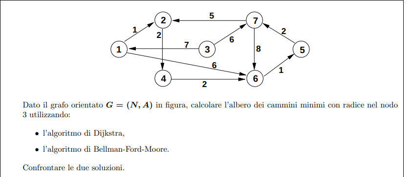

## Implementazione con dijkstra

```
dijkstra(graph G, node r, integer[] T) {
    integer[] d <- new integer[1 ... G.n]
    boolean[] b <- new boolean[1 ... G.n]
    foreach u ∈ G.V() - {r} do
        T[u] <- nil
        d[u] <- +∞
        b[u] <- false

    T[r] <- nil
    d[r] <- 0
    b[r] <- true

    PriorityQueue S <- PriorityQueue(); S.insert(r, 0)
    while not S.isEmpty() do
        node u <- S.deleteMin()
        b[u] <- false
        foreach v ∈ G.adj(u) do
            if(d[u] + w(u, v) < d[v]) then
                if not b[v] then
                    S.insert(v, d[u] + w(u, v))
                    b[v] <- true
                else
                    S.decrease(v, d[u] + w(u, v))
                
                T[v] <- u
                d[v] <- d[u] + w(u, v)
}
```

```
CodaPriorita => [] =>
d = [(1, +∞), (2, +∞), (3, +∞), (4, +∞), (5, +∞), (6, +∞), (7, +∞)]
b = [(1, false), (2, false), (3, false), (4, false), (5, false), (6, false), (7, false)]
T = [(1, nil), (2, nil), (3, nil), (4, nil), (5, nil), (6, nil), (7, nil)]
```

___

```
CodaPriorita => [(3, 0)] =>
d = [(1, +∞), (2, +∞), (3, 0), (4, +∞), (5, +∞), (6, +∞), (7, +∞)]
b = [(1, false), (2, false), (3, true), (4, false), (5, false), (6, false), (7, false)]
T = [(1, nil), (2, nil), (3, nil), (4, nil), (5, nil), (6, nil), (7, nil)]
```
___
```
CodaPriorita => [(7, 6), (1, 7)] =>
d = [(1, 7), (2, +∞), (3, 0), (4, +∞), (5, +∞), (6, +∞), (7, 6)]
b = [(1, true), (2, false), (3, false), (4, false), (5, false), (6, false), (7, true)]
T = [(1, 3), (2, nil), (3, nil), (4, nil), (5, nil), (6, nil), (7, 3)]
```
___
```
CodaPriorita => [(2, 11), (6, 14), (1, 7)] =>
d = [(1, 7), (2, 11), (3, 0), (4, +∞), (5, +∞), (6, 14), (7, 6)]
b = [(1, true), (2, true), (3, false), (4, false), (5, false), (6, true), (7, false)]
T = [(1, 3), (2, 7), (3, nil), (4, nil), (5, nil), (6, 7), (7, 3)]
```
___
```
CodaPriorita => [(2, 8), (6, 13)] =>
d = [(1, 7), (2, 8), (3, 0), (4, +∞), (5, +∞), (6, 13), (7, 6)]
b = [(1, false), (2, true), (3, false), (4, false), (5, false), (6, true), (7, false)]
T = [(1, 3), (2, 1), (3, nil), (4, nil), (5, nil), (6, 1), (7, 3)]
```
___
```
CodaPriorita => [(4, 10), (6, 13)] =>
d = [(1, 7), (2, 8), (3, 0), (4, 10), (5, +∞), (6, 13), (7, 6)]
b = [(1, false), (2, false), (3, false), (4, true), (5, false), (6, true), (7, false)]
T = [(1, 3), (2, 1), (3, nil), (4, 2), (5, nil), (6, 1), (7, 3)]
```
___
```
CodaPriorita => [(6, 12)] =>
d = [(1, 7), (2, 8), (3, 0), (4, 10), (5, +∞), (6, 12), (7, 6)]
b = [(1, false), (2, false), (3, false), (4, false), (5, false), (6, true), (7, false)]
T = [(1, 3), (2, 1), (3, nil), (4, 2), (5, nil), (6, 4), (7, 3)]
```
___
```
CodaPriorita => [(5, 13)] =>
d = [(1, 7), (2, 8), (3, 0), (4, 10), (5, 13), (6, 12), (7, 6)]
b = [(1, false), (2, false), (3, false), (4, false), (5, true), (6, false), (7, false)]
T = [(1, 3), (2, 1), (3, nil), (4, 2), (5, 6), (6, 4), (7, 3)]
```
___
```
CodaPriorita => [] =>
d = [(1, 7), (2, 8), (3, 0), (4, 10), (5, 13), (6, 12), (7, 6)]
b = [(1, false), (2, false), (3, false), (4, false), (5, false), (6, false), (7, false)]
T = [(1, 3), (2, 1), (3, nil), (4, 2), (5, 6), (6, 4), (7, 3)]
```

## Implementazione con Bellman-Ford-Moore
```
bfm(graph G, node r, integer[] T) {
    integer[] d <- new integer[1 ... G.n]
    boolean[] b <- new boolean[1 ... G.n]
    foreach u ∈ G.V() - {r} do
        T[u] <- nil
        d[u] <- +∞
        b[u] <- false

    T[r] <- nil
    d[r] <- 0
    b[r] <- true

    Queue S <- Queue(); S.enqueue(r)
    while not S.isEmpty() do
        node u <- S.dequeue()
        b[u] <- false
        foreach v ∈ G.adj(u) do
            if(d[u] + w(u, v) < d[v]) then
                if not b[v] then
                    S.enqueue(v, d[u] + w(u, v))
                    b[v] <- true
               
                T[v] <- u
                d[v] <- d[u] + w(u, v)
}
```

| u 	| (d1,p1) 	| (d2,p2) 	| (d3,p3) 	| (d4,p4) 	| (d5,p5) 	| (d6,p6) 	| (d7,p7) 	| S 	        |
|---	|---------	|---------	|---------	|---------	|---------	|---------	|---------	|---	        |
|  - 	| (∞, 3) 	| (∞, 3) 	| (0, 3) 	| (∞, 3) 	| (∞, 3) 	| (∞, 3) 	| (∞, 3) 	|  [3]          |
|  3 	| (7, 3)   	|         	|         	|         	|         	|         	| (6, 3)   	|  [7, 1]       |
|  1 	|         	| (8, 1)   	|         	|         	|         	| (13, 1)  	|         	|  [6, 2, 7]    |
|  7 	|         	|         	|         	|         	|         	|         	|         	|  [6, 2]       |
|  2 	|         	|         	|         	| (10, 2)  	|         	|         	|         	|  [4, 6]       |
|  6 	|         	|         	|         	|         	| (14, 6)  	|         	|         	|  [5, 4]       |
|  4 	|         	|         	|         	|         	|         	| (12, 4)  	|         	|  [6, 5]       |
|  5 	|         	|         	|         	|         	|         	|         	|         	|  [6] 	        |
|  6 	|         	|         	|         	|         	| (13, 6)  	|         	|         	|  [5] 	        |
|  5 	|         	|         	|         	|         	|         	|         	|         	|  [] 	        |

| u 	| (d1,p1) 	| (d2,p2) 	| (d3,p3) 	| (d4,p4) 	| (d5,p5) 	| (d6,p6) 	| (d7,p7) 	| S 	        |
|---	|---------	|---------	|---------	|---------	|---------	|---------	|---------	|---	        |
|   	| (7, 3)   	| (8, 1)   	| (0, 3) 	| (10, 2)  	| (13, 6)  	| (12, 4)  	| (6, 3)   	|  [] 	        |

### Confronto
Bellman fa 9 iterazioni, ma occupa meno spazio
Dijkstra fa 7 iterazioni, ma occupa piu spazio

Bellman inserisce gli stessi 2 nodi 2 volte (5 e 6) invece di aggiornare 'in place' la distanza dalla radice