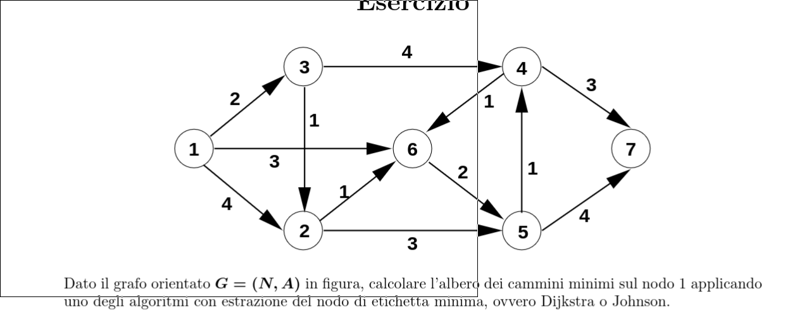

## Implementazione con dijkstra

```
dijkstra(graph G, node r, integer[] T) {
    integer[] d <- new integer[1 ... G.n]
    boolean[] b <- new boolean[1 ... G.n]
    foreach u ∈ G.V() - {r} do
        T[u] <- nil
        d[u] <- +∞
        b[u] <- false

    T[r] <- nil
    d[r] <- 0
    b[r] <- true

    PriorityQueue S <- PriorityQueue(); S.insert(r, 0)
    while not S.isEmpty() do
        node u <- S.deleteMin()
        b[u] <- false
        foreach v ∈ G.adj(u) do
            if(d[u] + w(u, v) < d[v]) then
                if not b[v] then
                    S.insert(v, d[u] + w(u, v))
                    b[v] <- true
                else
                    S.decrease(v, d[u] + w(u, v))
                
                T[v] <- u
                d[v] <- d[u] + w(u, v)
}
```

