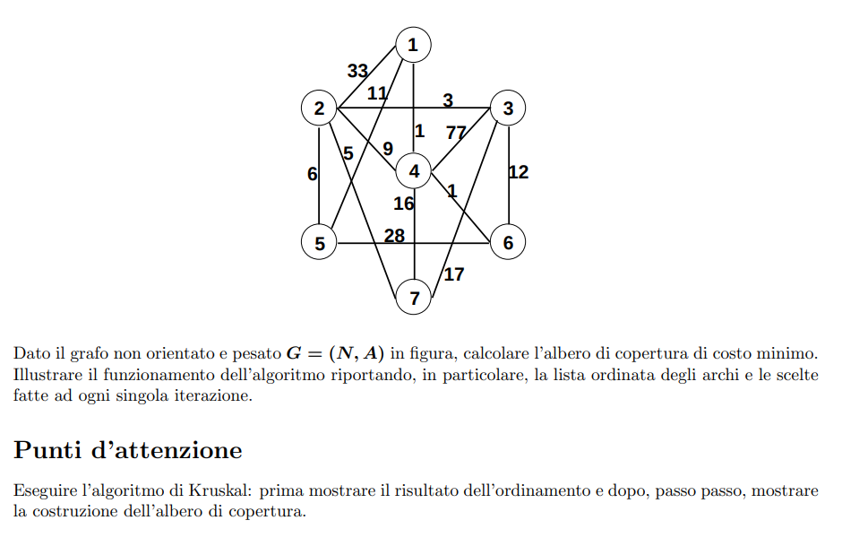
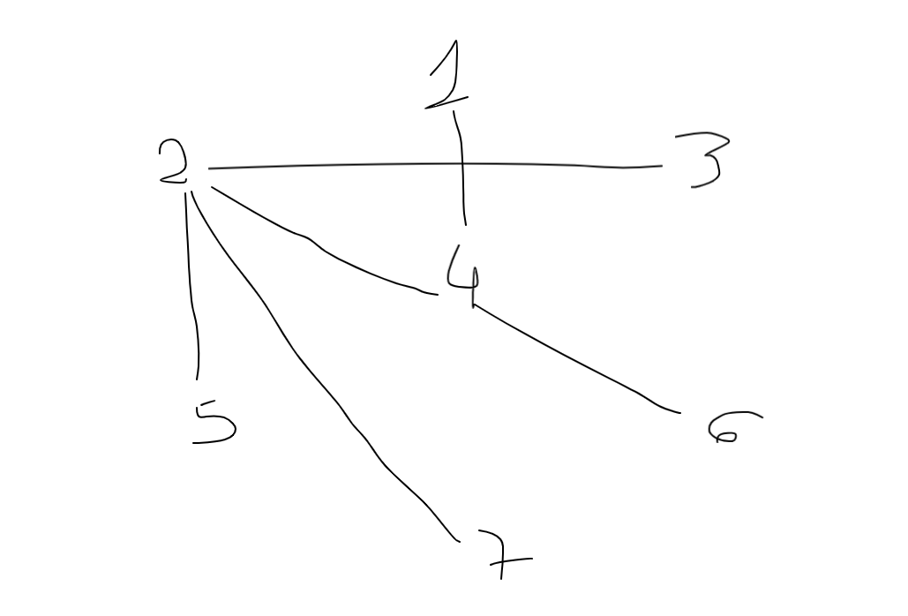

```
typedef struct Arco {
    struct *nodo u, v;
    int peso;
} Arco;

Set kruskal(Arco[] A, integer n, integer m) {
    Set T <- Set()
    MFSet M <- Mfset(n)
    { ordina A in modo che A[1].peso <= ... <= A[m].peso }

    integer c <- 0
    integer i <- 1
    while (c < n-1 && i <= m) {
        if(M.find(A[i].u) != M.find(A[i].v)) {
            M.merge(A[i].u, A[i].v)
            T.insert(A[i])
            c <- c + 1
        }
        i <- i + 1
    }
    return T 
}

```

```
// inizializzazione
// ordina A in maniera crescente
A[
    (1,4),
    (4,6),
    (2,3),
    (2,7),
    (2,5),
    (2,4),
    (1,5),
    (3,6),
    (4,7),
    (3,7),
    (5,6),
    (1,2),
    (3,4)
]

c = 0
i = 1
n = 7
m = 13

// prima iterazione
c < n-1 ? true
// 0 < 6 ? true
i <= m ? true
// 1 <= 13 ? true

M.find(A[i].u) != M.find(A[i].v) ? true
// 1 != 4 ? true

M.merge(A[i].u, A[i].v)
// [1,4]

T.insert(A[i])
// T = [(1,4)]


c = 1
i = 2

// seconda iterazione
c < n-1 ? true
// 1 < 6 ? true
i <= m ? true
// 2 <= 13 ? true

M.find(A[i].u) != M.find(A[i].v) ? true
// 4 e' una componente distinta in 1
// 1 != 6 ? true

M.merge(A[i].u, A[i].v)
// [4,6]

T.insert(A[i])
// T = [
    (1,4),
    (4,6)
    ]


c = 2
i = 3

// terza iterazione
c < n-1 ? true
// 2 < 6 ? true
i <= m ? true
// 3 <= 13 ? true

M.find(A[i].u) != M.find(A[i].v) ? true
// 2 != 3 ? true

M.merge(A[i].u, A[i].v)
// [2,3]

T.insert(A[i])
// T = [
    (1,4),
    (4,6),
    (2,3)
    ]


c = 3
i = 4

// quarta iterazione
c < n-1 ? true
// 3 < 6 ? true
i <= m ? true
// 4 <= 13 ? true

M.find(A[i].u) != M.find(A[i].v) ? true
// 2 != 7 ? true

M.merge(A[i].u, A[i].v)
// [2,7]

T.insert(A[i])
// T = [
    (1,4),
    (4,6),
    (2,3),
    (2,7)
    ]


c = 4
i = 5

// quinta iterazione
c < n-1 ? true
// 4 < 6 ? true
i <= m ? true
// 5 <= 13 ? true

M.find(A[i].u) != M.find(A[i].v) ? true
// 2 != 5 ? true

M.merge(A[i].u, A[i].v)
// [2,5]

T.insert(A[i])
// T = [
    (1,4),
    (4,6),
    (2,3),
    (2,7),
    (2,5)
    ]


c = 5
i = 6


// sesta iterazione
c < n-1 ? true
// 5 < 6 ? true
i <= m ? true
// 6 <= 13 ? true

M.find(A[i].u) != M.find(A[i].v) ? true
// 2 != 1 ? true

M.merge(A[i].u, A[i].v)
// [2,1]

T.insert(A[i])
// T = [
    (1,4),
    (4,6),
    (2,3),
    (2,7),
    (2,5),
    (2,4)
]

c = 6
i = 7

// termina il ciclo
ritorna 
T = [
    (1,4),
    (4,6),
    (2,3),
    (2,7),
    (2,5),
    (2,4)
]

costo finale 25
```


