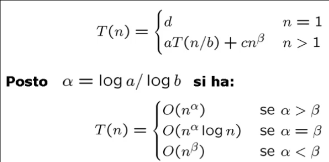

# Tecniche di analisi

Maggiori difficolta' per il calcolo della complessita':
* Analisi di algoritmi ricorsivi;
* Analisi del caso medio;
* Analisi ammortizzata di una sequenza di operazioni.

## Analisi compelssita' algoritmi ricorsivi
Occorre imprstare le relazioni di irocrrenza e individuarne l'ordine di grandezza.
Esistono 3 metodi per risolvere le relazioni di ricorrenza:
* Espandere le relazioni stesse con sostituzioni successive (eventualmente *per livelli*);
* Usare la soluzione generale di alcune relazioni di ricorrenza comuni (espresse in forma parametrica);
* Tentare con una soluzione _f(n)_ lasciando qualche parametro non specificato e dimostrare per induzione su _n_.

### Relazioni di ricorrenza comuni - Teorema delle ricorrenze lineari di ordine costante
Un algoritmo ricorsivo chiama se stesso un numero costante di volte _ai_.
La dimensione dell'input e' _n - i_ con _i_ costante.
Le chiamate ricorsive possono essere effettuate prima o dopo aver svolto un numero polinomiale di operazioni.

La complessita' di un algoritmo ricorsivo puo' essere espressa nella forma: 
> **T(n) = aiT(n - i) + cnβ**

Variabili:
* _ai >= 1_ perche' viene fatta almeno una chiamata ricorsiva;
* _i >= 1_ perche' la dimensione del problema deve essere diminuita almeno di 1 (ad ogni chiamata ricorsiva);
* _c > 0_ e _β >= 0_ fanno riferimento alle operazioni svolte oltre alle chiamate ricorsive. 

Se generalizziamo la costante _ai_ la formula possiamo rappresentare la complessita' nella forma:
> **T(n) = Σ1<=i<=h  aiT(n - i) + cnβ**

**Teorema**

Una relazione di ricorrenza di questo tipo si dice dunque:
* Lineare: perche' _n_ compare nei _T(n - 1)_ con grado 1;
* A coefficienti costanti: perche' _ai_ e' costante;
* Di ordine costante: perche' _h_ e' costante;
* Con lavoro polinomiale di suddivisione/ricombinazione: perche' _cnβ_ e' un polinomio.

### Relazioni di ricorrenza comuni - Teorema delle ricorrenze lineari con partizione bilanciata
Per gli algoritmi divide-et-impera il problema originario di dimensione _n_ viene diviso in _a_ sottoproblemi di dimensione _n/b_ ciascuno.

La funzione di complessita':
> **T(n) = aT(n/b) + cnβ**

Variabili:
* _a_ e' il numero di chiamate, dunque _a >= 1_;
* _b_ e' il numero di sottoproblemi, dunque _b >= 2_;
* _c > 0_ e _β >= 0_ fanno riferimento alle operazioni svolte oltre alle chiamate ricorsive.

**Teorema**

Una relazione di ricorrenza di questo tipo si dice dunque:
* Lineare: perche' _n_ compare nei _T(n - 1)_ con grado 1;
* A coefficienti costanti: perche' _ai_ e' costante;
* Con partizione bilanciata: perche' _n_ e' diviso per una costante _b_;
* Con lavoro polinomiale di suddivisione/ricombinazione: perche' _cnβ_ e' un polinomio.

## Analisi complessita' del caso medio
Esistono poche tenciche generali e sono comunque di difficile risoluzione. Le analisi trattabili riguardano le tabelle di hash e il Quicksort.

## Analisi ammortizzata per una sequenza di operazioni
Esistono le tecniche di:
* Aggregazione;
* Accantonamento;
* Potenziale.

