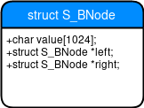

# A simple DBMS

## Introduction

### Purposes
I've worked with many types of databases: SQL, noSQL and even graph ones. One day I've started studying how [SQLlite](https://sqlite.org/index.html) works in order to have a better general understanding of these softwares thanks to it's fantastic documentation. I was hit so hard by the hype train that I wanted to realize a clone of it. Things went differently from making an actual clone of it, but still it was a great experience getting into this. If I ever go professional with C programming I will definitely catch up with what I've done so far in this repo and continue the development.

So far what I can say is that I made this project in order to have a better understanding on how databases work and because I needed to do a project for an exam.

### Goals
* Simple and intuitive CLI;
* Ability to handle multiple databases;
* Store databases, tables and records on disk;
* Fast searching by creating indexes;

### Approach and terminology
I've chosen to not use nor implement any SQL parser because that would have involved integration and licensing issues that I could not be able to handle with my C and legal expertises. In fact in order to interact with the database I've created so-called **metacomands**, providing an easy and intuitive user-experience.

For storing tables on disk I've decided to adopt the csv format, so that is possible to easily check the metacommands operations results. It's mandatory to specify, within the program, a **workingdir** (that as the name suggests is the place where databases are stored).

Indexes were the real challenge, there are so many tree structures out there that provide different levels of efficiency based on the context. By strongly believing the the *Occam's razor* approach, I've made up my own tree implementation.

## Logical View

### Metacommands Operations

When first start the program you get into Normal Mode, which gives access to other modes by inserting `.db-mode` and `.table-mode`, and exit the program with `.exit`.
In DB Mode and Table Mode you can use metacommands to execute operations as described in the picture and go back to Normal Mode when you're done with `.back`.

#### .help (in Normal, DB and Table Mode)
Every Mode has a dedicated version of `.help` metacommand, so you can get specific info about how to play around by printing a brief description of the Mode and listing avaible metacommands via `static void print_metacommands();` function.
Metacommands in each Mode are listed in [metacommand.h](src/metacommand.h).

Each list is extensible by writing the implementation of new metacommands in `MetaCommandResult execute_metacommand(InputBuffer* inputBuffer);` in [database.c](src/database.c) file.

#### .db-mode and .table-mode 
This two metacommands are self-explanatory, they make the program switch to other modes by modifying the Mode enum in [metacommand.h](src/metacommand.h).

#### .exit 
Close the program, nothing special.

#### .select-workingdir
This metacommand is very important because it lets you specify where to store your database. The `DirectorySelection define_working_dir();` function is called so you can insert your working directory manually (or just by pressing enter for working in the current one). 

#### .select-db
Select a pre-existant database or create a new one in the working directory. Each database folder has the *gbdb-* prefix, so the program can easily recognize the folder (without going for a recursive search that can take very long time).
After your selection, in DB Mode, the prompt will change with the selected database;

#### .list (in DB Mode)
Print out all your databases in the selected working directory.

#### .list (in Table Mode)
Print out all tables in your selected database.

#### .back (in DB and Table Mode)
Go back to Normal Mode.

#### .create
Create a new Table with the `TableOperationResult create_table();` function from [table.h](src/table.h). A new csv format file is created and you get asked to define the data structure of the table (otherwise what's the point of a table?).

#### .select
Select the table you want to use, the prompt in Table Mode will change accordingly.

#### .create-index
The data structure of the selected table gets print out and you need to specify on which column you desire to create the index. The `TableOperationResult create_index();` function will then make a subcall to the `record* build_list_from_table(FILE *fp);` which will create a linked list of all the records within the selected table.
After that the `void build_tree_from_list(record *list, int index_number);` wrapper will create a tree from the linked list and the column you've chosen by making many operations:
* **The list gets sorted** by the chosen column with the `int sort_records(record *head, int index_number, int n_records);` function with the bubble sort algorithm. 
* For each element of the list the `void build_leaves(bnode *leaves[], record *sorted_list, int leaves_number);` will **create a node structure** which represents the atomic element of the tree. As the function name suggests, these fresh node structures are the leaves of the tree that will be created.

 The node diagram.

*  Finally **the tree is created** by the recursive `bnode* build_tree(bnode *leaves[], int index_number, int nodes_number);` function. (NOTE: the tree gets built from the bottom to the top, finding median values between each node. The three depth is log2(n) with n being the number of records in the table);

#### .print-index
If you want to print the tree there are thwo handy recursive functions:
* `void print_2d_traversal_preorder(bnode *node, int space);`
* `void print_traversal_preorder(bnode *node);`
  
Obviously the 2d one is hardcoded for *wow effect*, but you can easily swap it out in favor of the linear one.

Both functions traverse the tree in the with the preorder algorithm, which at glance looked the most readable to me (the terminal gets quite messy when you use this metacommand).

#### .find
I prefer mongodb syntax over sql, so I used the *find* keyword for this metacommand that executes queries on the tree. The search function is  `void traversal_preorder_search(bnode *node, char key[32], int index_number);` which looks after your inserted `char key[32]` in the tree actually applying a WHERE condition. If you don't want to, you can simply print out the whole database, but you won't be relying on the tree (please use the tree, I worked so hard for it!).

Everytime a new query is launched a calculation of the time needed to retrieve the data is printed out.

#### .insert
I had to create an insert function in order to make this program eligible for the database status. One by one, each column of the table will be printed out and you are going to insert the value related to that field.