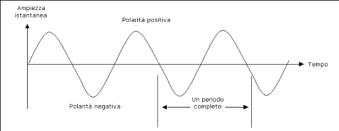
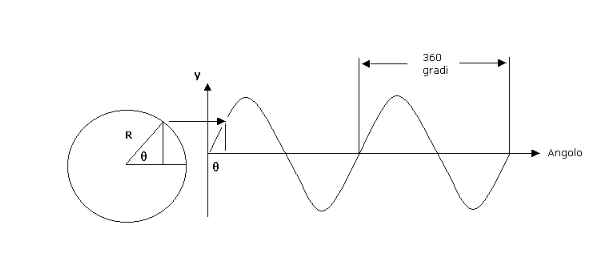
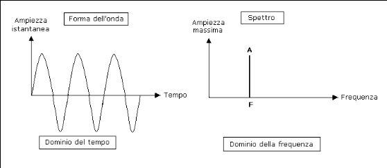
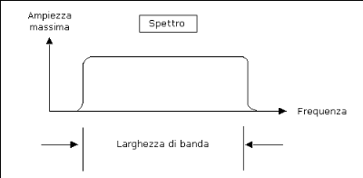
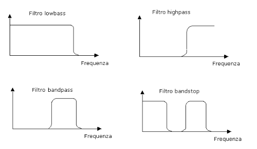
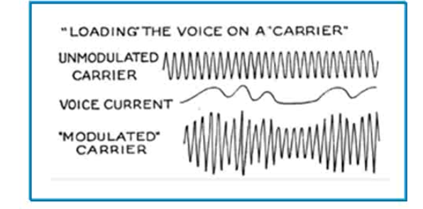

# Tecniche di comunicazione digitale

## Richiami sulla trasmissione digitale

### Segnali
In generale la parola segnale significa:
> Segno conosciuto o convenuto col quale si da notizia o avvertimento.

Nei sistemi di comunicazione, in particolare nella teoria dei segnali, un segnale e':
> Una grandezza fisica variabile del tempo a cui e' assegnata un'informazione.

#### Forme d'onda
E' possibile rappresentare graficamente un segnale per analizzare il suo comportamento nel tempo. Dunque posto il tempo sull'asse x si rappresenta l'**ampiezza istantanea** del segnale lungo l'asse y. L'ampiezza istantanea puo' rappresentare una qualunque grandezza fisica. 

La forma della rappresentazione grafica cosi' ottenuta e' detta **forma d'onda del segnale**. Per osservare le forme d'onda dei segnali si fa uso degli *oscilloscopi*.

Una forma d'onda che ha una forma base che continua a ripetersi entro un certo periodo e' detta **segnale periodico**.
La lunghezza temporale della forma base piu' breve di una forma d'onda periodica viene detta **periodo dell'onda** e viene misurato in secondi.

La velocita' con cui un periodo completo si ripete e' detta **frequenza fondamentale della forma d'onda** e viene misurata in hertz.

La **lunghezza d'onda** *λ* viene misurata tramite la formula *v / F*, dove *v* e' la velocita' di propagazione dell'onda e *F* e' la frequenza.

#### Onde sinusoidali
Quando un diapason viene percosso produce un tono puro, senza altri suoni armonici. Un tono puro a singola frequenza e' detta **onda sinusoidale**. 
Le onde sinusoidali sono gli elementi fondamentali da cui si possono creare segnali piu' complessi. Possono essere usate anche per spostare altri segnali a intervalli di frequenza diversi tramite la **modulazione**.

Un'onda sinusoidale si ottiene tramite la proiezione sull'asse *y* di un punto su un cerchio rotante. Questa viene quindi definita univocamente dalla sua ampiezza massima, dalla sua frequenza e dalla sua fase:
> *y = A sin (wt - phi)*

#### Analisi di Fourier
Jean Baptiste Joseph Fourier nei primi anni del 1800 dimostro' matematicamente che una qualunque funzione periodica poteva essere decomposta in una somma di infinite opportune funzioni o componenti sinusoidali (seno o coseno) dette **armoniche**. Quest'operazione e' nota come **Trasformata di Fourier** o piu' genericamente **Trasformata di Laplace bilatera**.

La componente sinusoidale con frequenza piu' bassa prende il nome di *armonica fondamentale*.

La somma delle frequenze delle onde sinusoidali ottenute tramite la Trasformata di Fourier ad ogni istante di tempo crea una nuova forma d'onda. 

Mano a mano che aggiungiamo nuove onde sinusoidali, che hanno frequenze armoniche via via piu' alte, l'onda risultante e' molto simile ad un'onda quadra. Le improvvise discontinuita' agli angoli dell'onda risultate cos' ottenuta prendono nome di **fenomeno di Gibbs**.

#### Sintesi 
L'analisi di Fourier puo' essere applicata a qualsiasi forma d'onda periodica per determinare le frequenze armoniche esatte, le fasi e le ampiezze massime corrispondenti per ricreare o **sintetizzare** un segnale periodico.

#### Conversione tempo/frequenza
La trasformata di Fourier e' particolarmente utile per convertire un segnale in funzione del tempo, in uno in funzione della frequenza, e viceversa.

#### Spettro
Gli elementi caratterizzanti di un'onda sinusoidale sono la sua esatta frequenza e la sua ampiezza massima.

Possiamo rappresentare un'onda sinusoidale nel dominio della frequenza come una linea verticale posta alla sua frequenza e una lunghezza pari alla sua ampiezza massima.

Questa rappresentazione e' chiamata **spettro dell'onda sinusoidale** e, poiche' qualsiasi forma d'onda puo' essere rappresentata come la somma di molte onde sinusoidali tramite l'analisi e la sintesi di Fourier, rappresenta i vari componenti sinusoidali della forma d'onda in frequenza.

#### Larghezza di banda
I componenti sinusoidali di una forma d'onda in frequenza occupano solo un intervallo finito di frequenze. La larghezza dell'intervallo di frequenze e' detta **larghezza di banda de segnale**.

Poiche' i sistemi e i canali di comunicazione non permettono il passaggio di tutte le frequenze, questi hanno una larghezza di banda massima per la trasmissione sul sistema o canale:

| Segnale o canale    	| Larghezza di banda 	|
|---------------------	|--------------------	|
| Telefonata          	| 4kHz               	|
| Stazione Radio AM   	| 10kHz              	|
| Amplificatore hi-fi 	| 20kHz              	|
| Stazione Radio FM   	| 200kHz             	|
| Banda Radio AM      	| 1.2MHz             	|
| Canale Televisivo   	| 6MHz               	|
| Banda Radio FM      	| 20MHz              	|

La larghezza di banda e' un'importante misura di un segnale o di un canale di comunicazione, ne determina la capacita' di trasportare o meno i segnali.

Ad esempio: un canale con larghezza di banda di 28kHz usato per trasportare i segnali delle telefonate, che occupano 4kHz ognuna, puo' trasportare al massimo 7 segnali simultaneamente.

A volte e' necessario limitare la larghezza di banda di un segnale, e cio' puo' essere realizzato attraverso i filtri che si occupano di eliminare determinate bande di frequenza lasciando passare tutte le altre.

* LPF (Low-pass Filter): consente solo il passaggio di componenti a bassa frequenza di un segnale;
* HPF (High-pass Filter): consente solo il passaggio di componenti ad alta frequenza di un segnale;
* BPF (Band-pass Filter): contente solo il passaggio di componenti del segnale con una frequenza compresa tra un intervallo predeterminato;
* BSP (Band-stop Filter): non consente il passaggio di componenti del sengale con una frequenza compresa tra un intervallo predeterminato.

#### Spettrogrammi
Strumenti come lo spettrografo generano **spettrogrammi** che visualizzano i cambiamenti nel tempo dello spettro di un segnale. 

Lo spettrogramma e' un tentativo per rappresentare tridimensionalmente uno spettro che cambia nel tempo.
___

### Rete telefonica

#### Trasduzione
La trasduzione consiste nella conversione di una grandezza fisica ad un'altra mediante una *funzione di trasferimento del trasduttore*.

Una grandezza fisica come la voce, intesa come perturbazione della pressione dell'aria *p(t)*, puo' essere **trasdotta** in una tensione elettrica *v(t)*, che ha lo *stesso andamento temporale* ma ha una natura fisica differente piu' adatta per la trasmissione a distanza.

Nel telefono di Meucci la trasduzione della voce avveniva tramite la proprieta' piezoelettrica dei granuli di carbone.

#### Modulazione
Invece di trasmettere direttamente il segnale elettrico trasdotto che riproduce l'andamento dell'onda sonora, si utilizza questo segnale per variare dei parametri di un'onda periodica **portante** detta anche *carrier*.

In questo caso si ha una trasmissione analogica in modulazione di ampiezza, frequenza e/o fase.

#### Multiplexing
Il multiplexing e' un meccanismo di trasmissione per cui piu' canali trasmissivi in ingresso condividono la stessa capacita' trasmissiva disponibile in uscita. Cio' avviene combinando piu' segnali analogici (o flussi di dati digitali) in un solo segnale, che viene detto *multiplato*, trasmesso in uscita su uno stesso collegamento fisico.

#### Telefonia analogica
Dopo l'invenzione della trasmissione analogica ci si e' posto il problema di come collegare tutti gli utenti. 

Se si collegano tutte le coppie di utenti si avranno *n(n - 1)* connessioni, con *n* il numero totale di utenti.

E' dunque necessario far viaggiare piu' conversazioni sullo stesso tratto di linea facendo uso di un **multiplexer** ed effettuando una **Commutazione di circuito** o *circuit-switching*, per la quale ad ogni richiesta di comunicazione tra una coppia di utenti viene istituito temporaneamente un percorso fisico con delle parti coincidenti.

#### Campionamento
Alcuni circuiti elettronici sono in grado di convertire un segnale analogico ad andamento continuo in una serie di valori discreti. Questa conversione prende il nome di **campionamento**.

Dal **Teorema di campionamento di Nyquist-Shannon** conosciamo la **frequenza di Nyquist**, ossia la frequenza minima, necessaria per campionare un segnale analogico senza perdere informazioni, per poi poter ricostruire il segnale analogico originario.

In particolare il teorema afferma che:
> Data una funzione che rappresenta un segnale a banda limitata, la minima frequenza di campionamento necessaria per evitare aliasing e perdita di informazioni nella ricostruzione del segnale analogico deve essere **maggiore del doppio della sua frequenza massima**.

#### Telefonia digitale
Invece di trasmettere la forma d'onda trasdotta che rappresenta il segnale vocale, viene trasmessa una serie di numeri che ne **codificano** periodicamente l'ampiezza.

Si usano dei circuiti elettronici chiamati **Convertitori Analogico-Digitali** che campionano il segnale analogico in ingresso.

La **risoluzione** del convertitore indica il numero di valori discreti che puo' produrre (es. un convertitore che codifica un ingresso analogico in 256 livelli discreti ha una risoluzione di 8 bit).

In questa applicazione, per codificare la voce umana senza perdere informazioni, sono necessari 8 mila campioni al secondo (8 kHz) con una risoluzione a 8 bit.

Un canale di telefonia digitale richiede dunque almeno 64 kbps.

#### PSTN (Public Service Telephone Network)
E' costituita da varie componenti:
* Apparati terminale (**telefoni**): analogici o digitali;
* Collegamenti terminali-centrali (**local loop**): analogico;
* Cavi condivisi centrale-centrale (**trunk**): digitale;
* Apparecchiature di commutazione (**switch di circuito**);
* Rete di controllo.

Si tratta di una struttura gerarchica:
* Intermidiate switching office (o central office);
* Toll office;
* End office;
* Telephone.

Non c'e' pero' un unico central office che connette tutti i toll office tra di loro perche' sarebbe troppo costoso e richiederebbe interconnessioni troppo complesse.

Si eleva l'astrazione a grandi commutatori che mettono in connessione diversi central office, aumentando il numero di livelli della gerarchia. Dunque maggiore e' il numero di livelli presenti, maggiore e' l'estensione della rete telefonica.

#### Come eseguire una telefonata
Sui telefoni ogni tasto emette un suono ad una frequenza differente, che viene codificato secondo una **codifica multifrequenza** usando un codice **DTMF (Dual-Tone, Multifrequency)**.

Quando si compone un numero, lo switch locale valuta se e' necessario interfacciarsi con il central office per risolvere la telefonata. 
Esegue dunque un controllo tramite uno scambio di informazioni con il central office mediante la tecnica **SS7 (Signaling System 7)**, una comunicazione **out band**, per valutare se e' possibile raggiungere il numero che si vuole chiamare.
Nel caso questo sia possibile deve essere attivato il collegamento tra lo switch locale della chiamante e lo switch locale del destinatario sempre tramite la tecnica *SS7*.

La comunicazione tra gli switch locali comporta la tramissione del **segnale di ring** (squillo) e della sequenza di bit che codificano la voce in forma digitale. La tramissione di informazioni tra gli switch locali puo' avvenire in varie modalita': storicamente si usa la modalita' **X.25** che raggruppa insieme di campioni vocali in un blocchi (pacchetto).

#### PBX (Private Branch Exchange)
Le aziende che dispongono molti terminali telefonici all'interno della stessa struttura possono voler richiedere un proprio end office, uno switch privato (centralino) interno.

Un PBX rappresenta l'equivalente di un end office che non si collega con un toll office perche' fa riferimento solo alla numerazione interna aziendale.
Un PBX ha comunque accesso alla rete PSTN ma non direttamente (e' necessario premere il numero 0).

Il PBX puo' essere un'apparecchiatura fisica o virtuale (ma in entrambi i casi va pagata la societa' telefonica):
* Fisica: c'e' veramente un centralino nell'azienda;
* Virtuale: e' la societa' telefonica a gestire il centralino.

___

### Rete Mobile
Il primo sistema radio-mobile fu inventato nei Laboratori Bell nel 1946 e furono apportati miglioramenti solo a meta' degli anni '60.

#### Concetto di cella
Questi miglioramenti derivano dall'introduzione del concetto di **cella** che oggi e' alla base della moderna telefonia cellulare: l'idea e' quella di avere un certo numero di antenne che gestiscono l'attivita' di ricezione e trasmissione dei segnali verso i terminali mobili e di collegare le celle tra di loro attraverso opportuni cablaggi.

Fin da subito nacquero alcune difficolta':
* Utilizzo di una portante diversa passando da una cella ad una cella contigua: quando un terminale mobile trasmette/riceve verso/da una cella non puo' usare la stessa portante di quelle utilizzate nelle celle contigue altrimenti i segnali andrebbero a sovrapporsi. Fortunatamente e' possibile riutilizzare le frequenze delle portanti ponendo il vincolo per il quale due celle contigue non possono utilizzare la stessa frequenza;
* Non e' possibile utilizzare una sola e singola portante all'interno di una cella: poiche' molti terminali mobili sono connessi alla stessa cella, se tutti utilizzassero la stessa portante per la comunicazione con la cella si avrebbero delle interferenze. E' necessario che ciascuna cella abbia un insieme di portanti molto vicine tra loro in frequenza, ma molto lontane dall'insieme delle frequenze utilizzate dalle celle contigue.
* Se si assegna una portante ad un utente che la sfrutta raramente, la banda viene "sprecata" nei silenzi.

#### Radio e cellulare
Il telefono cellulare e' una ricetrasmittente radio che e' in grado di modulare di volta in volta una portante differente.

Ogni cella ha una suo range di portanti ravvicinate tra loro in frequenza, e queste frequenze sono gestite da una *base station*: un apparato collegato all'antenna di ciascuna delle celle:
* Ogni volta che un cellulare viene acceso, questo viene registrato con la cella in cui si trova su una frequenza speciale (*frequenza di controllo*), ma non gli viene assegnata nessuna portante;
* Se il cellulare esegue una telefonata: riceve in assegnazione due delle frequenze portanti disponibili presso la cella in cui si trova;
* Qnado il cellulare riceve una chiamata: arriva il segnale di *ring* sul canale di controllo e al momento della risposta vengono allocate due portanti specifiche per l'esecuzione della chiamata.
  
#### Funzionamento di un cellulare
Nelle attuali reti cellulare, le singole celle sono delle stazioni ricetrasmittenti a bassa potenza con un raggio limitato (3-15km):
* Consente un efficace riuso delle frequenze;
* Riduce l'interferenza su una vasta area.

Quando un utente si sposta all'interno di una cella, il terminale mobile mantiene la connessione con l'antenna centrale di quella cella finche' il segnale sulla portante di cella e' piu' forte rispetto ad eventuali altri segnali che il terminale riesce a captare.

Nel momento in cui il terminale mobile si accorge che una nuova portante e' disponibile con un valore di potenza maggiore rispetto alla portante che sta utilizzando, smette di utilizzare la portante vecchia ed inizia a trasmettere sulla portante nuova. Conseguentemente la frequenza di trasmissione varia poiche' tra celle contigue vengono utilizzati insiemi di frequenze differenti. Il processo di "consegna" di un utente ad una cella contigua viene chiamato **hand over**. E' compito della rete far si' che questo passaggio, che puo' avvenire anche nel mezzo di una conversazione, avvenga in modo trasparente.

#### Stazioni base
Il motivo per cui l'*hand over* funziona e' lo stesso motivo per cui noi possiamo chiamare un terminale mobile che si trova in una cella differente dalla nostra o addirittura un telefono fisso.

Tutte le celle che fanno parte della rete mobile sono collegate attraverso collegamenti di rete fissa ad opportuni *switching office* (**MTSO - Mobile Telephone Switching Office**).
Questo commutatore:
* Instrada le chiamate da una cella all'altra;
* Gestisce l'*hand over*;
* Si occupa dell'interfaccia con il PSTN.

#### Protocolli della tecnologia cellulare
Esistono diverse modalita' per cui un telefono cellulare puo' modulare la portante di cella per trasmettere la voce dell'utente:
* **AMPS (Advanced Mobile Phone System)**: modulazione analogica di prima generazione, la voce viene utilizzata per modulare direttamente l'onda portante;
* **GSM (Global System for Mobile Communications)**: tecnica attualmente utilizzata sulla rete cellulare in Europa fa uso di una modulazione di tipo digitale di seconda generazione. La voce viene prima campionata e la portante viene modulata dall'insieme di bit prodotti dal campionamento;
* **IS95 (Interim Standard 95)**: un protocollo di modulazione alternativo al *GSM* di tipo digitale di seconda generazione;
* **UMTS (Universal Mobile Telecommunication System)**: protocollo di terza generazione con modulazione digitale, ma su celle molto piu' piccole per avere la possibilita' di tramissione dati.

___

### Multiplexing digitale
Bell invento' il primo sistema di multiplexing digitale (oltre a quello analogico) per cui piu' conversazioni digitali (o analogiche) possono essere trasmesse su un unico tratto di linea.

Questo sistema e' fondamentale per realizzare la *commutazione di circuito*.

#### Sistemi T carrier 
Indica un tratto di linea su cui possono essere multiplexate (trasmesse contemporaneamente) fino a 24 conversazioni. 

Negli USA, secondo il modello T1, ogni conversazione viene campionata a 7 bit per secondo e quindi la velocita' totale e' di 56 kbps.

In Europa, secondo il modello E1, si usano invece campioni da 8 bit e quindi il canale multiplexato ha una velocita' di 64 kbps.

#### Segnali digitali
Negli USA si usa il termine T1 per indicare la linea ditigale offerta dai fornitori di telecomunicazioni.

Si dovrebbe in realta' parlare di un sistema gerarchico, puoi cui:
* Un singolo canale di linea T1, prende il nome di **DS-0** e ha una velocita' di 56/64 kbps (a seconda della regione);
* La linea **DS-1** consente di portare fino a 24 canali *DS-0* con 8 kbps di overhead, con una velocita' di 1544 Mbps;
* La linea **DS-2** consente di portare fino a 96 canali *DS-0* con 168 kbps di overhead, con una velocita' di 6312 Mbps;
* La linea **DS-3** consente di portare fino a 672 canali *DS-0* con 1728 kbps di overhead, con una velocita' di 44736 Mbps;
* La linea **DS-4** consente di portare fino a 4032 canali *DS-0* con 16128 kbps di overhead, con una velocita' di 274176 Mbps.

#### Multiplexing dei canali
Esistono diverse tecniche per effetturare la condivisione di un canale unico tra piu' stazioni:
* **FDMA (Frequency Division Multiple Access)**: 
  * Tra piu' segnali analogici, ovvero tra piu' portanti modulate;
  * Ciascuna conversazione viene usata per modulare una portante differente (cioe' che oscilla con una frequenza diversa);
  * Dall'analisi di Fourier sappiamo che se la differenza tra le frequenze delle portanti e' sufficientemente ampia, all'arrivo e' possibile usare dei filtri selettivi per recuperare ciascuna portante singolarmente (quindi la singola conversazione);
* **TDMA (Time Division Multiple Access)**:
  * Tra segnali digitali;
  * Le stazioni trasmettono semplicemente a turno, un bit per ciascuna;
  * Se si hanno 24 sorgenti digitali che a turno vogliono inviare bit, con un bitrate pari a 64 kbps, occorerrara' che la linea sia in grado di assorbire piu' di 10 volte quella capacita' (overhead);
  * All'arrivo saremo in grado di discriminare i bit generati dalle varie sorgenti per recuperare le singole conversazioni;
  * Se una conversazione sta in silenzio, ossia non campiona il suono in bit, questo schema comporta un cattivo sfruttamento del canale;
* **CDMA (Code Division Multiple Access)**:
  * Viene utilizzato in *onda libera*, nella stessa cella della rete cellulare;
  * Non viene utilizzata una portante diversa per ogni cellulare poiche' non e' possibile conoscere a priori il numero di terminali registrati per una cella;
  * Si utilizza una stessa portante per tutti i terminali e, attraverso dei codici, si distingueranno le trasmissioni di un terminale da quella di un'altro;
  * Ci si imbatte in delle inevitabili interferenze (*cocktail party effect*) per via della sovrapposizioni dei segnali, ma ogni conversazione e' comunque intelligibile.

#### Velocita' T carrier e E carrier
I sistemi T carrier seguono le velocita' *DS-X* degli USA: da *DS-0* (64 kbps) a *DS-4* (274176 Mbps).

I sistemi E carrier sono piu' "razionali", sistemi anch'essi gerarchici, che invece di cambiare fattore ad ogni passo si ha uno schema piu' semplice:
* **E1**: porta 32 canali *DS-0* (2048 Mbps);
* **E2**: porta 4 canali *E1* (8448 Mbps);
* **E3**: porta 4 canali *E2* (34368 Mbps);
* **E4**: porta 4 canali *E3* (139264 Mbps);
* **E5**: porta 4 canali *E4* (565148 Mbps);