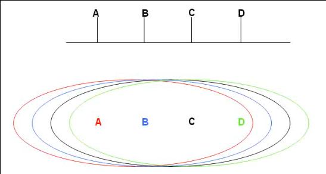
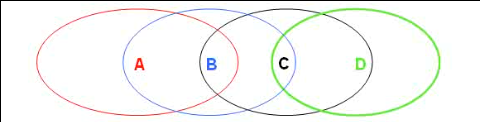
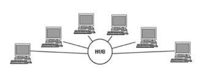
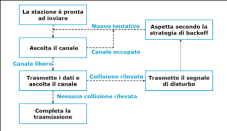

# Tecniche di comunicazione digitale

## Richiami sulla trasmissione digitale

### Segnali
In generale la parola segnale significa:
> Segno conosciuto o convenuto col quale si da notizia o avvertimento.

Nei sistemi di comunicazione, in particolare nella teoria dei segnali, un segnale e':
> Una grandezza fisica variabile del tempo a cui e' assegnata un'informazione.

#### Forme d'onda
E' possibile rappresentare graficamente un segnale per analizzare il suo comportamento nel tempo. Dunque posto il tempo sull'asse x si rappresenta l'**ampiezza istantanea** del segnale lungo l'asse y. L'ampiezza istantanea puo' rappresentare una qualunque grandezza fisica. 

La forma della rappresentazione grafica cosi' ottenuta e' detta **forma d'onda del segnale**. Per osservare le forme d'onda dei segnali si fa uso degli *oscilloscopi*.

Una forma d'onda che ha una forma base che continua a ripetersi entro un certo periodo e' detta **segnale periodico**.
La lunghezza temporale della forma base piu' breve di una forma d'onda periodica viene detta **periodo dell'onda** e viene misurato in secondi.

La velocita' con cui un periodo completo si ripete e' detta **frequenza fondamentale della forma d'onda** e viene misurata in hertz.

La **lunghezza d'onda** *λ* viene misurata tramite la formula *v / F*, dove *v* e' la velocita' di propagazione dell'onda e *F* e' la frequenza.

#### Onde sinusoidali
Quando un diapason viene percosso produce un tono puro, senza altri suoni armonici. Un tono puro a singola frequenza e' detta **onda sinusoidale**. 
Le onde sinusoidali sono gli elementi fondamentali da cui si possono creare segnali piu' complessi. Possono essere usate anche per spostare altri segnali a intervalli di frequenza diversi tramite la **modulazione**.

Un'onda sinusoidale si ottiene tramite la proiezione sull'asse *y* di un punto su un cerchio rotante. Questa viene quindi definita univocamente dalla sua ampiezza massima, dalla sua frequenza e dalla sua fase:
> *y = A sin (wt - phi)*

#### Analisi di Fourier
Jean Baptiste Joseph Fourier nei primi anni del 1800 dimostro' matematicamente che una qualunque funzione periodica poteva essere decomposta in una somma di infinite opportune funzioni o componenti sinusoidali (seno o coseno) dette **armoniche**. Quest'operazione e' nota come **Trasformata di Fourier** o piu' genericamente **Trasformata di Laplace bilatera**.

La componente sinusoidale con frequenza piu' bassa prende il nome di *armonica fondamentale*.

La somma delle frequenze delle onde sinusoidali ottenute tramite la Trasformata di Fourier ad ogni istante di tempo crea una nuova forma d'onda. 

Mano a mano che aggiungiamo nuove onde sinusoidali, che hanno frequenze armoniche via via piu' alte, l'onda risultante e' molto simile ad un'onda quadra. Le improvvise discontinuita' agli angoli dell'onda risultate cos' ottenuta prendono nome di **fenomeno di Gibbs**.

#### Sintesi 
L'analisi di Fourier puo' essere applicata a qualsiasi forma d'onda periodica per determinare le frequenze armoniche esatte, le fasi e le ampiezze massime corrispondenti per ricreare o **sintetizzare** un segnale periodico.

#### Conversione tempo/frequenza
La trasformata di Fourier e' particolarmente utile per convertire un segnale in funzione del tempo, in uno in funzione della frequenza, e viceversa.

#### Spettro
Gli elementi caratterizzanti di un'onda sinusoidale sono la sua esatta frequenza e la sua ampiezza massima.

Possiamo rappresentare un'onda sinusoidale nel dominio della frequenza come una linea verticale posta alla sua frequenza e una lunghezza pari alla sua ampiezza massima.

Questa rappresentazione e' chiamata **spettro dell'onda sinusoidale** e, poiche' qualsiasi forma d'onda puo' essere rappresentata come la somma di molte onde sinusoidali tramite l'analisi e la sintesi di Fourier, rappresenta i vari componenti sinusoidali della forma d'onda in frequenza.

#### Larghezza di banda
I componenti sinusoidali di una forma d'onda in frequenza occupano solo un intervallo finito di frequenze. La larghezza dell'intervallo di frequenze e' detta **larghezza di banda de segnale**.

Poiche' i sistemi e i canali di comunicazione non permettono il passaggio di tutte le frequenze, questi hanno una larghezza di banda massima per la trasmissione sul sistema o canale:

| Segnale o canale    	| Larghezza di banda 	|
|---------------------	|--------------------	|
| Telefonata          	| 4kHz               	|
| Stazione Radio AM   	| 10kHz              	|
| Amplificatore hi-fi 	| 20kHz              	|
| Stazione Radio FM   	| 200kHz             	|
| Banda Radio AM      	| 1.2MHz             	|
| Canale Televisivo   	| 6MHz               	|
| Banda Radio FM      	| 20MHz              	|

La larghezza di banda e' un'importante misura di un segnale o di un canale di comunicazione, ne determina la capacita' di trasportare o meno i segnali.

Ad esempio: un canale con larghezza di banda di 28kHz usato per trasportare i segnali delle telefonate, che occupano 4kHz ognuna, puo' trasportare al massimo 7 segnali simultaneamente.

A volte e' necessario limitare la larghezza di banda di un segnale, e cio' puo' essere realizzato attraverso i filtri che si occupano di eliminare determinate bande di frequenza lasciando passare tutte le altre.

* LPF (Low-pass Filter): consente solo il passaggio di componenti a bassa frequenza di un segnale;
* HPF (High-pass Filter): consente solo il passaggio di componenti ad alta frequenza di un segnale;
* BPF (Band-pass Filter): contente solo il passaggio di componenti del segnale con una frequenza compresa tra un intervallo predeterminato;
* BSP (Band-stop Filter): non consente il passaggio di componenti del sengale con una frequenza compresa tra un intervallo predeterminato.

#### Spettrogrammi
Strumenti come lo spettrografo generano **spettrogrammi** che visualizzano i cambiamenti nel tempo dello spettro di un segnale. 

Lo spettrogramma e' un tentativo per rappresentare tridimensionalmente uno spettro che cambia nel tempo.
___

### Rete telefonica

#### Trasduzione
La trasduzione consiste nella conversione di una grandezza fisica ad un'altra mediante una *funzione di trasferimento del trasduttore*.

Una grandezza fisica come la voce, intesa come perturbazione della pressione dell'aria *p(t)*, puo' essere **trasdotta** in una tensione elettrica *v(t)*, che ha lo *stesso andamento temporale* ma ha una natura fisica differente piu' adatta per la trasmissione a distanza.

Nel telefono di Meucci la trasduzione della voce avveniva tramite la proprieta' piezoelettrica dei granuli di carbone.

#### Modulazione
Invece di trasmettere direttamente il segnale elettrico trasdotto che riproduce l'andamento dell'onda sonora, si utilizza questo segnale per variare dei parametri di un'onda periodica **portante** detta anche *carrier*.

In questo caso si ha una trasmissione analogica in modulazione di ampiezza, frequenza e/o fase.

#### Multiplexing
Il multiplexing e' un meccanismo di trasmissione per cui piu' canali trasmissivi in ingresso condividono la stessa capacita' trasmissiva disponibile in uscita. Cio' avviene combinando piu' segnali analogici (o flussi di dati digitali) in un solo segnale, che viene detto *multiplato*, trasmesso in uscita su uno stesso collegamento fisico.

#### Telefonia analogica
Dopo l'invenzione della trasmissione analogica ci si e' posto il problema di come collegare tutti gli utenti. 

Se si collegano tutte le coppie di utenti si avranno *n(n - 1)* connessioni, con *n* il numero totale di utenti.

E' dunque necessario far viaggiare piu' conversazioni sullo stesso tratto di linea facendo uso di un **multiplexer** ed effettuando una **Commutazione di circuito** o *circuit-switching*, per la quale ad ogni richiesta di comunicazione tra una coppia di utenti viene istituito temporaneamente un percorso fisico con delle parti coincidenti.

#### Campionamento
Alcuni circuiti elettronici sono in grado di convertire un segnale analogico ad andamento continuo in una serie di valori discreti. Questa conversione prende il nome di **campionamento**.

Dal **Teorema di campionamento di Nyquist-Shannon** conosciamo la **frequenza di Nyquist**, ossia la frequenza minima, necessaria per campionare un segnale analogico senza perdere informazioni, per poi poter ricostruire il segnale analogico originario.

In particolare il teorema afferma che:
> Data una funzione che rappresenta un segnale a banda limitata, la minima frequenza di campionamento necessaria per evitare aliasing e perdita di informazioni nella ricostruzione del segnale analogico deve essere **maggiore del doppio della sua frequenza massima**.

#### Telefonia digitale
Invece di trasmettere la forma d'onda trasdotta che rappresenta il segnale vocale, viene trasmessa una serie di numeri che ne **codificano** periodicamente l'ampiezza.

Si usano dei circuiti elettronici chiamati **Convertitori Analogico-Digitali** che campionano il segnale analogico in ingresso.

La **risoluzione** del convertitore indica il numero di valori discreti che puo' produrre (es. un convertitore che codifica un ingresso analogico in 256 livelli discreti ha una risoluzione di 8 bit).

In questa applicazione, per codificare la voce umana senza perdere informazioni, sono necessari 8 mila campioni al secondo (8 kHz) con una risoluzione a 8 bit.

Un canale di telefonia digitale richiede dunque almeno 64 kbps.

#### PSTN (Public Service Telephone Network)
E' costituita da varie componenti:
* Apparati terminale (**telefoni**): analogici o digitali;
* Collegamenti terminali-centrali (**local loop**): analogico;
* Cavi condivisi centrale-centrale (**trunk**): digitale;
* Apparecchiature di commutazione (**switch di circuito**);
* Rete di controllo.

Si tratta di una struttura gerarchica:
* Intermidiate switching office (o central office);
* Toll office;
* End office;
* Telephone.

Non c'e' pero' un unico central office che connette tutti i toll office tra di loro perche' sarebbe troppo costoso e richiederebbe interconnessioni troppo complesse.

Si eleva l'astrazione a grandi commutatori che mettono in connessione diversi central office, aumentando il numero di livelli della gerarchia. Dunque maggiore e' il numero di livelli presenti, maggiore e' l'estensione della rete telefonica.

#### Come eseguire una telefonata
Sui telefoni ogni tasto emette un suono ad una frequenza differente, che viene codificato secondo una **codifica multifrequenza** usando un codice **DTMF (Dual-Tone, Multifrequency)**.

Quando si compone un numero, lo switch locale valuta se e' necessario interfacciarsi con il central office per risolvere la telefonata. 
Esegue dunque un controllo tramite uno scambio di informazioni con il central office mediante la tecnica **SS7 (Signaling System 7)**, una comunicazione **out band**, per valutare se e' possibile raggiungere il numero che si vuole chiamare.
Nel caso questo sia possibile deve essere attivato il collegamento tra lo switch locale della chiamante e lo switch locale del destinatario sempre tramite la tecnica *SS7*.

La comunicazione tra gli switch locali comporta la tramissione del **segnale di ring** (squillo) e della sequenza di bit che codificano la voce in forma digitale. La tramissione di informazioni tra gli switch locali puo' avvenire in varie modalita': storicamente si usa la modalita' **X.25** che raggruppa insieme di campioni vocali in un blocchi (pacchetto).

#### PBX (Private Branch Exchange)
Le aziende che dispongono molti terminali telefonici all'interno della stessa struttura possono voler richiedere un proprio end office, uno switch privato (centralino) interno.

Un PBX rappresenta l'equivalente di un end office che non si collega con un toll office perche' fa riferimento solo alla numerazione interna aziendale.
Un PBX ha comunque accesso alla rete PSTN ma non direttamente (e' necessario premere il numero 0).

Il PBX puo' essere un'apparecchiatura fisica o virtuale (ma in entrambi i casi va pagata la societa' telefonica):
* Fisica: c'e' veramente un centralino nell'azienda;
* Virtuale: e' la societa' telefonica a gestire il centralino.

___

### Rete Mobile
Il primo sistema radio-mobile fu inventato nei Laboratori Bell nel 1946 e furono apportati miglioramenti solo a meta' degli anni '60.

#### Concetto di cella
Questi miglioramenti derivano dall'introduzione del concetto di **cella** che oggi e' alla base della moderna telefonia cellulare: l'idea e' quella di avere un certo numero di antenne che gestiscono l'attivita' di ricezione e trasmissione dei segnali verso i terminali mobili e di collegare le celle tra di loro attraverso opportuni cablaggi.

Fin da subito nacquero alcune difficolta':
* Utilizzo di una portante diversa passando da una cella ad una cella contigua: quando un terminale mobile trasmette/riceve verso/da una cella non puo' usare la stessa portante di quelle utilizzate nelle celle contigue altrimenti i segnali andrebbero a sovrapporsi. Fortunatamente e' possibile riutilizzare le frequenze delle portanti ponendo il vincolo per il quale due celle contigue non possono utilizzare la stessa frequenza;
* Non e' possibile utilizzare una sola e singola portante all'interno di una cella: poiche' molti terminali mobili sono connessi alla stessa cella, se tutti utilizzassero la stessa portante per la comunicazione con la cella si avrebbero delle interferenze. E' necessario che ciascuna cella abbia un insieme di portanti molto vicine tra loro in frequenza, ma molto lontane dall'insieme delle frequenze utilizzate dalle celle contigue.
* Se si assegna una portante ad un utente che la sfrutta raramente, la banda viene "sprecata" nei silenzi.

#### Radio e cellulare
Il telefono cellulare e' una ricetrasmittente radio che e' in grado di modulare di volta in volta una portante differente.

Ogni cella ha una suo range di portanti ravvicinate tra loro in frequenza, e queste frequenze sono gestite da una *base station*: un apparato collegato all'antenna di ciascuna delle celle:
* Ogni volta che un cellulare viene acceso, questo viene registrato con la cella in cui si trova su una frequenza speciale (*frequenza di controllo*), ma non gli viene assegnata nessuna portante;
* Se il cellulare esegue una telefonata: riceve in assegnazione due delle frequenze portanti disponibili presso la cella in cui si trova;
* Qnado il cellulare riceve una chiamata: arriva il segnale di *ring* sul canale di controllo e al momento della risposta vengono allocate due portanti specifiche per l'esecuzione della chiamata.
  
#### Funzionamento di un cellulare
Nelle attuali reti cellulare, le singole celle sono delle stazioni ricetrasmittenti a bassa potenza con un raggio limitato (3-15km):
* Consente un efficace riuso delle frequenze;
* Riduce l'interferenza su una vasta area.

Quando un utente si sposta all'interno di una cella, il terminale mobile mantiene la connessione con l'antenna centrale di quella cella finche' il segnale sulla portante di cella e' piu' forte rispetto ad eventuali altri segnali che il terminale riesce a captare.

Nel momento in cui il terminale mobile si accorge che una nuova portante e' disponibile con un valore di potenza maggiore rispetto alla portante che sta utilizzando, smette di utilizzare la portante vecchia ed inizia a trasmettere sulla portante nuova. Conseguentemente la frequenza di trasmissione varia poiche' tra celle contigue vengono utilizzati insiemi di frequenze differenti. Il processo di "consegna" di un utente ad una cella contigua viene chiamato **hand over**. E' compito della rete far si' che questo passaggio, che puo' avvenire anche nel mezzo di una conversazione, avvenga in modo trasparente.

#### Stazioni base
Il motivo per cui l'*hand over* funziona e' lo stesso motivo per cui noi possiamo chiamare un terminale mobile che si trova in una cella differente dalla nostra o addirittura un telefono fisso.

Tutte le celle che fanno parte della rete mobile sono collegate attraverso collegamenti di rete fissa ad opportuni *switching office* (**MTSO - Mobile Telephone Switching Office**).
Questo commutatore:
* Instrada le chiamate da una cella all'altra;
* Gestisce l'*hand over*;
* Si occupa dell'interfaccia con il PSTN.

#### Protocolli della tecnologia cellulare
Esistono diverse modalita' per cui un telefono cellulare puo' modulare la portante di cella per trasmettere la voce dell'utente:
* **AMPS (Advanced Mobile Phone System)**: modulazione analogica di prima generazione, la voce viene utilizzata per modulare direttamente l'onda portante;
* **GSM (Global System for Mobile Communications)**: tecnica attualmente utilizzata sulla rete cellulare in Europa fa uso di una modulazione di tipo digitale di seconda generazione. La voce viene prima campionata e la portante viene modulata dall'insieme di bit prodotti dal campionamento;
* **IS95 (Interim Standard 95)**: un protocollo di modulazione alternativo al *GSM* di tipo digitale di seconda generazione;
* **UMTS (Universal Mobile Telecommunication System)**: protocollo di terza generazione con modulazione digitale, ma su celle molto piu' piccole per avere la possibilita' di tramissione dati.

___

### Multiplexing digitale
Bell invento' il primo sistema di multiplexing digitale (oltre a quello analogico) per cui piu' conversazioni digitali (o analogiche) possono essere trasmesse su un unico tratto di linea.

Questo sistema e' fondamentale per realizzare la *commutazione di circuito*.

#### Sistemi T carrier 
Indica un tratto di linea su cui possono essere multiplexate (trasmesse contemporaneamente) fino a 24 conversazioni. 

Negli USA, secondo il modello T1, ogni conversazione viene campionata a 7 bit per secondo e quindi la velocita' totale e' di 56 kbps.

In Europa, secondo il modello E1, si usano invece campioni da 8 bit e quindi il canale multiplexato ha una velocita' di 64 kbps.

#### Segnali digitali
Negli USA si usa il termine T1 per indicare la linea ditigale offerta dai fornitori di telecomunicazioni.

Si dovrebbe in realta' parlare di un sistema gerarchico, puoi cui:
* Un singolo canale di linea T1, prende il nome di **DS-0** e ha una velocita' di 56/64 kbps (a seconda della regione);
* La linea **DS-1** consente di portare fino a 24 canali *DS-0* con 8 kbps di overhead, con una velocita' di 1544 Mbps;
* La linea **DS-2** consente di portare fino a 96 canali *DS-0* con 168 kbps di overhead, con una velocita' di 6312 Mbps;
* La linea **DS-3** consente di portare fino a 672 canali *DS-0* con 1728 kbps di overhead, con una velocita' di 44736 Mbps;
* La linea **DS-4** consente di portare fino a 4032 canali *DS-0* con 16128 kbps di overhead, con una velocita' di 274176 Mbps.

#### Multiplexing dei canali
Esistono diverse tecniche per effetturare la condivisione di un canale unico tra piu' stazioni:
* **FDMA (Frequency Division Multiple Access)**: 
  * Tra piu' segnali analogici, ovvero tra piu' portanti modulate;
  * Ciascuna conversazione viene usata per modulare una portante differente (cioe' che oscilla con una frequenza diversa);
  * Dall'analisi di Fourier sappiamo che se la differenza tra le frequenze delle portanti e' sufficientemente ampia, all'arrivo e' possibile usare dei filtri selettivi per recuperare ciascuna portante singolarmente (quindi la singola conversazione);
* **TDMA (Time Division Multiple Access)**:
  * Tra segnali digitali;
  * Le stazioni trasmettono semplicemente a turno, un bit per ciascuna;
  * Se si hanno 24 sorgenti digitali che a turno vogliono inviare bit, con un bitrate pari a 64 kbps, occorerrara' che la linea sia in grado di assorbire piu' di 10 volte quella capacita' (overhead);
  * All'arrivo saremo in grado di discriminare i bit generati dalle varie sorgenti per recuperare le singole conversazioni;
  * Se una conversazione sta in silenzio, ossia non campiona il suono in bit, questo schema comporta un cattivo sfruttamento del canale;
* **CDMA (Code Division Multiple Access)**:
  * Viene utilizzato in *onda libera*, nella stessa cella della rete cellulare;
  * Non viene utilizzata una portante diversa per ogni cellulare poiche' non e' possibile conoscere a priori il numero di terminali registrati per una cella;
  * Si utilizza una stessa portante per tutti i terminali e, attraverso dei codici, si distingueranno le trasmissioni di un terminale da quella di un'altro;
  * Ci si imbatte in delle inevitabili interferenze (*cocktail party effect*) per via della sovrapposizioni dei segnali, ma ogni conversazione e' comunque intelligibile.

#### Velocita' T carrier e E carrier
I sistemi T carrier seguono le velocita' *DS-X* degli USA: da *DS-0* (64 kbps) a *DS-4* (274176 Mbps).

I sistemi E carrier sono piu' "razionali", sistemi anch'essi gerarchici, che invece di cambiare fattore ad ogni passo si ha uno schema piu' semplice:
* **E1**: porta 32 canali *DS-0* (2048 Mbps);
* **E2**: porta 4 canali *E1* (8448 Mbps);
* **E3**: porta 4 canali *E2* (34368 Mbps);
* **E4**: porta 4 canali *E3* (139264 Mbps);
* **E5**: porta 4 canali *E4* (565148 Mbps);

___

## Standard di rete locale

### Introduzione al livello data link
Fino a qualche anno fa, i produttori che si occupavano della realizzaziona reti private/aziendali che collegano i computer cercavano ognuno di mantenere la propria individualita', mentre nel mondo delle telecomunicazioni un prodotto ha valore solo se puo' interagire con prodotti di altri fornitori. 

Solo piu' recentemente, la filosofia di progetto per le reti private ha preso una direzione "condivisa" alla ricerca di uno **standard** per cui:
* E' possibile avere un vasto mercato per i dispositivi e il software;
* Prodotti provenienti da fornitori differenti possono comunicare;
* La tecnologia viene "congelata";
* Possono esserci piu' standard per la stessa funzione a seconda dei gruppi d'interesse.

#### Organizzazioni di standard
* **IETF - Internet Engineering Task Force** (Internet Society): il piu' grande movimento per la realizzazione di standard "aperti" e che ha costituito un'incredibile manifestazione di volontariato su scala internazionale;
* **ISO - International Standard Organization**: ente finanziato dai paesi e dalle grandi aziende;
* **ITU-T/CCIT**: un antico comitato che nell'ambito postale si occupava della standardizzazione delle reti telegrafiche;
* **Forum ATM**: forum non formali costituiti da coloro che producono dispositivi o software per una certa tecnologia, che servono principalmente a coordinare i prodotti per renderli piu' compatibili possibile.

#### Data link di rete privata
I collegamenti dati in rete privata, spesso chiamati  data link, sono spesso gestiti da un sistema  costituito da due sottolivelli ben distinti:
* **Sottolivello DDL - Data Link Layer**: si occupa del formato (lunghezza e struttura) dei pacchetti che verranno trasmessi sul collegamento;
* **Sottolivello MAC - Medium Access Control**: il modo per cui un collegamento sara' condiviso da piu' sorgenti che desiderano trasmettere/ricevere lungo il collegamento stesso (modalita' di multiplexing del collegamento);

Un'altra proprieta' che hanno i data link di rete privata rispetto a quelli di rete pubblica e' relativo al controllo degli errori, ossia la necessita' di verificare che durante la trasmissione su una linea su un data link non si siano verificate delle interferenze o dei disturbi esterni che possano aver modificato i bit trasmessi.

#### Responsabilita' del livello data link
L'HW e il SW che gestiscono il collegamento dati in rete privata hanno delle responsabilita' molto chiare:
* Devono gestire il multiplexing dei flussi di dati: se piu' stazioni trasmittenti/riceventi sono collegate allo stesso collegamento e' necessario che l'HW e il SW di gestione del collegamento siano in grado di assicurare che le trasmissioni possano avvenire senza conflitti/interferenze;
* Rilevazione dei data-frame: a differenza di quanto accade sulla rete pubblica non abbiamo piu' dei flussi di bit che confluiscono lungo un circuito virtuale che collega mittente e destinatario. In questo caso ogni sorgente genera un flusso di bit che viene poi suddiviso in pacchetti/frame. Avremo dunque la necessita' di trasmettere alla destinazione, individualmente, i pacchetti di cui si compone un messaggio;
* Controllo di accesso al mezzo (MAC): e' un tipo particolare di multiplexing per il quale vengono controllati i turni che le varie stazioni possono prendere nell'accedere al mezzo trasmissivo;
* Controllo degli errori;

In generale tutto il sottosistema del data link, che praticamente si sostituisce al sistema di gestione della rete telefonica, nelle reti private ha il compito di assicurare la connessione tra mittente e destinatario.

#### Tecniche di allocazione dei canali
Come per la rete telefonica pubblica ci sono varie tecniche per assicurare la condivisione di un'unica linea tra stazioni tramittenti e riceventi, che nel mondo delle reti locali vengono chiamate **tecniche di allocazione statica dei canali**:
* TDMA (Time Division Multiple Access);
* FDMA (Frequency Division Multiple Access);
* CDMA (Code Division Multiple Access).

Nel mondo delle reti private pero' si preferiscono le **tecniche di allocazione dinamica di canali**, dove si da la possibilita' di trasmettere alle stazioni che "hanno qualcosa da dire" (assegnando il canale di volta in volta), evitando i silenzi.

#### Protocolli MAC collision free
I **Protocolli a prenotazione** vengono utilizzati se ci sono piu' stazioni che vogliono trasmettere e non si desidera utilizzare nessuna tecnica di allocazione statica, si assegna l'unico canale che rimane:
  * A chi si e' prenotato per primo (**hand rising simultaneo**);
  * A tutte le stazioni secondo una politica **round robin**.

#### Protocolli MAC a contesa
La Tecnica **Slotted ALHOA** si utilizza un unico canale e ciascuno trasmette quando vuole trasmettere. Se due stazioni trasmettono contemporaneamente, a posteriori i riceventi si accorgono che i dati ricevuti sono stati soggetti ad interferenza e quindi non confermano la ricezione. I vari mittenti si accorgono di non aver potuto comunicare i dati desiderati fino a ritrasmetterli:
  * Quando necessario;
  * Dopo un tempo d'attesa di durata casuale.

Questa tecnica, per quanto semplice, funziona perfettamente quando c'e' un basso traffico, quando le stazioni che vogliono trasmettere sono poche e l'accesso al canale avviene sporadicamente.

Nel caso di reti con un traffico piu' alto, la tecnica **CSMA/CD (Carrier Sensing Multiple Access / Collision Detection)** consiste nell'ascoltare in anticipo la portante per verificare se questa sta venendo  modificata da qualcuno. Se ci si accorge che qualcuno sta trasmettendo si puo' rischedulare l'invio dei pacchetti dopo un periodo di tempo:
* *1-persistent*: la stazione rinvia con probabilita' 1 quando il canale e' inattivo;
* *p-persistent*: quando il canale diventa inattivo trasmette con probabilita' *p*;
* *non-persistent*: quando il canale e' inattivo attende un tempo random prima della trasmissione.

#### Quando usare i protocolli MAC

|             | Ritardo | Efficienza               |
|-------------|---------|--------------------------|
| Basso carico| ALHOA   |                          |
| Alto carico |         | Protocolli collision free|

Quando siamo in una situazione di basso carico e siamo disposti a tollerare un certo ritardo trasmissivo, possiamo utilizzare la tecnica a contesa ALHOA, che consente di avere il minimo overhead;

Se e' necessaria una certa efficienza ed il carico e' piu' alto abbiamo bisogno di una tecnica in grado di evitare le collisioni che consentono a piu' stazioni di trasmettere contemporaneamente senza che questo comporti problemi.

Il massimo dell'efficienza sarebbero quelle di rete pubblica, a condivisione statica dei canali, ma altre tecniche ottimizzano l'efficienza di ALHOA pur senza richiedere la complessa struttura gerarchica delle condivisioni in multiplexing dei canali in rete pubblica.

___

### Sottolivello MAC

#### Strategie di MAC
Esistono diverse strategie MAC, alcune piu' semplici, altre ibride/adattative rispetto ai profili di traffico.

Per dare una visione unificata delle varie strategie di MAC immaginiamo:
* Una serie di stazioni collegate ad un unico tratto di linea che vogliono comunicare tra di loro;
* Suddividiamo le stazioni in gruppi;
* Ad ogni intervallo di tempo diamo la possibilita' di trasmettere solo alle stazioni appartenenti ad un singolo gruppo;
* All'interno di ogni gruppo ogni stazione che vuole trasmettere puo' farlo;

Abbiamo 3 casi:
* Caso limite: ogni gruppo contiene un solo membro -> protocollo collision free;
* Caso limite: tutti i membri appartengono allo stesso gruppo -> protocollo ALOHA slotted;
* Caso intermedio: si sceglie la dimensione del gruppo a seconda del carico -> protocollo adattivo.

Ad esempio prima si inseriscono tutti i membri in un singolo gruppo, se c'e' una collisione si riduce a meta' e cosi' via.

#### Soluzioni MAC

| Contesto | Requisiti | Soluzione |
|----------|-----------|-----------|
| Basso carico | Latenza minimizzata | Protocolli a contesa (ALHOA) |
| Alto carico | Massima efficienza | Protocolli collision free |
| Carico variabile | Problemi diversi | Protocolli ibridi (a contesa limitata) |

#### MAC Wireless
Bisogna fare delle considerazioni differenti quando si passa da una rete in **guida d'onda** (tramite filo) ad uno a **onda libera** (wireless), dove le stazioni utilizzano un canale radio per comunicare tra di loro.

In quest'ultimo caso, durante la captazione puo' capitare che il range delle onde radio delle varie stazioni non sia integralmente coincidente.

Quando la zona di captazione delle onde radio delle stazioni e' perfettamente coincidente non c'e' alcuna differenza tra l'essere tutti collegati allo stesso filo.

In generale pero' questo non succede: nelle LAN wireless non tutte le stazioni sono sempre nel range l'una dell'altra, dunque le zone di captazione radio non coincidono.

Questa situazione fornisce una naturale suddivisione in gruppi che evita i conflitti, ma sorgono comunque dei problemi:
* *Problema della stazione nascosta*: quando A trasmette a B, C che non si trova nella zona di captazione delle onde radio trasmesse da A, percepisce il mezzo libero ed inizia la trasmissione, ma B verifichera' un'interferenza nelle trasmissioni;
* *Problema della stazione esposta*: quando B trasmette ad A, C percepisce il mezzo occupato e non trasmette a D.

Una soluzione a questo problema puo' essere trovata nell'emissione di appositi segnali che esplicano le intezioni delle stazioni:
* **RTS - Request To Send**: indica l'intenzione di una stazione di iniziare una trasmissione. Le stazioni che si trovano nella zona di captazione delle onde radio di A devono rimanere in silenzio fino a quando un segnale *CTS* avra' ritornato alla stazione trasmittente;
* **CTS - Clear to Send**: l'utilita' del segnale *CTS* sta nel fatto che possono esistere delle stazioni che non hanno sentito il segnale *RTS* ma che tuttavia si trovano nella zona di trasmissione della stazione ricevente. Il segnale comunica alle altre stazioni di rimanere in silenzio per tutta la durata della trasmissione/ricezione;
* **MACA for Wireless**: per evitare la collisione di piu' segnali *RTS* si puo' utilizzare la rilevazione della portante o degli ACK espliciti per confermare la ricezione dei dati. Se si verifica comunque una collisione si possono utilizzare degli **algoritmi di backoff** per cui si impone un'attesa randomica per la trasmissione a tutte le stazioni (protagoniste di una collisione) che vogliono emettere un flusso dati

___

### Introduzione ad Ethernet
Ethernet e' un esempio di **rete ad accesso condiviso**: piu' nodi usano lo stesso collegamento fisico come se fosse un collegamento in *onda libera* (l'etere). Quando un nodo trasmette, tutti gli altri ascoltano (broadcasting). La trasmissione avviene su un unico canale di frequenza, dunque per poter trasmettere le stazioni devono darsi il turno.

Dal punto di vista fisico il collegamento puo' essere un semplice segmento di cavo su cui tutti sono connessi, chiamata *struttura a bus* con terminatori in modo che il segnale si perda alle due estremita'. Un'alternativa, che pero' non si usa per le connessioni Ethernet e' quella di disporre il cavo ad anello, dove non c'e' bisogno di terminatori.

#### Tipi di MAC
L'algoritmo protocollo con cui si da il turno per accedere al cavo in una rete di accesso condiviso si chiama *Medium Access Control* (MAC).
Esistono diverse tipologie di MAC:
* Assegnamento fisso: divisione della banda trasmissiva del cavo in canali separati (TDM, FDM);
* A contesa: i nodi trasmettono sullo stesso canale, se piu' nodi trasmettono contemporaneamente e si verifica una collisione bisogna ritrasmettere (Ethernet);
* Basato su Token: i nodi trasmettono sullo stesso canale dandosi il turno attraverso un token di prenotazione (Token Ring).

#### Storia di Ethernet
Ethernet e' un MAC a contesa per reti a bus ad accesso condiviso.

Fu sviluppato al Palo Alto Research Center di Xerox da Bob Metcalfe, poi standardizzata da Xerox, DEC e Intel nel 1978.

Le specifiche che descrivono il livello fisico (cavi e segnali) e il tipo di MAC furono poi accettate dall'IEEE.

La versione storica dello standard *IEEE 802.3 CSMA/CD - Ethernet* prevedeva una velocita' di trasmissione limitata a 2Mbps (poi portata a 10Mbps e rimase cosi' per molto tempo). Prevedeva diversi cablaggi su cavo coassiale, con lunghezza massima di 500m per segmento. Comprendeva fino a 4 segmenti, separati da rigeneratori di segnale (*repeater*).

Gli standard moderni sono:
* *IEEE 802.3u* con una velocita' di 100Mbps;
* *IEEE 802.3z* con una velocita' di 1Gbps.

#### CSMA/CD
La politica MAC di Ethernet indica:
* **CS - Carrier Sense** (rilevazione sulla portante): invia un messaggio solo se il mezzo e' inattivo;
* **MA - Multiple Access** (accesso multiplo): piu' nodoi possono trasmettere anche con il rischio di collidere;
* **CD - Collision Detection** (rilevazione di collisione): interrompe immediatamente la trasmissione se viene rilevata una collisione.

#### Lo HUB
Il cablaggio a segmenti e' stato poi col tempo abbandonato. Il primo passo e' stato quello di passare da bus fisico a bus logico e stella fisica: invece di collegare tutti i nodi ad un cavo in coassiale, vengono invece collegati in doppino (*patch*) ad un unico concentratore che svolge il compito del bus.

L'hub svolge il compito che prima veniva svolto dal cavo, quello di essere l'etere della trasmissione.

L'hub rappresenta un progresso dal punto di vista architetturale ma dal punto di vista del protocollo, il comportamento e' il medesimo rispetto al cavo: quando riceve un segnale in ingresso su una delle sue porte, questo segnale viene propagato su tutte le altre porte (funge anche da *repeater*).

Se si vuole aumentare la dimensione di una rete, si possono connettere vari hub l'uno con l'altro, ma il tempo di propagazione del segnale tra i due punti piu' lontani della rete cresce drasticamente ed il test di controllo di linea libera da parte di un host sarebbe invalidato per il tempo di propagazione troppo lungo.

Enunciamo la **regola 5-4-3 di Ethernet**:
> Tra una qualunque coppia di host connessi via Ethernet, possono esserci al piu' 5 segmenti connessi da 4 repeater di cui al piu 3 popolati.

Questa regola garantisce le proprieta' di propagazione corretta del segnale.

___

### Ethernet

#### Frame
Ethernet e' una rete orientata al **frame** in quanto i "messaggi" che vengono trasmessi su una rete Ethernet sono tutti composti da unita' a formato fisso con una struttura ben precisa note come *frame*:
* **Preambolo**: una sequenza di 7 byte (ciascuno impostato a 10101010) usato per sincronizzare il ricevente;
* **Indirizzo Destinazione**: una sequenza di 6 byte che identifica l'interfaccia di rete che deve ricevere il messaggio;
* **Indirizzo Sorgente**: una sequenza di 6 byte che identifica l'interfaccia di rete che ha generato il messaggio;
* **Tipo**: sequenza di 2 byte;
* **Corpo**;
* **CRC - Cyclic Redundancy Checksum**: una sequenza di 4 byte che rappresenta un campo di controllo per il contenuto del frame.

##### Indirizzi
Ethernet e' una rete di tipo broadcast e parte dal presupposto che tutte le stazioni di lavoro siano collegate allo stesso segmento di rete e che quindi tutti i frame generati vengano recapitati a tutti.

L'indirizzo serve a ciascuna delle stazioni della rete per scartare tutti i messaggi che non sono indirizzati a lui e tenere invece quelli che la indicano come destinatario.
Quindi ogni interfaccia di rete ha un proprio identificativo a 48 bit generato nella fase di produzione del chipset di rete o della scheda di rete e lo si scrive come 6 coppie di numeri esadecimali.

L'indirizzo di broadcast *FF-FF-FF-FF-FF-FF* indica che il frame deve essere indirizzato a tutti i riceventi.

##### Tipo
E' una **chiave di demultiplazione**. 

Quando una sorgente genera frame sa benissimo chi e' il destinatario di quel frame, quale protocollo di alto livello deve utilizzare. Ma quando invece un'interfaccia di rete riceve un frame, questa deve essere in grado di smistare il frame all'adeguato elemento che implementa lo specifico protocollo ad alto livello utilizzato.

##### Corpo
Il corpo puo' contenere fino a 1500 byte di dati.

##### CRC - Cyclic Redundancy Checksum
Indica il resto di una divisione polinomiale: si considera tutto il frame come un polinomio a coefficienti binari (dove il primo bit sara' il coefficiente dell'incognita "virtuale" con esponente piu' alto e cosi' via) e viene diviso da un *polinomio generatore* (si utilizza lo stesso polinomio su tutte le schede Ethernet).

Il resto di questa operazione viene salvato in modo da poter identificare dei fail HW e quindi gli errori di trasmissione a momento della ricezione.

#### CSMA/CD

___

### Gestione delle collisioni
Una stazione A inizia a trasmettere all'istante *t0* e continua a trasmettere. 

La stazione B, mentre la stazione A sta trasmettendo, continua a vedere il canale come inattivo e allora decide di iniziare a trasmettere proprio nell'ultimo microsecondo utile (quando il segnale generato da A lo sta per raggiungere).

Abbiamo dunque una **collisione** immediatamente rilevabile da B perche' leggendo sulla linea, non trova la stessa sequenza di bit che sta trasmettendo, ma una sequenza diversa prodotta dall'interferenza tra il suo frame e quello inviato da A.

A dovra' invece attendere il tempo di propagazione da B ad A per accorgersi che si e' verificata una collisione.

#### Problema della rilevazione
Come si puo' assicurare che A si accorga che e' avvenuta una collisione?
* Il frame di A raggiunge B al tempo *t*;
* Il frame di B raggiunge A al tempo *2t*;

##### Condizione di integrita' del frame
Quindi A si accorgera' della collisione se sta ancora trasmettendo al tempo *2t* (*round trip time*).

Lo standard *IEEE 802.3* specifica che il valore massimo del *round trip time* (*2t*) deve essere di 51,2μs, questo implica che tra i due host ci deve essere una distanza di al piu' 2500m.

A 10Mbps si richiedono 0,1μs per trasmettere 1 bit, quindi 512 bit (64 byte) richiedono 51,2μs per l'invio.

Conseguentemente i frame Ethernet devono essere lunghi almeno 64 byte.

I dati di un frame devono essere dunque di almeno 46 byte (se deve inviare un quantitativo di informazioni minore, effettuera' un *padding* inserendo tanti zeri quanti ne sono necessari per raggiungere i 46 byte).

Se viene aumentata la banda, il bitrate, ma mantengo uniforme il formato del frame, bisognera' ridurre la distanza massima tra due stazioni. Quindi le successive revisioni *IEEE 802.3u* e *IEEE 802.3z* saranno costrette a ridurre la lunghezza massima del cavo di rete.

Quando un mittente si accorge che c'e' stata una collisione, deve smettere di trasmettere ed inviare un *segnale di jam* di 48 byte.

##### Backoff esponenziale
Se viene rilevata una collisione ciascuno dei due host coinvolti attende un tempo casuale e riprova ad effettuare una trasmissione. Se il tempo d'attesa fosce scelto casualmente tra pochi valori potrebbero verificarsi collisioni ripetute.

L'intervallo di valori tra cui questo numero casuale viene estratto, viene raddoppiato ad ogni collisione successiva.

Alla collisione tra due host: ognuno dei due host scegliera' un numero a sorte K da un insieme, che moltiplichera' per il round trip time di 51,2μs. Il tempo d'attesa per ognuno degli host sara' *K * 51.*

* Prima collisione: si sceglie K tra {0,1};
* Seconda collisione: si sceglie K tra {0, 1, 2, 3};
* N-esima collisione: si sceglie K tra {0, ..., 2n-1}.

Il valore massimo di K e' 1023, quindi dopo 16 tentativi l'interfaccia di rete smette di riprovare e comunica l'errore di trasmissione all'host.

___

### Switched Ethernet
Invece di collegare tutte le stazioni di lavoro di un segmento Ethernet ad un unico cavo, nello Switched Ethernet le stazioni di lavoro sono collegate alle porte di un dispositivo di rete chiamato **switch**.

L'operazione di switching consente di determinare, una volta che un frame si presenta su una porta dello switch, su quali porte va poi inoltrate in base all'indirizzo MAC che si trova nell'intestazione del suddetto frame in arrivo. In particolare piu' frame possono arrivare in parallelo sulle porte dello switch ed essere indipendentemente reindirizzati alla porta corretta (mentre su un cavo o su un hub avremmo avuto una collisione). Dunque, a parita' di banda nominale, avremo piu' throughput (numero di bit al secondo visti da un destinatario).

Le porte di uno switch possono essere separate in gruppi in modo che gli host collegati ad un gruppo di porte comunichino solo tra loro. Avremo dunque delle reti distinte separate sullo stesso dispositivo fisico: questa struttura prende il nome di **Ethernet virtuali (VLAN)**.

Quando il frame viene presentato su una porta, contenente in intestazione l'indirizzo del mittente e l'indirizzo del destinatario, lo switch potrebbe non sapere a quale porta e' associato l'indirizzo del destinatario (ma sa sempre a quale porta e' associato l'indirizzo mittente). Dunque, lo switch, ogni volta che vedra' passare un frame, aggiungera' nella sua **CAM (Content Addressable Memory)** la coppia \<Indirizzo MAC, porta\> (se non era gia' presente). 
Se l'associazione \<Indirizzo MAC, porta\> non e' subito disponibile all'arrivo del frame, lo switch inoltrera' il frame a tutte le porte (tranne a quella del mittente), di modo che quando il destinatario rispondera', lo switch sapra' a chi era destinato e salvera' l'associazione \<Indirizzo MAC, porta\> nella sua *CAM*.

Nel caso in cui due dispositivi collegati allo stesso switch e facenti parte della stessa *VLAN* vogliano comunicare, lo switch deve abilitare il *cammino* tra le due porte. Non e' possibile pero' collegare tutte le porte tra di loro (per *n* porte si avrebbero *n(n - 1)* collegamenti).

Per controllare a che porta dello switch e' connesso il nostro computer e' necessario:
 * Conoscere il nostro indirizzo MAC (digitando `ip a` su sistemi Unix);
 * Collegarsi al prompt dello switch ed utilizzare il comando specifico per stampare la CAM;
 * Associare i risultati della CAM con il nostro indirizzo MAC.

#### Tipi di switch
* **Configurazione fissa**: hanno un numero fisso di porte Ethernet (in genere fino a 48);
* **Modulari**: hanno architetture interne che consentono l'aggiunta successiva di porte:
  * E' possibile impilare e collegare tra loro certi modelli di switch a configurazione fissa, ma il collegamento tra due switch impilati ha una banda limitata (es. 32Gbps rispetto a 720Gbps di uno switch modulare);
  * Gli switch modulari hanno grandi ingombri e richiedono impianti di alimentazione elettrica e di raffreddamento di notevole potenza.

#### Negoziazione
Abbiamo detto che i terminali, descritti dalla coppia \<Indirizzo MAC, porta\> vengono salvati sulla CAM dello switch all'arrivo di un nuovo frame, ma questa pratica e' ormai in disuso.

Con i nuovi standard avviene un *handshake* con un **protocollo di negoziazione** attivata dallo switch e consente al terminale di condividere i parametri di comunicazione della sua scheda di rete allo switch stesso. Se il terminale, o piu' precisamente la sua interfaccia, non rispondono all'handshake allora lo switch assumera' che si tratta di un'interfaccia datata a 10Mbps/half duplex.

#### Velocita'
Con gli standard di rete piu' recenti e' stato possibile aumentare la velocita' a 100Mbps/1Gbps riducendo pero' la lunghezza massima del collegamento host-switch.

Questa riduzione del collegamento e' necessaria per garantire l'integrita' del frame. Anche se aumento il bitrate, la velocita' di propagazione del segnale rimane costante (round trip = 2T) e quindi devo necessariamente ridurre la lunghezza del collegamento.
E' implicito dunque che per avere una connessione Ethernet veloce, le distanze devono essere brevi.

___

### VLAN
Lo switch mantiene un isolamento completo tra le varie VLAN, dunque per far comunicare VLAN differenti occorre creare un ponte attraverso un dispositivo apposito:
* **Bridge**: se opera a livello Ethernet;
* **Router**: se opera a livello superiore.

Oggi molti switch non richiedono dispositivi esterni per creare ponti tra varie VLAN, in questo caso si tratta di **switch-router**.

#### Trunking
La presenza delle VLAN crea un problema nella connessione tra switch (quando vengono impilati).
Se viene collegata una porta di uno switch alla porta di un altro switch, la connessione riguardera' solo le VLAN che comprendono le porte utilizzate. Occorrerebbero quindi tanti collegamenti quante sono le VLAN da collegare.

Molti switch risolvono questo problema utilizzando delle *porte di trunking*. Collegando due porte di trunking si abilita il traffico tra le VLAN con lo stesso numero identificativo dei due switch.

Il frame generato in una VLAN con il numero identificativo *N* del frame *A* sara' disponibile alle sole porte appartenenti alla VLAN *N* dello switch *B*.

#### Protocolli di trunking
La nascita del trunking ha comportato un'estensione all'approccio originale di Ethernet, in quanto, quando arriva un frame su una porta di trunking, lo switch di destinazione deve sapere a chi recapitare il suddetto frame. 
Dunque il frame che viaggia sulle porte di trunking deve essere contrassegnato dall'identificativo della VLAN a cui deve essere recapitato.

Esistono due tipi di protocolli di trunking:
* **Protocolli ad incapsulamento** (ISL, Cisco, Inter-Switch Link): viene aggiunto un header e un footer al frame Ethernet per indicare la VLAN di destinazione;
* **Protocolli a piggyback** (IEEE 802.Q): si tratta di piggyback quando si fa uso di parti inutilizzate un messaggio, per inserire al suo interno un messaggio piu' piccolo di un altro protocollo. In questo caso l'identificativo della VLAN (4 byte) viene inserito nel frame Ethernet tra i campi *indirizzo*, *sorgente* e *tipo*. Occorre pero' ricalcolare il CRC all'ingresso e all'uscita dal trunk.

#### Connessione a livelli superiori
Se non disponessimo del trunking per effettuare il collegamento tra due VLAN potremmo utilizzare un router. Questo collegamento si chiama **routing**.

La configurazione molto comune del **router-on-a-stick** prevede l'utilizzo di una porta di trunking che, invece di essere impiegata per il collegamento ad un altro switch, viene collegata ad un router.
