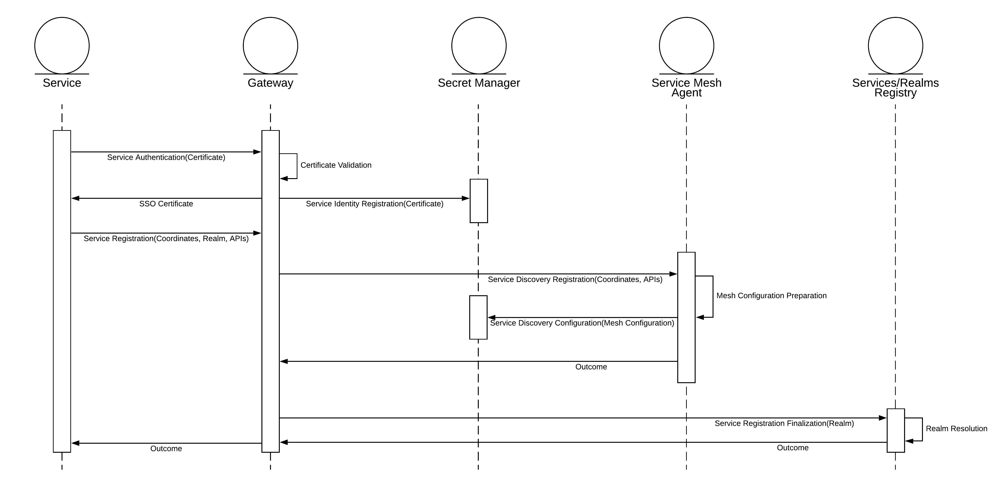
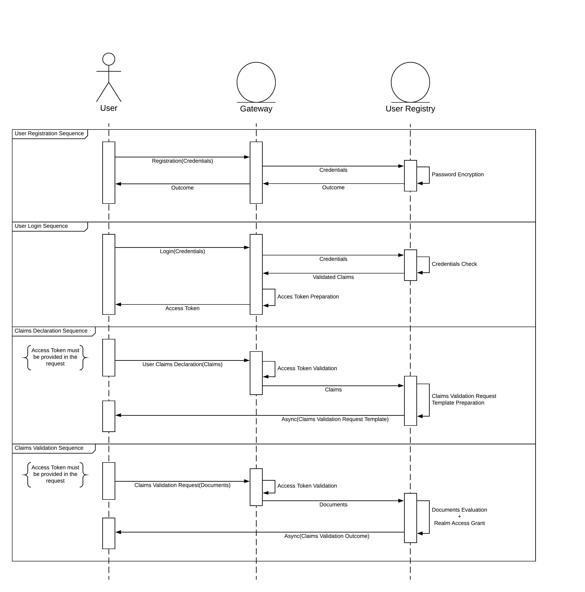
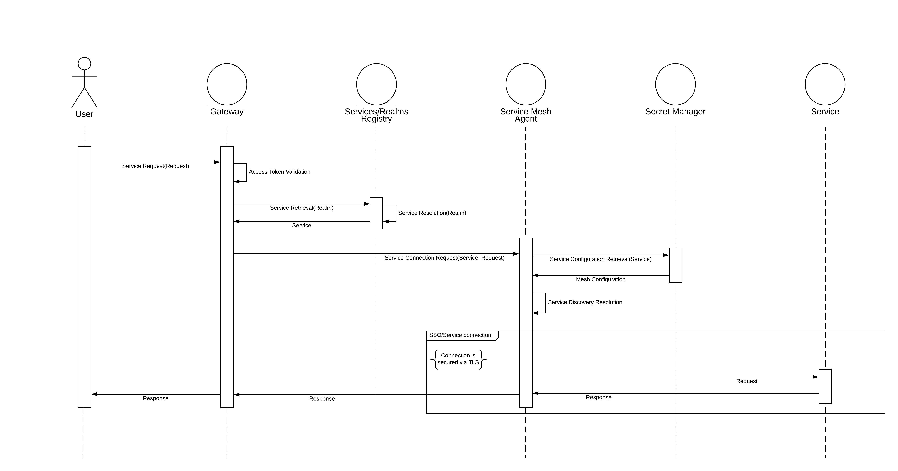

# SWM-Project

## Overview
This project purpose is to build a **Single-Sign-On platform** inspired by the **MILS** (Multiple Independent Levels of Security/Safety) security architecture, which is built upon the secrecy based **Bell-LaPadula model**, and **William Wulf**'s works.

Bell and LaPadula developed their model to enforce access control in government and military applications, introducing many important concepts like a hierarchical classification of Clearance and Sensivity levels for Subjects and Objects, their contribution in the security field was truly valuable.

MILS is a high assurance security architecture that supports the coexistence of untrusted and trusted components, based on verifiable separation mechanisms and controlled information flow.

William Wulf, in his work about [HYDRA - The kernel of a multiprocessor operating system](https://dl.acm.org/doi/10.1145/355616.364017), references the need of a strong separation between protection and security when referring to access control systems, a concept that lacks in Bell-LaPadula principles.

In his paper he stated:
> Protection is a Mechanism, security is a Policy. 
> 
> A system utilizing such a mechanism may be more or less secure depending upon policies governing the use of the mechanism and upon the reliability of the program which manipulate the protected entities. 
> 
> [...]
> 
> A particular consequence of this philosophy is to discard the notion of 'ownership'. 
> While ownership is useful concept for certain "security" strategies, to include a concept at the most primitive levels would lead to the exclusion of the construction of certain other classes of truly secure systems.
 
Let's now introduce the policy and the mechanism.

## Policy
The policy is a **Claim-Based Access Control** for Subjects and Objects abandoning the hierarchical Role-Based system:

* Subjects: 
  * Have one or multiple _claims_ that declare what the Subject is or is not, defining what _realm(s)_ it can have access to. 
  * Subjects can register to the SSO indipendently and verify their claims by submitting valuable information that vouch for the declared claims;
  * Once the authentication process is performed, Subjects are given an **Access Token**, that _expires_ after a pre-defined and configurable time, for submitting requests for Objects;
* Objects: are defined into a distinct _realm_, grouped by the nature of the resource.

A MILS system employs a set of properties, commonly acronymed as **NEAT**:
* Non-bypassable: each component of the system must use a pre-defined and non-modifiable communication path/pattern;
* Evaluatable: any component must be evaluated to the level of assurance required of that component;
* Always-invoked: each and every access/message is checked by the appropriate security monitors;
* Tamperproof: the system prevents unauthorized changes to the security monitor code, configuration and data.

The _NE_ properties imply a strong _separation of duty_ for each component of the SSO.

The _AT_ properties implies the need of many _security-managers_ with a defined _scope_ that are constantly monitoring every request of their scope and are being constantly monitored by all others security-managers to prevent hacking or tweaking.

## Mechanism
MILS systems are in-line with current Cloud development patterns so the SSO revolves around 2 microservices built from scratch, a Service Mesh Agent and a Secret Manager:
* **Subjects Registry**:
  * The **Services/Realms Registry** module maps the relationships between Services and Realms;
  * The **User Registry** module is responsible for Users registration requests storing the Subject's credentials and claims
* **Gateway**: main entrypoint that handles incoming requests for services verifing the validity of the Access Token and the necessary claims to access the service realm;
* **Service Mesh Agent**: creates a graph of the registered services for discovery resolution via explicit connection policies declarations and it's responsible for encrypting the SSO-service communication;
* **Secret Manager**: the mesh configuration (coordinates, APIs and certificates) for registered services is stored in a vault.

The communication pattern of choice between the microservices is gRPC and the isolation/bounded-context of each component makes it indipendently testable to guarantee the level of assurance required.

Several state-of-art architectural patters are applied for reliability in distributed environments:
* Service Discovery: with Self-Registration and Service Registry;
* API Gateway: a service that provides each client with unified interface to services;
* Health Checking: the service mesh configuration is a representation of alive and dead services;
* Circuit Breaking: if the requested service is present in the service mesh configuration, a rollback is performed;
* Secure Service Communication: TLS certificates are used for mutual authentication between the SSO and the requested service.

### Service Registration
The following diagram describes the process:

The service and SSO perform a mutual authentication by issueing each other's certificate; the SSO stores the service certificate in the vault and updates the service graph. The realm gets resolved via the Service Registry pattern.

### User Operations
All interactions with the Users Registry is referenced in the subsequent diagram:

#### Registration
The password is hashed via an implementation of the PBKDF2 key-derivation function described the [RFC-2898](https://tools.ietf.org/html/rfc2898).

The function takes the `password` as an input and proceeds to calculate the derivation function by using 5 declared parameters:
* PseudoRandom Function: an efficiently computable function that emulates a _random oracle_, in this case is used HMAC-SHA1;
* Password: the `password` itself;
* Salt: randomly generated at every function call, with a length of 64 bits as per general recommendation;
* Number of iterations: in this case 65536 (which produces far more entropy than common web Password-Managers use, eg. LastPass makes 5000 iterations);
* Key length: in this case 128.

The output of the function is the `salt` and the `hashed password`.

#### Login
The Access Token for users is described in the [RFC-7519](https://tools.ietf.org/html/rfc7519), which is the representation of the user's verified claims.

#### Claims Declaration
Registered users can indipendently submit their claims and will receive a Template for the  documentation needed for verifying them. Each realm will have it's own Template wich can be extended in many sub-Templates based on the authorities that can varify the claim.

#### Claims Validation
For certain realms the process of claims validation can be sometimes automated: the documentation to prove the user's affinity with the realm, if defined by a "contract", can be easily evaluated. 

Some fields make use of proprietary formats which can only be judged by members of the realms, but if we take into account the possiblity to register new services, third verified parties can take care of this.

### Services Requests
Users can interact with the registered services (if they have the necessary verified claims) via the SSO's gateway that will take care of forwarding the request in a secured context:

## Conclusions
The main difference between a traditional SSO like Kerberos is about the **service availability and connection responsability**.
Kerberos provides the User with the ticket needed to authenticate with a service, but the subsequent interactions with are completely delegated to the user.

In the presented SSO solution the responsability isn't delegated and it takes care about the security of the communication channel with the service forwarding the user's request.

In a distributed envirnoment, if the registered services have interactions within their contexts besides the SSO flow-control and implement the Service Mesh Agent, the SSO can still be aware of what's going on. The service graph will always be updated and the health check will monitor eventual failures circuit-breaking the requests and securing the users from attacks.