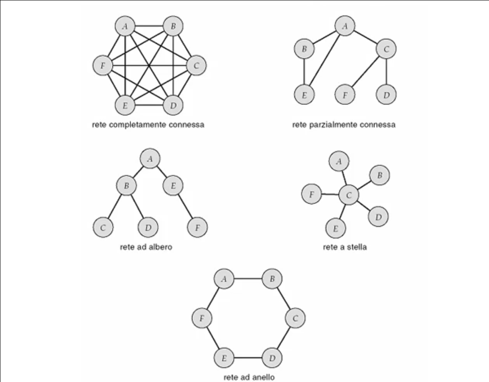

# Architettura del calcolatore

## Architettura e funzionamento dei sistemi di elaborazione 

### Macchina di von Neumann: architettura e funzionamento
L'architettura generale del calcolatore (macchina di von Neumann) e' composta da un **Processore** in grado di eseguire operazioni prelevate dalla **Memoria Centrale**. La coppia Processore-Memoria costituisce l'**unita' di elaborazione** o **unita' centrale**. Le informazioni su cui l'unita' centrale puo' operare sono fornite da dispositivi di I/O (periferiche).

Il processore, connesso alla memoria centrale tramite il bus di memoria, preleva le istruzioni da eseguire tramite il registro **Program Counter** (fase di **fetch**) e le inserisce nel **Current Instruction Register**.
La **Control Unit** si occupa di leggere l'istruzione (fase di **decode**) e decidere se e' ammissibile o meno.
In caso positivo l'istruzione viene inoltrata all'**Unita' Aritmetico Logica** capace di eseguirla e il risultato verra' posto in un registro (fase di **execute**).

Il calcolatore e' in grado dunque di leggere le istruzioni disposte in sequenza nella memoria centrale e di eseguirle all'infinito. Tramite dei costrutti logici si possono realizzare:
* Frasi condizionali semplici/doppie;
* Cicli a condizione iniziale/finale;
* Cicli a conteggio.

Per gestire eventi asincroni, come l'input e l'output ci si avvale dell'**interrupt**, il meccanismo hardware in grado di accorgersi di eventi esterni.

### Chiamate di procedura e risposta alle interruzioni
Lo **stack** e' una porzione di memoria centrale in cui viene individuata una *base* a partire dalla quale vengono accumulate le informazioni necessarie a supportare le varie chiamate di procedura. La *cima* dello stack cosi' raggiunta e' individuata dal registro **Stack Pointer** in modo da supportare efficacemente l'accesso alla memoria.

Uno stack e' una struttura dati dove le informazioni vengono scritte ed estratte secondo la modalita' **LIFO** (Last In First Out). Questo consente di aprire una procedura, eseguire le operazioni e chiamare una procedura (all'interno della procedura chiamata) senza interrompere l'esecuzione della procedura chiamante.

Realizzazione della chiamata di procedura (in ordine):
* La procedura chiamante:
  * Carica sullo stack i valori attuali dei parametri formali;
  * Salva sullo stack il riferimento al contesto di attivazione della procedura chiamante (**Push Base Pointer**);
  * Individua il contesto di attivazione della procedura da chiamare (**Move Base Pointer, Stack Pointer**);
  * Attiva la procedura (**Call MIA_PROCEDURA**).
* La procedura chiamata:
  * Crea le variabili locali;
  * Esegue la procedura;
  * Rimuove le variabili locali;
  * Ritorna alla procedura chiamante.
* La procedura chiamante:
  * Ripristina il contesto di attivazione della procedura chiamante (**Pop Base Pointer**);
  * Rimuove dallo stack i valori attuali dei parametri formali ritornando al contesto di attivazione della procedura chiamante.

La risposta all'interruzione differisce dalla chiamata di procedura per:
* L'**attivazione** in quanto asincrona (la chiamata a procedura e' sincrona);
* La necessita' di salvare il **contesto** di attivazione della procedura in esecuzione, per poter creare un contesto per la risposta all'interruzione;
* La mancanza di un passaggio di parametri (in quanto non esistono parametri da passare all'interruzione).

Realizzazione della risposta all'interruzione:
* Procedura in esecuzione:
  * Esegue operazioni del programma in esecuzione.
* Risposta all'interruzione:
  * L'hardware salva lo stato del processore e disabilita ulteriori interruzioni;
  * Salva il contesto della procedura in esecuzione (**Push all**);
  * Crea le variabili locali;
  * Esegue la risposta all'interruzione;
  * Rimuove le variabili locali;
  * Ripristina il contesto della procedura in esecuzione (**Pop all**);
  * L'hardware ripristina lo stato del processore e riabilita le interruzione.
* Procedura in esecuzione:
  * Continua l'esecuzione.

### Memoria
Tipologie di supporti per lo storage delle informazioni:
* Registri del processore:
  * Numero e capacita' dipendenti dal processore;
  * Accesso estremamente rapido;
  * Accesso diretto;
  * Capacita' molto ridotta.
* Cache interna al processore:
  * Contiene una copia di porzione di memoria centrale;
  * Accesso rapido;
  * Capacita' ridotta.
* Cache esterna al processore:
  * Contiene una copia di porzione di memoria centrale in modo da poter essere ricopiate nella cache interna;
  * Capacita' aumentata rispetto a quella interna.
* Memoria centrale:
  * Accesso rapido;
  * Accesso diretto;
  * Capacita' limitata.
* Memoria di massa a dischi elettronici/magnetici:
  * Tempo di accesso medio (dipendente dai tempi elettronici e meccanici);
  * Accesso diretto o sequenziale;
  * Capacita' ampia.
* Memoria di massa a dischi ottici:
  * Accesso lento;
  * Accesso diretto o sequenziale;
  * Capacita' molto ampia.
* Memoria di massa a nastri magnetici:
  * Accesso molto lento;
  * Accesso sequenziale;
  * Capacita' estremamente ampia.

Per accelerare l'esecuzione di un programma e' possibile utilizzare la tecnica di **caching** che consiste nel copiare porzioni di memoria centrale verso dispositivi piu' rapidi (ad esempio le memorie cache di primo o secondo livello). La stessa tecnica puo' essere utilizzata per velocizzare l'accesso a dispositivi di memoria piu' lenti (ad esempio scaricando in una zona di memoria RAM i blocchi di istruzioni posti sul disco a cui si accede frequentemente per evitare inutili ritardi).
Gestire un meccanismo di caching implica porre particolare attenzione alla **coerenza** delle copie poste sui dispositivi piu' rapidi rispetto a quelli piu' lenti.

La **protezione della memoria** e' particolarmente importante quando lavoriamo in un ambiente dove piu' programmi sono caricati nella memoria centrale. E' fondamentale confinare gli accessi dei vari programmi nella memoria (ogni programma deve poter accedere solo alla zona di memoria ad esso riservata).
La protezione in:
* Registri: e' implicito quando cambiamo il programma in esecuzione;
* Cache: e' automaticamente aggiornato/salvato dai meccanismi hardware che provvedono alla sua gestione;
* Memoria centrale: dobbiamo curarci che le porzioni di memoria centrale assegnate ad un programma non vengano utilizzate da altri programmi, a questo scopo viene introdotto il dispositivo dedicato **Memory Management Unit**;
* Memoria di massa: la protezione delle informazioni viene realizzata nell'ambito della gestione del filesystem.

Per garantire che un programma in esecuzione, il quale richiede una parola in memoria tramite l'esplicitazione di un indirizzo, non interroghi una zona di memoria ad esso non riservata, il dispositivo di Memory Management Unit entra in azione:
* Quando un le istruzioni di un nuovo programma cominciano ad essere eseguite, all'interno del MMU viene posto un registro di *base* che punta all'indirizzo che indica la prima istruzione di quel programma;
* Un secondo registro *limite* puntera' invece all'ultima istruzione del programma;
* Dunque quando la CPU richiedera' una parola in memoria, l'MMU verifichera' che esso sia compreso tra il valore di *base* e il valore *limite* assegnati al programma (se e' cosi' viene consentito l'accesso alla memoria, altrimenti l'MMU lancia un'interruzione per segnalare l'errore).

### Connessione delle periferiche
Il sistema di elaborazione (composto da unita' centrale, bus di memoria e memoria centrale) per ricevere e mostrare le informazioni ha bisogno delle periferiche. Le interfacce delle periferiche sono connesse all'unita' centrale tramite il **bus di I/O**. 

Le interfacce sono costituite di due parti:
* Una che parla con la periferica connessa ad un cavo che termina sull'elettronica di controllo a bordo della periferica:
  * La scheda di controllo della periferica si occupa di gestire la connessione e di controllare a tutti gli effetti la periferica stessa.
* Una che parla con il calcolatore.

Il canale di comunicazione e' dunque costituito dal cavo, dall'interfaccia alla periferica e dalla scheda di controllo di gestione della connessione.

L'interfaccia alla periferica e' munita dei registri:
* Stato;
* Comando;
* Dati.

Funzionamento:
* L'unita' centrale chiede all'interfaccia quale e' lo stato di comunicazione con la periferica (ottenendo il contenuto del registro Stato);
* Se la periferica e' libera il processore e' in grado di chiedere l'esecuzione di un comando di I/O (ponendo nel registro Dati l'ordine che si vuol far pervenire alla periferica);
* L'unita' centrale inviera' i dati richiesti alla periferica (emettendo un comando che scrivera' nel registro Comando);
* L'elettronica a bordo dell'interfaccia intercetta il comando e capisce che deve inviare il contenuto del registro Dati alla periferica trasferendo il contenuto del registro Dati alla scheda di controllo della periferica connessa;
* Nella periferica verra' eseguito il comando richiesto;
* Il risultato verra' eventualmente ritornato all'interno del registro Dati dell'interfaccia del calcolatore e verra' aggiornato il registro Stato in modo tale che il processore venga a conoscenza dell'avvenuta esecuzione.

Esistono due modi per l'unita' centrale di controllare le interfacce:
* **Attesa attiva**: il processore, attraverso il bus I/O, legge periodicamente il contenuto del registro Stato;
* **Interruzione**: il processore, attraverso il bus I/O, invia il comando alla periferica e procede nello svolgere le proprie attivita'. Quando finalmente torna un risultato sull'interfaccia e viene modificato il registro Stato e viene generato un interrupt verso il processore in modo da avvisarlo.

Il trasferimento dei dati tra la CPU e l'interfaccia puo' avvenire:
* **A singola parola**: attraverso il registro Dati;
* **A blocchi**: attraverso un Direct Memory Access (copiando i dati in sequenza' finche non si termina).

Per velocizzare il trasferimento dati puo' essere mappata una porzione di memoria centrale sull'interfaccia. Il canale di comunicazione periferica-interfaccia provvedera' a caricare i valori provenienti dalla periferica sulla memoria dell'interfaccia; il calcolatore in maniera analoga, per inviare dei dati alla periferica scrivera' anche lui sulla memoria dell'interfaccia.

Il canale di comunicazione puo' essere gestito:
* Tramite il controllo nell'interfaccia dell'unita' centrale:
  * Una porzione dell'interfaccia si occupa di gestire il canale.
* Tramite il controllo nella periferica:
  * Una porzione di elettronica si occupa di gestire il canale.

All'interno della periferica un'altra porzione di elettronica si occupa di analizzare le richieste del processore, comprenderle e mandarle in esecuzione sulla periferica.

### Reti informatiche: architetture e funzionamento
Le reti permettono di supportare la condivisione di risorse tra piu' calcolatori in modo da ridurre il costo di acquisizione e di gestione dei sistemi e far cooperare utenti che usano macchine diverse.

Esistono due topologie fondamentali per le reti informatiche:
* Reti locali: 
  * Utilizzate all'interno di un edificio o in gruppi di edifici molto vicini;
  * Viene effettuata una connessione con opportuni cablaggi per mettere in comunicazione i calcolatori e i dispositivi.
* Reti geografiche:
  *  Utilizzate per connettere siti molto distanti geograficamente;
  *  Sono costituite da un insieme di siti connessi localmente.

Per realizzare le strutture di rete esistono differenti pattern:

Per supportare la realizzazione delle reti locali esistono diverse tecnologie:
* Reti a bus:
  * Ethernet (con varie velocita');
* Reti ad anello:
  * Token Ring (rame), FDDI (fibra ottica);
* Reti a stella:
  * Cablaggio strutturato;
* Reti wireless:
  * Bluetooth, WiFi.

Un calcolatore si connette alla rete in maniera differente da come si connette alle periferiche, ma viene mantenuta la struttura di base.

Il processore e' connesso alla memoria centrale tramite il bus di memoria e comunica con l'interfaccia di rete attraverso il bus di I/O. L'interfaccia di rete contiene una porzione di memoria per effettuare il trasferimento dei dati da/verso la rete e dei registri (tipicamente Stato e Comando).
Sull'interfaccia di rete c'e' una componente di controllo della connessione attraverso il cavo di rete.

La rete, dal punto di vista logico, puo' essere vista come una periferica molto complessa al quale sono connessi vari calcolatori.

Il canale di comunicazione in questo caso e' costituito dal componente di controllo nell'interfaccia di rete, dalla rete stessa e dai canali di comunicazione verso gli altri calcolatori.

### Classificazione dei sistemi di elaborazione
#### Mainframe
Il mainframe e' composto da un'unita' centrale alla quale vengono connessi dispositivi di I/O.
Tra i dispositivi di ingresso piu' tipici ci sono le schede perforate (dove le perforazioni indicavano gli zero e gli uno) e come uscita vengono usate le stampanti. Successivamente per semplificare l'immissione/estrazione di grosse quantita' di dati sono stati introdotti i nastri magnetici.

L'architettura e' orientata ad **operazioni batch** (non-interattive) in cui un programma veniva caricato, eseguito e poi si passava al successivo. Questo approccio era tipico dei sistemi **monoprogrammati** (con un programma solo caricato in memoria centrale in ciascun momento). La CPU era sottoutilizzata perche' per passare al programma successivo doveva attendere la terminazione delle operazioni svolte dalle periferiche di I/O.

Per ridurre i tempi di attesa fu introdotta una soluzione che prevedeva di caricare l'unita' centrale con piu' programmi (sistemi **multiprogrammati**), ma ovviamente il problema di attesa delle periferiche non veniva risolto del tutto perche' l'unita' centrale doveva comunque attendere che l'operazione venisse completata dalle periferiche senza poter svolgere alcun lavoro utile. Con l'avvento del **multiprocessing** la CPU non attendeva piu' il completamento delle operazioni da parte delle periferiche ma procedeva con l'esecuzione di altri programmi.

Un'evoluzione dei sistemi mainframe e' stata l'introduzione di un'architettura orientata a supportare molti utenti operanti contemporaneamente (**sistemi interattivi multiutente**) tramite i terminali che condividevano il tempo macchina (**time sharing**).

#### Minicomputer
Partendo dall'architettura mainframe e' stato possibile creare dei calcolatori dedicati a gruppi piu' piccoli di utenti per ridurre i costi.

#### Workstation
Riducendo ancora la scala del minicomputer e' stato possibile creare dei calcolatori per soddisfare esigenze di un utente sofisticato a costi contenuti. Vediamo ad esempio la nascita dei sistemi desktop con grafica e dei dispositivi per l'interazione avanzata e l'elaborazione intensiva.

#### Personal computer
L'evoluzione dei terminali interattivi ha consentito di creare dei calcolatori che potevano interagire con calcolatori piu' performanti garantendo un buon grado di liberta' per l'interazione con questi ultimi.

#### Computer palmare
Ne esistono diverse tipologie come i palmari veri e propri e sistemi piu' specializzati come i cellulari.
La caratteristica principale e' il basso consumo.

#### Sistemi di elaborazione in tempo reale
Sono alcuni sistemi particolari per applicazioni specifiche tipicamente utilizzati per la gestione dei processi industriali e nell'automazione industriale (ma anche per la domotica, sistemi medicali, ecc.).

La necessita' di risposta agli eventi in tempi brevi ha costituito due filoni dell'architettura di questi sistemi:
* Hard real time;
* Soft real time.

Col tempo l'architettura e' stata arricchita con componenti in grado di scambiare segnali con il mondo esterno (ad esempio: schede di acquisizione dei segnali e immagini e schede di attuazione controlli).

#### Sistemi dedicati
Sono sistemi specifici dedicati ad una sola applicazione, riducendo all'osso l'architettura generale per selezionare solo quei componenti strettamente indispensabili per condurre tale applicazione (ad esempio gli elettrodomestici, sistemi hifi, motori delle automobili, ecc.). Questi sistemi hanno capacita' molto ridotte in termini di computazione e di memoria.

#### Sistemi multimediali
Personal computer o computer palmari dedicati a piu' "media" (piu' canali di comunicazione al quale l'utente vuole connettersi in tempo reale).

#### Sistemi multiprocessore
Per risolvere alcune esigenze computazionali, i sistemi multiprocessore fanno uso di piu' CPU strettamente connesse in grado di effettuare economie di scala sulle periferiche.

Un bus di connessione mette in comunicazione i processori con la memoria e le periferiche di I/O.

I processori possono:
* Tutti svolgere la stessa tipologia di attivita': **simmetrici**;
* Essere specializzati su alcune attivita': **asimmetrici**.

#### Cluster
E' un'architettura in cui le connessioni con i sistemi sono piu' lasche di un ambiente multiprocessore: un bus connette piu' calcolatori tra di loro. Questi sistemi migliorano l'economia di scala sulle periferiche e rendono il sistema fail-proof, ma soprattutto hanno l'obiettivo di ridurre i costi di acquisizione.

#### Sistemi distribuiti
E' un'architettura in cui i sistemi sono connessi tramite la rete.