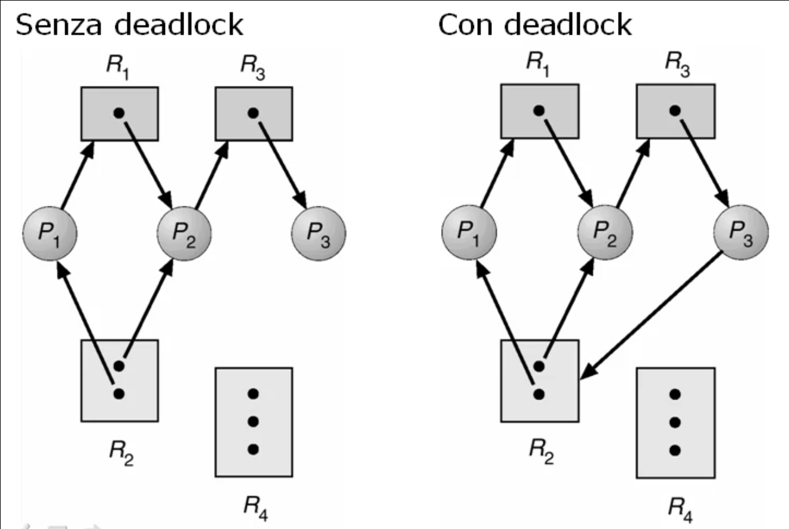
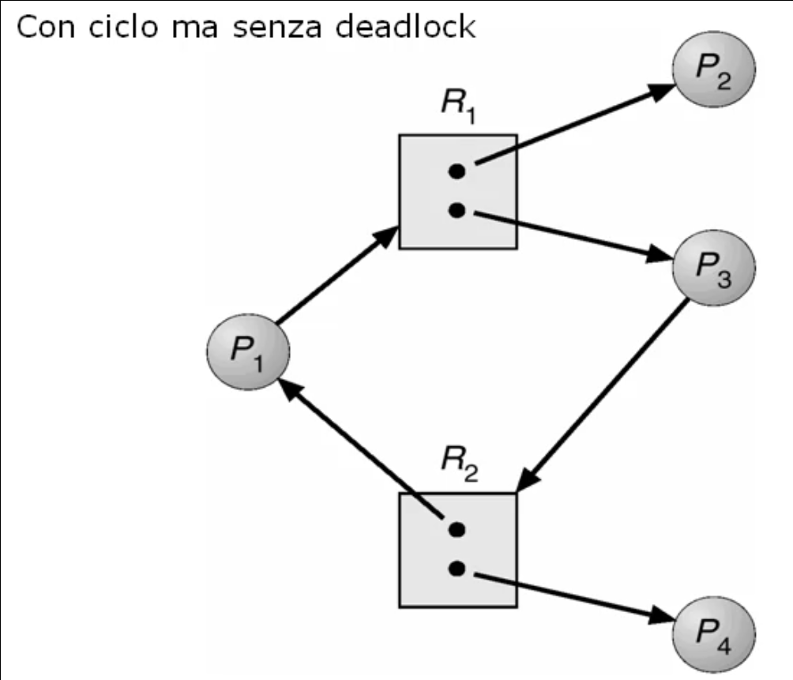
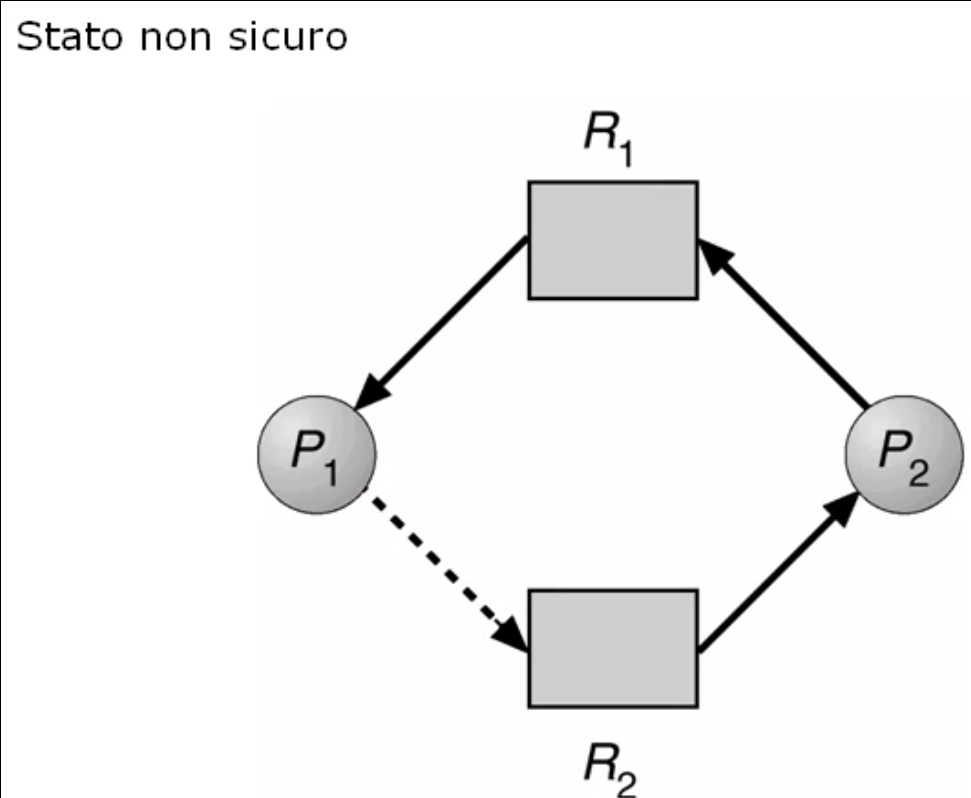
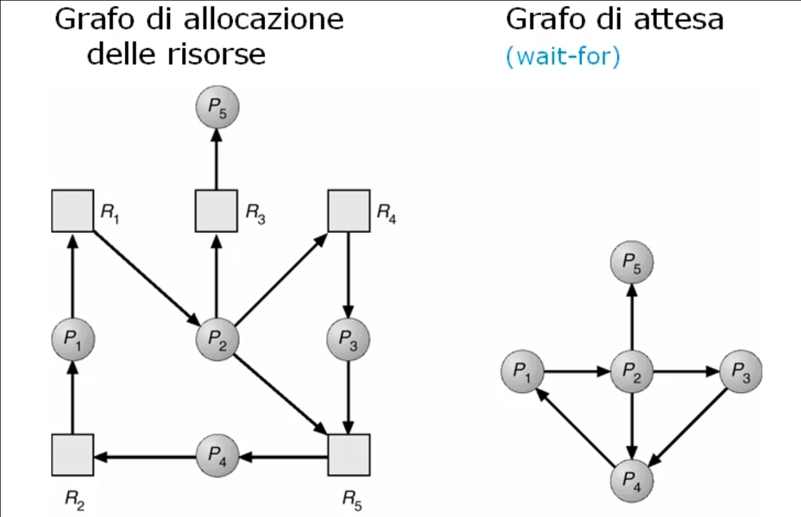

# Deadlock

## Caratterizzazione del deadlock

### Uso di risorse condivise
Quando si hanno delle risorse condivise in un sistema e' necessario farne un uso corretto al fine di garantirne la consistenza.

In particolare le risorse condivise possono essere usate:
* In modo non esclusivo (eg. file in sola lettura);
* Solo in modo mutuamente esclusivo (eg. stampate).
  
E' necessario sincronizzare l'accesso all'uso di risorse condivise usabili solo in modo mutamente esclusivo tramite i passaggi:
* Richiesta di uso della risorsa;
* Uso della risorsa;
* Rilascio della risorsa.
  
### Definizione di deadlock
Il problema del deadlock si verifica quando un insieme di processi rimangono in attesa indefinitamente quando le risorse che chiedono di poter utilizzare sono in uso da altri processi a loro volta in attesa.

### Condizioni per l'occorrenza del deadlock
Esistono quattro condizioni, che se si verificano contemporaneamente si ha deadlock:
1. Mutua esclusione (mutual exclusion): le risorse vengono gestite in mutua esclusione;
2. Possesso e attesa (hold & wait): un processo prende possesso di una risorsa ed entra in attesa per il possesso di un'altra risorsa;
3. Non c'e' rilascio anticipato (no pre-emption): la risorsa non e' sottoponibile a pre-emption prima del termine del processo;
4. Attesa circolare (circular wait): un insieme di processi siano uno in attesa di una risorsa posseduta da un altro processo in modo circolare.

### Identificazione del deadlock: grafo di allocazione delle risorse
Per verificare la presenza delle condizioni del deadlock e' possibile utilizare il grafo di allocazione delle risorse.

Il grafo di allocazione risorse e' cosi' composto:
* I nodi possono essere:
  * Processi del sistema (*P={P1, P2, ..., Pn}*);
  * Risorse del sistema, eventualmente con piu' istanze identiche (*R={R1, R2, ..., Rm}*).
* Gli archi possono essere:
  * Richieste da parte di un processo per una risorsa (*Pi -> Rj*);
  * Assegnazione di una risorsa ad un processo (*Rj -> Pi*).

### Metodi di gestione del deadlock
Esistono vari approcci per la gestione dei deadlock:
* **Ignorare** il deadlock;
* **Prevenzione** del deadlock (deadlock prevention);
* **Evitare** il deadlock (deadlock avoidance);
* **Rilevazione e recupero** del deadlock (deadlock detection & recovery).

___

## Tecniche di prevenzione del deadlock

### Principio della prevenzione
Prevenire il deadlock puo' essere ottenuto impedendo che le quattro condizioni per cui si verifica siano tutte soddisfatte contemporaneamente. E' sufficiente che una sola condizione non venga soddisfatta.

### Tecniche per la condizione di mutua esclusione
La condizione:
* Deve essere assolutamente soddisfatta per tutte le risorse che non sono usabili in modo condiviso;
* Non e' necessaria per le risorse usabili in modo condiviso.

La condizione puo' essere invalidata rimuovendola per le risorse intrinsecamente condivisibili.

La condizione non puo' essere mai invalidata per le risorse intrinsecamente non condivisibili.

### Tecniche per la condizione di possesso e attesa
La condizione puo' essere invalidata facendo si che ogni processo che richiede una risorsa non possegga gia' altre risorse.

Tecniche per realizzare tale approccio sono:
* Obbligare un processo a chiedere ed ottenere tutte le risorse necessarie prima di iniziare l'esecuzione;
* Un processo che possiede alcune risorse e vuole chiederne altre deve:
  * Rilasciare tutte le risorse che possiede;
  * Chiedere tutte le risorse che gli sono necessarie, incluse eventualmente alcune di quelle che gia' possedeva.

Una soluzione di questo genere alla prevenzione porta ad uno scarso utilizzo delle risorse perche' forza una grossa serializzazione dell'uso e in particolare mantiene in uso le risorse per un tempo molto superiore rispetto allo stretto necessario. Conseguentemente puo' portare a starvation.

### Tecniche per la condizione di nessun rilascio anticipato
La condizione puo' essere invalidata mediante rilascio anticipato (pre-emption) per risorse il cui stato di uso all'atto del rilascio anticipato e' ripristinabile. In questo modo la risorsa non notera' che e' stata riassegnata ad un altro processo.

Tecniche per realizzare tale approccio sono:
* Se un processo detiene alcune risorse e ne chiede altre che non possono essergli assegnate immediatamente:
  * Rilascera' tutte le risorse possedute;
  * Le risorse rilasciate anticipatamente sono aggiunte alla lista delle risorse per cui il processo sta aspettando;
  * Il processo verra' fatto ripartire soltanto quando potra' ottenere le vecchie e le nuove risorse.
* Se un processo detiene alcune risorse e ne chiede altre:
  * Se tutte le risorse richieste sono disponibili gli vengono assegnate;
  * Se alcune delle risorse richieste non sono disponibili:
    * Se sono assegnate ad un processo che sta aspettando ulteriori risorse, le risorse richieste e detenute dal processo in attesa vengono:
      * Rilasciate anticipatamente ed assegnate al processo richiedente;
      * Inserite tra quelle per cui il processo e' in attesa.
  * Se alcune delle risorse richieste non sono disponibili e non sono possedute da processi in attesa di altre risorse, il processo richiedente deve:
    * Attendere che si liberino;
    * Ripartire quando ottiene tutte le risorse necessarie.

### Tecniche per la condizione di attesa circolare
La condizione puo' essere invalidata impedendo che si creino situazioni di attesa circolare.

Tecniche per realizzare tale approccio:
* Introdurre un ordinamento globale univoco su tutti i tipi di risorsa *Ri*;
* Se un processo richiede *k* istanze della risorsa *Rj* e detiene solo risorse *Ri* con *i < j*:
  * Se le *k* istanze della risorsa *Rj* sono disponibili vengono assegnate;
  * Altrimenti il processo deve attendere.

Un processo non potra' mai chiedere istanze della risorsa *Rj* se detiene risorse *Ri* con *i > j*.

* Se un processo chiede *k* istanze ella risorsa *Rj* e detiene risorse *Ri* con *i >= j* deve:
  * Rilasciare tutte le istanze della risorse *Ri*;
  * Chiedere tutte le istanze della risorsa *Rj* (quelle detenute precedentemente piu' quelle nuove *k*);
  * Chiedere le istanze delle risorse *Ri* con *i > j* che deneteva precedentemente.

___

## Tecniche per evitare il deadlock

### Principio dell'evitare il deadlock
Obiettivo dell'approccio di evitare il deadlock e':
* Aumentare lo sfruttamento delle risorse rispetto alla tecnica di prevezione;
* Aumentare l'efficienza del sistema;
* Semplificare la gestione.

Per evitare il deadlock e' necessario **verificare a priori** che la sequenza di richieste e rilasci delle risorse effettuate da un processo porti al deadlock tenendo conto delle sequenze dei processi gia' accettati nel sistema.

### Informazioni per evitare il deadlock
E' necessario conoscere a priori delle informazioni sul comportamento dei processi:
* Il numero massimo di risorse per ogni processo;
* Le risorse assegnate;
* Le risorse disponibili;
* Le richieste e i rilasci futuri di risorse da parte del processo.

### Stato sicuro
Usando le informazioni ottenute e' possibile verificare se il sistema potra' trovarsi in uno stato che e' garantito essere privo di situazioni di deadlock.

Diremo che uno stato e' sicuro se il sistema puo' allocare le risorse richieste da un processo, dell'inisieme presente nel sistema, secondo un ordine opportuno garantendo che non si verifichi mai un deadlock. I processi che verranno accettati nel sistema verrano ordinati opportunamente in modo tale che le loro richieste non comportino mai l'entrata in uno stato di deadlock.

Se lo stato e':
* Sicuro: siamo certi che non andremo mai in una situazione di deadlock;
* Non sicuro: non possiamo a priori dire nulla sul sistema circa la possibilita' di entrare in deadlock.

Una sequenza di processi *P1, P2, ..., Pn* e' una sequenza sicura per l'allocazione corrente se le richieste che ogni processo *Pi* puo' fare possono essere soddisfatte dalle risorse attualmente disponibili piu' tutte le risorse detenute dai processi *Pj* con *j < i*.

Uno stato si dice sicuro se esiste una sequenza sicura.

#### Come evitare il deadlock
Per evitare il deadlock bisogna garantire che il sistema passi da uno stato sicuro ad un altro stato sicuro quando un processo chiede una nuova risorsa:
* Si parte sempre da uno stato iniziale sicuro;
* Una richiesta di risorsa viene soddisfatta se la risorsa e' disponibile e se il sistema va in uno stato sicuro;
* Se la risosta non e' disponibile il processo deve attendere.

### Algoritmo del grafo di allocazione delle risorse
Nel grafo di allocazione delle risorse aggiungiamo una nuova tipologia di arco: l'arco di **prenotazione delle risorse** (rappresentato con la linea tratteggiata). Questi archi indicano l'intenzione, da parte di un processo, di chiedere una risorsa.

Uno stato si dice non sicuro quando la presenza di un arco di prenotazione evidenzia un ciclo tra processi e risorse. Nel momento in cui il processo chiede l'uso della risorsa il sistema entrerebbe in deadlock.

L'algoritmo basato sul grafo di allocazione delle risorse prevede che si costruisca il suddetto grafo con gli archi di prenotazione. Se ci sono cicli in tale grafo, lo stato non e' sicuro, quindi non si puo' accettare tale richiesta di risorse del processo cosi' inserito. Cio' vale solo per istanze singole delle risorse.

### Algoritmo del banchiere
E' una generalizzazione dell'algoritmo del grafo di allocazione delle risorse in quanto gestisce istanze multiple delle risorse.

E' un algoritmo meno efficiente dell'algoritmo del grafo di allocazione delle risorse perche' deve tener conto del numero di istanze della risorsa, il cui numero massimo va dichiarate a priori. 

Il processo deve restituire in un tempo finito le risorse utilizzate.

Per supportare l'algoritmo del banchiere devono essere introdotte alcune strutture dati:
* *m*: risorse;
* *n*: processi;
* *Available[1..m]*: vettore delle risorse disponibili;
* *Max[1..n,1..m]*: matrice di massime richieste per ogni processo di ciascuna risorsa;
* *Allocation[1..n,1..m]*: matrice che individua quante istanze di ogni risorsa sono gia' state assegnate ad un processo;
* *Need[1..n,1..m]*: matrice che indica quante risorse ciascun processo vuole ancora chiedere.

#### Algoritmo di verifica dello stato sicuro
L'algoritmo del banchiere utilizza una procedura di verifica dello stato sicuro e fa uso di due vettori:
* *Work[1..m]*: vettore di risorse disponibili nel nostro sistema e viene posto uguale al vettore *Available* all'inizio della procedura;
* *Finish[1..n]*: vettore di booleani che indica se il processo considerato e' stato correttamente gestito e viene inizializzato a falso.

Step dell'algoritmo di verifica dello stato sicuro:
1. Inizializzazione dei vettori:
   * *Work = Available*;
   * *Finish[i] = False* per *i = 0,1,...,n-1;
2. Si cerca *i* tale che:
   * *Finish[i] ==  False*;
   * *Needi <= Work*;
   * Se non esiste tale *i* vai allo step 4.
3. Si allocano "fittiziamente" le risorse richieste dal processo in modo tale da verificare la sua compatibilita':
   * *Work = Work + Allocation[i]*;
   * *Finish[i] = True*;
   * Vai allo step 2.
4. Se, per ogni *i*, *Finish[i] == true*, allora lo stato e' sicuro.

#### Realizzazione dell'algoritmo del banchiere
L'algoritmo di richiesta delle risorse, che introduce un vettore di richieste effettuate dal processo *i* *Request[i]* procede secondo gli step:
1. Se *Request[i] <= Need[i]* vai al passo 2, altrimenti solleva errore: il processo ha ecceduto il numero massimo di richieste;
2. Se *Request[i] <= Available[i]* vai al passo 3, altrimento *Pi* deve attendere poiche' le risorse non sono disponibili;
3. Si ipotizzi di stanziare le risorse richieste:
   * *Available = Available - Request[i]*;
   * *Allocation[i] = Allocation[i] + Request[i]*;
   * *Need[i] = Need[i] - Request[i]*;
   * Se lo stato risultante e' sicuro, al processo *Pi* vengono confermate le risorse assegnate;
   * Altrimenti *Pi* deve aspettare le richieste *Request[i]* e viene ristabilito il vecchio stato di allocazione delle risorse.

___

## Tecniche di rilevazione e ripristino del deadlock

### Principio di rilevazione e ripristino
Il sistema deve essere in grado di:
* Rilevare la presenza di situazioni di deadlock dopo che sono avvenute;
* Ripristinare una situazione di corretto funzionamento eliminando il deadlock.
  
### Algoritmi di rilevamento con istanze singole delle risorse: grafo di attesa
A partire dal grafo di allocazione delle risorse deduciamo il grafo di attesa.
Nel grafo di attesa:
* I nodi: sono i processi attivi del sistema;
* Gli archi: indicano le dipendenze tra i processi dovute al fatto che un processo possiede una risorsa che e' richiesta da un altro processo.

La rilevazione per sistemi con solo istanze singole delle risorse puo' essere fatta tramite gli step:
* Analisi del grafo di attesa;
* Se il grafo di attesa contiene cicli, si ha deadlock;
* I processi in deadlock sono quelli coinvolti in ciascun ciclo presente nel grafo.

### Algoritmi di rilevamento con istanze multiple delle risorse: algoritmo completo
Per la rilevazione in sistemi con istanze multiple delle risorse bisogna creare un algoritmo piu' complesso che vada a vedere l'effettiva allocazione delle risorse e quindi verifichi la presenza di deadlock tenendo conto della molteplicita' delle istanze. E' necessario introdurre un insieme di strutture dati:
* *m*: risorse;
* *n*: processi;
* *Available[1..m]*: vettore delle istanze delle risorse disponibili;
* *Allocation[1..n,1..m]*: matrice che indica quante istanze di ogni risorsa sono state assegnate;
* *Request[1..n,1..m]*: matrice che indica quante istanze di ciascuna risorsa devono essere assegnate per ogni processo.

#### Algoritmo di rilevazione del deadlock
Si introducono:
* *Work[1..m]*: vettore delle istanze delle risorse disponibili;
* *Finish[1..n]*: vettore dei processi esaminati.

Si procede per step:
1. *Work = Available*
   * Per *i = 0, 1, ..., n - 1*:
     * Se *Allocation[i] != 0*, allora *Finish[i] = false*;
     * Se *Allocation[i] == 0*, allora *Finish[i] = true*;
2. Si cerca *i* tale che:
   * *Finish[i] == false*
   * *Request[i] <= Work*
   * Se non esiste tale *i* vai al passo 4.
3. Si effettua l'aggiornamento delle allocazioni e si dichiara il processo soddisfatto:
   * *Work = Work + Allocation[i];
   * *Finish[i] = true*;
   * Vai al passo 2.
4. Se:
   * *Finish[i] == false* per qualche *i*, con *0 <= i < n* allora si ha deadlock;
   * *Finish[i] == false*, allora il processo *Pi* e' in deadlock.
   

### Applicazione della rilevazione
E' necessario invocare l'algoritmo della rilevazione:
* Ogni volta che una richiesta di allocazione non puo' essere soddisfatta immediatamente, e comporta:
  * Rilevazione immediata;
  * Poche risorse e pochi processi bloccati;
  * Considerevole sovraccarico computazionale;
* A intervalli di tempo prestabiliti, e comporta:
  * Rilevazione piu' complessa;
  * Molte risorse e molti processi possono essere bloccati;
  * Minor sovraccatico computazionale.

### Tecniche di ripristino
Per ripristinare i processi in deadlock e' possibile usare differenti tecniche.

#### Terminare i processi in deadlock:
* Abortire tutti i processi in deadlock:
  * Troppi processi terminati;
  * Spreco di risorse computazionali;
  * Costo elevato;
* Abortire un processo alla volta fino ad eliminare il deadlock:
  * Pochi processi terminati;
  * Algoritmo di rilevazione invocato piu' volte.

Per terminare i processi e' necessario individuare un ordine intelligente di eliminazione, i criteri sono:
* Priorita' del processo;
* Tempo di elaborazione del processo;
* Risorse utilizzate;
* Risorse richieste per terminare l'elaborazione;
* Numero dei processi da terminare;
* Processo interattivo o batch.

#### Rilasciare anticipatamente le risorse
Ci sono varie opzioni:
* Selezionare una vittima a costo minimo (processo o risorsa);
* Effettuare un rollback:
  * All'ultimo stato sicuro;
  * Totale;

E' necessario non selezionare sempre la stessa vittima altrimenti c'e' il rischio di starvation.