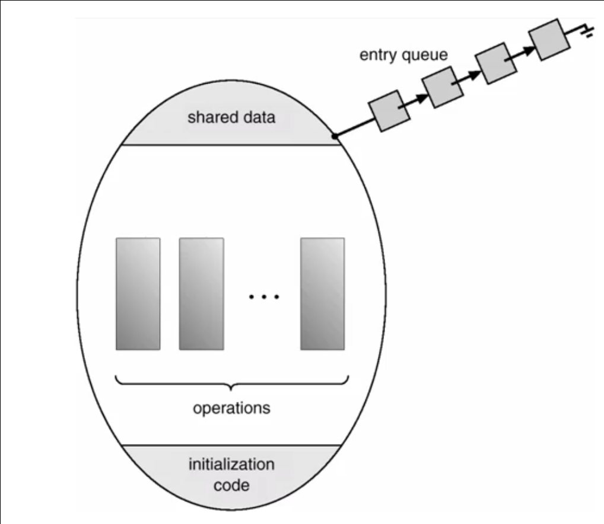

# Sincronizzazione dei processi

## Processi concorrenti

### Concetto di concorrenza tra processi o thread
La concorrenza tra processi si ha quando si hanno delle risorse condivise che sono usabili solo in mutua esclusione. E' necessario sincronizzare i processi affinche' abbiano accesso alla risorsa condivisa in modo opportuno.

#### Sincronizzazione per l'uso delle risorse condivise
La sincronizzazione per l'uso delle risorse condivise prevede il coordinamento dell'evoluzione della computazione dei processi in modo tale che possano utilizzare risorse fisiche (eg. perifetiche) e informative (eg. variabili in memoria centrale, file) in maniera coordinata. E' necessario che la risorsa rimanga consistente e congruente quando viene utilizzata dai vari processi.

### Sezioni critiche
Durante l'esecuzione concorrente di processi che condividono delle risorse, in caso in interruzione (in sistemi time-sharing), e' possibile incorrere in problemi di computazione per via della rischedulazione dei processi.

Le porzioni di codice che, se eseguite in modo concorrente, possano causare degli errori di computazione vengono definite **sezioni critiche**.

Per garantire che delle sezioni critiche non generino errori e' necessario soddisfare tre condizioni:
* **Mutua esclusione**: ciascuna delle porzioni di codice deve essere eseguita come una sezione critiche;
* **Progresso**: se non ci sono processi che stanno eseguendo una sezione critica, e dei nuovi processi vogliono entrare nella sezione critica, la decisione su quale processo far entrare nella sezione critica spetta solo ai processi che non stanno eseguendo la loro sezione critica;
* **Attesa limitata**: e' necessario evitare che i processi che vorrebbero entrare nella sezione critica, ma non possono per via dell'esecuzione di una sezione critica di un altro processo, non finiscano nello stato di *starvation*.

### Sincronizzazione di processi cooperanti
La sincronizzazione puo' avvenire non solo per gestire la mutua esclusione di risorse informative o fisiche, ma anche per gestire processi cooperanti.

La concorrenza prevede che i processi competano per l'uso di risorse, ma non prevedono in generale che ci sia una collaborazione per il raggiungimento di un obiettivo comune.

Per coordinare due processi separati possiamo sincronizzare i processi tramite un meccanismo di notifica e controllare dinamicamente l'evoluzione della computazione per il raggiungimento dell'obiettivo comune.

___ 

## Variabili di lock

### Sincronizzazione di processi concorrenti

#### Variabile di turno
E' una variabile condivisa che indica quale processo, tra un insieme di processi, ha diritto ad utilizzare una cerca risorsa in un certo istante.

#### Algoritmi per la sincronizzazione mediante turno
Esistono tre approcci per gestire la mutua esclusione alla rispettiva sezione critica di due processi *P<sub>0</sub>* e *P<sub>1</sub>* mediante la variabile di turno.

##### Algoritmo 1
```java
  private volatile int turn;  // la variabile di turno 
  public Algorithm 1() // (1)
  {
    turn = TURN 0;
  }
  public void enteringCriticalSection (int t) // (2)
  {
    while (turn != t)
      Thread.yield();
  }
  public void leavingCriticalSection (int t) // (3)
  {
    turn = 1 - t;
  }
```

1. Inizializza a 0 la variabile di turno, dando cosi possibilita' al processo *P<sub>0</sub>* di accedere alla propria sezione critica.
2. Il processo *P<sub>0</sub>* puo' accedere all'uso della risorsa condivisa, mentre a un qualsiasi altro processo (con `t` diverso da 0) viene invece impedito l'accesso, lasciandolo bloccato della funzione di attesa `yeld()`.
3. Quando il processo *P<sub>0</sub>* avra' terminato le sue operazioni nella sezione critica, concedera' l'uso delle risorse condivise all'altro processo. Cio' avviene cambiando il valoree alla variabile `turn`.

Questo algoritmo garantisce la mutua esclusione imponendo una stretta alternanza dei processi, ma con tutti gli svantaggi che questo comporta. Se un produttore vuole deporre piu' informazioni durante il suo turno, non potra' farlo perche dovra' prima aspettare che il consumatore esaurisca il suo turno, causando dei rallentamenti.

Inoltre non viene garantito il progresso in quanto i processi che possono prendere parte alla decisione circa il prossimo processo che avra' diritto ad operare la sua sezione critica, stanno operando la loro sezione critica.

##### Algoritmo 2
```java
  private volatile boolean flag0, flag1;
  public Algorithm 2() // (1)
  {
    flag0 = false; flag1 = false;
  }
  public void enteringCriticalSection (int t) // (2)
  {
    if (t == 0) 
    {
      flag0 = true;
      while (flag1 == true)
        Thread.yield();
    }
    else 
    {
      flag1 = true;
      while (flag0 == true)
        Thread.yield();
    }
  }
  public void leavingCriticalSection (int t) // (3)
  {
    if(t == 0) flag0 = false; else flag1 = false;
  }
```
1. Inizializza entrambi i flag a false poiche' i processi devono ancora fare richiesta di entrare nelle rispettive sezioni critiche.
2. Se il processo *P<sub>0</sub>* vuole entrare nella sua sezione critica, il flag del processo passera' a true. 
3. Quando il processo *P<sub>0</sub>* termina le sue operazioni nella sua sezione critica, pone il proprio flag a false.

Questo algoritmo garantisce la mutua esclusione ma senza imporre una stretta alternanza dei processi, dato che chi fa la richiesta di accesso ad una risorsa deve attendere il completamento del processo che in quel momento sta utilizzando la risorsa. Questo potrebbe portare ad un'attesa infinita.

Anche in questo caso non viene garantito il progresso.

##### Algoritmo 3
```java
  private volatile boolean flag0, flag1;
  private volatile int turn;
  public Algorithm 3()
  {
    flag0 = false; flag1 = false;
    turn = TURN 0;
  }
  public void enteringCriticalSection (int t) // (1)
  {
    int other = 1 - t;
    turn = other;
    if (t == 0) 
    {
      flag0 = true;
      while (flag1 == true && turn == other)
        Thread.yield();
    }
    else 
    {
      flag1 = true;
      while (flag0 == true && turn == other)
        Thread.yield();
    }
  }
  public void leavingCriticalSection (int t)
  {
    if(t == 0) flag0 = false; else flag1 = false;
  }
```

1. Grazie all'assegnamento `turn = other` la prossima volta che verra' lanciata la funzione, il turno verra' assegnato all'altro processo in attesa. Se questo non fa nulla, allora ripassa immediatamente il turno.

Questo algoritmo garantisce sia la mutua esclusione che il progresso perche non rimane bloccato a causa di prenotazione grazie alla doppia condizione del `while`.

#### Variabile di lock
Una generalizzazione della gestione mediante le variabili di turno e' la gestione tramite le variabili di lock. Mentre le variabili di turno dichiarano lo stato di uso da parte dei processi mettendo in evidenza il turno dei processi, la variabile di lock indica in maniera assoluto lo stato di uso della risorsa e da parte di quale processo.

Si pone la variabile di lock a 0 per indicare che la risorsa e' libera, ed ad 1 per indicare che la risorsa e' in uso.

Per garantire un uso corretto della variabile di lock e quindi l'atomicita' della sequenza delle operazioni a livello assemblatore e' necessario:
* Disabilitare le interruzioni;
* Leggere la variabile di lock;
* Se la risorsa e' libera, imporre il lock ad 1 e riabilitare le interruzioni;
* Se la risorsa e' in uso, riabilitare le interruzioni e porre il processo in attesa che la risorsa si liberi.

#### Supporti HW per le variabili di lock
Per ovviare al problema di atomicita' delle operazioni a livello di assemblatore tramite la disabilitazione delle interruzioni, in alcuni processori e' stata introdotta l'istruzione macchina `TEST-AND-SET` che:
* Legge il valore della variabile di lock (TEST) e pone tale valore in un flag del processore;
* Scrive nella variabile di lock il valore 1;
* Se il flag del processore (il vecchio valore della variabile di lock) e' 0, allora la risorsa era libera, altrimenti era gia' occupata e il processo deve attendere.

___

## Semafori

### Concetto di semaforo
L'obietto dei semafori e' quello di elevare il livello di astrazione della gestione della sincronizzazione portandolo dal livello delle istruzioni al livello delle funzioni del sistema operativo per:
* Garantire una corretta gestione della sincronizzazione mediante l'accesso alle variabili di supporto alla mutua esclusione;
* Evitare usi errati di abilitazione e disabilitazione delle interruzioni o degli assegniamenti alle variabili di turno o di lock.

### Semaforo binario
E' una variabile binaria che rappresenta lo stato di uso della risorsa condivisa. Si assegna il valore:
* 1: risorsa libera;
* 0: risorsa in uso.

Il semaforo e' manipolato da funzioni atomiche (in quanto procedure di sistema) da usare in modo mutuamente esclusivo:
* `acquire(S)`: acquisisce l'uso della risorsa;
* `release(S)`: rialscia l'uso della risorsa.

#### Uso
Se altri processi provano ad accedere alla risorsa mentre questa e' in uso, verrano inseriti in una coda e verranno ordinati da una politica di schedulazionoe definita dal semaforo (eg. First In, First Served / priorita' / deadline).

#### Realizzazione
Supponiamo di considerare un'**attesa attiva** quando la risorsa e' in uso, quindi il processo guardera' continuamente il valore della variabile binaria. Questo comporta uno spreco di risorse di calcolo.

La soluzione implica la sospensione e una rischedulazione quando la risorsa non e' disponibile e una riattivazione automatica non appena la risorsa torna disponibile per il processo in testa alla coda d'attesa.

### Semaforo generalizzato
Ci si riferisce ad un semaforo generalizzato quando si vuole far riferimento ad *n* risorse omogenee condivise. In questo caso la variabile che lo rappresenta non sara' piu' una variabile binaria ma una variabile intera ed avra' come valore:
* *n*: *n* risorse libere;
* 0: tutte le risorse in uso.

Il semaforo e' ancora manipolato dalle funzioni di `acquire(S)` e `release(S)` su **una risorsa** di quelle disponibili dall'insieme omogeneo.

#### Uso
Per ogni processo, che in maniera ordinata effettuera' una funzione di acquisizione sulle risorse messe a disposizione del semaforo, il valore del semaforo generalizzato decrementera' di 1.

Se il semaforo raggiunge il valore di 0, i processi che richiederanno l'acquisizione rimarranno in attesa che il processo si liberi in una coda.

___

## Monitor

### Concetto di monitor
Quando usiamo dei semafori per gestire la sincronizzazione, possiamo avere degli errori di programmazione che non sono trattabili dal sistema operativo:
* Violazioni della mutua esclusione;
* Attese infinite.

Questo perche' le primitive relative ai semafori sono chiamate di sistema operativo e come tali operano solo se chiamate in modo corretto.

L'obiettivo del monitor e' quella di togliere dalle mani del programmatore la responsabilita' di correttezza di accesso in mutua esclusione alle risorse e alle sezioni critiche, innalzando il livello di astrazione per la gestione della sincronizzazione forzandone un uso corretto.

Il monitor e' un costrutto linguistico che il compilatore provvede a trasformare in chiamate di sistema opportune da effettuare ai momenti giusti, garantendo che tali chiamate vengono effettivamente eseguite.

Il monitor e' dunque un costrutto di sincronizzazione formulato a livello di linguaggio di programmazione. Solo un processo puo' trovarsi all'interno di un monitor ed essere attivo. Logicamente appare come un insieme di sezioni critiche che possono essere eseguite solo in mutua esclusione.

```java
monitor nome-del-monitor
{
  // dichiarazione delle variabili

  public entry p1(..) { ... }
  public entry p2(..) { ... }
  
}
```

### Realizzazione


Per realizzare un monitor vengono utilizzate:
* Una serie di informazioni condivise per rappresentare la risorsa comune;
* Le operazioni da effettuare sulla risorsa comune;
* Il codice di inizializzazione dell'ambiente operativo.

Quando un processo non ottiene immediatamente l'uso della risorsa contenuta nel monitor verra' accodato in una coda di attesa per l'accesso.

### Uso
Per gestire la mutua esclusione, il compilatore associa al monitor una variabile `condizione` che rappresenta lo stato di uso del monitor (coincide con un semaforo).

Quando un processo vuole utilizzare la risorsa chiamando una delle operazioni contenute nel monitor, che vengono gestite in modo mutuamente esclusivo, se la `condizione` dice che il monitor e' libero allora il processo ottiene l'uso della primitiva e procede.

Il processo entrera' nella sua sezione critica e la `condizione` del monitor verra' posta nello stato *in uso*.

Se arriva un altro processo che vuole utilizzare un'altra operazione del monitor, questo trovera' il monitor *in uso* e quindi dovra' attendere in una coda di attesa dei processi. Questa operazione viene effettuata dalla primitiva di `wait` e il processo rimarra' nella coda d'attesa finche' il processo che sta utilizzando la risorsa non avra' terminato la sua sezione critica. A questo punto verra' chiamata una primitiva di `signal` sul processo che era in attesa.

___

## Problemi della starvation e del deadlock
In alcune condizioni operative, tenendo conto delle politiche di gestione delle code di attesa dei processi per ottenere le risorse, si possono verificare fenomeni di starvation e di deadlock.

### Starvation
Si ha starvation, o blocco indefinito, quando un processo in attesa di utilizzare una risorsa rimane bloccato indefinitamente in attesa poiche' altri peocesso ottengono sempre prima tale risorsa.

La causa e' l'uso di una politica di schedulazione della coda di attesa non adatta, in quanto non garantisce a tutti i processi di ottenere in un tempo finito la risorsa.

### Deadlock
Si ha il deadlock, o stallo, quando in un gruppo di due o piu' processi, ciascun processo aspetta una risorsa che e' detenuta in modo mutuamente esclusivo da un altro processo del gruppo.

La causa e' l'attesa circolare di risorse da gestire in mutua esclusione senza un rilascio.

Per risolvere la situazione di stallo e' necessario adottare alcune tecniche per:
* Impedire che si verifichi;
* Prevenirne che si verifichi;
* Lasciarle avvenire per poi risolvere;
* Ignorarle.

___

## Transazioni atomiche

### Concetto di transazione atomica
Una transazione atomica e' un'insieme di istruzioni che eseguono un'unica funzione logica in un'applicazione.

Con atomicita' della transazione si indica che l'effetto della transazione sulle infomazioni memorizzate deve essere permanente solo se tutte le operazioni sono state completate correttamente senza interferenze con altri processi.

La sequenza di operazioni di una transazione deve essere atomica, come un'unica operazione indivisibile.

Quando una transazione viene vista terminare in maniera:
* Corretta: si effettua un'operazione di `commit` che rende permanenti gli effetti della transazione;
* Errara: si effettua un'operazione di `abort` che non ha alcun effetto o torna indietro all'ultima transazione corretta (roll back).

#### Tipologie di archivi
In un sistema di elaborazione possiamo avere diverse tipologie di archivi:
* Archivio volatile: le infomazioni non sopravvivono allo spegnimento del sistema
  * Memoria cache;
  * Memoria centrale.
* Archivio non volatile: le informazioni sopravvivono allo spegnimento del sistema
  * Dischi magnetici e ottici;
  * Nastri magnetici.
* Archivio stabile: le informazioni non vengono mai perse
  * Replicazione in molti archivi non volatili.

Per la realizzazione delle transazioni atomiche ci focalizzeremo alle infomazioni salvate su archivi volatili.

### Transazioni atomiche individuali
Le transazioni atomiche prese individualmente, che non hanno una concorrenza di altre transazioni sulle stesse risorse condivise, possono essere gestite le tecniche di loggig e check pointing.

#### Logging
Il log (registro) delle transazioni registra in un archivio stabile le transazioni e il loro stato di esecuzione:
* Nome della transazione;
* Nome dell'oggetto dei dati;
* Vecchio valore dei dati;
* Nuovo valore dei dati.

La realizzazione del meccanismo **Write-Ahead Logging** consiste di memorizzare:
* Un record all'inizio della transazione;
* Un record alla fine della transazione:
  * Se la transazione viene completata si inserisce la parola chiave `commits`;
  * Se la transazione non viene effettuata per via di errori non viene inserito il record.

E' dunque possibile operare sui valori di una transazione salvati sul registro delle transazioni mediante le funzioni:
* `undo(T)`: riporta i dati modificati dalla transazione *T* ai vecchi valori;
* `redo(T)`: assegna ai dati modificati dalla transazione *T* il nuovo valore.

Si tratta di funzioni **idempotenti** ovvero la ripetuta esecuzione porta sempre ad ottenere lo stesso risultato.

Usare il registro delle transazioni per effettuare un ripristino vuol dire analizzare la sequenza delle informazioni salvate nel log e decidere quale delle operazioni chiamare:
* Se la transazione viene abortita a causa di un errore all'interno della stessa, il log non contiene la parola di `commits` finale, il sistema operativo deve eseguire la funzione di `undo(T)` per riportare la condizione nello stadio primitivo (prima dell'inizio della transazione);
* Se il sistema stesso di elaborazione fallisce (eg. per un errore HW o di rete) per ogni transazione nel log:
  * Se non contiene la parola `commits` si esegue un `undo(T)`;
  * Se contiene la parola `commits` si esegue un `redo(T)`.

#### Check pointing
L'uso del logging puo' portare ad un tempo molto lungo di ripristino perche' bisogna partire dall'inizio del registro delle transazioni e riscandire tutte le transazioni effettuate.

La soluzione e' data dal check pointing (punti di verifica). Periodicamente si eseguono:
* Scrittura su un archivio stabile dei record del log memorizzati su archivio volatile;
* Scrittura dei dati modificati su archivio stabile;
* Scrittura sull'archivio stabile dei log di sistema il fatto che e' stato raggiunto un checkpoint.

Il ripristino basato sul check pointing consiste nell'eseguire le modifiche alle informazioni volatili che si hanno del sistema a partire soltanto dal checkpoint piu' recente del log. Si eseguono le stesse logiche di `undo(T)` e `redo(T)`.

### Transazioni atomiche concorrenti
Le transazioni possono essere anche eseguite da processi diversi in modo concorrente sugli stessi archivi. La gestione delle transazioni diventa dunque piu' complessa perche' e' necessario garantire che l'esecuzioni delle transazioni venga fatta in modo seriale secondo un ordine arbitrario.

#### Serializzazione
Per le transazioni concorrenti bisogna creare delle condizioni di **seriazzabilita'**. Ossia andare a porre le azioni delle transazioni in un ordine seriale tale per cui il risultato sia corretto dal punto di vista delle interazioni e delle informazioni memorizzate.

Per serializzare le informazioni si puo' operare a due livelli:
* A livello dell'intera transazione: dobbiamo garantire che le transazioni intere siano eseguite in sezioni critiche. Si pone un semaforo *mutex* comune tra le transazioni, questo pero' comporta una lentezza e riduce drasticamente le possibilita' di parallelismo;
* A livello di operazioni svolte nella transazione: si garantisce la serializzazione sulle singole operazioni svolte nella transazione. E' necessario introdurre degli algoritmi di controllo della concorrenza delle operazioni per:
  * Effettuare una schedulazione concorrente seriale;
  * Effettuare una schedulazione concorrente serializzabile mediante:
    * Protocolli di lock;
    * Protocolli basati su timestamp.

Nella schedulazione concorrente seriale:
| T<sub>0</sub> 	| T<sub>1</sub> 	|
|---------------	|---------------	|
| read(A)       	|               	|
| write(A)      	|               	|
| read(B)       	|               	|
| write(B)      	|               	|
|               	| read(A)       	|
|               	| write(A)      	|
|               	| read(B)       	|
|               	| write(B)      	|


Nella schedulazione concorrente serializzabile:
| T<sub>0</sub> 	| T<sub>1</sub> 	|
|---------------	|---------------	|
| read(A)       	|               	|
| write(A)      	|               	|
|               	| read(A)       	|
|               	| write(A)      	|
| read(B)       	|               	|
| read(B)       	|               	|
|               	| read(B)       	|
|               	| write(B)      	|

#### Protocolli basati su locking
Il lock (blocco) e' una variabile che viene associata ad un dato che definisce l'accessibilita' al dato stesso.

Il lock viene posto:
* Libero: se l'accesso e' consentito;
* In uso: se la transazione deve essere sospesa in attesa del blocco libero.

Esistono due tipi di lock:
* Lock condiviso: consente a piu' processi ad accedere allo stesso dato nel caso in cui le operazioni che devono svolgere non siano conflittuali (lettura da parte di piu' processi);
* Lock esclusivo: se piu' processi vogliono modificare un dato, il lock esclusivo garantisce la consistenza del dato per gli altri processi consentendo ad un solo processo di effettuare la modifica.

Il protocollo di **lock di base** prevede:
* Una transazione applica il lock su un dato:
  * Se il lock e' disponibile, allora la transazione accede al dato;
  * Se il lock non e' disponibile:
    * Se il lock richiesto e' esclusivo, la transazione attende finche' il dato viene rilasciato;
    * Se il lock richiesto e' condiviso:
      * La transazione accede al dato se esso e' correntemente bloccato con lock condiviso;
      * La transazione attende il dato se esso e; correntemente bloccato con lock esclusivo.

Il protocollo di lock di base non garantisce la serializzabilita' sulle operazioni della transazione.

Si puo' introdurre il protocollo di **lock a due fasi** dove:
* Fase di crescita (Growing phase): una transaszione puo' ottenere dei lock ma non li puo' rilasciare;
* Fase di contrazione (Shrinking phase): una transazione puo' rilasciare i lock ma non ne puo' ottenere di nuovi.

Il protocollo di lock a due fasi garantisce la serializzabilita' delle operazioni della transazione ma non puo' prevenire le situazioni di deadlock (stallo).

#### Protocolli basati su timestamp
Con la tecnica del timestamp si definisce dunque un ordine di serializzazione per ogni coppia di transazioni in conflitto in modo che la loro esecuzione venga determinata dal primo lock che viene richiesto e che definisce le incompatibilita'.

Il timestamp e' una marca di tempo, un attributo della transazione che rappresenta qunando la transazione stessa e' entrata nel sistema. Il timestamp e' univocamente associato alle transazioni di sistema e puo' essere generato in due modi:
* Tramite il clock di sistema;
* Tramite un contatore.

Il protocollo basato su timestamp per accedere a risorse condivise prevede l'uso di due tipi di timestamp:
* Write timestamp;
* Read timestamp.

Ogni operazione di read o write in conflitto viene eseguita nell'ordine della marca di tempo.

Quando si vuole eseguire un'operazione di lettura:
* Se il timestamp della transazione e' inferiore al write-timestamp associato al dato: la lettura e' negata e la transazione deve eseguire un rollback;
* Se il timestamp della transazione e' maggiore o uguale al write-timestamp associato al dato: la lettura viene eseguita e il read-timestamp associato al dato viene posto come il valore massimo tra il read-timestamp del dato e il timestamp della transazione stessa.

Quando si vuole eseguire un'operazione di scrittura:
* Se il timestamp della transazione e' inferiore al read-timestamp associato al dato: la scrittura e' negata e la transazione deve eseguire un rollback;
* Se il timestamp della transazione e' minore al write-timestamp associato al dato: la scrittura e' negata e la transazione deve eseguire un rollback;
* Altrimenti la scrittura e' eseguita.

L'ordine di serializzazione di ogni coppia di transazioni di conflitto, nei protocolli di timestamp, e' determinato dal timestamp associato a ciascuna transazione alla sua attivazione. Questo garantisce una serializzazione corretta delle operazioni elementari, fornendo la possibilita' di implementare un elevato parallelismo, riducendo al minimo la serializzazione delle operazioni.