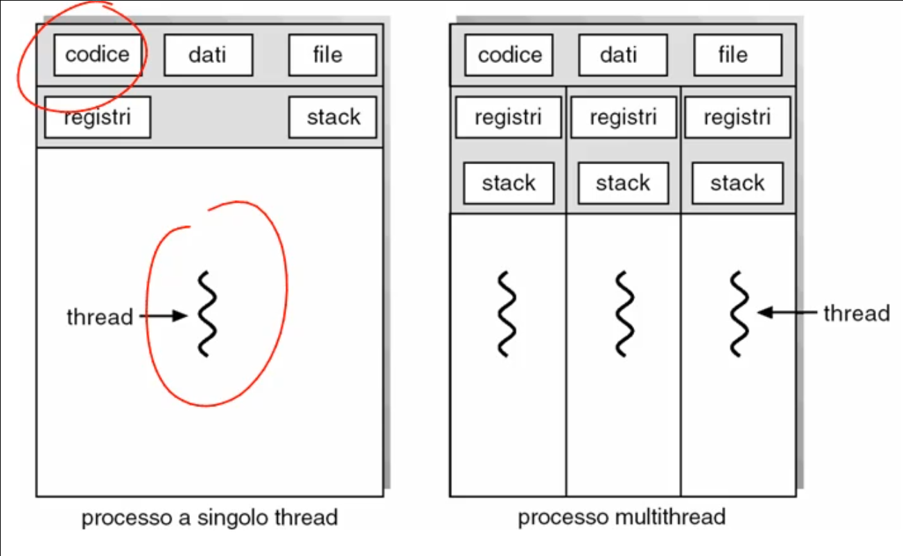
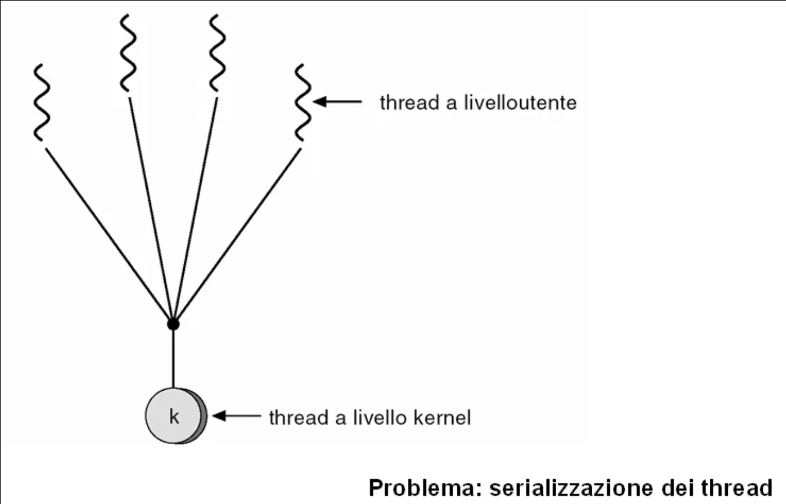
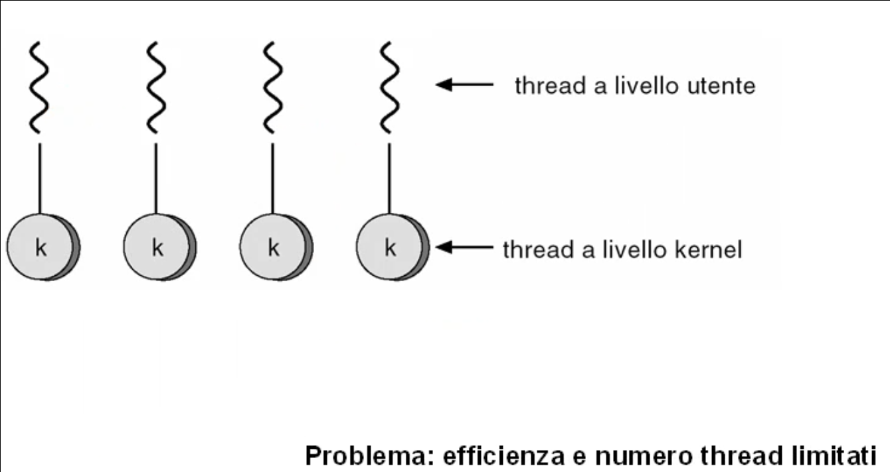
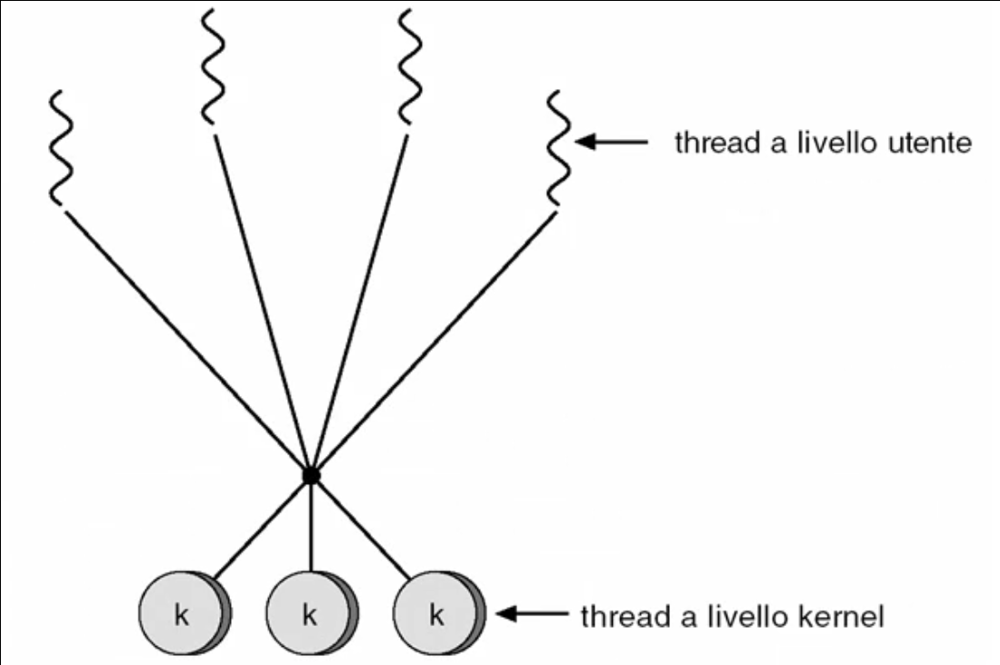
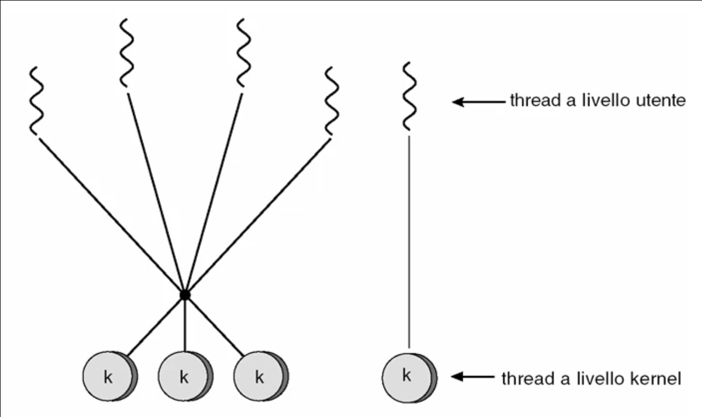

# Thread

## Thread

### Motivazioni
Tipicamente una qualunque applicazione esegue 3 tipi di attivita':
* Controllo del flusso di operazioni;
* Operazioni di I/O;
* Elaborazione all'interno del processore;

In applicazioni in cui sono necessari un'alta disponibilita' del servizio e un basso tempo di risposta, e' necessario porre molta cura nella realizzazione, nel bilanciamento e nell'esecuzioni delle 3 attivita' tipiche, dunque possono sorgere alcuni problemi:
* Esecuzione di piu' flussi di controllo nello stesso processo per attivita' simili;
* L'attesa di operazioni di I/O puo' impedire di servire richieste di attivita' simili;
* La memoria centrale, tra i vari processi, viene condivisa per ridurre i tempi di scambio delle informazioni.

Per affrontare questi problemi, fare uso dei processi e' fattibile, ma puo' portare a difficolta' di raggiungimento degli obiettivi di disponibilita' e basso tempo di risposta. La soluzione consisterebbe nell'avere un processo server e vari processi client che accedono/cooperano col server per l'esecuzione dell'applicazione, ma questo non e' efficiente.

### Concetto di thread
L'idea e' di avere flussi di controllo dell'esecuzione di istruzioni di un programma indipendenti e paralleli.

Nell'ambiente classico, un processo e' un unico flusso di controllo (detti processi pesanti).

Un processo multi-thread consente di avere piu' flussi di controllo all'interno del singolo processo in modo da poter risolvere i problemi di disponibilita' e risposta rapida.

### Benefici
Il modello del processo basato su multi-thread rende la computazione piu' flessibile ed efficiente:
* Maggiore risposta: perche' ciascun thread puo' farsi carico di rispondere ad una nuova richiesta;
* Condivisione di risorse: il codice, i dati e i file sono condivisi tra i thread;
* Economia: in termini di occupazione in memoria in quanto c'e' un codice, dati e file sono condivisi;
* Utilizzo di architetture multiprocessore: posso distribuire i thread sui vari processori.

### Supporti di gestione
Per supportare la gestione dei thread il sistema operativo mette a disposizione due approcci:
* Gestione a livello kernel: il sistema operativo fornisce delle funzioni tutte eseguite e gestite all'interno del kernel;
* Gestione a livello utente: il sistema operativo si fa carico dell'insieme dei thread di un processo senza vedere i singoli thread, gestendo dunque unicamente il singolo processo. La gestione dei singoli thread all'interno del processo e' responsabilita' di un insieme di funzioni apposite eseguite all'interno del processo.

Il sistema operativo mette comunque a disposizione una serie di funzioni che costituiscono la libreria di gestione dei thread:
* Nello spazio utente: la libreria e' una serie di funzioni usuali eseguite come chiamate a funzioni locali del proceso applicativo.
* Nello spazio kernel: chiamate a sistema

___

## Modelli multi-thread

### Modelli di mappaggio di sistemi multi-thread a livello utente nel kernel
Per realizzare sistemi multi-thread e' possibile avere un supporto fornito dal sistema operativo per i soli processi (in questo caso non esiste alcun supporto diretto all'interno del sistema operativo) simulando a livello utente l'evoluzione parallela dei vari thread di quel processo.

In altri sistemi esiste un supporto diretto ai thread all'interno del kernel (in questo caso e' il sistema operativo che si fa carico di gestire la schedulazione dei vari thread nel sistema) eseguendo l'ambiente multi-thread direttamente a livello del kernel. Questo puo' essere effettuato con:
* L'esecuzione diretta di un thread utente su un thread del livello kernel;
* La simulazione di un gruppo di thread a livello utente su ciascun thread a livello kernel.

#### Modello multi-thread molti-a-uno

#### Modello multi-thread uno-a-molti

#### Modello multi-thread molti-a-molti

#### Modello a due livelli
 

### Modelli di organizzazione della cooperazione tra i thread

#### Thread simmetrici
Si hanno un insieme di thread tutti uguali e capaci di risolvere l'applicazione all'interno del processo.

Le richieste che pervengono al processo, possono essere trattate da uno qualunque di questi thread.

#### Thread gerarchici
Le richieste pervengono al processo e vengono acquisite e trattate da un thread coordinatore del gruppo che provvedera' ad inviarle ai thread lavoratori del processo.

#### Thread in pipeline
Le richieste che pervengono al processo vengono acquisite dal primo thread, che svolge delle attivita' di elaborazione e produce una risposta parziale. Questa risposta parziale viene poi inoltrata ad un thread successivo e cosi' via, finche' ultimo non completera' l'elaborazione rilasciando il risultato ai richiedenti.

___

## Gestione dei thread

### Funzioni di creazione
Quando un processo desidera creare un thread esegue una funzione di **fork** che duplica tutti i thread del processo o alla duplicazione del solo thread chiamante.

### Funzioni di esecuzione
Quando un processo vuole eseguire un programma puo' invocare la funzione di **exec** e rimpiazzare l'intero processo che stava venendo eseguito in quel momento per eseguirlo. Anche gli altri thread vedranno cambiare il codice di un programma in esecuzione.

### Funzioni di terminazione
Per terminare un thread va individuato prima che abbia terminato le sue attivita' ed esistono due modalita':
* La terminazione asincrona rispetto all'evoluzione della computazione comporta una terminazione immediata;
* La terminazione differita implica l'individuazione di oppurtuni momenti della sua evoluzione della computazione se puo' terminare o procedere nella sua attivita'. Alternativamente, al termine della sua attivita', il thread termina e viene rimosso dal sistema.

### Funzioni di sincronizzazione e comunicazione
Sono procedure di sistema operativo dal thread originante verso i thread del processo destinatario:
* Tutti i thread del processo destinatario;
* Sottoinsieme di thread;
* Thread specifico.

### Processi leggeri
Per gestire meglio le operazioni dei thread all'interno del sistema molto spesso viene introdotto il processo leggero (**LWP** - Lightweigth process).

Consistono in processori virtuali utili per disaccoppiare la visione dei thread a livello utente dalla visione dei thread gestita a livello del kernel.
Il LWP si frappone, fornendo all'insieme dei processi utente, un processore virtuale che mappera' i processi utente a livello del kernel in modo trasparente.

In questo modo il processo utente non deve occuparsi della gestione del parallelismo.