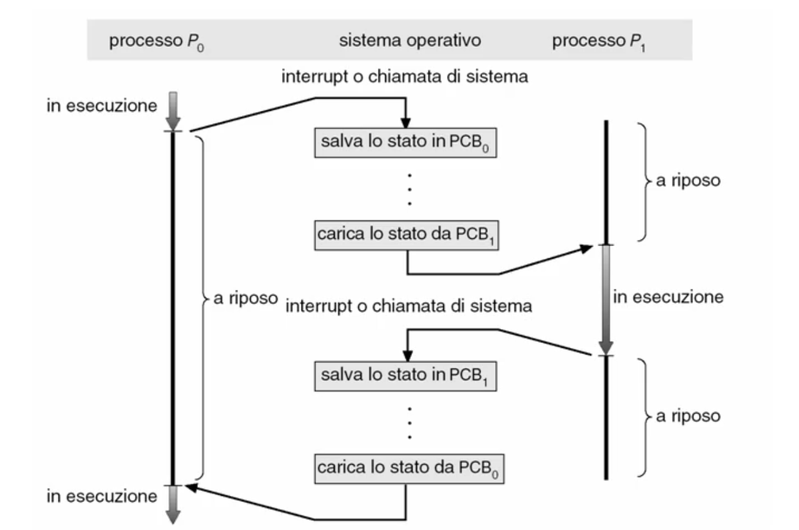

# Gestione del processore

## Processi

### Processi

#### Multi-tasking
##### Problema
Un qualunque sistema di elaborazione risente della **lentezza delle operazioni di I/O**, sfruttando molto poco il processore, che rimane spesso in attesa e dunque non puo' eseguire compiti utili per far avanzare il programma in esecuzione.

##### Soluzione
Durante l'esecuzione di un programma, se questo esegue delle operazioni di I/O, invece di attendere il completamento il modello del **multi-tasking** suggerisce al processore di svolgere un altro programma cercando eseguire piu' programmi "contemporaneamente".

##### Realizzazione
Tramite:
* **Multiprogrammazione**: ossia caricare in memoria centrale piu' programmi in modo che si abbiano piu' programmi disponibili da eseguire;
* **Multi-tasking**: ossia gestire una turnazione dei programmi sul processore quando un programma entra in attesa del completamento delle operazioni delle periferiche.

Il sistema operativo fa dunque in modo che il processore riesca a gestire piu' flussi di esecuzione indipendenti, appare eseguire piu' programmi in parallelo.

#### Concetto di processo
Per processo si intende un **programma in esecuzione**, costituito da un'insieme di componenti disposti in memoria centrale per poterne supportare l'esecuzione:
* Codice del programma;
* Dati del programma:
  * Variabili globali (Memoria centrale);
  * Variabili locali e non locali dichiarate nelle procedure (Stack);
  * Variabili temponanee generate dal compilatore (Registri del processore);
  * Variabili allocate dinamicamente (Heap).
* Lo stato di evoluzione della computazione:
  * Program counter;
  * Insieme di tutti i valori delle variabili.

##### Differenza tra programma e processo
Il programma e':
* Un'entita' passiva;
* Costituito da una semplice lista di istruzioni.

Il processo invece e':
* Un'entita' attiva ottenuta dal programma di esecuzione;
* L'insieme di tuttii valori delle variabili;
* L'insieme di tutte le risorse in uso.

##### Ciclo di vita di un processo
L'insieme delle attivita' che sta svolgendo un processo descrive lo stato della computazione di un processo.

Il processo, da un punto di vista astratto, e' una funzione che trasforma informazioni eseguendo le istruzioni del programma:
* Parte dall'acquisizione dei valori iniziali (ad esempio costanti o valori ottenuti tramite le periferiche);
* Termina con la produzione di risultati finali (emessi attraverso le periferiche).

Il processo e' una **macchina a stati finiti**:
* Gli stati sono le informazioni su cui opera;
* Le transizioni sono dovute alle istruzioni che modificano le informazioni.

#### Stato di evoluzione della computazione di un processo
Lo stato di evoluzione della computazione di un processo e' l'insieme di tutti i valori delle informazioni da cui dipende la computazione del processo (e quindi descrive come il processo evolve). Si considerano gli insiemi di:
* Variabili globali (area dati globali);
* Variabili locali e non locali delle procedure del programma (Stack);
* Variabili temporanee introdotte dal compilatore (Registri del processore);
* Variabili allocate dinamicamente (Heap);
* Informazioni di gestione del contesto della chiamata di procedure
  * Indirizzo di ritorno; 
  * Base pointer;
  * Stack pointer.
* Istruzione corrente: 
  * Program counter.

##### Cambiamento del processo in esecuzione
Per cambiare il processo in esecuzione dobbiamo ricordarci di **salvare lo stato** di evoluzione della computazione per garantirne la corretta esecuzione, indipendentemente dagli eventuali cambiamenti dei processi in esecuzione (come se non avessimo mai cambiato il processo).

Per salvare lo stato di evoluzione del processo in esecuzione, poiche' sono gia' in memoria, **non e' necessario salvare**:
* Il codice;
* Le variabili globali;
* Lo Heap;

Mentre invece **e' necessario salvare**:
* Il contenuto dei registri;
* Il Program Counter.

Possono essere salvati in una struttura dati del sistema operativo o sulla cima dello Stack in modo tale che possano essere recuperati successivamente.

Quando il sistema tornera' in esecuzione, trovera' a partire dalla posizione indicata dallo Stack Pointer i valori del Program Counter e dei registri per ripristinarli. Ovviamente anche il contenuto dello Stack Pointer viene salvato poiche' in memoria centrale.

Nel caso in cui si stia utilizzando un linguaggio che consente al codice di *auto-modificarsi* in base allo stato in cui si trova e' necessario salvare anche il codice stesso come componente dello stato di evoluzione della computazione del processo.

#### Stato di uso del processore da parte di un processo
Durante la sua computazione, un processo puo':
* Usare il processore:
  * Per eseguire effettivamente la computazione;
* Attendere di ottenere l'uso del processore, pur avando tutte le altre risorse informative o fisiche necessarie:
  * Teoricamente la computazione potrebbe evolvere (in quanto il processo ha solo bisogno di poter utilizzare il processore), ma non lo fa poiche' le istruzioni non possono essere eseguite;
* Attendere che una risorsa informativa o fisica diventi disponibile:
  * La computazione non puo' evolvere poiche' mancano alcune risorse oltre al processore.

Il concetto di Stato di uso del processore da parte del processo e' la modalita' in cui il processo sta usando il processore:
* **New**: quando il processo viene creato;
* **Running**: quando il processo sta venendo eseguito dal processore;
* **Waiting**: quando il processo e' in attesa di risorse esterne o il completamento di un'operazione richiesto ad una periferica;
* **Ready-To-Run**: quando il processo ha tutte le risorse disponibili e puo' essere eseguito (in attesa del processore);
* **Terminated**: quando il processo e' stato eseguito e terminato.

#### Diagramma degli stati del processo
Per descrivere l'evoluzione delle attivita' dei processi useremo un diagramma degli stati del processo e le transizioni tra gli stati.

Si tratta di un grafo orientato dove:
* Nodi: indicano gli stati del processo;
* Archi: indicano le transizioni tra gli stati del processo.

In particolare quando un processo e' *Ready-To-Run* entrera' in competizione con altri processi pronti per essere eseguiti e, tramite algoritmi di selezione, verra' selezionato da un **Dispatcher** che consentira' al processo l'utilizzo del processore.

#### Supporti per la gestione dei processi
Per gestire i processi il sistema operativo mette a disposizione il **Process Control Block** che raccoglie tutte le informazioni riguardanti il processo:
* L'identificatore del processo (Numero);
* Lo stato del processo;
* Il Program Counter;
* Eventuali registri della CPU (a meno che questo non siano salvati nella zona di memoria indicata dallo Stack Pointer);
* Le informazioni sulla schedulazione della CPU (come e quando gli puo' essere abilitato l'uso del processore);
* Le informazioni sulla gestione della memoria centrale (limiti di memoria);
* Le informazioni sullo stato dell'I/O (ad esempio file aperti);
* Le informazioni sull'accounting (costi di uso del sistema).

##### Code dei processi nei vari stati
I descrittori che raccolgono le informazioni sui singoli processi possono essere accodati nelle code che rappresentano gli stati del processo:
* Ci sara' un unico processo che sara' nella coda *running*;
* Per ciascuna delle risorse avremo un insieme di processi in attesa dell'esecuzione delle operazioni richieste o di ottenere la disponibilita' della risorsa.

##### Transizioni tra le code

___

### Creazione e terminazione dei processi

#### Modelli computazionali

##### Processi come flusso di operazioni
Possiamo vedere un processo come il flusso di esecuzione della computazione.

Se noi abbiamo attivita' separate, possiamo quindi vedere flussi separati che vengono eseguiti nel sistema, dunque dal punto di vista logico si tratta di processi separati.

I flussi possono essere:
* **Indipendenti**: costituiti da processi che evolvono autonomamente;
* **Sincronizzati**: costituiti da processi che evolvono sincronizzandosi.

##### Modellazione della computazione a processi
Possiamo dunque modellare la computazione di un'applicazione in vari modi. Dal punto di vista astratto abbiamo un programma che ha vari obiettivi da raggiungere descrivendoli come:
* Un singolo processo monolitico che piano piano raggiunge i sotto-obiettivi per poi terminare l'insieme delle varie attivita' previste dal programma;
* Una collezione di processi cooperanti che indentificano diversi flussi con ognuno lo scopo di risolvere una parte dell'insieme delle attivita'.

Il modello di realizzazione del codice eseguibile puo' essere:
* Un programma monolitico;
* Programmi separati.

Possiamo dunque realizzare differenti modelli di computazione:
* Un unico programma monolitico eseguito come un unico processo;
* Un programma monolitico che genera dei processi cooperanti;
* Programmi separati che vengono eseguiti come processi cooperanti (che eventualmente generano ulteriori processi cooperanti).

#### Modalita' e funzioni per creazione e attivazione dei processi
##### Generazione di un processo
Quando ho un processo in esecuzione, questo puo' attivare una funzionalita' del sistema operativo (chiamata usualmente **fork**) che produce una copia del programma e attiva una copia del processo.

Le risorse del processo figlio possono essere:
* Condivise col padre;
* Parzialmente condivise col padre;
* Indipendenti dal padre (ottenute dal sistema);
* Passate al momento dell'inizializzazione (argomenti della fork).

##### Spazio di indirizzamento
Nella maggior parte dei contesti lo spazio di indirizzamento del processo figlio e' sempre distinto da quello del processo padre.

In alcuni casi lo spazio del processo figlio e' duplicato dello spazio del processo padre, dunque vengono copiati codice, dati, heap e stack. Durante l'evoluzione della computazione del processo figlio il codice rimarra' inalterato mentre dati, heap e stack verranno valorizzati durante l'esecuzione. 
Si ha dunque lo stesso programma e gli stessi dati all'atto della creazione.

Un'altra tecnica consiste nel far avere al processo figlio uno spazio di indirizzamento completamente nuovo. Verra' dunque utilizzato un nuovo programma che puo' (richiamato dalla funzione **exec**).

##### Esecuzione dei processi
L'esecuzione dei processi generanti puo' avvenire in due modalita':
* Continua l'esecuzione in modo concorrente ai figli;
* Attende finche' alcuni o tutti i suoi figli sono terminati (questo viene ottenuto tramite un'operazione specifica di chiamata al sistema operativo: **wait** del processo figlio).

#### Modalita' e funzioni per terminazione dei processi
Durante tutta la loro attivita' i processi svolgono operazioni che realizzano la computazione del programma applicativo per risolvere i problemi e possono terminare quando viene raggiunta l'ultima istruzione del flusso previsto dall'applicazione.

In tal caso il processo termina con l'esecuzione della funzione **exit** la quale provvede a restituire un'informazione sullo stato di esecuzione del processo all'interfaccia utente (o piu' in generale al processo chiamante) e a deallocare le risorse utilizzate dal processo.

Un processo puo' anche terminare in caso si verifichino degli eventi anomali (ad esempio un uso eccessivo di risorse, un errore nell'uso di una risorsa, esecuzione di un compito non piu' necessario).

In questo caso possono avvenire anche terminazioni forzate a cascata quando termina un processo padre ed e' previsto che anche i suoi processi figli terminino. Cio' avviene utilizzando la funzione **abort** che porta alla gestione di terminazione con anomalie.

___

### Sospensione e riattivazione dei processi

#### Come si realizza il multi-tasking

##### Classificazione dei processi rispetto all'uso delle risorse fisiche
Un processo puo' usare le risorse fisiche del sistema in vari modi, possiamo avere dei processi:
* **I/O-bound**: legati all'I/O, quei processi che fanno molte operazioni di I/O;
* **CPU-bound**: legati alla CPI, quei processi che fanno molte operazioni aritmetico-logiche e in memoria centrale.

Queste due tipologie di processi descrivono come in realta' le applicazioni sono progettate. Questa classificazione consente al sistema operativo di gestire la virtualizzazione in maniera ottimale.

##### Realizzazione del multi-tasking
Il multi-tasking ha come obiettivo quello di effettuare la turnazione dei processi sul processore per massimizzare lo sfruttamento del processore.

La metodologia per affrontare la turnazione consiste in vari step:
* Sospensione del processo in esecuzione;
* Ordinamento dei processi *Ready-To-Run* (**scheduling**);
* Selezione del processo *Ready-To-Run* da mettere in esecuzione (**dispatching**);
* Riattivazione del processo selezionato.

Per definire come questi step vengono svolte possono esserci varie combinazioni di politiche e meccanismi. In funzione delle regole scelte si avranno dei risultati differenti.

Politiche:
* Definizione delle opportunita' di sospensione del processo in esecuzione;
* Definizione dell'ordinamento dei processi pronti;

Meccanismi:
* Sospensione del processo in esecuzione con salvataggio del suo contesto di esecuzione;
* Dispatching del processo da mettere in esecuzione;
* Riattivazione di un processo con ripristino del suo contesto di esecuzione.

##### Politiche di sospensione dei processi nel multi-tasking
Il processo in esecuzione puo' essere sospeso:
* In modo implicito:
  * Dopo aver effettuato una richiesta di I/O;
  * Dopo aver creato un sottoprocesso attendendone la terminazione;
* In modo esplicito:
  * Quando rilascia volontariamente il processore.

#### Time sharing
E' un multi-tasking a condivisione di tempo e ha come obiettivo di gestire la turnazione dei processi sul processore in modo da creare l'illusione di evoluzione contemporanea agli utenti interattivi.

Il problema e' che i processi CPU-bound non rilasciano il processore abbastanza frequentemente da permettere tale illusione.

La soluzione consiste nel forzare il rilascio del processore (**pre-emption**).

#### Come si realizza il time sharing
Si introduce il concetto di **time slice** come intervallo di tempo massimo di uso consecutivo del processore consentito a ciascun processo.

Per realizzare la valutazione del time slice e l'ordine di pre-rilascio si fa uso del **Real-time clock** (un dispositivo che scandisce il tempo generando periodicamente un'interruzione).

Il problema e' che usualmente il periodo del Real-time clock e' troppo breve, quindi la routine di pre-rilascio verrebbe eseguita troppo frequentemente causando un sovraccarico di gestione delle interruzioni.

La soluzione e' di trovare un time-slice che non sia coincidente con il Real-time clock ma sia sufficientemente lungo da fare una turnazione frequente. Si usa un multiplo del periodo del Real-time clock.

#### Sospensione di un processo
##### Politiche di sospensione dei processi nel time sharing
Il processo in esecuzione viene sospeso:
* Dopo aver effettuato una richiesta di I/O (sincrona-implicita);
* Dopo aver creato un sottoprocesso attendendone la terminazione (sincrona-implicita);
* Quando rilascia volontariamente il processore (sincrona-esplicita);
* Quando scade il time-slice (asincrona-implicita).

##### Sospensione del processo in esecuzione
Si tratta principalmente di due operazioni:
* Attivare la procedura di sospensione:
  * Sincrona rispetto alla computazione in stato supervisione (in procedure di I/O, creazione dei processi);
  * Sincrona rispetto alla computazione in stato utente (in rilascio volontario);
  * Asincrona rispetto alla computazione (allo scadere del time-slice nel time sharing);
* Salvataggio del contesto di esecuzione:
  * Salvare tutti i registri del processore sullo Stack;
  * Salvare lo Stack Pointer nel Process Control Block.

Questa procedura e' identica a qualunque risposta alle interruzioni.

#### Riattivazione di un processo
Il ripristino del contesto di esecuzione consiste nel:
* Ripristinare il valore del registro che punta alla base dello Stack prendendolo da Process Control Block del processo da riattivare;
* Ripristinare il valore dello Stack Pointer prendendolo dal Process Control Block del processo da riattivare;
* Ripristinare tutti i registri del processore prendendoli dallo Stack.

##### Cambiamento del processo in esecuzione
Il **context-switch** consiste nel:
* Sospendere il processo in esecuzione;
* Riattivare un processo da mettere in esecuzione.

##### Dispatching del processo
Consiste semplicemente nel prendere il processo ordinato dalla schedulazione dei processi e porlo in esecuzione.