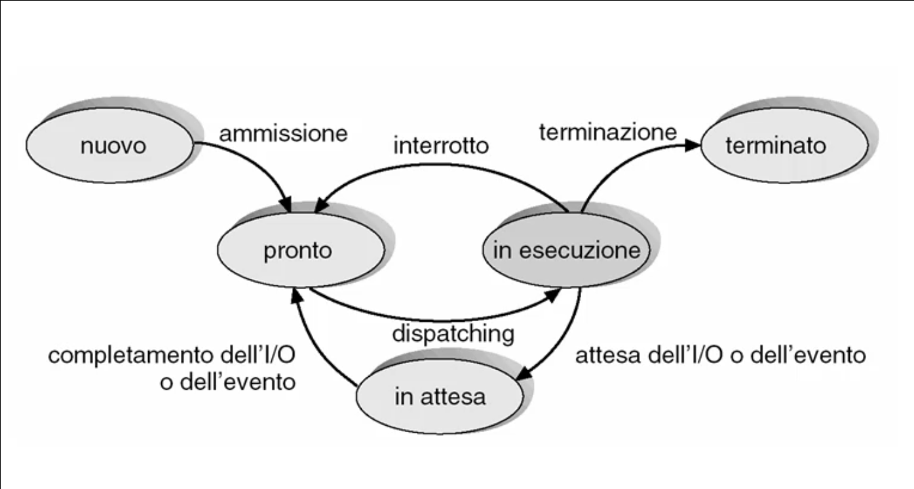
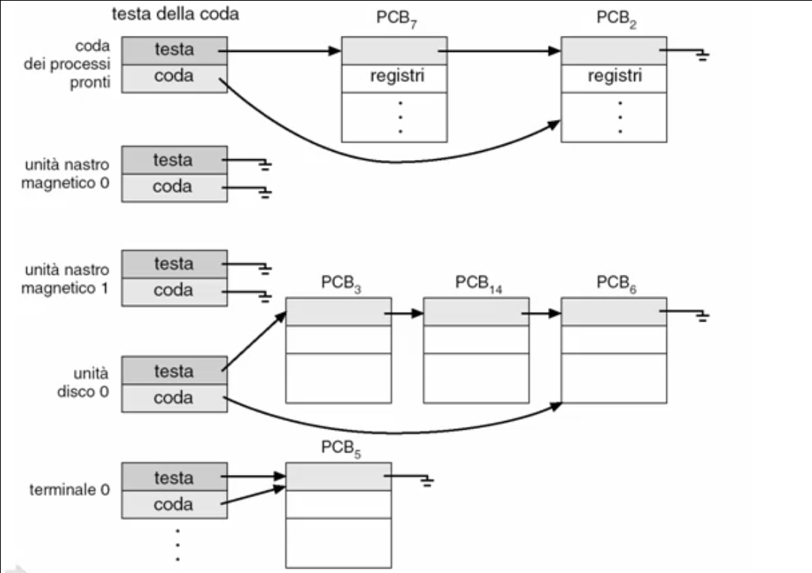
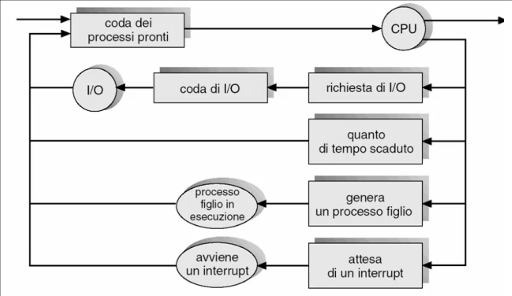

# Gestione del processore

## Processi

### Processi

#### Multi-tasking
##### Problema
Un qualunque sistema di elaborazione risente della **lentezza delle operazioni di I/O**, sfruttando molto poco il processore, che rimane spesso in attesa e dunque non puo' eseguire compiti utili per far avanzare il programma in esecuzione.

##### Soluzione
Durante l'esecuzione di un programma, se questo esegue delle operazioni di I/O, invece di attendere il completamento il modello del **multi-tasking** suggerisce al processore di svolgere un altro programma cercando eseguire piu' programmi "contemporaneamente".

##### Realizzazione
Tramite:
* **Multiprogrammazione**: ossia caricare in memoria centrale piu' programmi in modo che si abbiano piu' programmi disponibili da eseguire;
* **Multi-tasking**: ossia gestire una turnazione dei programmi sul processore quando un programma entra in attesa del completamento delle operazioni delle periferiche.

Il sistema operativo fa dunque in modo che il processore riesca a gestire piu' flussi di esecuzione indipendenti, appare eseguire piu' programmi in parallelo.

#### Concetto di processo
Per processo si intende un **programma in esecuzione**, costituito da un'insieme di componenti disposti in memoria centrale per poterne supportare l'esecuzione:
* Codice del programma;
* Dati del programma:
  * Variabili globali (Memoria centrale);
  * Variabili locali e non locali dichiarate nelle procedure (Stack);
  * Variabili temponanee generate dal compilatore (Registri del processore);
  * Variabili allocate dinamicamente (Heap).
* Lo stato di evoluzione della computazione:
  * Program counter;
  * Insieme di tutti i valori delle variabili.

##### Differenza tra programma e processo
Il programma e':
* Un'entita' passiva;
* Costituito da una semplice lista di istruzioni.

Il processo invece e':
* Un'entita' attiva ottenuta dal programma di esecuzione;
* L'insieme di tuttii valori delle variabili;
* L'insieme di tutte le risorse in uso.

##### Ciclo di vita di un processo
L'insieme delle attivita' che sta svolgendo un processo descrive lo stato della computazione di un processo.

Il processo, da un punto di vista astratto, e' una funzione che trasforma informazioni eseguendo le istruzioni del programma:
* Parte dall'acquisizione dei valori iniziali (ad esempio costanti o valori ottenuti tramite le periferiche);
* Termina con la produzione di risultati finali (emessi attraverso le periferiche).

Il processo e' una **macchina a stati finiti**:
* Gli stati sono le informazioni su cui opera;
* Le transizioni sono dovute alle istruzioni che modificano le informazioni.

#### Stato di evoluzione della computazione di un processo
Lo stato di evoluzione della computazione di un processo e' l'insieme di tutti i valori delle informazioni da cui dipende la computazione del processo (e quindi descrive come il processo evolve). Si considerano gli insiemi di:
* Variabili globali (area dati globali);
* Variabili locali e non locali delle procedure del programma (Stack);
* Variabili temporanee introdotte dal compilatore (Registri del processore);
* Variabili allocate dinamicamente (Heap);
* Informazioni di gestione del contesto della chiamata di procedure
  * Indirizzo di ritorno; 
  * Base pointer;
  * Stack pointer.
* Istruzione corrente: 
  * Program counter.

##### Cambiamento del processo in esecuzione
Per cambiare il processo in esecuzione dobbiamo ricordarci di **salvare lo stato** di evoluzione della computazione per garantirne la corretta esecuzione, indipendentemente dagli eventuali cambiamenti dei processi in esecuzione (come se non avessimo mai cambiato il processo).

Per salvare lo stato di evoluzione del processo in esecuzione, poiche' sono gia' in memoria, **non e' necessario salvare**:
* Il codice;
* Le variabili globali;
* Lo Heap;

Mentre invece **e' necessario salvare**:
* Il contenuto dei registri;
* Il Program Counter.

Possono essere salvati in una struttura dati del sistema operativo o sulla cima dello Stack in modo tale che possano essere recuperati successivamente.

Quando il sistema tornera' in esecuzione, trovera' a partire dalla posizione indicata dallo Stack Pointer i valori del Program Counter e dei registri per ripristinarli. Ovviamente anche il contenuto dello Stack Pointer viene salvato poiche' in memoria centrale.

Nel caso in cui si stia utilizzando un linguaggio che consente al codice di *auto-modificarsi* in base allo stato in cui si trova e' necessario salvare anche il codice stesso come componente dello stato di evoluzione della computazione del processo.

#### Stato di uso del processore da parte di un processo
Durante la sua computazione, un processo puo':
* Usare il processore:
  * Per eseguire effettivamente la computazione;
* Attendere di ottenere l'uso del processore, pur avando tutte le altre risorse informative o fisiche necessarie:
  * Teoricamente la computazione potrebbe evolvere (in quanto il processo ha solo bisogno di poter utilizzare il processore), ma non lo fa poiche' le istruzioni non possono essere eseguite;
* Attendere che una risorsa informativa o fisica diventi disponibile:
  * La computazione non puo' evolvere poiche' mancano alcune risorse oltre al processore.

Il concetto di Stato di uso del processore da parte del processo e' la modalita' in cui il processo sta usando il processore:
* **New**: quando il processo viene creato;
* **Running**: quando il processo sta venendo eseguito dal processore;
* **Waiting**: quando il processo e' in attesa di risorse esterne o il completamento di un'operazione richiesto ad una periferica;
* **Ready-To-Run**: quando il processo ha tutte le risorse disponibili e puo' essere eseguito (in attesa del processore);
* **Terminated**: quando il processo e' stato eseguito e terminato.

#### Diagramma degli stati del processo
Per descrivere l'evoluzione delle attivita' dei processi useremo un diagramma degli stati del processo e le transizioni tra gli stati.

Si tratta di un grafo orientato dove:
* Nodi: indicano gli stati del processo;
* Archi: indicano le transizioni tra gli stati del processo.

In particolare quando un processo e' *Ready-To-Run* entrera' in competizione con altri processi pronti per essere eseguiti e, tramite algoritmi di selezione, verra' selezionato da un **Dispatcher** che consentira' al processo l'utilizzo del processore.

#### Supporti per la gestione dei processi
Per gestire i processi il sistema operativo mette a disposizione il **Process Control Block** che raccoglie tutte le informazioni riguardanti il processo:
* L'identificatore del processo (Numero);
* Lo stato del processo;
* Il Program Counter;
* Eventuali registri della CPU (a meno che questo non siano salvati nella zona di memoria indicata dallo Stack Pointer);
* Le informazioni sulla schedulazione della CPU (come e quando gli puo' essere abilitato l'uso del processore);
* Le informazioni sulla gestione della memoria centrale (limiti di memoria);
* Le informazioni sullo stato dell'I/O (ad esempio file aperti);
* Le informazioni sull'accounting (costi di uso del sistema).

##### Code dei processi nei vari stati
I descrittori che raccolgono le informazioni sui singoli processi possono essere accodati nelle code che rappresentano gli stati del processo:
* Ci sara' un unico processo che sara' nella coda *running*;
* Per ciascuna delle risorse avremo un insieme di processi in attesa dell'esecuzione delle operazioni richieste o di ottenere la disponibilita' della risorsa.

##### Transizioni tra le code
