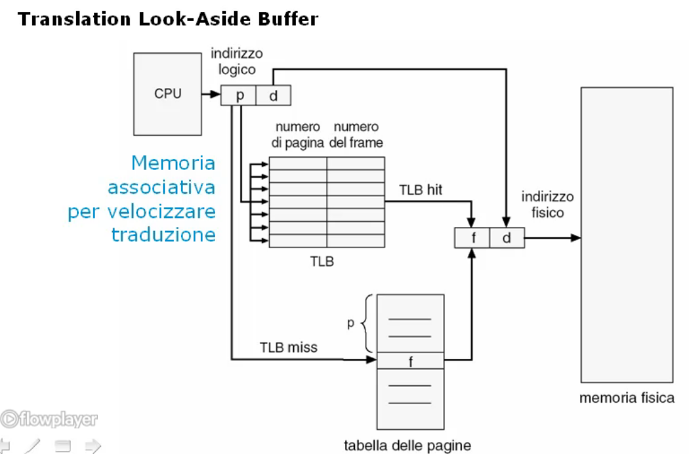

# Gestione della memoria centrale

## Tecniche di base di primo livello

### Indirizzamento in memoria centrale

#### Indirizzi logici e indirizzi fisici
Quando scriviamo un programma e ne generiamo il codice eseguibile, il programma P ha un suo spazio di indirizzamento in cui pone: il codice, i dati globali, lo heap e lo stack.

Quando il programma vuole accedere ad uno specifico indirizzo (eg. 100hex) si dice che questo e' l'**indirizzo logico** della cella di memoria posta in tale locazione: tale indirizzo viene calcolato a partire dall'indirizzo zero di base del programma P (dal primo byte occupato dal programma nel suo spazio di indirizzamento).

Questo pero' non coincide con lo spazio di indirizzamento fisico in cui il programma si trova.

In memoria centrale, dove abbiamo vari programmi caricati, ogni programma ha uno spazio di indirizzamento riservato in modo tale che ognuno di questi possa evolvere nella sua computazione.
In particolare, il programma P, potra' essere caricato a partire dalla posizione 500hex in memoria centrale: questo indirizzo viene anche chiamato **indirizzo di base**.

La cella di memoria con indirizzo logico 100hex, rispetto al programma P, si trovera' in un **indirizzo fisico** in memoria centrale. Per ottenere l'indirizzo fisico di tale cella bisognera' calcolare l'*offset* in memoria centrale a partire dall'indirizzo 0hex.


#### Collegamento degli indirizzi logici agli indirizzi fisici
Durante la fase di scrittura del programma, utilizzeremo delle descrizioni *simboliche* per riferirci a delle celle di memoria, che il *compilatore e il linker tradurranno poi in indirizzi numerici in memoria fisica*.

Le operazioni di **linking** da una descrizione simbolica ad un indirizzo logico nella memoria del programma vengono effettuate dal compilatore e dal linker, definendo cosi' lo spazio di indirizzamento logico per quel programma e i valori logici di ciascuna variabile, procedura, ecc.

L'operazione di *caricamento* effettuera' il **binding** definitivo ponendo il valore fisico associato al valore logico.

Il collegamento degli indirizzi, inteso come associazione di un valore logico ad un indirizzo fisico di una cella di memoria, puo' avvenire in 3 momenti specifici:
* In fase di compilazione
* In fase di caricamento
* In fase di esecuzione


#### Binding statico - Fase di compilazione
In **fase di compilazione** noi forniamo un *indirizzo di base* in memoria fisica che indica l'indirizzo da cui vogliamo far partire lo spazio di allocazione del programma da noi compilato.
I riferimenti simbolici degli indirizzi, all'interno del codice eseguibile, verrano resi indirizzi fisici eseguendo un semplice calcolo:

> Ponendo:
> * IF : Indirizzo fisico di una cella di memoria indirizzata dal programma;
> * IL : Indirizzo logico di una cella di memoria indirizzata dal programma;
> * IB : Indirizzo di base da cui viene caricato lo spazio di indirizzamento del programma;
> * 0hex : Indirizzo di partenza della memoria fisica;

> IF = 0hex + IB + IL

L'indirizzamento viene dunque **caricato staticamente all'interno del codice**, ed ogni volta che il programma verra' caricato, sara' caricato sempre a quell'indirizzo di base.


#### Binding statico - Fase di caricamento
In **fase di caricamento** in quanto abbiamo ancora la possibilita' di spostare il programma *rilocandolo* a partire da un indirizzo di base diverso.

Cambiando indirizzo di base da cui far partire lo spazio di indirizzamento di un programma abbiamo la possibilita' di rilocare in posizioni diverse in memoria centrale il codice e quindi, cambiando anche i riferimenti fisici alle celle indirizzate logicamente.

In questo caso si parla di **caricamento statico con rilocazione del codice durante il caricamento**.

#### Binding statico - Fase di esecuzione
In **fase di esecuzione** abbiamo la possibilita' di caricare il programma in una posizione di memoria a partire dal un indirizzo di base, che viene memorizzato in un dispositivo apposito: la **Memory Management Unit**, in modo tale che ogni volta che viene generato un indirizzo logico, questo viene tradotto aggiungendo l'offset di base e quindi andando a generare l'indirizzo fisico desiderato.

La rilocazione in questo caso e' molto facile, in quanto basta assegnare lo spazio di indirizzamento del programma a partire da un altro indirizzo di base e cambiare il contenuto del registro della Memory Management Unit per farlo puntare al nuovo spazio di indirizzamento.

In modo automatico la Memory Management Unit si occupera' di rigenerare tutti gli indirizzi senza che debba essere modificato nulla all'interno del codice ottenendo cosi' un **caricamento statico con rilocazione del codice in esecuzione**.

#### Binding dinamico
E' possibile effettuare il caricamento del programma in maniera **dinamica** per minimizzare l'utilizzo della memoria centrale, effettivamente caricando solo le porzioni che servono. 

Posso ottenere un **caricamento dinamico** quando vado a caricare una porzione di programma che viene messa in esecuzione. Nel momento in cui la porzione di programma fara' riferimento ad un'altra porzione (non presente in memoria centrale) il supporto runtime del linguaggio di programmazione provvedera' a caricare in memoria centrale la porzione di codice necessaria. 

Questo approccio e' tipico quando si vogliono utilizzare librerie condivise. 
Senza il caricamento dinamico nella memoria centrale saremmo costretti a ripetere porzioni di programma per una corretta esecuzione.


___

### Partizionamento
#### Tecnica del partizionamento della memoria centrale
La memoria centrale deve essere allocata ai programmi e al sistema operativo per consentire ad essi di depositare codice, dati, heap e stack necessari alla loro evoluzione della computazione.

Lo spazio di indirizzamento del processore (ossia il numero di parole fisiche diverse che il processore puo' indirizzare) e' usualmente molto superiore allo spazio fisico di memoria installata nel sistema di elaborazione.

Ciascun processo puo' quindi utilizzare, dello spazio fisico di memoria, una porzione al piu' grande come lo spazio di memoria installata, ma deve consentire ad altri programmi installati nel sistema di poter essere allocati.

Ai programmi allocati e' consentito effettuare operazioni di lettura e scrittura solo dalla memoria centrale fisica.

Il problema che si vuole risolvere e' quello di realizzare la multiprogrammazione per supportare il multitasking.

#### Obiettivi
Gli obiettivi che si vogliono raggiungere sono:
* Ripartire la memoria centrale fisica tra i processi che sono stati caricati (incluso il sistema operativo) per realizzare sistemi multiprogrammati;
* Proteggere la memoria centrale da accessi non leciti da parte di un processo a zone occupate da altri processi (o dal sistema operativo).


#### Partizioni
E' possibile parizionare la memoria centrale in partizioni su cui verranno caricati i processi, lasciando sempre una porzione dedicata al sistema operativo.

Qualora il numero di partizioni disponibili fosse zero, e venisse lanciato un nuovo processo, questo dovra' attendere che una partizione venga liberata prima di poter essere allocato.

Se avessi un processo piu' grande della maggiore partizione presente, tale processo non potra' mai essere eseguito con quel partizionamento.

Nel partizionamento abbiamo dunque che:
> La somma dello spazio di indirizzamento dei processi e del sistema operativo e' uguale alla memoria centrale fisica.

#### Partizioni fisse (Statiche)
La tecnica delle partizioni fisse prevede che la memoria fisica venga suddivisa in un insieme di partizioni di grandezza predeterminata per i vari processi applicativi.

Queste partizioni vengono conservate in una **tabella delle partizioni** in cui vengono memorizzati gli indirizzi fisici di inzio delle varie partizioni.

Quando il sistema vorra' caricare un programma in una partizione andra' a scandire nella tabella delle partizioni quali tra queste e' libera e quale dispone di una dimensione sufficiente a contenere il programma desiderato.

Il partizionamento viene definito all'atto del **bootstrap**, e non potra' essere cambiato per tutta l'esecuzione dei programmi fin quando il sistema non viene spento.

#### Partizioni variabili (Dinamiche)
Un altro approccio e' quello delle partizini variabili per cui il numero delle partizioni e la dimensione di queste non viene definito in fase di bootstrap ma puo' essere cambiata **durante l'esecuzione**.

In questo caso abbiamo la **tabella delle partizioni** (che contiene le informazioni relative agli indirizzi fisici di inizio delle varie partizioni) che se durante l'esecuzione **ritiene opportuno modificare le partizioni**, ad esempio per caricare un programma che necessita di molto spazio che non riesce ad entrare in nessuna partizione, puo' **procedere con la ripartizione** (anche diminuendo il numero totale di partizioni disponibili) aggiornando conseguentemente la tabella.

#### Caratteristiche - Frammentazione
Il grosso problema che si ha con il partizionamento e' che rimangono spesso dei frammenti di memoria non utilizzati.

Ad esempio se un processo caricato in una partizione non la usa nella sua massima dimensione allocabile, ci sono delle zone di memoria completamente inutilizate ed inutilizzabili da altri processi.

Addirittura, la somma di tutta la memoria non utilizzata da vari processi, potrebbe consentire l'allocazione di un nuovo processo, ma poiche' questa e' bloccata dal partizionamento e non si trova in posizioni contigue cio' non e' possibile.

___

### Overlaying

#### Tecnica dell'overlaying della memoria centrale
Il problema fondamentale che si deve affrontare quando si vuole mandare in esecuzione un processo in un sistema di elaborazione e' che la memoria centrale fisica assegnata a tale processo puo' non bastare a contenere lo spazio di indirizzamento logico.

Il partizionamento consente di ripartire la memoria centrale fisica tra vari processi, consentendo quindi il multitasking, ma lo spazio di indirizzamento non cambia (puo' addirittura diminuire).

I problemi che possono generarsi sono:
* Un processo puo' eccedere la partizione di memoria a lui assegnata;
* Un processo, che trova uno spazio sufficiente per poter operare in un sistema, se _portato_ in un altro sistema, non ha uno spazio sufficiente (**portabilita'**).

#### Obiettivi
L'obiettivo dell'overlaying e' permettere ad un processo di avere unno spazio di indirizzamento logico piu' grande della memoria centrale fisica ad esso allocata, ma caricando in questa solo la **porzione** di spazio logico che serve per la computazione nell'immediato futuro.

Questa tecnica deve identificare le porzioni di codice e di dati che:
* Sono usate sempre;
* Sono usate in mutua esclusione per eseguire funzioni specifiche dell'applicazione (queste porzioni sono dette **overlay**).

Le porzioni di codice overlay devono essere caricate in memoria centrale solo quando deve essere eseguita la funzione richiesta.

Una volta individuate le porzioni di codice overlay bisogna creare in memoria centrale:
* Lo spazio per caricare le porzioni di codice che devono essere sempre residenti in memoria centrale;
* Lo spazio per caricare le porzioni di codice overlay.

Quando cambia la porzione di codice che serve nell'immediato futuro viene tolta la vecchia porzione di overlay e ne viene caricata un'altra.

E' necessario salvare dalla memoria centrale in uno spazio di memoria temporanea i dati modificati da un overlay caricato (consideriamo solo i dati globali e non quelli _generati_ dall'overlay - statefulness).
In questo modo e' possibile far spazio per i dati dei nuovi overlay da caricare.


#### Caratteristiche
> La tecnica dell'overlay _ripiega_ lo spazio logico occupato da un processo in uno spazio fisico piu' piccolo in memoria centrale.

La responsabilita' del programmatore e' identificare le porzioni di codice e di dati sovrapponibili tramite questa tecnica.
L'optimum e' che le porzioni di codice sovrapponibili abbiano delle **dimensioni omogenee** in modo da ridurre i delta di memoria centrale non utilizzata.

Il compilatore introdurra' le chiamate di caricamento e scaricamento in memoria centrale, collegandosi alla liberia di gestione dell'overlaying in modo tale da realizzare tale tecnica. Inserira' anche delle **operazioni di verifica** che accertino la presenza della funzionalita' richiesta dal processo all'interno dell'overlay caricato.

E' possibile realizzare degli **overlay multipli** che consentono di effettuare il caricamento e lo scaricamento massivo di porzioni di codice, ma anche di caricare la stessa porzione di codice piu' volte all'interno della memoria centrale.

Infine e' possibile realizzare degli **overlay gerarchici** per i quali una determinata porzione di memoria centrale in cui vi e' caricato un processo, viene _sottopartizionata_ che puo' essere utilizzata in overlay da uno degli overlay caricati globalmente di livello superiore.

___

### Swapping

#### Tecnica dello swapping della memoria centrale
Quando utilizziamo una tecnica di partizionamento in memoria centrale consentiamo la multiprogrammazione, e quindi aumenta il numero dei processi che sono caricati in memoria centrale, tutti nello stato di `Ready to Run` e che possono competere per l'uso del processore.
Se alcuni di questi programmi, entrano in uno stato di `Wait` (perche' devono attendere il completamento di un'operazione di I/O, o per altri motivi) questi continueranno comunque ad occupare spazio in memoria centrale, anche se non sono in grado di evolvere la propria computazione.
Questo spazio non e' utilizzabile, magari da altri processi, che non sono ancora stati caricati in memoria centrale: si ha dunque uno **spreco di memoria centrale**.

#### Obiettivi
L'obiettivo della tecnica di swapping e' quello di liberare lo spazio di memoria centrale fisica occupato da processi che sono in stato di `Wait` per far posto a processi che possono essere eseguiti: cio' aumenta il grado di multiprogrammazione tenendo in memoria centrale fisica solo processi nello stato di `Ready to Run` e `Running`.

#### Gestione
La tecnica dello swapping e' dunque composta da vari step:
* L'identificazione dei processi che non possono evolvere perche' sono in stato di `Wait`;
* Il salvataggio in una memoria temporanea (detta anche **swap**) di dati globali, heap e stack dei processi in stato di `Wait` (assumendo che il codice sia immutabile);
* La rimozione dalla memoria centrare fisica dei processi che si trovano nello stato di `Wait`;
* Il caricamento nello spazio che si e' liberato in memoria centrale di **un nuovo processo o un processo che era in memoria temponeanea** (quando ha ottenuto tutte le risorse informative o fisiche necessarie per riprendere la sua evoluzione).


La gestione e' completamente assegnata al sistema operativo, rendendola trasparente al programmatore.

#### Estensione dello swapping
La tecnica dello swapping ha anche altre applicazioni:
* Salvare lo stato di processi terminati per effettuare un'analisi a posteriori (addebito);
* Far ruotare dei processi in stato `Ready to Run` tra la memoria centrare fisica e l'area di swap aumentando la turnazione globale dei processi sul processore (_roll out/roll in_ per sistemi con schedulazione basata su priorita').

___

## Tecniche di base di secondo livello

### Paginazione[1]
Le tecniche di base di primo livello soffrono di alcuni problemi di inefficienza:
* Caricare tutto il processo in memoria centrale e' inutile per l'evoluzione della computazione;
* Il caricamento e lo scaricamento di grosse porzioni di memoria richiedono tempi lunghi: lo swapping dell'intero processo e' lento;
* La gestione del caricamento e dello scaricamento effettuata dal programmatore nell'overlaying e' complessa e puo' portare a sprechi di memoria.

#### Obiettivi
Gli obiettivi della tecnica di paginazione sono:
* Mantenere in memoria centrale solo le porzioni del processo che servono nell'immediato futuro: **minima occupazione di memoria centrale**;
* Caricare e scaricare piccole porzioni di memoria: **velocita' di swapping e minimo sovraccarico**;
* Porzioni di memoria di dimensione identica: **efficienza di gestione**;
* Possibile non contiguita' delle porzioni di un processo nella memoria centrale fisica: **efficienza di gestione**;
* Gestione indipendente del programmatore: **correttezza, sicurezza ed equita'**.

#### Tecnica di paginazione
La tecnica di paginazione provvede a suddividere la memoria centrale fisica in **pagine fisiche (o frame)** tutte della stessa dimensione. Lo spazio di indirizzamento di ognuno dei processi viene analogamente diviso in porzioni dette **pagine logiche (o pagine)**. Le pagine fisiche e le pagine logiche hanno tutte la stessa dimensione.

La **tabella delle pagine** di un processo definisce la corrispondenza tra le pagine logiche e le pagine fisiche del processo considerato:
```
TabellaPagine[PaginaLogica] = PaginaFisica      (se caricata)
TabellaPagine[PaginaLogica] = ---               (se non caricata)
```

Implicitamente facciamo uso della tecnica di swapping per rimuovere dalla memoria centrale delle pagine fisiche che non servono piu' e caricare delle nuove pagine logiche per consentire l'evoluzione dei processi.

Gli indirizzi nelle pagine prendono la seguente forma:
* Indirizzo logico = numero di pagina logica *p*, spiazzamento nella pagina *d*;
* Indirizzo fisico = numero di pagina fisica *f*, spiazzamento nella pagina *d*.


* Il processore genera un indirizzo logico costituito da pagina logica *p* e spiazzamento *d*;
* Il numero di pagina logica viene usato come indice nella tabella delle pagine per trovare la pagina fisica *f* dove e' stata caricata;
* Il numero di pagina fisica *f* e lo spiazzamento *d* costituiranno l'indirizzo fisico della parola di memoria desiderata all'interno della memoria centrale.

#### Gestione
La gestione della paginazione prevede che:
* Solo le pagine logiche che servono all'immediato futuro per la computazione dei processi nello stato di pronto siano presenti in memoria centrale;
* Le pagine logiche di un processo possono essere caricate in pagine fisiche non contigue in memoria centrale fisica (perche' la tabella delle pagine permette di reperire la loro posizione fisica ovunque siano poste);
* Le pagine lofiche che non sono caricate in memoria centrale vengono conservate nell'area di swap;
* Le pagine fisiche modificate vengono salvate in area di swap prima di essere rimosse dalle pagine fisiche.

E' responsabilita' del sistema operativo gestire la paginazione in maniera trasparente per il programmatore. Si occupera' di:
* Selezionare le pagine da caricare in memoria centrale fisica;
* Caricare in memoria centrale le pagine necessarie ma non presenti (*page fault*);
* Selezionare le pagine da scaricare della memoria centrale fisica;
* Scaricare le pagine di memoria centrale non piu' necessarie.

#### Supporti
Questa tecnica prevedere il supporto del dispositivo hardware **Memory Management Unit** che contiene la tabella delle pagine o il suo indirizzo in memoria centrale, traducendo l'indirizzo logico in indirizzo fisico. Nel caso in cui una traduzione non puo' essere completata, la MMU segnalera' al processore la necessita' di gestire la situazione anomala tramite una `TRAP`.

### Paginazione[2]
Come si possono gestire le grandi tabelle delle pagine? Se la tabella e' troppo grande puo' non entrare nella memoria della **MMU** e puo' diventare estremamente pesante avere uno spazio di memoria centrale dedicato perche' ogni volta, la **MMU**, deve effettuarvi l'accesso per effettuare delle operazioni di controllo.

#### Memoria ausiliaria di traduzione (Translation Look-Aside Buffer)


La memoria ausiliaria di traduzione e' uno spazio di memoria temporanea specializzato nel contenere le ultime pagine a cui si ha avuto accesso e di contenerle in un modo particolarmente efficiente per il loro reperimento (e quindi completare la traduzione di un indirizzo logico ad uno fisico in modo rapido):
* Il processore in questo caso il processore produce un indirizzo logico, costituito da una pagina logica *p* e uno spiazzamento nella pagina *d*;
* La MMU prima di andare a cercare nella tabella delle pagine del processo in esecuzione, va a vedere nel **Translation Look-Aside Buffer** se esiste un riferimento alla pagina logica desiderata perche' a tale pagina si e' acceduto recentemente;
* All'interno di questa *memoria associativa* esiste tale riferimento cercato:
  * Se esiste (**HIT**) la traduzione viene effettuata immediatamente generando l'indirizzo fisico *f*;
  * Se non esiste (**MISS**) allora la MMU deve andare a cercare nella tabella delle pagine completa di quel processo, eventualmente posta in memoria centrale:
    * Se esiste (**HIT**) la traduzione viene effettuata generando l'indirizzo fisico *f*;
    * Se non esiste (**MISS**) la MMU lancia una `TRAP` per segnalare al processore la necessita' di caricare in memoria centrale la pagina desiderata ed aggiornare la tabella delle pagine.


#### Tabella gerarchica delle pagine


La tabella delle pagine viene spezzata gerarchicamete in una **tabella esterna** (una sorta di sommario della tabella delle pagine) che viene divisa in porzioni piu' piccole in modo tale da non dover tener presente nella MMU tutta la tabella delle pagine di un processo ma solo quella porzione necessaria per l'evoluzione nell'immediato futuro.

Tipicamente un processo fa uso di una porzione ridotta della tabella delle pagine per via della sua intrinseca **localita'**.

Se la sottotabella delle pagine necessaria non e' presente nella tabella esterna delle pagine allora si provvedera' prima a caricare nella MMU la porzione della tabella delle pagine desiderata e poi si effettuera' l'accesso.

Questo approccio puo' essere esteso in modo gerarchico, ad esempio, a tre livelli.

#### Tabella delle pagine con hashing


E' possibile evitare di usare il numero di pagina come indice della tabella delle pagine, ma invece calcolare una funzione di hashing sull'indirizzo di pagina logica. In questo modo si ottiene una posizione sulla tabella di hashing a cui facciano riferimento le poche pagine logiche caricate in memoria centrale all'interno di una tabella piu' piccola.

In caso di collisione si accoderanno i riferimenti in una lista.

#### Tabella invertita delle pagine


Fornisce un indentificatore del processo e il numero di pagina logica caricata in una pagina fisica. 

Sostanzialmente la tabella inversa delle pagine funziona al contrario, si andra' a cercare nella tabella delle pagine la riga che contiene i valori di riferimento:
```
TabellaInversaPagine[PaginaFisica] = Processo,PaginaLogica      (se caricata)
TabellaInversaPagine[PaginaFisica] = ---                        (se non caricata)
```

La pagina logica deve essere associata al processo perche' la tabella inversa delle pagine e' una tabella unica per tutti i processi perche' corrisponde alle pagine fisiche presenti in memoria centrale. Se la pagina di quel processo non e' caricata vorra' dire che non si trovera' numero di pagina fisica corrispondente.

Si crea un problema di **protezione delle pagine**.

Un processo potra' accedere soltanto alle sue pagine in quanto la tabella delle pagine di un processo contiene solo le pagine fisiche assegnate a quel processo (ed e' mantenuta dal sistema operativo).

Per avere una granularita' maggiore di protezione e' possibile introdurre dei bit di protezione che consenta lettura/scrittura/esecuzione delle pagine.

#### Condivisione delle pagine


Se tre utenti che vogliono eseguire l'editing di un documento, il codice eseguibile dell'editor puo' essere condiviso per risparmiare spazio in memoria centrale.

Tali pagine vengono assegnate uguali in tutte e 3 le istanze del processo di editing. Le pagine che cambiano sono quelle che contengono i dati. E' necessaria dunque una chiara separazione tra le porzioni relative al codice da quelle dei dati.

Sara' il caricatore a garantire la condivisione delle pagine segnalando l'uso delle pagine al sistema operativo.

---

### Segmentazione

#### Problemi
La segmentazione cerca di affrontare gli stessi problemi della paginazione:
* Evitare che tutto il processo debba essere caricato in memoria centrale perche' non e' strettamente necessario per la computazione;
* Evitare il caricamento e lo scaricamento di grosse porzioni di memoria perche' richiede tempi lungi (generando uno spreco di tempo di gestione);
* Gestire il caricamento e lo scaricamento in modo indipendente dal programmatore in modo da sollevarlo (a differenza dell'overlaying) da questa responsabilita'.

Mentre la paginazione vede lo spazio di indirizzamento logico come un unico vettore di indirizzi omogenei tra di loro, la segmentazione invece consente di assegnare ad ogni spazio logico (codice, dati globali, heap e stack) una **tipologia** consentendo le operazioni lecite su ciascun spazio e impedendo quelle illecite.

La paginazione non consente una condivisione semplice ed efficiente di porzioni di memoria. 

#### Obiettivi
La segmentazione condivide gli obiettivi della paginazione eccetto la dimensione identica delle porzioni di spazio di indirizzamento logico.

Inoltre si vuole:
* Supportare la visione di uno spazio di indirizzamento dei processi dal punto di vista utente senza piu' vedere solamente il vettore contiguo di memoria centrale;
* Dare una visione semantica alle porzioni di spazio di indirizzamneto dei processi;
* Supportare la tipizzazione di porzioni dello spazio di indirizzamento logico in modo da garantire un forte controllo degli accessi sulle operazioni ammissibili in base al tipo di ciascuna porzione;
* Supportare efficientemente la condivisione di porzioni dello spazio di indirizzamento tra diversi processi.

#### Tecnica della segmentazione


La memoria centrale fisica che ha una struttura lineare di indirizzi viene quindi divisa in segmenti fisici detti **frame**, strutture monodimensionali di memoria.

Lo spazio di indirizzamento dei processi viene diviso in segmenti logici detti **segmenti**, strutture bidimensionali di memoria poiche' ognuno di questi segmenti ha un indirizzamento lineare.

Quindi l'indirizzamento globale di un processo e' costituito dall'insieme dei segmenti, ciascuno con indirizzamento di tipo lineare.
La segmentazione cerchera' di mappare in memoria fisica la visione logica dello spazio di indirizzamento bidimensionale del processo.

I segmenti possono essere tipizzati in base:
*  Al contenuto;
*  Alla dimensione.

Un segmento potra' essere caricato solo in un frame che abbia una dimensione sufficiente per contenerlo. 

Per gestire la segmentazione viene introdotta la **Tabella dei segmenti** per ogni processo che definisce la corrispondenza tra i segmenti e i frame del processo considerato.


```
TabellaSegmenti[Segmento] = (IndirizzoBaseFrame, DimensioneSegmento) se caricato
TabellaSegmenti[Segmento] = ---                                      se non caricato
```

```
IndirizzoLogico = (numeroDiSegmento s,  spiazzamentoNelSegmento d)
IndirizzoFisico = (indirizzoDiBaseDelFrame bf, spiazzamentoNelSegmento d)
```


Trasformazione di una struttura bidimensionale in una lineare:


#### Gestione
La gestione della segmentazione prevede che in memoria centrale vengano caricati solo i segmenti strettamente necessari nell'immediato futuro, considerando solo i processi nello stato `Ready`.

I segmenti di un processo possono essere caricati in posizioni non contigue per garantire uno sfruttamento ottimale della memoria.

I segmenti che non sono caricati sono conservati nelll'area di swap.

Se un frame viene modificato, questo deve essere salvato in area di swap prima di essere rimosso dalla memoria centrale fisica.

Il programmatore e' responsabile della configurazione del processo in segmenti. Cio' viene realizzato in modo implicito attraverso la strutturazione del programma in moduli che vengono compilati separatamente e nell'uso di librerie del sistema.

Il compilatore e il linker generano:
* Un segmento codice per il modulo sorgente;
* Un segmento dati globali per modulo;
* Un segmento per la tabella dei simboli;
* Un segmento di stack;
* Un segmento di heap.

Il sistema operativo provvedera' alla gestione operativa della segmentazione in modo automatico:
* Seleziona i segmenti da caricare in memoria fisica;
* Carica in memoria fisica solo i segmenti necessari ma non presenti;
* Seleziona i frame dal scaricare dalla memoria fisica;
* Scarica dalla memoria fisica i frame non piu'necessari.

#### Supporti hardware
Per realizzare la segmentazione in modo efficiente e' necessario avere a disposizione un hardware dedicato, la Memory Management Unit.

La MMU conterra' la tabella dei segmenti o il suo indirizzo in memoria centrale e tradurra' gli indirizzi logici in indirizzi fisici.

#### Protezione dei segmenti
Un processo puo' accedere solo ai suoi segmenti: la protezione dagli accessi di altri processi e' implicita nella tabella dei segmenti.
L'accesso da parte di un processo ad un area di memoria fisica al di fuori dei propri segmenti comportera' un **segmentation fault**.


I bit di protezione permettono di definire i segmenti in:
* Lettura/Scrittura
* Sola Lettura
* Sola Esecuzione

#### Condivisione dei segmenti


La condivisione dei segmenti e' molto piu' facile rispetto alla paginazione.

Se due utenti vogliono lanciare lo stesso programma per editare due file diversi, il programma puo' essere caricato una volta sola.

In questo caso si ottiene automaticamente una separazione tra le due porzioni di memoria per i processi che consentono di condividere lo stesso segmento qualora parte di quelle porzioni coincidano. Sara' dunque impossibile condividere anche le porzioni di dati. 

#### Frammentazione
Con la segmentazione nasce il problema della frammetazione della memoria: quando carico in un segmento logico in un frame di dimensioni superiori, rimane una porzione di frame non sfruttata.

Quindi a partire dalle dimensioni variabili dei segmenti si causa una **frammentazione esterna della memoria**.

La soluzione a questo problema e' fare uso della tecnica del **garbage collection**, riallocando i vari segmenti per collezionare gli sfridi di memoria, accorpandoli, per costituire dei frame liberi piu' grandi.

---

### Segmentazione con paginazione
I problemi che si vogliono affrontare sono gli stessi affrontati dalla segmentazione, in piu' si vuole affrontare il problema della frammentazione della memoria centrale.

#### Obiettivi
Sono gli stessi della segmentazione e in piu' si cerca di evitare la frammentazione della memoria centrale

#### Tecnica della segmentazione con paginazione della memoria centrale
Vengono fuse le caratteristiche di:
* Gestione semplice ed efficiente tipica della paginazione:
  * Identificazione dei frame liberi;
  * Scelta edl frame libero in cui caricare una pagina;
  * Nessuna frammentazione.
* Gestione tipizzata della segmentazione:
  * Verifica degli accessi e delle operazioni;
  * Condivisione di porzioni di memoria.

Nella segmentazione con paginazione la memoria centrale fisica viene divisa in porzioni tutte della stessa dimensione **pagine fisiche** (o frame).
Lo spazio di indirizzamento di ogni precesso viene diviso in **segmenti logici** (o segmenti), ciascuno ulteriormente suddiviso in **pagine logiche** tutte della stessa dimensione.

I segmenti contengono informazioni di tipo diverso, dunque potranno supportare la tipizzazione ed avere dimensioni diverse tra di loro.
Poiche' la dimensione della pagina logica coincide con quella della pagina fisica in memoria centrale, la pagina di un segmento puo' essere caricata direttamente in una pagina fisica senza sprecare spazio.

```
IndirizzoLogico = (numeroDiSegmento s, numeroDiPagina p, spiazzamentoNelSegmento d)
IndirizzoFisico = (numeroDiFrame f, spiazzamentoNelSegmento d)
```


#### Gestione
Solo le pagine necessarie nell'immediato futuro vengono caricate nei frame.

Le pagine di un segmnento di un processo possono essere caricate in frame non contigui in memoria centrale fisica.

Le pagine che non sono caricate sono conservate nell'area di swap.

I frame modificati vengono salvati in area di swap prima di essere rimossi daLla memoria centrale fisica.

Il programmatore deve configurare la divisione del processo in segmenti per poter supportare la tipizzazione.
La configurazione e' effettuata implicitamente mediante la strutturazione del programma in moduli compilati separatamente e nell'uso di librerie.

Il sistema operativo gestisce autonomamente:
* La selezione delle pagine da caricare in memoria centrale fisica;
* Il caricamento in memoria centrale delle pagine necessarie ma non presenti;
* La selezione dei frame da scaricare della memoria centrale fisica;
* Lo scaricamento dei frame di memoria centrale non piu' necessari. 

#### Supporti hardware
Si utilizza il supporto hardware **Memory Management Unit** per tradurre l'indirizzo logico in indirizzo fisico e per la segnalazione alla CPU per il caricamento/scaricamento di pagine in memoria centrale.

`TRAP` lanciate:
* Page fault;
* Segmentation violation.

---

## Memoria virtuale

### Concetti e tecniche fondamentali

#### Problemi di uso della memoria centrale fisica
* La memoria centrale fisica ha uno spazio ridotto rispetto allo spazio di indirizzamento richiesto dai programmi, limitando quindi la possibilita' che questi vengano caricati in memoria centrale ed evolvere;
* Si vuole garantire un elevato grado di multiprogrammazione garantendo la presenza in memoria centrale di un numero sufficiente di processi per sfruttare al massimo il processore;
* Si vuole condividere la memoria centrale tra vari processi, proteggendo gli spazi assegnati;
* Gestione efficiente dell'assegnamento della memoria centrale ai processi;
* Supporto al time-sharing.

#### Obiettivi
L'obiettivo e' dunque quello di realizzare una **memoria centrale virtuale** che crei:
* **Astrazione**:
  * Piu' grande della memoria centrale fisica assegnata ad ogni processo;
  * Indipendente dalla memoria centrale fisica installata nel sistema;
  * Gestione efficiente della memoria.
* **Virtualizzazione**:
  * Ogni processo puo' utilizzare tutto lo spazio di indirizzamento del processore;
  * Ogni processo ignora la presenza degli altri processi che competono per l'uso della memoria centrale. 


#### Concetto di memoria virtuale
Il bus degli indirizzi della CPU e' costituito da *n* bit.
Lo spazio di indirizzamento del processore e' dunque di *2^n* bit, ma la memoria fisica installata nel sistema e' usualmente solo una frazione dello spazio di indirizzamento.

Ogni processo *P1, P2, ..., Pn* che potra' essere caricato in memoria, vedra' come spazio di indirizzamento disponibile *2^n*.

La **memoria virtuale** e' determinata dalla somma di tutti gli spazi di indirizzamento dei vari processi.

La gestione della memoria virtuale e' un insieme di tecniche e di politiche che permettono di creare la visione di uno spazio di memoria centrale per ogni processo:
* Con dimensione pari allo spazio di indirizzamento del processore;
* Dedicato al singolo processo;
* Protetto dagli altri processi;
* Gestito in modo efficiente;
* Con porzioni eventualmente condivise con altri processi.

La memoria virtuale prevede la suddivisione in **porzioni** dello spazio di indirizzamento di un processo e la **divisione** della memoria centrale in frame.

Il mapping delle porzioni logiche nei frame fisici sara' effettuato in maniera protetta.
La memoria virtuale provvedera' al caricamento delle sole porzioni necessarie nell'immediato futuro nei frame della memoria centrale fisica.
Si occupera' di conservare le porzioni non caricate nell'area di swap.


#### Tecniche per la realizzazione della memoria virtuale
* Le tecniche di paginazione/segmentazione/paginazione con segmentazione sono le tecniche che consentono di dividere la memoria centrale in porzioni e gestire il mapping delle porzioni e dei frame;
* La tecnica di swapping si occupera' di caricare e scaricare le porzioni individuate;
* Sara' necessario individuare:
  * Meccanismi per rilevare la mancanza dei frame;
  * Meccanismi per il caricamento dei frame;
  * Politiche per la selezione delle porzioni da caricare nella memoria centrale fisica;
  * Politiche per la selezione dei frame da scaricare dalla memoria centrale fisica.

---

### Tecniche di sostituzione della pagina

#### Meccanismo di caricamento delle pagine
L'esecuzione di un programma richiede la presenza in memoria centrlae dei frame contenenti le istruzioni e i dati su cui si deve operare in quel momento. La sequenza delle pagine richieste dal processo e' detta **stringa di riferimento** delle pagine.


Il caricamento della pagina richiede un certo tempo:
* Indichiamo con *p* la probabilita' di mancanza della pagina in memoria centrale fisica;
* Indichiamo con *ma* il tempo di accesso alla memoria centrale fisica;
* Indichiamo con *spf* il tempo di servizio dell'interruzione di mancanza di pagina.

Il tempo effettivo di accesso e': 
> *(1 - p) x ma + p x spf*


#### Meccanismo di scaricamento delle pagine
Il sistema puo' aver bisogno di scaricare delle pagine dalla memoria centrale all'area di swap:
* Un frame che non e' stato modificato: puo' essere semplicemente rimosso dalla memoria centrale;
* Un frame che e' stato modificato:
  * Si puo' salvare il frame sull'area di swap e rimuoverlo dalla memoria centrale;
  * Si puo' salvare il frame in un buffer delle pagine e rimuoverlo dalla memoria centrale. Poi salvare il buffer sull'area di swap e liberarlo;
* Un frame residente: non puo' essere mai rimosso dalla memoria centrale perche' contengono informazioni di uso frequente da parte del sistema operativo.

#### Sostituzione delle pagine
Quando si vuole caricare una pagina puo' capitare che non ci sia spazio in memora centrale fisica. Si decide dunque di optare per una **sostituzione** di una pagina fisica.


La sostituzione di pagina consiste nell'identificare il frame vittima da scaricare tramite:
* **Sostituzione locale**: il processo seleziona un frame da scaricare solo tra i frame ad esso assegnati;
* **Sostituzione globale**: il processo puo' selezionare un frame da scaricare tra tutti i frame, inclusi quelli degli altri processi.


Gli step sono:
* Scaricamento della pagina da sostituire;
* Miglioramento del bit di modifica, invalidando il bit di riferimento al frame appena rimosso;
* E' possibile effettuare il caricamento di pagina;
* Aggiornamento della tabella delle pagine.

#### Politiche di selezione delle pagine da scaricare
E' possibile adottare diverse politiche per identificare il frame da scaricare dalla memoria centrale:
* **First In / First Out**: il frame da scaricare e' il frame piu' vecchio tra quelli candidati allo scaricamento;
* **Sostituzione ottima**: il frame da scaricare e' quello che non sara' usato per il piu' lungo periodo di tempo (facendo appello alla stringa di riferimento);
* **Last Recently Used**: il frame da scaricare e' quello che e' stato usato meno recentemente (si presuppone che un frame utilizzato tanto tempo fa non sia piu' necessario). La realizzazione richiede la presenza di un orologio o contatore che terra' traccia degli accessi alle pagine, o di uno stack;
* **Reference Bits**: dei biti ausiliari indicano se una pagina e' stata referenziata o meno. Il sistema operativo azzera periodicamente (T) i bit di riferimento e ad ogni accesso ad una pagina il bit di riferimento viene posto ad 1. Il frame da scaricare e' uno con bit di riferimento a 0. Questo metodo non considera l'evoluzione storica della computazione, si puo' dunque estendere la tecnica considerando un gruppo di N bit di riferimento. Allo scadere di ogni periodo T i bit di riferimento vengono shiftati verso destra, in questo modo il gruppo di bit conserva la storia piu' recente degli ultimi N periodi;
* **Second Chance**: offrire ad ogni pagina una seconda possibilita' prima di essere indicata come vittima. Si ciclano le pagine e si cerca le prima pagina con bit di riferimento a 0 a partire dalla posizione corrente. Per fare la sostituzione in maniera efficiente si usa il bit di riferimento per indicare l'accesso al frame e il bit di modifica per indicare la scrittura nel frame:
  * R=0 / M=0 ne' usato ne' modificato recentemente, migliore frame da sostituire;
  * R=0 / M=1 non usato recentemente ma modificato, secondo miglior candidato, bisogna prima salvare il frame;
  * R=1 / M=0 recentemente usato, ma non modificato, probabilmente sara' usato presto;
  * R=1 / M=1 recentemente usato e modificato, probabilmente sra' usato presto e deve essere salvato;
* **Least Frequently Used**: il frame da scaricare e' quello usato meno frequentemente facendo riferimento ad un contatore degli accessi (inizializzati a zero) che vengono incrementati ad ogni accesso. Il frame da scaricare e' quello con il contatore minore. I frame usati intensamente in un passato remoto rimangono in memoria, quindi si implementa un meccanismo di decadimento dell'uso mediante la divisione per 2 dei contatori ad intervalli regolari;
* **Most Frequently Used**: il frame da scaricare e' quello con il contatore maggiore (si presuppone che una pagina usata molto recentemente non lo sara' piu' in futuro). 

#### Politiche di selezione delle pagine da caricare
Quando si deve scegliere una pagina da caricare si possono adottare diverse politiche:
* Ci si puo' limitare alla pagina richiesta esplicitamente dal sistema quando un processo richeide l'accesso ad una pagina che non e' presente in memoria centrale;
* Si puo' **prevedere** quali pagine potranno essere richieste:
  * Caricando la pagina richiesta e altre *N* pagine successive adiacenti;
  * Caricando *N* pagina della stringa di riferimento predetta a partire dalla pagina richiesta (quando la stringa di riferimento e' disponivile).

---

### Tecniche di allocazione dei frame
Il numero di frame che possono essere allocati ad un processo influenza la frequenza di `Page Fault` di tale processo: maggiore e' il numero dei frame:
* Minore e' l'occorrenza dei `Page Fault`;
* Minore e' il tempo di accesso medio alla memoria centrale.

Il problemi sono:
* Quanti frame a ciascun processo?
* L'allocazione deve essere uguale per tutti i processi (omogenea)?

#### Allocazione dei frame ai processi
Esistono dei **vincoli** per l'allocazione dei frame:
* Numero minimo di frame per ogni processo: dipende dall'architettura fisica del sistema;
* Frame disponibili in memoria centrale: dipende dalla memoria centrale fisica installata;
* Frame allocati ai processi: 
  * Per ogni processo *P<sub>i</sub>* allochiamo *f<sub>i</frame>* frame;
  * Consideriamo i *G<sub>j</sub>* gruppi che condividono *r<sub>j</sub>* frame;
  * Indichiamo con *d* il numero totale di frame disponibili;
  * I frame allocati ai processi sono: *Σ<sub>i</sub> f<sub>i</sub> - Σ<sub>j</sub> r<sub>j</sub> <=d*;
* L'insieme dei frame da cui effettuare l'allocazione e' un vincolo per cui le tecniche:
  * Allocazione globale: tutti i frame possono essere assegnati a tutti i processi;
  * Allocazione locale: gli algoritmi di allocazione operano su un sottoinsieme di frame assegnati ad un processo.

#### Algoritmi di allocazione
Nell'allocazione **omogenea** ogni processo ha la stessa quantita' di frame:
* Indichiamo con *m* il numero di frame totali;
* Indichiamo con *n* il numero dei processi;
* Indichiamo con *f<sub>i</sub>* il numero di frame allocati al processo *P<sub>i</sub>*.
> *f<sub>i</sub> = m/n*

Nell'allocazione **proporzionale alla dimensione** il numero di frame allocati ad un processo e' proporzionale alla dimensione del processo:
* Indichiamo con *m* il numero di frame totali;
* Indichiamo con *s<sub>i</sub>* la dimensione dello spazio virtuale occupato dal processo *P<sub>i</sub>*;
* Indichiamo con *f<sub>i</sub>* il numero di frame allocati al processo *P<sub>i</sub>*.
> *f<sub>i</sub> = m x s<sub>i</sub> / Σ<sub>i</sub> s<sub>i</sub>*

Nell'allocazione **proporzionale alla priorita'** il numero di frame allocati ad un processo e' proporzionale alla priorita' del processo:
* Indichiamo con *m* il numero di frame totali;
* Indichiamo con *p<sub>i</sub>* la priorita' del processo *P<sub>i</sub>* (con logica positiva);
* Indichiamo con *f<sub>i</sub>* i frame allocati al processo *P<sub>i</sub>*;
> *f<sub>i</sub> = m x p<sub>i</sub> / Σ<sub>i</sub> p<sub>i</sub>*

---

### Thrashing

#### Fenomeno del thrashing
Si tratta di un fenomeno legato allo spreco di tempo di gestione della paginazione a causa dell'elevata frequenza di richieste di cambiamento di pagina.

Se un processo ha troppo pochi frame allocati, i `Page fault` per quel processo occorrono molto frequentemente. 
Cosi' frequentemente che si trascorre piu' tempo per gestire la paginazione che per l'esecuzione del processo. 
Si ha dunque una grave perdita delle prestazioni del sistema.

Le cause possono essere:
* Il tentativo di garantire un'elevata multiprogrammazione;
* L'algoritmo di schedulazione a lungo termine cerchera' di introdurre nuovi processi per incrementare lo sfruttamento del processore.


#### Tecniche di gestione
E' possibile evitare il thrashing scegliendo:
* Politche di schedulazione che impediscano il thrashing: limitando il caricamento di nuovi processi quando il numero di grame allocati ai processi diminuisce eccessivamente;
* Politiche di allocazione dei frame che impediscano il thrashing: restringendo l'insieme dei frame eligibili per lo scaricamento in mancanza di frame liberi (allocazione locale).

Anziche' evitare il thrashing a priori e' possibile prevenirlo operando oculatamente sulle varie attivita' di gestione.

Possiamo osservare che un proceso ha una **localita' di esecuzione**, tende ad accedere, in un certo intervallo di tempo, a certe zone di memoria o di dati. 
Prevenire il thrashing vuol dire identificare il numero di frame capaci di contenere la localita' del processo durante la sua esecuzione tramite:
* **Approssimazione Working-Set**: insieme delle pagine di lavoro;
* **Approssimazione Page Fault Frequency**: frequenza dei page fault.

##### Tecnica del Working-Set
* Identifichiamo una finestra del working set di ampiezza Δ come il tempo di esecuzione del processo;
* Il working set **WS** sara' l'insieme delle pagine Δ che sono state usate piu' recentemente dal processo;
* Se una pagina e' in uso attivo allora si trovera' nel WS, altrimenti sara' tolta dal WS dopo Δ periodi dal suo ultimo utilizzo.

* Indichiamo con *m* il numero di frame totali disponibili nella memoria centrale fisica;
* Indichiamo con *f<sub>i</sub>* i frame allocati al processo *P<sub>i</sub>*

* Ad ogni nuovo processo *P<sub>i</sub>* da caricare in memoria centrale, dobbiamo allocare  *f<sub>i</sub> = max<sub>t</sub>(WS<sub>i</sub>(t))* 
* Se *Σ<sub>k=1</sub> f<sub>k</sub> > m* viene selezionato un processo vittima *P<sub>v</sub>* da scaricare per evitare il thrashing.

Dal punto di vista pratico questa tecnica e' molto difficile da realizzare in quanto sarebbe necessario conoscere il working set di ciascun processo.

##### Tecninca del Page Fault Frequency
Si va ad osservare che le prestazioni del sistema cambiano in funzione del numero di frame che vengono messi a disposizione del processo: maggiore e' il numero di frame concessi ad un processo, minore sara' la probabilita' che si verifichi un `Page Fault`.


Quando la frequenza di `Page Fault` e':
* Troppo elevata: si allocano frame al processo;
* Troppo bassa: si deallocano frame al processo;

In mancanza di frame liberi si sospende un processo per liberare frame.

---

### Ottimizzazione delle prestazioni

#### Prepaginazione
E' una tecninca che cerca di caricare in memoria centrale le pagine logiche in **anticipo** rispetto al loro uso.
In questo modo si carica una pagina che servira' in un prossimo futuro prima che si verifichi un `Page Fault, e si porta la localita' del processo in memoria centrale.

Nel modello del Working-Set si caricano tutte le pagine del Working-Set corrente.

#### Dimensionamento della pagina
Si tratta di un problema relativo all'hardware (sistema di genereazione degli indirizzi e MMU) e tale scelta ha un grande impatto sulla gestione delle pagine nel sistema operativo:

| Pagine grandi                                     | Pagine piccole                                          |
|---------------------------------------------------|---------------------------------------------------------|
| meno pagine nel sistema                           | piu' pagine nel sistema                                 |
| la tabella delle pagine ha dimensione minore      | la tabella delle pagine ha dimensione maggiore          |
| maggiore frammentazione interna                   | minore frammentazione interna                           |
| minore tempo di I/O per caricamento/scaricamento  | maggiore tempo di I/O per caricamento/scaricamento      |
|                                                   | aumento della localita'                                 |
| minore risoluzione                                | maggiore risoluzione                                    |
| maggiore memoria caricata ma non usata            | minore memoria caricata ma non usata                    |
| possibile maggior numero di page fault            | possibile minor numero di page fault                    |

#### Translation Look-aside Buffer
E' possibile migliorare la gestione della memoria virtuale sfruttando il translation look-aside buffer (memoria associativa che contiene le conversioni piu' recentemente effettuate di pagine logiche in pagine fisiche).

La dimensione del translation look-aside buffer dipende dalla dimensione della tabelle e dalla dimensione della pagina. Con una maggiore estensione si ottiene una minor probabilita' di `Page Fault` e minore sara' il tempo di accesso medio alla memoria.

Le possibilita' sono dunque:
* Aumentare la dimensione del translation look-aside buffer;
* Aumentare la dimensione di pagina;
* Pagine con dimensione eterogenea per ridurre la frammentazione.

#### Tabella invertita delle pagine
Per gestire in modo efficiente la tabella di pagine e' possibile considerare la tabella invertita delle pagine che:
* Riduce la quantita' di memoria fisica necessaria per tradurre indirizzi virtuali in indirizzi fisici;
* Quando viene richiesta una pagina non referenziata dalla tabella inevrsa si lancia un `Page Fault` e si ricorre alle tabelle esterne delle pagine per risolvere l'indirizzamento.

#### Strutturazione del programma
I `Page Fault` e i Working-Set possono essere ridotti se il programma ha una forte localita'.

La forte localita' e' ottenibile usando una buona strutturazione del programma tramite:
* Figure strutturali con cui organizzare le operazioni;
* Modularita';
* Utilizzo di opportune strutture dati.

Sara' poi compito di compilatore e linker produrre codice che soffrira' meno di `Page Fault`.

#### Pagine residenti per dispositivi di I/O
I `Page Fault` possono essere evitati lasciando le pagine per i buffer dei dispositivi di I/O residenti in memoria centrale. E' possibile tenerli:
* Negli spazi indirizzi del sistema operativo con copiatura nelle variabili del processo;
* Negli spazi indirizzi del processo con pagine residenti in memoria.

#### Pagine residenti per processi in tempo reale
Nel caso di processi in tempo reale puo' essere utile far si che alcune o tutte le pagine siano residenti in memoria centrale perche' il tempo necessario per caricarle puo' far superare i vincoli temporali imposti sull'esecuzione del processo a causa del tempo di gestione necessario per la paginazione. 

Se vengono lasciate le pagine critiche in memoria centrale non bisognera' mai caricarle.