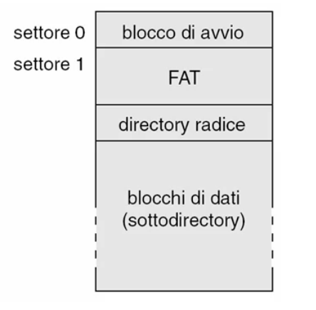
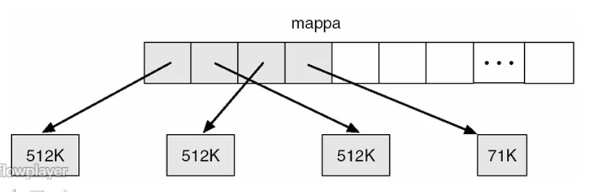
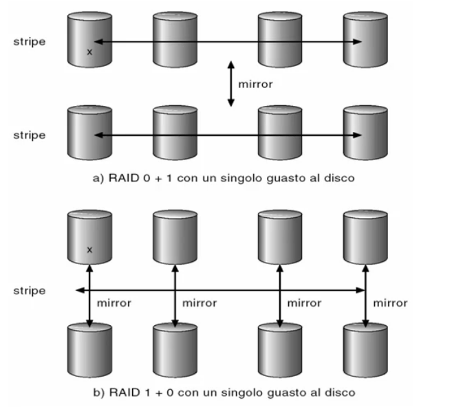

# Gestione dell'ingresso / uscita

## Sottosistemi di ingresso / uscita

### Struttura e funzioni dei sottosistemi di ingresso / uscita

#### Tipologie di periferiche
* Tastiera;
* Mouse e dispositivi di puntamento;
* Video;
* Stampanti;
* Dischi magnetici e ottici;
* Nastri magnetici;
* Rete informatica;
* Orologi e temporizzatori;
* ...

#### Caratteristiche delle periferiche
Il sistema operativo deve tener conto delle differenti caratteristiche delle periferiche per una corretta gestione delle stesse:
* Direzione I/O:
  * Sola lettura;                                       //CDROM
  * Sola scrittura;                                     //Controller grafico
  * Lettura e scrittura;                                //Disco
* Condivisione:
  * Dedicato (mutua esclusione con altri processi);     //Nastro, stampante
  * Condivisibile;
* Metodo di accesso:
  * Sequenziale;                                        //Nastro, modem
  * Diretto;                                            //CDROM, disco
* Modo di trasferimento dei dati:
  * A carattere;                                        //Terminale
  * A blocchi;                                          //Disco
* Schedulazione del trasferimento:
  * Sincrono (bloccante);                               //Nastro
  * Asincrono (non bloccante);                          //Tastiera
* Velocita' del dispositivo:
  * Latenza;
  * Tempo di ricerca;
  * Tempo di trasferimento;
  * Ritardo tra le operazioni.

#### Software di gestione delle periferiche
Il software di gestione delle periferiche deve tener conto di tutte le possibili caratteristiche delle periferiche e fornire:
* Un'interfaccia software unica ed omogenea che realizzi l'astrazione e la virtualizzazione di tutte le periferiche;
* Un alto grado di semplicita' di sviluppo di software senza conoscere nel dettaglio le periferiche connesse;
* La standardizzazione e un'omogeneizzazione della gestione;
* Strutturazione in 'strati' del software di gestione dell'I/O:
  * Strato di Gestione del canale di comunicazione;
  * Strato di Devide Dependent Driver;
  * Strato di Device Independent Driver; 

##### Gestione del canale di comunicazione
Lo strato ha come obiettivo rendere trasparente la gestione della connessione della periferica, quindi di "come" la connessione viene gestita. Cio' garantisce che le comunicazioni CPU-Periferica siano trasparenti.

E' possibile tramite:
* Una periferica mappata in memoria;
* Un'attesa attiva;
* Una gestione delle interruzioni;
* L'uso del DMA per effettuare il trasferimento di blocchi di dati.

##### Device Dependent Driver
Ha come obiettivo quello di rendere trasparenti le differenze tra i vari dispositivi della stessa tipologia:
* Modelli diversi;
* Produttori diversi;
* Trattamento degli errori.

Si occupa di omogeneizzare il linguaggio di comando e il trattamento di periferiche dello stesso tipo.

##### Device Independent Driver
Ha come scopo innalzare ulteriormente il livello di astrazione in modo tale da mostrare tutte le tipologie di periferiche allo stesso modo:
* Trattamento errori;
* Gestione;
* Bufferizzazione;
* Caching;
* Spooling.

---

### Realizzazione del sottosistema di I/O

#### Funzioni di gestione
##### Schedulazione operazioni
Per mantenere una gestione efficiente delle periferiche e' spesso opportuno ordinare le richieste provenienti dai vari processi in una coda. Questo consente di conservarle, ordinate, per eseguirle nel modo piu' opportuno massimizzando globalmente l'uso efficiente di risorse.

Le politiche di schedulazione possibili sono:
* FIFO;
* Priorita';
* Scadenza
* ...

##### Bufferizzazione
La bufferizzazione delle comunicazioni tra CPU e periferica ha come scopo quello di immagazzinare temporaneamente i dati che vengono trasferiti con una periferica.

L'obiettivo e' adattare le diverse velocita' di comunicazione tra sorgente e destinazione, affinche' non si debba perdere troppo tempo che una delle due sia pronta per effettuare il trasferimento.

L'idea e' di avere una porzione dedicata a buffer nella CPU per la periferica.
Il sistema si connettera' con la periferica e quando la CPU deve comunicare con al periferica, scrivera' nel buffer dedicato e sara' compito del sottosistema di I/O instradare i blocchi di dati verso la periferica. Al contrario il sistema di gestione delle periferiche consegnera' alla CPU i blocchi di dati che la periferica vuole inviare ad un determinato processo.

Quindi oltre che adattare le velocita' si adattano anche le dimensioni dei dati trasferiti.

La bufferizzazione supporta la semantica della copia: i dati trasferiti vengano 'fotografati' all'atto della richiesta di I/O e questi valori verranno trasferiti con la periferica, mentre il sistema puo' modificare senza ripercussioni le informazioni contenute in quelle strutture dati dei processi.

##### Caching
Il caching consente di conservare una copia dei dati letti da una periferica in una memoria veloce per un riuso rapido.

Si evitera' in questo modo di accedere a periferiche con tempi di caricamento lunghi per rileggere dei dati non cambiati dall'ultima lettura. Si riduce il tempo effettivo di accesso.

##### Spooling
Lo spooling ha come scopo bufferizzare l'output per una periferica in una memoria di massa opportuna detta *area di spooling*.

Esistono alcune periferiche che devono essere usate in modo condiviso o che sono molto lente, per le quali e' utile introdurre il meccanismo di spooling che provvede a separare completamente la richiesta di emissione di dati verso la periferica dall'effettiva emissione.

Il processo non vedra' direttamente la periferica, ma vedra' il sistema di spooling come il sistema a cui verra' demandata completamente la scrittura effettiva. L'operazione di scrittura verra' vista completata dal processo quando l'informazione da scrivere sulla periferica verra' memorizzata nell'area di spooling. Successivamente sara' il sistema operativo che prendera' i dati sull'area di spooling e li inviera' alla periferica.

##### Locking
Per periferiche che devono essere utilizzate in mutua esclusione dobbiamo usare il meccanismo di locking che consente di *prenotare* un dispositivo.

I processi verranno messi in una coda di attesa gestita secondo una politica opportuna e quando sara' il turno di un processo verra' posto nello stato di `Ready-to-Run` e la periferica gli verra' assegnato fin quando il processo non ne terminera' l'uso. A quel punto la periferica verra' rilasciata per poter essere assegnata ad altri processi presenti in coda o per altri processi che faranno una richiesta successivamente.

##### Gestione errori
All'interno della gestione I/O e' necessario riconoscere e trattare i guasti permanenti alle periferiche e gli eventuali malfunzionamenti transitori.

Nel caso di un malfunzionamento temporaneo a livello connessione periferica o internamente alla periferica stessa il sistema deve riconoscere che l'operazione non e' andata a buon fine tramite l'analisi delle informazioni di ritorno, trattando opportunamente il caso.
Ad esempio potra' ritentare la comunicazione con la periferica resettando la comunicazione o la periferica stessa.

Se il malfunzionamento persiste nonostante le riconfigurazioni, il guasto dovra' essere considerato permanente e trattato come tale.

#### Strutture dati

Nel sottosistema di gestione dell'I/O vengono create un'insieme di strutture dati a supporto delle varie operazioni. In particolare nella memoria centrale del kernel viene conservata una tabella di tutti i file aperti e di tutte le periferiche in uso in modo tale da poter sapere quli risorse sono in uso e quali sono le operazioni relative che il sistema puo' utilizzare.

Per ogni file e risorsa in uso verranno individuate le operazioni lecite e i puntatori specifici a procedure di sistema operativo che realizzano le suddette operazioni.

Nello spazio dell'utente verranno conservate le informazioni specifiche dell'utente in modo tale che ogni processo possa conservare la propria versione indipendentemente dal fatto che due processi stiamo usando la stessa risorsa in modo condiviso.

#### Realizzazione di una richiesta di I/O

#### Prestazioni dell'I/O
La gestione dell'I/O e' il fattore di maggiore importanza per le prestazioni di un sistema:
* Eseguire driver;
* Schedulare i processi;
* Cambi di contesto dovuti agli interrupt;
* Copia dei dati.

Per migliorare le prestazioni possiamo:
* Ridurre i cambiamenti di contesto;
* Ridurre la copiatura dei dati;
* Ridurre la frequenza di interrupt;
* Aumentare la concorrenza;
* Gestire le periferiche a livello piu' basso;
* Equilibrare le prestazioni di sistema.

---

## Gestione delle memorie di massa
Su una gestione efficiente delle memorie di massa si basano:
* La virtualizzazione del processore;
* La virtualizzazione della memoria centrale.

### Schedulazione degli accessi al disco
#### Tempo di accesso al disco
Il tempo di accesso al disco **Access Time** indica il tempo necessario per effettuare l'operazione di accesso ai dati posti sul disco ed e' composto da:
* **Seek Time**: il tempo di ricerca per l'individuazione dei dati all'interno del disco;
* **Rotational Latency**: la latenza di rotazione, ossia il tempo necessario affinche' i dati si presentino sotto le testine di lettura/scrittura.

#### Larghezza di banda
La larghezza di banda **Bandwith** e' la capacita' di trasferimento dei dati sul disco ed e' misurata con:
> numero byte trasferiti / tempo totale trasferimento

#### Obiettivi
Gli obiettivi di una gestione efficiente delle memoria di massa sono:
* Ridurre al minimo i tempi di accesso;
* Ampliare al massimo la larghezza di banda.

Le tecniche di schedulazione degli accessi al disco aiutano a migliorare i due parametri di cui sopra, ordinando le richieste d'accesso in modo opportuno.

#### Algoritmi di schedulazione degli accessi

##### First Come / First Served - FCFS
Le richieste vengono tenute nella coda di attesa nell'ordine in cui arrivano, e secondo tale ordine verranno servite: prima la richiesta piu' vecchia.

Se nella coda esistono richieste che, in maniera alternata, vogliono accedere a dati posti su cilindri distanti tra loro, il percorso della testina sul disco avra' un comportamento 'a zigzag' che rende particolarmente alta la latenza d'accesso (data dalla somma degli spostamenti cilindro-cilindro).

##### Shortest Seek Time First - SSTF
Si effettuano le richieste di accesso al disco in modo da servire prima quelle che richiedono il tempo d'accesso minore.

Secondo questa strategia la testina avra' un percorso ottimo.

##### Scansione - Algoritmo dell'ascensore - SCAN
Poiche' e' sconsigliato effettuare confronti locali per decidere quale richiesta e' la piu' vicina tra quelle accodate: l'algoritmo dell'ascensore rappresenta un'alternativa valida.

Le richieste verranno tenute ordinate nella coda e verranno servite, di volta in volta, le richieste che verranno trovate lungo il percorso, assumento che la testina semplicemente si sposti da un'estremo all'altro del disco.

##### Circula Scan - CSCAN
Nella schedulazione a scansione quando si arriva vicino al cilindro 0 (o quello piu' elevato), l'invertire la direzione di marcia sul disco porta a ripassare immediatamente sui cilindri che si erano passati poco prima. Le richieste pendenti invece saranno probabilmente interessate ai dati posti all'altro estremo del disco.

La variante circular scan consiste nel 'saltare' all'altra parte del disco una volta raggiunto il suo estremo senza effettuare alcuna lettura (effetto pacman).

Il tempo di attesa delle varie richieste risulta piu' uniforme, anche se costa di piu' in scansione del disco poiche' la testina verra' spostata senza fare operazioni di accesso.

##### Ricerca - LOOK
Si tratta di un'ottimizzazione al CSCAN per cui l'accesso per la richiesta con cilindro minimo o massimo avverra' tramite un 'salto' ma senza avere il vincolo di raggiungere gli estremi assoluti dei cilindri del disco. Si terra' conto principalmente della 'direzione' di scansione

#### Selezione dell'algoritmo di schedulazione
La selezione risulta critica per garantire delle buone prestazioni per la gestione dei dischi. I Device Independent Driver dovranno farsi carico di una gestione ottimale per il tipo di applicazioni e il tipo di disco che si sta considerando.

Le prestazioni dipendono dal numero e dai tipi delle richieste, le quali sono fortemente influenzate dai metodi di allocazione dei blocchi sul disco ai vari file.

E' bene porre l'algoritmo di schedulazione in un modulo separato per poter essere facilmente sostituibile con una procedura differente e adattarlo alle esigenze di gestione.

Gli algoritmi SSTF e LOOK sono indicati come predefiniti.

---

### Organizzazione del disco

#### Configurazione del disco
Per configurare un disco e' sono necessari 3 step:
* Formattazione fisica;
* Partizionamento;
* Formattazione logica di ciascuna partizione.

##### Formattazione fisica
Si tratta di una **formattazione a basso livello** durante la quale il disco viene suddiviso in **settori** che il controller del disco puo' leggere e scrivere.
Ogni settore e' composto da:
* Header;
* Zona dati;
* Terminatore.

Nel terminatore viene posto il *checksum* per verificare la possibile presenza di errori di memorizzazione relativi alla zona dati ed eventualmente per correggerli.

##### Partizionamento
Il partizionamento suddivide il disco in **porzioni** gestite separatamente come dischi logici dal punto di vista del sistema operativo. Un disco puo' contenere una sola partizione. 

##### Formattazione logica di ciascuna partizione
Detta anche **formattazione ad alto livello**, permette di **creare il filesystem** all'interno della partizione e quindi di fare accesso *logici* alla memoria del disco.

Alternativamente una partizione puo' essere formattata come *raw disk* come nel caso delle aree di swap.

#### Blocco di avvio
Il disco viene strutturato con un blocco specifico di avvio ed un insieme di blocchi successivi.

Il blocco di avvio (boot block) contiene il sistema od una sua parte (tipicamente un caricatore che provvedera' poi a caricare il resto del sistema operativo).

Nel settore successivo esisteranno le informazioni essenziali sulla organizzazione del disco, dove reperire i vari blocchi concatenati che costituiscono i file memorizzati nel disco.

#### Blocchi difettosi
Il disco puo' contenere dei blocchi difettosi (bad block), che non riescono a conservare correttamente la memorizzazione delle informazioni desiderate.

Questi bad blocks vengono rimossi durante la formattazione logica attraverso una gestione manuale.

Alternativamente e' possibile utilizzare delle tecniche di sostituzione dei settori guasti:
* In modo automatico durante la formattazione;
* Tramite sector sparing: vengono conservati un insieme di blocchi non assegnati all'uso normale del disco, per cui durante la formattazione logica, se viene reperito un bad block, questo viene sostituito da uno dei blocchi conservati come *spare*;
* Tramite sector forwarding: i blocchi di riserva vengono posti tutti in fondo, dunque durante la formattazione si saltano i bad blocks spostando tutto il disco verso la parte di riserva;
* Tramite sector slipping: si spostano porzioni di disco in blocco.

#### Gestione dell'area di swap
L'area di swap e' un'area tipicamente gestita come *raw disk* per supportare la multiprogrammazione e rappresenta la memoria virtuale del sistema. Contiene:
* Interi processi (per sistemi operativi con solo swapping);
* Pagine del processo (per sistemi operativi con paginazione);
* Segmenti di processo (per sistemi operativi con segmentazione).

La locazione dell'area di swap inficia le performance della stessa:
* Partizione dedicata gestita in modo grezzo: accesso estremamente rapido a carico del gestore della memoria virtuale che terra' una mappa delle posizioni dei processi;
* File il cui accesso viene regolato dal filesystem: il gestore della memoria virtuale dovra' operare attraverso tutte le funzioni di gestione del filesystem, dunque sara' molto piu' lento.

La dimensione dell'area di swap e' fissa in caso di gestione come raw disk, mentre invece e' dinamica sul filesystem.

L'area di swap viene strutturata con una mappa e i blocchi dell'area stessa.
La **mappa** definisce l'ordine con cui i blocchi devono essere considerati per creare lo spazio di indirizzamento del processo. Nella mappa si trovano gli indici che individuano i blocchi all'interno del disco che verranno letti nell'ordine definito dalla mappa (cio' consente, eventualmente, di avere blocchi di dimensione diversa).

---

### Dischi RAID
RAID sta per *Redundant Array of Inexpensive Disks*. 

I gruppi di dischi fisici vengono gestiti in modo integrato al fine di apparire come un unico disco con caratteristiche migliori dal punto di vista della tolleranza ai guasti e delle prestazioni.

#### Obiettivi
##### Costi
Ridurre il costo di grosse capacita' di memoria di massa assemblando dischi piccoli ma a basso costo.

##### Ridondanza
Si vuole migliorare l'affidabilita' globale tramite:
* Replicazione completa dei dati;
* Informazioni ridondanti per correzione errori;
* Codici per correzione errori.

##### Mean Time To/Between Failure - MTTF/MTBF
Si vuole migliorare il parametro MTBF per ridurre:
* Tempo medio al guasto dei singoli dischi;
* Tempo medio di riparazione;
* Tempo medio alla perdita dei dati.

##### Parallelismo
Si vuole migliorare il parallelismo negli accessi per aumentare le prestazioni del sistema complessivo tramite la **distribuzione** dell'accesso al singolo file memorizzato sull'insieme dei dischi in modo tale che i vari dischi operino contemporaneamente sullo stesso file. Tale parallelismo permette di fornire globalmente una quantita' di dati maggiore nell'unita' di tempo.

La tecnica utilizzata e' il **data striping**, che puo' essere effettuato in modalita':
* Bit-level striping;
* Block-level striping.

#### Livelli RAID
[RAID LEVELS](https://en.wikipedia.org/wiki/Standard_RAID_levels)

[NESTED RAID LEVELS](https://en.wikipedia.org/wiki/Nested_RAID_levels)

##### RAID 0
Distribuzione non ridondante tramite striping aumentando parallelismo e velocita'.

Il file visto come sequenza di elementi omogenei viene suddiviso in porzioni che verranno memorizzati in maniera distribuita all'interno dei dischi (es. una porzione per disco).

Questo consente di leggere il primo record logico di ogni porzione in parallelo sugli *n* dischi.

##### RAID 1
Duplicazione dei dischi tramite mirroring garantendo tolleranza ai guasti.

Crea una copia identica di tutte le informazioni presenti nel disco da duplicare con il 100% di ridondanza fisica.

##### RAID 2
Codici per la correzione di errori (ECC - Error Correcting Codes) in grado di rilevare e correggere gli errori.

La ridondanza fisica e' ridotta rispetto il RAID 1 e gli accessi non sono paralleli, dunque le prestazioni sono piu' basse rispetto allo striping del RAID 0.

##### RAID 3
Parita' a bit alternati (Bit-interleaved parity).

Prevede l'uso di un bit di parita' che viene memorizzato su un disco aggiuntivo. 
Questo bit viene calcolato a partire dai bit memorizzati nelle posizioni corrispondenti degli altri dischi.

In caso di guasto di uno dei dischi si puo' ricostruire il valore dei bit persi andando ad utilizzare i bit di parita'.
L'accesso alle informazioni viene limitato in velocita' in quanto si deve sempre accedere al disco di parita' per il controllo degli errori. Il disco di parita' e' dunque un bottleneck.

##### RAID 4
Parita' a blocchi alternati (Block-interleaved parity)

Prevede l'uso di blocchi di parita' memorizzati su un disco aggiuntivo.

##### RAID 5
Parita' distribuita a blocchi alternati (block-interleaved distributed parity)

Prevede l'uso di blocchi di parita' memorizzati sui dischi che contengono le informazioni, spezzando il contenuto del disco di parita' del RAID 4.

Cio' consente di migliorare il parallelismo nelle operazioni.

##### RAID 6
Ridondanza P+Q (P+Q Redundancy)

Cerca di migliorare la tolleranza a guasti multipli andando ad utilizzare opportune tecniche di codifica.

##### RAID 0+1 e RAID 1+0

---

### Memoria terziaria

#### Obiettivi
La memoria terziaria serve per estendere lo spazio messo a disposizione dalla memoria di massa e contenere grandissime quantita' di informazioni.

A tale fine, invece di utilizzare dei dispositivi permanentemente connessi al sistema, si utilizzano supporti di memoria che siano rimovibili, connessi solo quando necessario. Dunque la frequenza di accesso alle informazioni e' basso.

Il costo deve essere basso.

#### Periferiche di archiviazione terziaria
* Dischi rimovibili:
  * Dischetti;
  * Dischi magnetici;
  * Dischi ottici;
  * Dischi a cambiamento di fase;
* Nastri magnetici;
* Memorizzazione olografica;
* Sistemi meccanici microelettronici.

Le caratteristiche principali che devono avere questi supporti hardware sono:
* Velocita':
  * Larghezza di banda;
  * Latenza di accesso;
* Affidabilita';
* Basso costo.

#### Gestione della memoria terziaria
Per la gestione della memoria terziara dobbiamo occuparci di:
* Gestire il dispositivo fisico;
* Ottenere un'astrazione virtuale dei dispotivi connessi.

I dischi rimovibili possono essere mostrati come *raw disk* oppure strutturare il disco con file system. Questi dispositivi possono essere condivisi tra diversi processi durante il periodo in cui sono **montati** al sistema. L'accesso alle informazioni e' tipicamente **diretto** oppure puo' essere **sequenziale**.

Con i nastri magnetici abbiamo la possibilita' di realizzare una gestione dell'accesso come un *raw disk* semplicemente ponendo un file dopo l'altro sul dispositivo. In questo caso l'uso e' esclusivamente assegnato ad un processo alla volta e l'accesso e' necessariamente **sequenziale** per la natura del supporto magnetico.

La grande difficolta' della gestione della memoria terziaria e' la denominazione dei file: ossia come andare ad identificare all'interno dei supporti il singolo file in modo univoco. 

Questo problema nasce dalla proprieta' di *portabilita''* del supporto.
Attualmente manca ancora un soluzione omogenea che permetta la portabilita' del file system contenuto all'interno del supporto rimovibile, dunque diventa difficile garantire la riusabilita' delle informazioni contenute nel file system del disco in ambiti eterogenei.

La denominazione univoca dei file e' delegata all'interpretazione dell'applicativo e dell'utente anche se esistono alcuni standard di modalita' di archiviazione all'interno dei dispositivi.

Un modo di realizzare l'astrazione in questi sistemi e' la gestione gerarchica della memoria (*Hierarchical Storage Management*).
Viene estesa la gerarchia di memorizzazione per incorporare la memorizzazione terziara estendendo il file system.
Si ottiene dunque una univoca denominazione all'interno dell'unico file system globale indicizzato dal sistema di elaborazione.