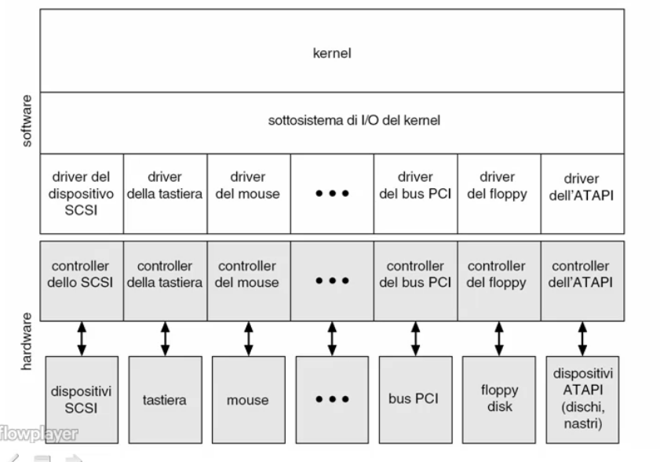
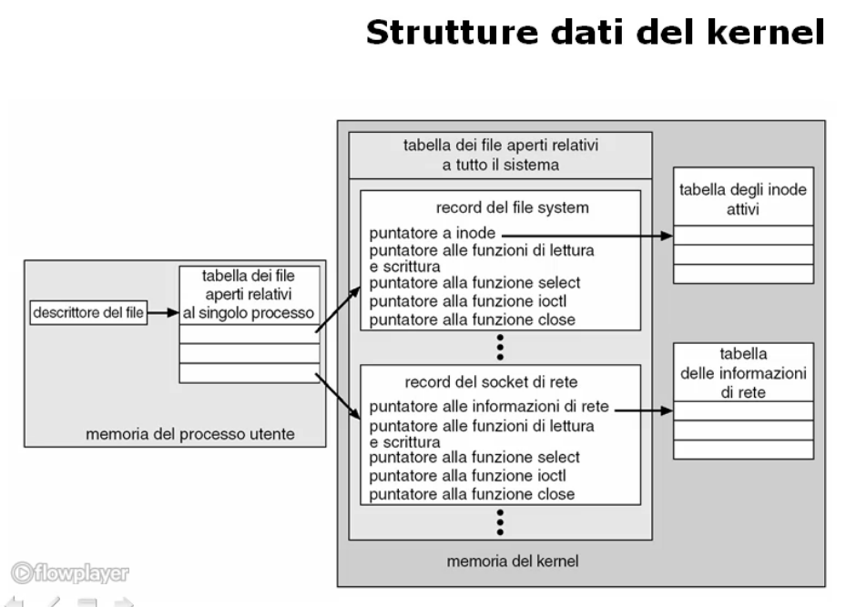
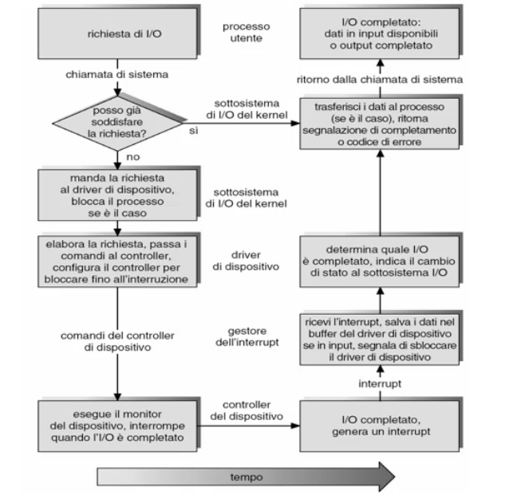

# Gestione dell'ingresso / uscita

## Sottosistemi di ingresso / uscita

### Struttura e funzioni dei sottosistemi di ingresso / uscita

#### Tipologie di periferiche
* Tastiera;
* Mouse e dispositivi di puntamento;
* Video;
* Stampanti;
* Dischi magnetici e ottici;
* Nastri magnetici;
* Rete informatica;
* Orologi e temporizzatori;
* ...

#### Caratteristiche delle periferiche
Il sistema operativo deve tener conto delle differenti caratteristiche delle periferiche per una corretta gestione delle stesse:
* Direzione I/O:
  * Sola lettura;                                       //CDROM
  * Sola scrittura;                                     //Controller grafico
  * Lettura e scrittura;                                //Disco
* Condivisione:
  * Dedicato (mutua esclusione con altri processi);     //Nastro, stampante
  * Condivisibile;
* Metodo di accesso:
  * Sequenziale;                                        //Nastro, modem
  * Diretto;                                            //CDROM, disco
* Modo di trasferimento dei dati:
  * A carattere;                                        //Terminale
  * A blocchi;                                          //Disco
* Schedulazione del trasferimento:
  * Sincrono (bloccante);                               //Nastro
  * Asincrono (non bloccante);                          //Tastiera
* Velocita' del dispositivo:
  * Latenza;
  * Tempo di ricerca;
  * Tempo di trasferimento;
  * Ritardo tra le operazioni.

#### Software di gestione delle periferiche
Il software di gestione delle periferiche deve tener conto di tutte le possibili caratteristiche delle periferiche e fornire:
* Un'interfaccia software unica ed omogenea che realizzi l'astrazione e la virtualizzazione di tutte le periferiche;
* Un alto grado di semplicita' di sviluppo di software senza conoscere nel dettaglio le periferiche connesse;
* La standardizzazione e un'omogeneizzazione della gestione;
* Strutturazione in 'strati' del software di gestione dell'I/O:
  * Strato di Gestione del canale di comunicazione;
  * Strato di Devide Dependent Driver;
  * Strato di Device Independent Driver; 

##### Gestione del canale di comunicazione
Lo strato ha come obiettivo rendere trasparente la gestione della connessione della periferica, quindi di "come" la connessione viene gestita. Cio' garantisce che le comunicazioni CPU-Periferica siano trasparenti.

E' possibile tramite:
* Una periferica mappata in memoria;
* Un'attesa attiva;
* Una gestione delle interruzioni;
* L'uso del DMA per effettuare il trasferimento di blocchi di dati.

##### Device Dependent Driver
Ha come obiettivo quello di rendere trasparenti le differenze tra i vari dispositivi della stessa tipologia:
* Modelli diversi;
* Produttori diversi;
* Trattamento degli errori.

Si occupa di omogeneizzare il linguaggio di comando e il trattamento di periferiche dello stesso tipo.

##### Device Independent Driver
Ha come scopo innalzare ulteriormente il livello di astrazione in modo tale da mostrare tutte le tipologie di periferiche allo stesso modo:
* Trattamento errori;
* Gestione;
* Bufferizzazione;
* Caching;
* Spooling.

---

### Realizzazione del sottosistema di I/O

#### Funzioni di gestione
##### Schedulazione operazioni
Per mantenere una gestione efficiente delle periferiche e' spesso opportuno ordinare le richieste provenienti dai vari processi in una coda. Questo consente di conservarle, ordinate, per eseguirle nel modo piu' opportuno massimizzando globalmente l'uso efficiente di risorse.

Le politiche di schedulazione possibili sono:
* FIFO;
* Priorita';
* Scadenza
* ...

##### Bufferizzazione
La bufferizzazione delle comunicazioni tra CPU e periferica ha come scopo quello di immagazzinare temporaneamente i dati che vengono trasferiti con una periferica.

L'obiettivo e' adattare le diverse velocita' di comunicazione tra sorgente e destinazione, affinche' non si debba perdere troppo tempo che una delle due sia pronta per effettuare il trasferimento.

L'idea e' di avere una porzione dedicata a buffer nella CPU per la periferica.
Il sistema si connettera' con la periferica e quando la CPU deve comunicare con al periferica, scrivera' nel buffer dedicato e sara' compito del sottosistema di I/O instradare i blocchi di dati verso la periferica. Al contrario il sistema di gestione delle periferiche consegnera' alla CPU i blocchi di dati che la periferica vuole inviare ad un determinato processo.

Quindi oltre che adattare le velocita' si adattano anche le dimensioni dei dati trasferiti.

La bufferizzazione supporta la semantica della copia: i dati trasferiti vengano 'fotografati' all'atto della richiesta di I/O e questi valori verranno trasferiti con la periferica, mentre il sistema puo' modificare senza ripercussioni le informazioni contenute in quelle strutture dati dei processi.

##### Caching
Il caching consente di conservare una copia dei dati letti da una periferica in una memoria veloce per un riuso rapido.

Si evitera' in questo modo di accedere a periferiche con tempi di caricamento lunghi per rileggere dei dati non cambiati dall'ultima lettura. Si riduce il tempo effettivo di accesso.

##### Spooling
Lo spooling ha come scopo bufferizzare l'output per una periferica in una memoria di massa opportuna detta *area di spooling*.

Esistono alcune periferiche che devono essere usate in modo condiviso o che sono molto lente, per le quali e' utile introdurre il meccanismo di spooling che provvede a separare completamente la richiesta di emissione di dati verso la periferica dall'effettiva emissione.

Il processo non vedra' direttamente la periferica, ma vedra' il sistema di spooling come il sistema a cui verra' demandata completamente la scrittura effettiva. L'operazione di scrittura verra' vista completata dal processo quando l'informazione da scrivere sulla periferica verra' memorizzata nell'area di spooling. Successivamente sara' il sistema operativo che prendera' i dati sull'area di spooling e li inviera' alla periferica.

##### Locking
Per periferiche che devono essere utilizzate in mutua esclusione dobbiamo usare il meccanismo di locking che consente di *prenotare* un dispositivo.

I processi verranno messi in una coda di attesa gestita secondo una politica opportuna e quando sara' il turno di un processo verra' posto nello stato di `Ready-to-Run` e la periferica gli verra' assegnato fin quando il processo non ne terminera' l'uso. A quel punto la periferica verra' rilasciata per poter essere assegnata ad altri processi presenti in coda o per altri processi che faranno una richiesta successivamente.

##### Gestione errori
All'interno della gestione I/O e' necessario riconoscere e trattare i guasti permanenti alle periferiche e gli eventuali malfunzionamenti transitori.

Nel caso di un malfunzionamento temporaneo a livello connessione periferica o internamente alla periferica stessa il sistema deve riconoscere che l'operazione non e' andata a buon fine tramite l'analisi delle informazioni di ritorno, trattando opportunamente il caso.
Ad esempio potra' ritentare la comunicazione con la periferica resettando la comunicazione o la periferica stessa.

Se il malfunzionamento persiste nonostante le riconfigurazioni, il guasto dovra' essere considerato permanente e trattato come tale.

#### Strutture dati

Nel sottosistema di gestione dell'I/O vengono create un'insieme di strutture dati a supporto delle varie operazioni. In particolare nella memoria centrale del kernel viene conservata una tabella di tutti i file aperti e di tutte le periferiche in uso in modo tale da poter sapere quli risorse sono in uso e quali sono le operazioni relative che il sistema puo' utilizzare.

Per ogni file e risorsa in uso verranno individuate le operazioni lecite e i puntatori specifici a procedure di sistema operativo che realizzano le suddette operazioni.

Nello spazio dell'utente verranno conservate le informazioni specifiche dell'utente in modo tale che ogni processo possa conservare la propria versione indipendentemente dal fatto che due processi stiamo usando la stessa risorsa in modo condiviso.

#### Realizzazione di una richiesta di I/O

#### Prestazioni dell'I/O
La gestione dell'I/O e' il fattore di maggiore importanza per le prestazioni di un sistema:
* Eseguire driver;
* Schedulare i processi;
* Cambi di contesto dovuti agli interrupt;
* Copia dei dati.

Per migliorare le prestazioni possiamo:
* Ridurre i cambiamenti di contesto;
* Ridurre la copiatura dei dati;
* Ridurre la frequenza di interrupt;
* Aumentare la concorrenza;
* Gestire le periferiche a livello piu' basso;
* Equilibrare le prestazioni di sistema.
