# File system

## Interfaccia del file system

### File e le loro caratteristiche

#### File system
Il file system e' l'astrazione delle informazioni nei dispositivi fisici. Si tratta di una visione logica dei dispositivi fisici di memorizzazione e di trasferimento di informazioni.

L'obiettivo e' dare una visione omogenea dei dispositivi e delle informazioni in modo tale che possano essere reperite per posizione logica al loro interno.

Il file system fornisce anche il supporto per la memorizzazione a lungo termine e il trasferimento delle informazioni.

Consiste nella collezione e gestione di:
* Informazioni (dati, programmi): file;
* Metainformazioni (metadati): directory

#### Aggregazione di informazioni
Quando si desidera aggregare delle informazioni esistono diversi costruttori su cui ci si puo' appoggiare:
* Array: N elementi omogenei (tutti dello stesso tipo) che vengono memorizzati in un'unica struttura dati di dimensione nota a priori;
* Record: K elementi eventualmente disomogenei (ogni elemento costituira' un *campo* del record e conterra' inforamzioni di tipo differente) che vengono memorizzati in una struttura dati con numero di campi e tipi noti a priori.

#### Concetto di file
Il file e' un costruttore per contenere elementi omogenei (tutti dello stesso tipo) tramite una struttura dati di dimensione non nota a priori.

#### Tipi di file
Il tipo delle informazioni memorizzate puo' essere diverso, tipicamente dati o programmi. 

Il tipo base del dato puo' essere:
* Numerico;
* Alfabetico;
* Binario;
* Carattere;
* Byte;
* ...

I file che contengono programmi vengono identificati tramite un'estensione del nome a seconda della tipologia:
* Eseguibili -> .exe, .com, .bin;
* Oggetto -> .obj, .o;
* Codice sorgente -> .c, .cc, .java, .go;
* Batch -> .bat, .sh;
* Testo;
* Elaborazione testi;
* Libreria;
* Grafico;
* Archivio;
* Multimedia;

#### Struttura dei file
Il file avra' una struttura differente a seconda del tipo di informazione che si va a contenere:
* Nessuna:
  * Sequenza di parole o byte;
* Struttura semplice:
  * Linee a lunghezza fissa o variabile;
* Struttura complessa:
  * Documento formattato;
  * File caricabile rilocabile.

#### Attributi
Un file puo' essere caratterizzato da diverse informazioni che permettono di supportare un uso semplice ed efficiente, queste informazioni sono dette attributi, che costituiscono il **descrittore**.

A seconda del sistema operativo si possono individuare diversi attributi, ad esempio:
* Nome;
* Identificatore all'interno del sistema;
* Tipo (ossia il contenuto);
* Locazione fisica in memoria di massa;
* Dimensione;
* Data di creazione;
* Data di ultiumo accesso;
* Proprietario;
* Protezione;
* Formato;
* ...

#### Operazioni
Su un file sono ammissibili diverse operazioni:
* Creazione;
* Scrittura;
* Lettura;
* Riposizionamento;
* Cancellazione;
* Troncamento;
* Accodamento;
* Modifica di attributi;
* Blocco per l'uso condiviso;
* ...

#### Uso del file
L'**apertura** di un file consiste in:
* Verificare le autorizzazioni all'accesso;
* Identificare il descrittore del file nel file system per reperire le informazioni per iniziare la gestione;
* Identificazione del file all'interno dei dispositivi fisici;
* Verificare e gestire lo stato in uso condiviso;
* Inizializzare le informazioni per una efficiente gestione (tabella dei file aperti).

Quando il file e' stato aperto sono state inizializzate le informazioni per l'ambiente per poter accedere alle informazioni memorizzate ai singoli elementi logici che costituiscono il file. Ciscun element logico nel file avra' una sua posizione (identificata da un numero che parte da 0). La posizione in cui si trova un elemento viene utilizzata per effettuare la sua **lettura e scrittura**:
* L'elemento che deve essere letto o scritto e' l'elemento corrente;
* Il sistema gestisce il puntatore all'elemento corrente per far si' che lettura e scrittura possano procedere implicitamente (sapendo sempre quale sara' l'elemento da leggere o da scrivere).

Per accedere al file in lettura o scrittura viene utilizzata la tabella dei file aperti per reperire:
* La posizione dei componenti del file nei dispositivi fisici;
* Il puntatore al file per identificare l'elemento correntemente in suo;
* Il blocco per l'accesso condiviso.

Al termine dell'uso del file, l'operazione di **chiusura** del file permette di:
* Aggiornare tutte le informazioni di gestione;
* Rilasciare l'uso condiviso;
* Cancellare le informazioni di gestione nella tabella dei file aperti.

#### Metodo di accesso
L'accesso agli elementi di un file puo' essere diverso a seconda delle caratteristiche del sistema operativo e dei dispositivi fisici in cui i file vengono memorizzati.

##### Accesso sequenziale
L'accesso parte dal primo elemento del file fino a giungere all'ultimo.
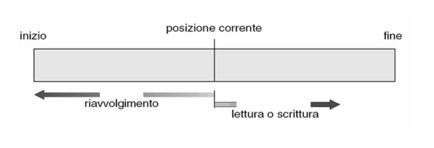

Per ritornare all'inizio e' necessario riavvolgere il file fino all'inizio per poter eseguire le operazioni di scansione sequenziale.
Se si desidera accedere ad un elemento all'interno del file, precedente alla posizone corrente, e' necessario riavvolgere il file fino all'inzio e procedere fino ad individuare l'elemento desiderato.

Questa e' la tecnica tipica utilizzata per i nastri magnetici.

##### Accesso diretto
I dischi sono suddivisi in tracce e settori, dunque il sistema accedera' direttamente alla memoria di massa tramite le coordinate fisiche di traccia e settore.

##### Accesso indicizzato
Tipico di grossi file di basi di dati in cui l'accesso alle informazioni effettive sarebbe poco efficiente se effettuato direttamente.
Il reperimento delle informazioni desiderate sarebbe poco efficiente se fosse effettuato andando a scandire gli elementi direttamente all'interno del file.

Viene invece costruito un indice, che suddividera' le informazioni all'interno del file in porzioni rappresentate in modo sintetico da un elemento dell'indice. L'analisi viene dunque fatta in prima battuta sull'indice e quando si trova una corrispondenza per il gruppo di informazioni di interesse si andra' a reperire quale e' la porzione del file dove risiede l'informazione desiderata ed infine i si effettua l'accesso in tale zona per il reperimento.

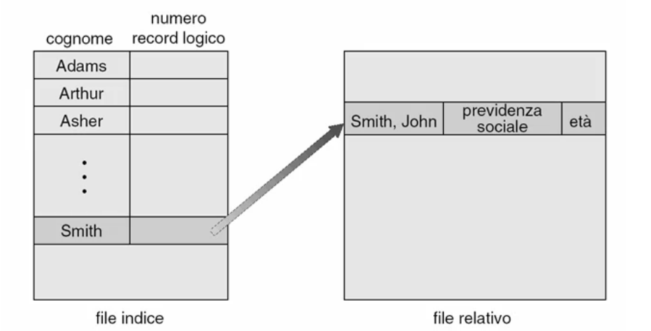

Questa metodologia d'accesso puo' essere utilizzata anche per conservare in modo compatto una porzione delle informazioni lasciando tutti i dettagli sulle informazioni associate all'elemento desiderato all'interno del file dati vero e proprio. La ricerca verra' fatta all'interno del file indice, e trovato l'elemento desiderato, si troveranno tutti i dati ad esso associati andando ad identificare la posizione fisica all'interno del file di dati nel file indice.

---

### Direttori e le loro caratteristiche

#### Concetto di direttorio
Il direttorio o directory e' una struttura logica che ha l'obiettivo di:
* Supportare il raggruppamento dei file in base a criteri logici;
* Supportare la gestione efficiente dell'accesso ai file;
* Supportare la condivisione e la protezione dei file; 

Sostanzialmente si tratta di una collezione omogenea di informazioni (attributi) su gruppi di file. Per ogni file viene identificato l'insieme di informazioni che si vogliono collezionare che e' costituito dal descrittore dei file.

Quindi si puo' identificare il direttorio come un file, dove il tipo base e' il descrittore di un file.

#### Operazioni sui direttori
Le operazioni sui direttori si distinguono in due tipologie:
* Su file:
  * Creazione;
  * Cancellazione;
  * Ridenominazione;
  * Modifiche degli attributi;
  * ...
* Su direttori:
  * Individuare la posizione logica di un file nel file system;
  * Elencare file;
  * Ricercare file;
  * ...


#### Struttura del file system
Un file system puo' essere strutturato in vari modi:
* A singolo livello;
* A due livelli;
* Ad albero;
* A grafo aciclico;
* A grafo generale.

##### Direttorio a singolo livello
Si tratta del modo piu' semplice di strutturare il file system. Su un disco viene posto un unico direttorio che contiene tutti i descrittori ai file posti su quel disco.

E' una soluzione che veniva adottata sui vecchi sistemi mono-utente che avevano una memoria di massa molto ristretta. I problemi di questo file system erano:
* Gestione delle omonimie;
* Ridenominazione;
* Raggruppamento.

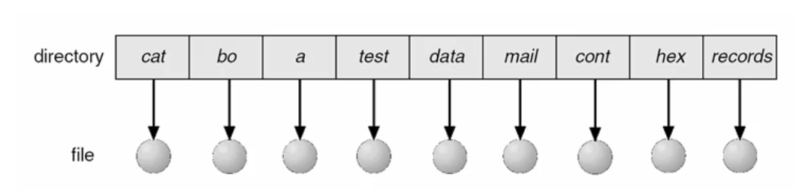

##### Direttorio a due livelli
Per i piccoli sistemi multi-utente (ormai superati) fu introdotto il file system a due livelli:
* Le directory a livello piu' alto contengono i riferimenti all'insieme dei file dei singoli utenti;
* Le directory a livello piu' basso contengono i file.

Caratteristiche:
* Si ha una gestione parziale dell'omonimia (solo tra utenti diversi);
* La ricerca e' piu' efficiente (in quanto e' per utente);
* Non c'e' la possibilita' di raggruppare in modo logico i file;
* I file non possono essere condivisi tra utenti, a meno di replica.

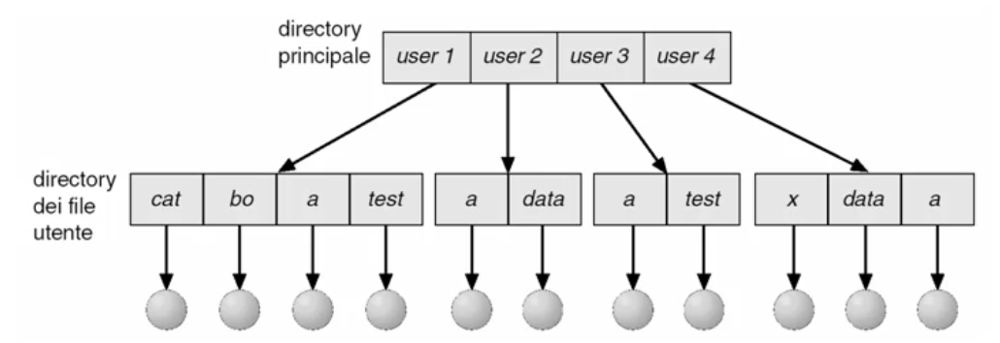

##### Visione logica del file system
Nei sistemi operativi moderni si vuole ottenere la possibilita' di avere una visione logica del file system: poter raggruppare i file in modo logico per l'insieme degli utenti considerati.

##### Direttorio ad albero
Con una struttura ad albero si ottiene:
* Gestione adatta per i sistemi multi-utente;
* Ricerca efficiente in modo logico;
* Capacita' di raggruppamento in base alle esigenze degli utenti;
* Capacita' di condivisione di file;
* Rilocazione dell'insieme dei file in cui si opera con il concetto di *direttorio corrente*:
  * Percorso relativo;
  * Percorso assoluto.

##### Direttorio a grafo aciclico
E' possibile generalizzare la struttura ad albero introducendo un grafo aciclico per la condivisione di file e direttori.

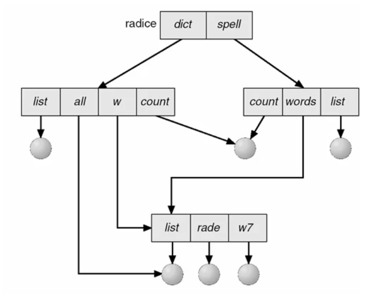

##### Direttorio a grafo generale
Con i dovuti accorgimenti e' possibile consentire i cicli all'interno del file system disposto a grafo.
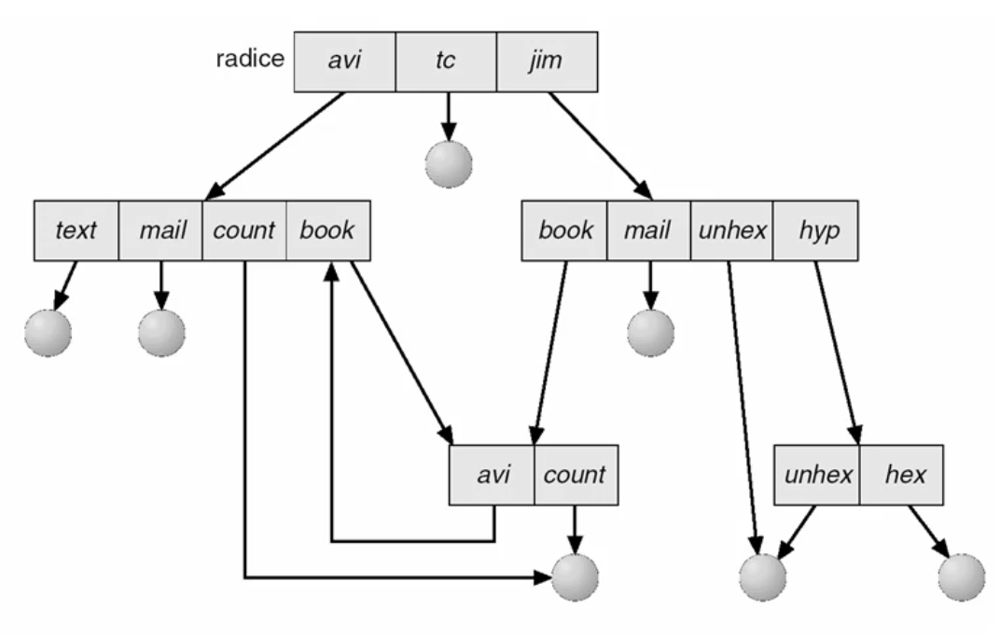


#### Memorie di massa a dischi multipli
Una memoria di massa puo' essere costituita da piu' dischi. In questo caso si ha, all'interno di ciascun disco, una struttura del file system organizzata.

L'insieme delle memorie di massa viene visto individualmente organizzato come un file system, le cui strutture sono sperate tra loro.

Sara' l'utente che dovra' sapere se il file desiderato si trova in un disco piuttosto che in un altro.

Il reperimento logico avviene quindi solo all'interno del singolo disco.

#### Memorie di massa con grossi dischi
Quando si hanno delle memorie massa con grossi dischi diventa difficle gestire tali dischi come un'unica entita'. Spesso si suddivide il disco in **partizioni** per poter gestire ciascuna partizione in modo piu' semplice ed efficiente.

#### Partizioni
La partizione e' l'astrazione del dispositivo fisico in memoria di massa.

Su un disco posso avere una o piu' partizioni.
Su piu' dischi posso avere una o piu' partizioni distribuite.

Su ciascuna partizione verra' creato il proprio file system.

Nel caso di una partizione distribuita su piu' dischi vedremo un unico file system per l'insieme dei dischi che costituiscono tale partizione.

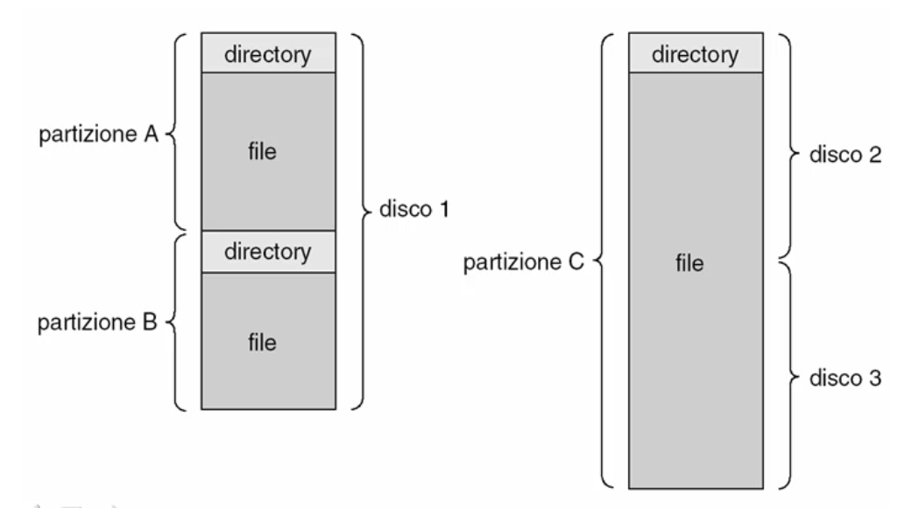

#### Montaggio del file system
All'interno del sistema di elaborazione vogliamo vedere un'unica struttura del file system indipendentemente da quanti dischi logici o partizioni abbimao nel sistema.

Una volta identificato il file system primario su cui montare altre partizioni, si scegliera' un file che verra' associato come **radice** del file system che si va a montare.

In questo modo la radice del file system primario diventa la radice di tutto il file system.

Quando si cerchera' di accedere su un file contenuto del disco dove riesiede il file system primario si seguira' un percorso nel disco che portera' a raggiungere direttamente il file.

Se si vorra' reperire un file posto sull'altro disco, in cui la radice era stata connessa attraverso un'operazione di montaggio al primo, la ricerca avverra' scendendo lungo il file system principale, fino a raggiungere il direttorio associato alla radice del secondo file system e da li' si saltera' sulla radice del file system secondario scendendo fino a trovare il file desiderato.

Questo direttorio associato alla radice del secondo file system e' detto **punto di montaggio** del secondo file system.

Il sistema conservera' una tabella dei punti di montaggio e dei file system montati, fornendo cosi' una visione trasparente e omogenea all'utente.

---

### Condivisione dei file e protezione

#### Condivisione dei file
La condivisione dei file consiste nella possbilita' per piu' processi (eventualmente per piu' utenti) di utilizzare le stesse informazioni contenute in un file.

Questo e' tipico di un ambiente multi utente ed e' utile per condividere informazioni avendone una sola copia e per supportare la collaborazione.

L'accesso ai file piu' essere effettuato contemporaneamente da piu' processi qualora le operazioni eseguite da ciascun processo siano compatibili tra loro:
* Se i processi effettuano solo operazioni di lettura il file non viene modificato dunque le informazioni sono consistenti;
* Se un solo processo desidera scrivere si perde la compatibilita' con altre operazioni perche' le informazioni assumerebbero uno stato di inconsistenza. E' necessario dunque operare in mutua esclusione con le altre operazioni (sia di lettura che di scrittura).

#### Sistemi multi-utente
In un ambiente multi-utente diventa importante identificare univocamente gli utenti e i gruppi degli utenti in modo da poter definire quali sono le attivita' lecite sui file per ciascun utente o gruppo.

E' necessario effettuare prima una **autenticazione** degli utenti e quindi, una volta certificata l'identita' della persona che sta accedendo al sistema e facendola coincidere con l'identita' di uno degli utenti ammissibili al sistema, associare alla persona un insieme di diritti di accesso ai vari file.

Per ciascun file e' possibile specificare quali siano i diritti che ha un utente o un gruppo.

Questa articolazione consente di specificare le autorizzazioni all'accesso per:
* L'utente proprietario del file;
* Il gruppo a cui appartiene il proprietario;
* Tutti gli altri.

#### File system remoti
L'accesso ai file del sistema puo' avvenire in vari modi, ad esempio un file system puo' essere posto come accessibile remotamente, permettendone l'uso condiviso delle risorse.

Una volta che l'utente si e' autenticato, e quindi sono stati definiti i diritti che ha su ciascun file, i processi per questo utente ereditano i diritti dell'utente stesso, a meno che l'utente non li riduca per i vari processi o non li riduca il sistema operativo stesso.

I processi potranno accedere alle risorse remote secondo diverse modalita'.
##### Trasferimento di file con modalita' anonima o autenticata
* FTP;
* HTTP;

Nel caso di trasferimento di file il client lavorera' sulla sua copia locale, mentre quella remota rimarra' inalterata (a meno che il processo, al termine, non provveda a reinviare i file al server salvandolo al posto di quello originale). Rimane comunque chiara l'identita' client/server e il fatto che venga trasferita una copia del file localmente.

Nel caso di file system in rete il server contiene la gestione dei file che verranno posti visibili alle macchine in rete, e un processo posto ovunque in rete, purche' abbia i diritti di leggere o scrivere il file desiderato, potra' accedere il lettura e scrittura (ove concesso) al file desiderato.

Il file potra' rimanere sul server, oppure verra' trasportato sul client bloccando la copia sul server in modo che non venga alterata, e al termine dell'uso verra' rilasciata, ocn la clausola che se il processo ha modificato il file, le modifiche verrano riportate nella copia originale.

#### File system in rete
File system di rete con modello **client/server**: prevede che il processo conosca la struttura della rete e la distribuzione delle porzioni di file system all'interno delle macchine della rete per poter accedere al loro file system (dove si ha ottenuto accesso)

File system **distribuito**: sara' il sistema operativo distribuito a creare una visione trasparente dell'allocazione delle risorse informative in modo che il processo possa vedere l'unico albero del file system. Il sistema operativo si occupera' inoltre della scoperta di dove il file desiderato nel file system virtuale si trova fisicamente. Questa soluzione richiede una forte interazione e compatibilita' tra i sistemi operativi delle singole macchine.


#### Coerenza
Avere un file system posto su macchine diverse e concedere l'accesso allo stesso file a piu' processi porta il problema della coerenza.
Dunque la coerenza specifica le modalita' di accesso ad un file condiviso per garantire la consistenza delle informazioni.

Definisce le modalita' di aggiornamento dei file condivisi, esistono diverse politiche adottabili:
* Modifiche immediatamente visibili;
* Modifiche visibili solo immediatamente dopo la chiusura del file;
* Modifiche visibili solo nelle sessioni successive alla chiusura del file;
* File condivisi immutabili.

##### Coerenza in caso di guasti
Si puo' avere lo stesso problema di coerenza anche in caso di guasti.

I guasti possibili sono:
* Guasti locali al client;
* Guasti locali al server;
* Guasti alla rete.

Gestione dei guasti:
* Rilevamento;
* Ripristino;
* Sopravvivenza con capacita' limitate;
* Tolleranza ai guasti mediante ridondanza;

Per gestire la coerenza in caso di guasti in un sistema distribuito e' necessario introdurre il concetto di **stato del file system**, in modo da memorizzare le informazioni che definiscono la correttezza dello stato del file system e gestire quindi le eventuali situazioni di guasto e di errori indotti dai guasti, e le situazioni di incoerenza derivanti.

#### Protezione
Quando diversi processi condividono file e' essenziale garantire la consistenza informazioni dei file rispetto agli accessi.

Esistono diverse tecniche utilizzate per garantire la protezione:
* Impedire fisicamente l'accesso alla macchina su cui si trova il file di cui si vuole proteggre l'integrita' ad un utente o processo;
* Definire i permessi sulle operazioni sul file per ciascun utente/processo (lettura, scrittura, esecuzione, ...):
  * Autenticazione;
  * Assegnazione dei permessi ai processi;
  * Verifica dei permessi sulla risorsa su cui si vuole accedere.

##### Controllo dell'accesso
Il controllo degli accessi alla risorsa dipende dall'identita' dell'utente e dal processo che ha lanciato, in funzione delle autorizzazioni concesse dall'amministratore del sistema.

Gli approcci per realizzare il controllo degli accessi possono essere:
* Access Control List (ACL): per ogni file del sistema viene definita la lista degli utenti che possono utilizzare tale risorsa e la lista delle operazioni che ogni utente puo' effettuare. Eventualmente e' possibile introdurre nella lista anche dei gruppi di utenti con relativi permessi. Questo approccio e' flessibile ma la lista puo' diventare troppo difficile da gestire;
* Versione ridotta dell'ACL: nella lista vengono definiti soltanto i diritti concessi a *proprietario/gruppo/universo*;
* Capabilities List: si associa ad ogni utente l'insieme delle risorse a cui esso ha accesso e la lista di operazioni ammissibili per ogni risorsa;
* Associare a ciascun file una password, limitando l'accesso ai soli utenti/processi in grado di fornire la password corretta.

---

## Implementazione del file system

### Struttura e realizzazione

#### Obiettivo
L'obiettivo e' la gestione omogenea di tutte le risorse informative e fisiche del sistema di elaborazione in maniera tale che vengano viste, a livello astratto, come flussi di informazioni elementari (come file).

Le risorse informative sono i file, le risorse fisiche sono periferiche.

#### Supporto fisico del file system
Il supporto fisico del file system e' costituito dalla memoria secondaria (dischi) che permette di memorizzare le informazioni e di poterle fornire ai processi su richiesta.

La caratteristica principale rispetto alla gestione del file system e' che il dispositivo fisico memorizza le informazioni a blocchi ed e' spesso suddiviso in partizioni.

#### Visione utente delle informazioni nel file system
Le informazioni che vogliono essere memorizzate dagli utenti nel file system sono i file, ossia flussi di elementi omogenei in quantita' non determinata e non limitata se non dallo spazio del dispositivo stesso.

#### File system
Il file system e' quindi la porzione di Sistema operativo che si deve far carico di trasformare il livello fisico di memorizzazione delle informazioni come blocchi di memoria di massa in un livello logico visto come un file.

Sostanzialmente il sistema operativo si devre far carico di astrarre la rappresentazione fisica e di fornire una visione virtuale delle informazioni come un file.

#### Struttura della gestione del file system
La porzione di sistema operativo che si occupa della festione del file system puo' essere strutturata in moduli:
* Porzione di basso livello che si occupa di **gestione della periferica**:
  * Comunicazioni con la periferica;
  * Gestione dipendente dal dispositivo;
  * Gestione indipendente dal dispositivo;
* Il **file system** di base e' quell'insieme di funzinalita' di gestione che provvede a:
  * Organizzare le operazioni di lettura e scrittura dei blocchi fisici in modo da garantire la presenza delle informazioni necessarie alle operazioni all'interno del sistema di elaborazione;
  * Memorizzare le informazioni desiderate nel supporto di memoria di massa;
* Il **modulo di organizzazione dei file**  e' quella porzione della gestione del file system che provvede a ricostruire la sequenza dei blocchi fisici per creare la visione del flusso astratto di elementi logici che l'utente vuole vedere (concatena i blocchi nell'ordine opportuno per costruire il flusso di elementi logici);
* Il **file system logico** provvede a creare la visione astratta del reperimento delle informazioni all'interno del file system. Ovvero gestisce i metadati in modo da supportare la navigazione nella strutturazione logica in directory e sottodirectory del file system, e quindi di identificare sempliciemente i file attraverso un percorso nell'albero del file system.


#### Strutture dati per la gestione del file system
Per supportare la gestione del file system vengono utilizzate delle strutture dati su disco e in memoria centrale. 

##### Strutture dati su disco
Nel disco vengono memorizzate alcune informazioni che persistono anche quando viene tolta l'alimentazione al dispositivo.
Strutture su disco:
* Blocco di controllo del boot (per consentire il caricamento del sistema operativo);
* Blocco di controllo della partizione (contiene le informazioni relative alla struttura fisica del disco);
* Directory (la struttura del file systema all'interno del sistema);
* Blocchi di controllo dei file (che consentono di sapere dove si trovano i singoli blocchi appartenenti ai vari file).

Descrittore dei file:
* Permessi sul file;
* Date del file (creazione, accesso, scrittura);
* Proprietario, gruppo, ACL del file;
* Dimensione del file;
* Blocchi di dati del file.

##### Strutture dati in memoria centrale
In memoria centrale vengono tenute delle strutture dati che permettono l'operativita' durante l'esecuzione dell'accesso ai file:
* Tabella delle partizioni (per velocizzare l'accesso alla struttura dei dischi);
* Descrittori delle directory;
* Tabella dei file aperti del sistema;
* Tabella dei file aperti per un processo;
* Tabella di montaggio dei file system.

##### Apertura file
Quando si apre un file, in memoria centrale si creano una serie di strutture dati.

Nella memoria secondaria ci sono:
* Il blocco di direttori che vogliamo esaminare;
* Le informazioni relative agli attributi dello specifico file che ci interessa.

Nella memoria del kernel:
* Viene creata una struttura dati in cui vengono conservate le informazioni essenziali per poter accedere (durante alla lettura e la scrittura) ai blocchi sul disco.

Una volta specificato il nome del file nello spazio utente, il sistema operativo va a cercare nell'albero dei direttori il descrittore del file desiderato che viene portato in memoria centrale del kernel per elaborazioni successive

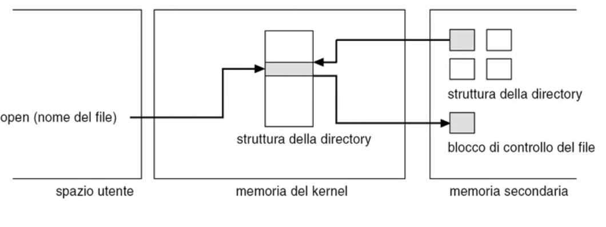

##### Lettura file
In memoria centrale:
* Verra' creato un elemento nella tabella dei file aperti dal processo, utilizzando come riferimenti quelli presi dal descrittore (ottenuto in fase di apertura);
* Verra' referenziato un elemento nella tabella dei file aperti dal sistema (fa da cache rispetto al blocco di controllo del file).

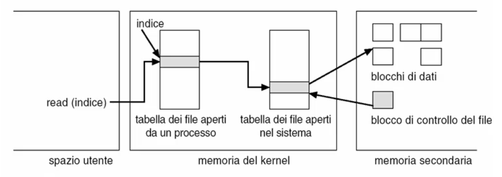

##### File system virtuali
L'interfaccia del file system si prefigge lo scopo di creare una virtualizzazione che rende indipendente la locazione dove andiamo a memorizzare il file dall'accesso da parte dei processi;

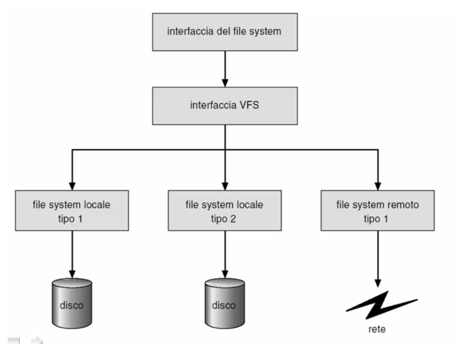

---

### Realizzazione dei direttori

#### Tecniche per la realizzazione dei direttori

##### Lista
La struttura a lista e' la struttura piu' semplice ed e' costituita da un elenco di descrittori dei vari file.

Dal punto di vista logico la intendiamo come una lista a puntatori.

Il direttorio e' costituito da un identificatore del primo descrittore di file della lista e in ciascun descrittore esistera' il puntatore al prossimo elemento della lista.

Si tratta di un implementazione efficiente per visualizzare l'elenco dei file, ma se si vuole ordinarlo e' necessario fare un ordinamento.
L'accesso e' generalmente costoso perche' si deve effettuare una scansione lineare.

E' possibile migliorare la soluzione tramite:
* Una cache;
* La persistenza della lista in modo ordinato
* Utilizzare una struttura b-tree.

##### Tabella di hash
Una soluzione alternativa e' costituita dall'utilizzo di una tabella di hash.

Usiamo ancora una lista con puntatori per contenere in modo ordinato i descrittori dei file, ma a differenza dell'implementazione tramite lista non faremo piu' un riferimento diretto a questi elementi ma utilizziamo una tabella di hash per tenere traccia dei puntatori alle sottosezioni della lista che vengono individuate dalla funzione di hashing.

Quando cerchiamo un file non andremo piu' a scansionare la lista ma, attravero la funzione di hashing, andremo ad individuare un indice all'interno della tabella di hashing e leggendo nella tabella di hashing troveremo il sottoinsieme degli elmenti che soddisfa con quel valore la funzione di hashing. Tra questi ci sara' il descrittore di file che ci interessa e quindi scandiremo solo quella porzione di lista.

La scelta della funzione di hash e' critica per poter distribuire i vari file nella lista tra i vari indici della tabella di hashing minimizzando le collisioni.

---

### Realizzazione dei file: Gestione all'astrazione dei file

#### Visione logica del file
La visione logica del file che vogliamo mostrare e' costituita da una sequenza di elementi omogenei, i **record logici**, in numero a priori non limitato.

#### Visione fisica del file
La visione fisica e' un insieme di elementi fisici, i **blocchi fisici**, nel supporto di memoria di massa.

#### Mapping della visione logica sulla visione fisica
A partire da dei record logici tipizzati di dimensione L byte, e da dei blocchi fisici uniformi per il supporto di memoria di massa di dimensione F byte, vengono mappati:
* Un record logico in un blocco fisico:
  * `L<F` -> sfridi
  * `L>F` -> tipo base non memorizzabile
* K record logici in un blocco fisico: `K = max{ n | nL <=F }`
  * `KL <= F` -> sfridi

#### Visione logica omogenea del file
Si introduce un livello intermedio tra la visione tipizzata dell'utente e la visione a blocchi fisici che permetta di memorizzare la sequenza dei dati indipendentemente dalle caratteristiche fisiche del supporto di memoria di massa.

Questa visione logica omogenea che prescinde dalla tipizzazione e' il **byte stream** (flusso di byte).

#### Mapping del byte stream
Per mappare la visione loica nella versione fisica attraverso la visione logica a byte stream e' necessario mappare la visione logica nella visione byte stream rimuovendo la tipizzazione.

Successivamente sara' possibile mappare la visione a byte stream nella visione fisica imponendo il raggruppamento degli elementi logici (byte) in blocchi fisici.

E' sempre possibile rimuovere la visione tipizzata, semplicemente andando ad analizzare il file come insieme di byte, dunque questo mapping sara' sempre possibile. Gli sfridi in memoria fisica saranno sempre nulli perche' il tipo base (il byte) e' sempre un sottomultiplo di `F` (dimensione uniforme del blocco fisico di memoria di massa).

A livello fisico si avra' una sequenza di blocchi fisici sui quali sara' mappato il byte stream, che conterra' a sua volta la mappatura dei record logici del file.

Per ottenere i record logici dal byte stream si creera' una **finestra** di dimensione `L` byte da sovrapporre al byte stream, in modo tale che solo quello che compare all'interno della finestra venga mostrato all'esterno, e il resto del byte stream venga nascosto. Quell'insieme di `L` byte del byte stream sara' interpretato come record logico.

Per ottenre il byte stream dai blocchi fisici sara' necessario ricordarsi dove sono i blocchi fisici sul disco e quale e' l'ordine con cui devono essere scanditi per definire la sequenza dei byte per risostruire il byte stream.

#### Gestione dell'astrazione dei file

##### Apertura
Quando si chiama la funzione di apertura si sta iniziando ad accedere al file logico, diviso in record logici, e ci si sta semplimemente posizionando sul primo elemento logico.

A livello di byte stream si sta semplicemente immaginando di avere i memoria centrale il flusso di byte completo da scandire con le operazioni successive, ma al momento ci si sta posizionando sul byte 0, e si sta posizionando la finestra di interpretazione sul byte 0 a sua volta, per essere pronti a gestire il primo record logico.

A livello di blocchi fisici si sta prendendo l'elemento ordinato di blocchi fisici in cui si trova memorizzato il file, iniziando a considerare solo il primo blocco.

##### Lettura
L'operazione di lettrura non fara' altro che creare il contenuto del byte stream e interpretare i byte. Nel momento in cui si chiamera' l'operazione di lettura, se siamo all'apertura, il byte stream sara' vuoto e quindi verra' richiamato il livello basso della gestione del file system, che provvedera' a reperire i byte dal primo blocco fisico, e a caricarli in memoria centrale, per poter riempire la prima porzione di byte del byte stream.

I byte del byte stream avranno ora il valore del contenuto del primo blocco fisico. Ora l'operazione di lettura potra' procedere, in quanto, all'interno della finestra, si troveranno byte che potranno essere presi ed interpretati come i primi `L` byte del primo record logico, rendendo cosi' il contenuto disponibile e visibile all'utente.

L'operazione viene completata restituendo cosi' all'utente il valore del primo record logico.
Il puntatore (indice) del record logico corrente verra' quindi spostato di una posizione e analogamente sara' spostata di una posizione la finestra. 

Una successiva richeista di lettura partira' quindi dalla configurazione ottenuta. Se la finestra non sara' coperta per intero dai byte disponibili nel byte stream sara' necessaro andare a leggere il secondo blocco fisico della memoria di massa, in modo da riempire la parte mancante della finestra e quindi terminare l'operazione di lettura, valorizzando il rispettivo record logico.

##### Scrittura
Quando si effettuera' l'operazione di apertura ci si trovera' come sempre nelle varie prime posizioni. Quando si richiede un'operazione di scrittura, dopo aver aperto il file, si andra' a riepmpire con dei valori il primo record logico.
Questo, interpretato a livello di byte stream, costituisce il contenuto della finestra posizionata all'inizio del file. Non ha senso andare a scrivere subito nel blocco fisico perche' se ne riempirebbe solamente una porzione. E' piu' logico invece attendere di avere sufficienti byte per scrivere in un blocco fisico intero, in modo da minimizzare gli accessi al disco.

Si va quindi a spostare il puntatore del record logico all'elemento successivo, e si va a spostare la finestra logica del byte stream all'elemento immediatamente successivo.

Col susseguirsi delle operazioni di scrittura si riempira' nel byte stream una quantita' di dati sufficiente per riempire un blocco fisico. Al raggiungimento di questa dimensione `F` sara' possibile andare a scrivere i byte su disco, nel corrispettivo blocco fisico.

I byte che eccederenno la dimensione del blocco fisico verrano scritti nel blocco fisico successivo, al successivo raggiungimento della dimensione `F`.

##### Posizionamento (Seek)
Per effettuare un'operazione di posizionamento alla posizione *L* bisognera':
* Posizionare il puntatore all'L-esimo record logico;
* Spostare la finestra del byte stream in modo da mostrare il L-esimo gruppo di byte;
* Se il byte stream alla L-esima posizione sara' vuoto, in caso di lettura, bisognera' reperire i byte che riempiranno la finestra dal corrispondente blocco fisico in memoria di massa, mentre in caso di scrittura si dovranno andare a scrivere i dati nel blocco fisico corrispondente.

##### Chiusura
L'operazione di chiusura termina l'uso di un file.
Se siamo in lettura libera le strutture dati utilizzate, se siamo in scrittura salva l'eventuale porzione del byte stream che non era stata salvata in precedenza e quindi libera le strutture dati corrispondenti.

---

### Realizzazione del file system: allocazione dei blocchi

#### Allocazione dei blocchi fisici
Allocare i blocchi fisici ha come scopo quello di creare l'insieme ordinato di blocchi a supporto dell'astrazione dei file e puo' essere effettuato con diverse tecniche.

##### Allocazione contigua
Ordinamento sequenziale adiacente dei blocchi fisici dello stesso file.

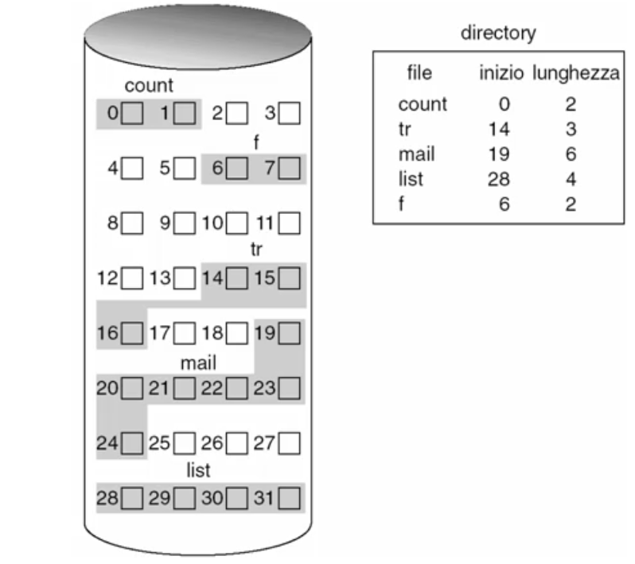

Per il file `count` imponiamo che i blocchi fisici necessari a memorizzarlo siano adiacenti.

Questo approccio ha come caratteristiche:
* Accesso rapido al blocco successivo;
* Accesso diretto lento perche' bisogna trovare il blocco desiderato (scansione lineare);

Il problema e' che si ha una mancanza di spazio contiguo sufficiente per l'allocazione di un nuovo file o estendere un file esistente: diventa necessario ricopiare l'intero file in un nuovo blocco di memoria per aggiungere nuove informazioni (**frammentazione interna**). 

Se non esiste spazio per creare un file nuovo di dimensione sufficiente diventa necessario compattare il contenuto del disco per raccogliere un numero di blocchi adiancenti sufficienti per contenere il nuovo file (**frammentazione esterna**). Cio' comporta un alto overhead di gestione. 

##### Allocazione collegata
Nel caso di allocazione collegata non e' necessario che i blocchi siano adiacenti, e cio' risolve i problemi di mancanza di spazio e l'eventuale compattazione.

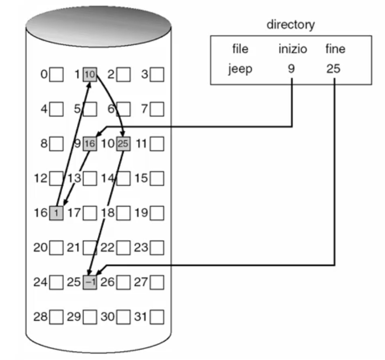

Per sapere quale e' l'ordine con cui scandire i vari blocchi si ha una lista collegata dei blocchi: si mantiene all'interno di ciascun blocco il puntatore al blocco successivo.

In questo modo non rimangono porzioni di blocchi di memoria non utilizzata (**no frammentazione esterna**).

Si ha un accesso diretto lento perche' bisogna scandire la sequenza dei blocchi per scoprire dove si trova il blocco desiderato.

Viene 'sprecato' dello spazio per poter memorizzare i puntatori al blocco successivo. Per ridurre questo side-effect spesso vengono raggruppati i blocchi adiacenti in *cluster* e quelli che vengono allocati nella lista collegata sono i cluster di blocchi adiacenti.

In caso di guasto si perdono i puntatori ai blocchi successivi quindi diventa difficile garantire l'affidabilita' di memorizzazione.

Per migliorare l'affidabilita' viene introdotta la **File Allocation Table - FAT**, quindi le informazioni dei puntatori invece di essere sparpagliate tra i vari blocchi per sapere dove si trova il blocco successivo, vengono raccolte in una tabella memorizzata sul disco separatamente dai blocchi dei dati. Si possono mantenere anche diverse copie della stessa tabella sul disco, lo spazio occupato sarebbe comunque minore.

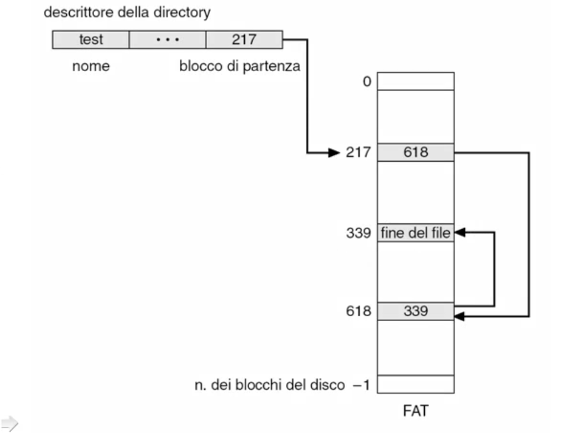

In questo caso, il descrittore del file posto nella directory, va ad individuare il numero di blocco fisico legato allaFAT, e usando questo indice all’interno della FAT sarà possibile sapere dove si trova il blocco successivo.Questo indice sarà, inoltre, utilizzato per reperire il blocco fisico sul disco.

##### Allocazione indicizzata
Nel caso della FAT vanno scanditi uno dopo l'altro i riferimento all'interno della FAT stessa per trovare l'elemento desiderato (Scansione).

Nel caso dell'allocazione indicizzata, i blocchi anziche' essere dispersi nella FAT vengono allocati in una tabella relativa al file considerato. Sostanzialmente i vari elementi, nell'ordine, saranno gli indici dei blocchi fisici corrispondenti all'indice considerato. L'indice **i-node** contiene la sequenza dei puntatori ai blocchi fisici.

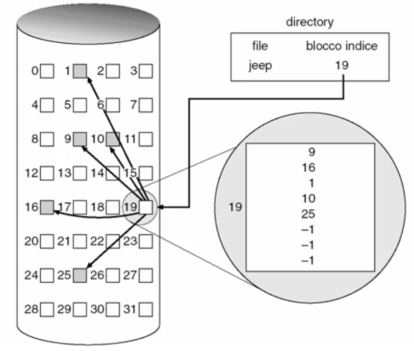

In questo caso non c'e' frammentazione esterana, l'accesso diretto e' veloce e l'affidabilita' e' alta.
La dimensione del blocco dell'indice e' il limite della dimensione massima del file:
* Schema collegato;
* Indice multilivello;
* Schema combinato.

Nello **schema collegato** abbiamo un blocco indice in cui gli elementi individuano i blocchi fisici tranne l'ultimo elemento dell'indice, che invece va ad individuare un altro indice.

In questo modo si crea una lista di indici, ognuno dei quali punta al successivo nell'ultimo elemento mentre i primi indicano dei blocchi fisici. Dunque per trovare un blocco fisico si dovra' effettuare almeno in alcuni casi una scansione delle tabelle degli indici e generare overhead.

Per ovviare ai problemi dello schema collegato e' possibile utilizzare un blocco indice con **indice multilivello** in cui abbiamo al primo livello un indice in cui tutti gli elementi non puntano a dei blocchi fisici ma puntano tutti ad altri indici. Nel caso di un numero di livelli uguale a 2, gli indici trovati punteranno a dei blocchi fisici.

In questa soluzione e' possibile ridurre il tempo di ricerca delle informazioni perche' con una struttura ad albero e' possibile reperire il blocco desiderato in un tempo logaritmico.

L'allocazione con **schema combinato** e' piu' complessa in cui vengono mischiati:
* Allocazioni dirette;
* Allocazioni con schema monolivello;
* Allocazioni con schema multilivello.

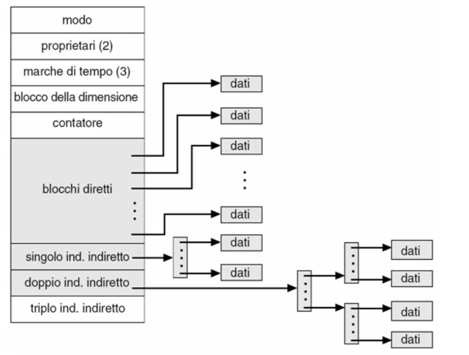

#### Miglioramento delle prestazioni per allocazione
E' possibile ottenere dei forti miglioramenti:
* Portando in memoria centrale tutte le informazioni di gestione che sono memorizzate sul disco attraverso un meccanismo di caching;
* Effettuare delle operazioni di lettura anticipata delle informazioni di gestione o dei blocchi sul disco attravero un meccanismo di **read ahead**.

#### Gestione dello spazio libero

##### Bitmap (vettore di bit)
Ad ogni blocco fisico viene associato un bit, e a questo viene assegnato un valore di 0 o 1 a seconda del fatto che il blocco sia libero oppure occupato da un file.

Si potra' reperire un blocco libero andando a cercare un blocco che disporra' di tale bit a 0. Questo e' efficiente se eesiste un supporto hardware adeguato a trattare analisi e reperimento in modo immediato.

##### Lista collegata
Si puo' utilizzare una lista collegata per tenere traccia dei blocchi liberi. E' come se fosse un file che identifica i blocchi liberi mettendoli tutti uno dietro l'altro. Si trattera' quindi di andare a prendere il primo blocco libero della lista.

##### Conteggio
A volte puo' essere utile avere dei blocchi liberi adiacenti per questioni di efficienza negli accessi e per ridurre la dimensione della lista libera, soprattuto per andare a cercare nella lista libera un numero sufficiente di blocchi contigui per garantire buone prestazioni.

Per ottenere cio', se si avra' un insieme di blocchi liberi contigui, invece che memorizzarli individialmente si potra' memorizzare nella lista un elemento che conterra' il numero dei blocchi liberi contigui e l'indirizzo del primo blocco libero.

Se si terra' la lista ordinata contando i blochci fisici liberi adiacenti in questo modo si potranno unire i vantaggi di memorizzare i file in blocchi adiancenti (operazioni di lettura piu' rapide) con il fatto che non e' indispensabile che i blocchi siano TUTTI adiancenti, ma che semplicemente si utilizzino il massimo numero di blocchi adiancenti, memorizzando pero' nella struttura ogni blocco individualmente.

---

### Valutazione dell'efficienza e delle prestazioni del sistema

#### Efficienza
L'efficienza e' lo sfruttamento ottimale delle risorse per il file system e riguarda:
* Il dimensionamento ideale per:
  * Blocchi;
  * Puntatori;
  * Metadati;
* Il rendimento dello spazio occupato sul disco, evitando:
  * Frammentazione interna (spazio non occupato all'interno di ciascun blocco di memoria);
  * Frammentazione esterna (spazi non usabili a causa dell'allocazione effettuata dei vari blocchi ai file);
  * Grandi aree usate per informazioni di gestione.

#### Tecniche per migliorare l'efficienza
Si possono considerare diverse tecniche.

Considerare la possibilita' di avere cluster di dimensione variabile a seconda delle esigenze permette di ridurre la frammentazione interna.

Definire la dimensione dei blocchi/puntatori/metadati in funzione della tecnologia e delle modalita' di uso permette di ridurre la quantita' di spazio occupato per la gestione.

Ad esempio utilizzando un'allocazione statica e dinamica delle tabelle in memoria, oppure utilizzando delle specifiche File Allocation Table.

#### Prestazioni
Le prestazioni riguardano la rapidita' di uso delle risorse per il file system e riguarda:
* Il modo di uso delle risorse per il file system;
* Quali strutture dati vengono utilizzate a supporto dell'uso delle risorse per il file system;
* Quali supporti hardware vengono dedicati all'uso di risorse per il file system, ad esempio:
  * Memoria centrale;
  * Cache.

#### Tecniche per migliorare le prestazioni
Per migliorare le prestazioni e' spesso possibile utilizzare approcci molto semplici:
* Utilizzando algoritmi di gestione semplici, riducendo l'overhead;
* Utilizzando strutture dati apposite per garantire un veloce accesso alle informazioni.

E' possibile introdurre dei supporti hardware che agevolino l'accesso al disco:
* Cache del disco per cui il disco non dovra' necessariamente accedere ai blocchi fisici della memoria di massa;
* Cache delle pagine dove conservare le informazioni in arrivo dal processo;
* Buffer di cache unificata del buffer di disco e del processo per semplificare la gestione complessiva;
* Memoria virtuale unificata per cui tutte le informazioni si trovano in una memoria astratta.

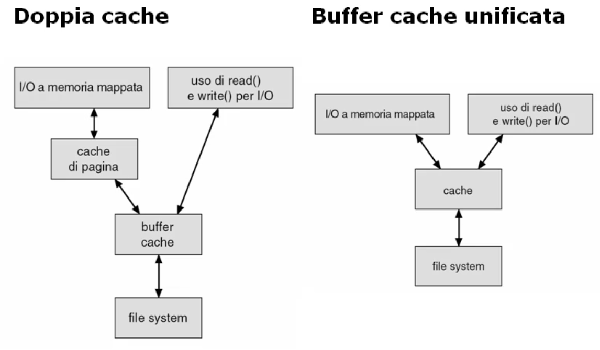

Nella doppia cache, con la periferica si ha una cache di pagina che provvede a contenere i dati in arrivo da essa.

Verso il processo si ha un buffer che provvede ad alimentare i dati del file system per le specifiche richieste del processo.

Questa buffer cache viene alimentata con tutte le informazioni provenienti dalla cache di pagina del disoc in caso si stia effettuando un'operazione di lettura. Altrimenti sara' il buffer cache ad alimentare la cache di pagina per poi andare su disco in caso si stia effettuando un'operazione di scrittura.

In entrambi i casi i tempi si allungano in quanto i dati vengono copiati tra le due cache.


Nella cache unificata tale copiatura non avviene piu', le informazioni vengono scritte una sola volta. 

Per la gestione della cache si possono utilizzare algoritmi Last Recently Used oppure delle priorita' di paginazione per assegnare lo spazio.

Per migliorare le prestazioni e' inoltre possibile adottare delle tecniche di I/O **mediate da cache**, in modo da minimizzare lo spostamento delle testine, scegliendo un algoritmo intelligente di conseguenza.

E' possibile ridurre il tempo effettuando le operaizoni di scrittura in modo **asincrono** (scrivendo in un buffer del sistema operativo, considerando l'operazione come conclusa, lasciando al sistema operativo la responsabilita' della scrittura).

Per migliorare l'uso della cache e' possibile utilizzare algoritmi alternativi a Least Recently Used come:
* free-behind: non appena viene usata un'info questa viene subito rimossa dalla cache per lasciare spazio;
* read-ahead: scaricare dal disco ulteriori blocchi immediatamente senza attendere che venga effettivamente richeista tale informazione.

Si puo' usare anche una memoria virtuale unificata che includa sia memoria centrale che memoria di massa, creando cosi' un disco virtuale. Questo avviene con i **Ram-disk** (le dimensioni saranno limitate ma conservano una buona efficienza).

---

### Manutenzione del file system

#### Errori nel file system
Gli errori nel file system possono derivare da:
* Danneggiamenti alla struttura dati, quindi un problema di consistenza delle informazioni memorizzate;
* Danneggiamenti dei supporti fisici in cui le informazioni sono memorizzate.

#### Coerenza del file system
In entrambi i casi di errore del file system e' necessario garantire la coerenza allineando i valori dei dati e dei metadati in memoria e su disco.

Il **controllore della coerenza** e' un sistema di verifiche che garantisce tale allineamento di valori. 
Inotltre per dati e metadati critici verranno sempre scritti in modo sincrono per garantire la corretta persistenza dell'informazione.

#### Backup e ripristino del file system
Il backup permette di effettuare un salvataggio di sicurezza dei dati e dei metadati.
Cio' avviene creando e conservando una copia delle informazioni per superare situazioni di problemi fisici ai supporti di memoria di massa come malfunzionamenti, guasti e catastrofi.

Puo' essere effettuato in maniera:
* Completa: salvando tutte le informazioni;
* Incrementale: salvando solo le informazioni modificate dall'ultimo backup.

L'eventuale ripristino (o restore) consente di superare le condizioni di errore dovute a guasti.
Cio' avviene caricando i dati e metadati in memoria di massa per ripristinare una situazione coerente precedente a guasti fisici.

Per gestire il backup e il restore in modo efficiente e' possibile introdurre:
* file system orientati alle transazioni mediante operazioni di **logging**: quando viene effettuata un'operazione queste vengono registrate e quindi si ripristina lo stato corretto del sistema andando ad analizzare lo stato delle singole transazioni ripetendo le transazioni non completate e andando a ripristinare uno stato precedente all'esecuzione delle transazioni;
* file system basati sulla registrazione delle attivita' tramite **journaling**.

---

## Protezione

### Concetti fondamentali della protezione
La protezione ha come scopo quello di proteggere le risorse da accessi che non siano stati autorizzati:
* Accessi errati accindentali;
* Accessi malevoli.

#### Obiettivi
L'obiettivo della protezione del fily system e' definire le autorizzazioni ad utilizzare le risorse presenti nel sistema:
* Le **regole** specificano chi e come puo' utilizzare le risorse;
* I **meccanismi** definiscono gli strumenti per imporre le regole.

#### Domini di protezione
La definizione delle regole e' fatta mediante i domini di protezione.

Consideriamo quali sono le risorse che vogliamo proteggere:
* Risorse fisiche: cpu, memoria centrale, periferiche, ecc;
* Risorse informative: file, strutture di comunicazione e sincronizzazione tra i processi, ecc.

Ciascuna risorsa e' caratterizzata da:
* Un identificativo;
* Un insieme di operazioni che possono essere effettuate su di essa.

La definizione di protezione si basa sul **principio di minima conoscenza**:
> Un processo deve accedere solo alle risorse strettamente necessarie per effettuare la propria computazione.

In questo modo si evita che il processo possa, accidentalmente, usare in modo errato le risorse danneggiando il sistema e gli altri processi.

Definiamo **dominio di protezione** come:
> La caratterizzazione dell'insieme delle risorse e delle relative operazioni lecite che un processo puo' effettuare quando viene autorizzato ad accedere alle risorse rappresentate nel dominio.

Il dominio di protezione e' dunque un insieme di coppie `<Oggetto, Diritti>` dove:
* Gli oggetti sono le risorse che vogliamo proteggere;
* I diritti sono le operazioni lecite ammesse sulla risorsa considerata.

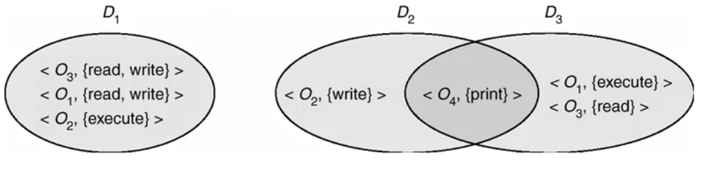

#### Associazione processo-dominio
Quando un processo viene attivato nel sistema gli si deve associare un dominio di protezione per definire quali sono le risorse che puo' usare e quali diritti ha su tali risorse.

L'associazione puo' avvenire in maniera:
* **Statica** all'attivazione del processo;
* **Dinamica**: potra' essere cambiata nel tempo per:
  * Richiesta del processo; 
  * Richiesta del gestore del sistema;
  * Modifiche delle regole associate al dominio.

Il cambiamento di dominio potra' essere effetuato dal processo se questo possiede i diritti per effettuare tale operazione.

Il cambiamento delle caratteristiche di un dominio potra' essere attuato mediante **revoca** di alcuni diritti di accesso:
* Immediata o ritardata;
* Selettiva o generale;
* Parziale o totale;
* Temporanea o permanente

---

### Tecniche di realizzazione della protezione

#### Realizzazione dei domini di protezione
I domini di protezione possono essere rappresentati in modo immediato attraverso la matrice degli accessi in cui si rappresentano quali sono le operazioni lecite per ogni dominio, per ogni risorsa.

Le possibili implementazioni sono:
* Matrice completa;
* Liste di controllo degli accessi;
* Liste di capacita' dei domini;
* Meccanismo serrature-chiavi (lock-key).

#### Matrice degli accessi
Si tratta di una matrice bidimensionale: sulle righe poniamo i domini di protezione e sulle colonne inseriamo le risorse informative e fisiche da proteggere.
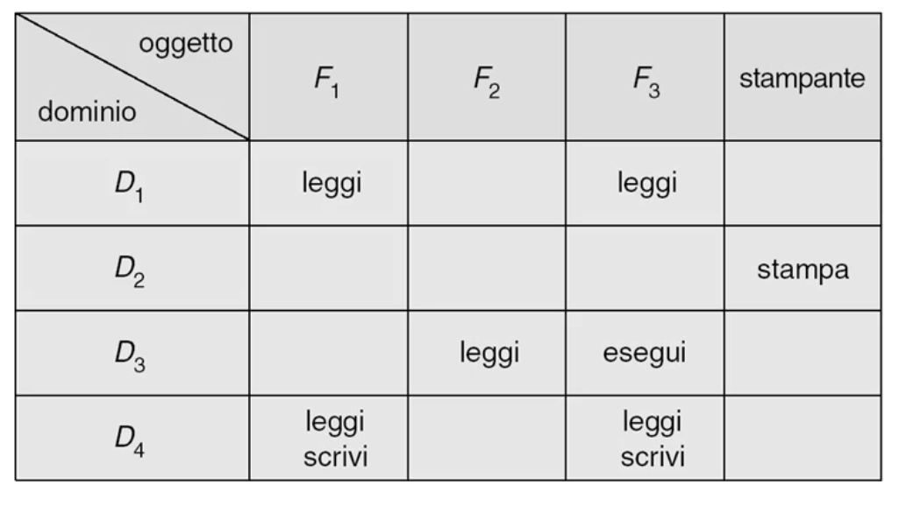

E' possibile aggiungere anche i domini di protezione sulle colonne come se fosse una qualunque risorsa informativa o fisica del sistema.
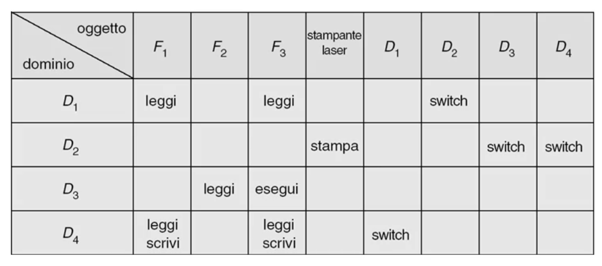

Possiamo aggiungere i diritti per la modifica della matrice stessa con il diritto di **copia**. Ad esempio un dominio potra' copiare i diritti di un altro dominio su una risorsa.
Il diritto che si vuol concedere in copiatura si indica con l'asterisco.

Possiamo inserire i diritti di **proprieta'** per cui solamente il proprietario di una risorsa, quando si trovera' in un determinato dominio potra' effettuare delle operazioni specifiche. Solo il proprietario di una risorsa potra' copiare i diritti su una risorsa concedendola ad altri domini.

> La matrice degli accessi raccoglie tutte le informazioni sui diritti di uso e supporta i meccanismi di protezione dinamica.

#### Liste di controllo degli accessi
Poiche' la matrice degli accessi puo' essere molto sparsa, in certi casi e' conveniente usare una struttura piu' leggera.

Le liste di controllo degli accessi conservano le liste dei diritti associate per ogni dominio per ogni risorsa.
```
Risorsa: <Dominio, Diritto>
```

Sostanzialmente si ha una lettura per colonne della matrice degli accessi.


#### Liste dei capacita' dei domini
Si tratta di una rapprestazione ortogonale alle lista dei controllo degli accessi, per cui vengono conservate le liste delle risorse e dei diritti per ogni dominio.
```
Dominio: <Risorsa, Diritto>
```

Sostanzialmente si ha una lettura per righe della matrice degli accessi.

#### Revoca dei diritti
La revoca dei diritti viene effettuata in modo diverso a seconda di come e' stata memorizzata la matrice degli accessi:
* Tramite lista di controllo degli accessi: rimuovere i domini e/o i diritti dalla lista della risorsa:
  * Revoca immediata;
  * Revoca generale o selettiva;
  * Revoca totale o parziale;
  * Revoca permanente o temporanea.
* Tramite la lista di capacita' dei domini: i diritti non sono raccolti in un modo chiaro sulla risorsa desiderata, ma sono sparsi nelle varie liste essendo associate ai vari domini:
  * Revoca lenta;
  * E' possibile migliorare questa implementazione tramite un meccanismo di *riacquisizione* dei diritti:
    * Periodicamente vengono rimosse tutte le capacita';
    * I processi devono piano piano riacquisire i diritti andandoli a richiedere al sistema;
    * Cio' consente di modificare la lista delle risorse che si intendono concedere;
  * Alternativamente e' possibile inserire dei *puntatori alle capacita'*:
    * Per ogni risorsa si mantiente una lista che individua tutte le capacita' di quell'oggetto;
  * Tramite un *approccio indiretto*:
    * Le capacita' non sono piu' associate alle risorse ma vengono rappresentate in una tabella e possono essere revocate azzerando il puntatore alla tabella stessa;
  * Tramite *chiavi*:
    * La revoca cambia la chiave in possesso del sistema per quella risorsa;
    * Quando un processo cerchera' di accedere alla risorsa trovera' la chiave d'accesso modificata e quindi non potra' accedere.

#### Confronto
* Liste di controllo degli accessi:
  * Possono essere specificate dagli utenti;
  * Informazioni globali;
  * Inefficienti su grandi sistemi;
* Liste di capacita' dei domini:
  * Relative agli oggetti;
  * Informazioni localizzate;
  * Revoca inefficiente.


#### Meccanismo serratura-chiave
Un altro approccio per gestire in maniera efficiente l'accesso alle risorse e' il meccanismo **lock-key** dove serratura e chiave sono definite da stringhe di bit.

Il processo puo' eseguire un'operazione su una risorsa se la chiave combacia con la serratura per l'operazione indicata.

#### Sistemi operativi basati sulle capacita'
Questi sistemi operativi mettono a disposizione un approccio nativo all'uso delle risorse mediante capacita' dove gli utenti possono definire e controllare tali capacita'.

L'approccio e' comodo perche' amplia l'uso dei diritti all'interno del sistema.

#### Protezione basata sul linguaggio
In altri approcci si e' cercato di portare i concetti di protezione direttamente nel linguaggio di programmazione per renderlo ancora piu' nativo nell'ambito della scrittura del programma applicativo. Tutti gli aspetti di gestione vengono affidati al compilatore che deve provvedere ad introdurre le opportune attivita' di verifica dei riferimenti.

In fase di compilazione o esecuzione si verificheranno i diritti di uso delle varie risorse e quindi si garantira' una verifica puntuale dell'uso delle risorse.

Il controllo puo' essere piu' granulare:
* Il progettista puo' definire i meccanismi e le regole di base;
* L'amministratore di sistema puo' specificare le politiche;
* L'utente e il programmatore possono aggiungere eventualmente ulteriori specializzazioni dei diritti.

Rispetto ad una protezione basata sul kernel, questa distribuzione delle responsabilita' provoca:
* Minor sicurezza generale;
* Maggior flessibilita';
* Maggior efficienza.