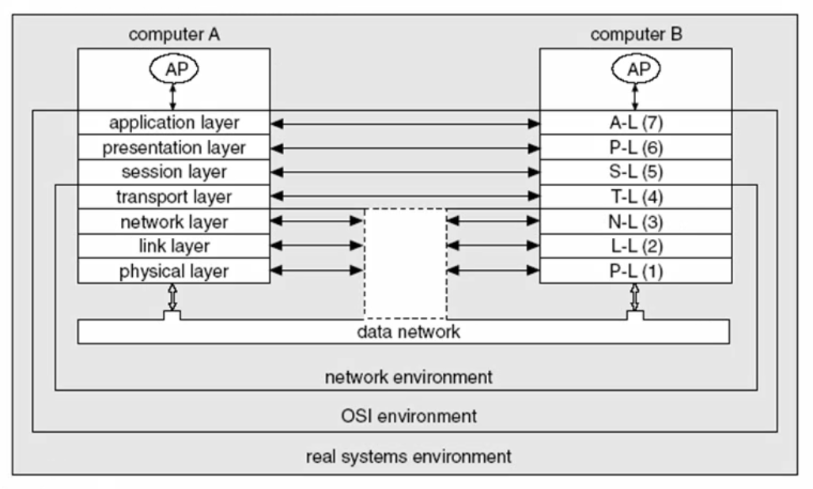
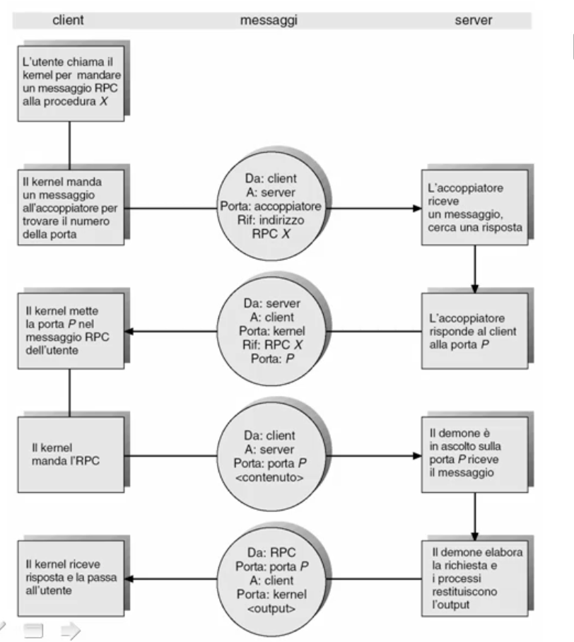
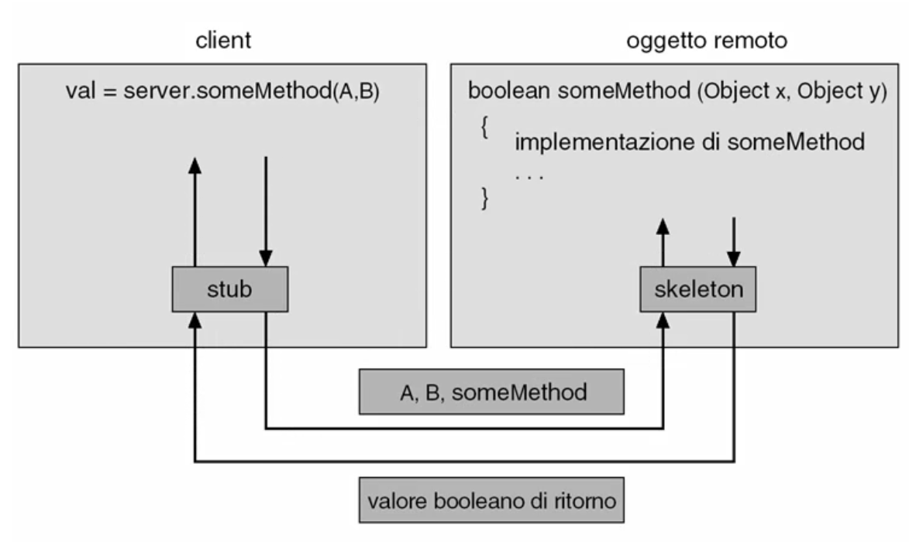
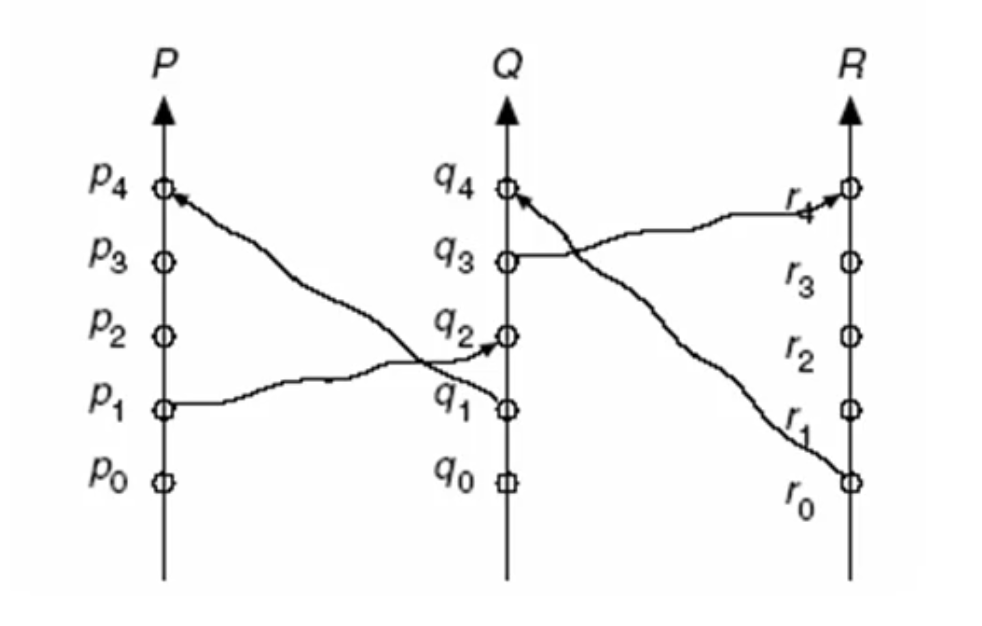
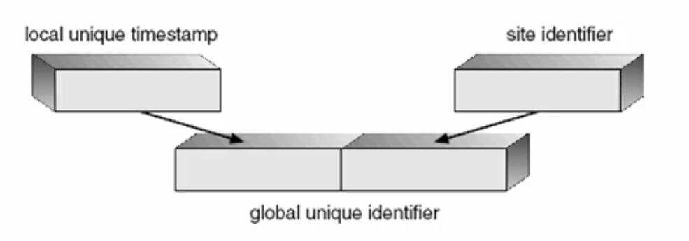

# Sistemi distribuiti

## Funzioni di un sistema distribuito

### Obiettivi e funzioni

#### Architetture di elaborazione distribuite
Un'architettura di elaborazione distribuita e' costituita da un'insieme di sistemi di elaborazione interconnessi attraverso la rete.

Ciascuna macchina avra':
* Almeno un processore;
* Della memoria locale;
* Periferiche locali;
* Periferiche condivise tra i vari sistemi;
* Risorse globali accessibili alle altre macchine;
* La rete di comunicazione stessa costituisce una periferica.

La caratteristica principale e' l'eterogeneita' dei singoli sistemi, comportando delle difficolta' di gestione per il sistema operativo.

Un'architettura di elaborazione distrivuita e' costituita da un'insieme di **siti** in cui vengono installate delle **macchine** (host, computer, nodi) che possono fungere da **server e/o client**.

I vantaggi di un'architettura di elaborazione distribuita sono:
* La possiblita' di integrare sottosistemi: esistono dei sottosistemi gia' acquisiti in vari siti se decidiamo di interconnetterli con gli altri sottosistemi nella rete possiamo creare un'interazione a livello dell'intero sistema;
* La condivisione delle risorse;
* Parallelismo della computazione: avendo piu' sistemi di elaborazione, una computazione puo' essere 'spezzata' e distribuita su altri sistemi di elaborazione in modo da avere un parallelismo fisico nella computazione ottenendo un aumento della velocita' di calcolo (**computation speedup**);
* Interazione con utente: permette di aumentare l'astrazione e avvicinarsi di piu' agli utenti;
* Riduzione della complessita' e del costo dei singoli componenti per adattarli alle specifiche esigenze (**downsizing**);
* Aumenta l'affidabilita' totale del sistema (**reliability**), la tolleranza ai guasti (**fault tolerance**) e la sua disponibilita' (**dependability**);
* Forte scalabilita' del sistema (**scalability**) poiche' e' possibile aggiungere funzioni, servizi e componenti senza dover gettare cio' che era stato precedentemente acquisito.

#### Sistemi operativi per architetture di elaborazione distribuite
Esistono due famiglie di sistemi operativi:
* Sistemi operativi di rete - **Network Operating Systems**: gestiscono l'integrazione tra i singoli componenti del sistema distribuito ma lasciano ancora vedere agli utenti la struttura e le caratteristiche dei componenti e della rete. Un processo sa dove si trovano le risorse che gli servono.
* Sistemi operativi distribuiti - **Distributed Operating Systems**: coprono l'intera architettura distribuita, nasconde le differenze tra le singole macchine e fa apparire l'insieme della macchine interconnesse in rete come un unico sistema di elaborazione. Il fatto che sia distribuito anche geograficamente diventa un dettaglio marginale, tutto e' trasparente ai processi. In questo modo e' piu' semplice organizzare l'uso delle risorse da parte degli utenti.

#### Sistema operativo di rete
Un sistema operativo di rete deve consentire l'accesso alle risorse informative e fisiche che sono condivise nella rete. Per questo le attivita' che deve supportare sono:
* Collegamento per eseguire un'elaborazione remota:
  * Login remoto: Telnel/SSH;
  * Comunicazione tra processi remoti: Socket;
  * Attivazione di procedure remote: RPC;
* Consentire l'uso di risorse fisiche remote:
  * Stampanti remote: spooling di stampa remoto.
* Accesso ai file remoti:
  * Trasferimento remoto di file: FTP;
  * File server remoto: montaggio di file system;
* Servizi generali come la posta elettronica.

#### Sistema operativo distribuito
Ha un approccio completamente diverso: deve rendere trasparente tutta l'architettura fisica del sistema di elaborazione distribuito.

Deve quindi:
* Rendere accessibili le risorse remote come se fossero risorse locali;
* Consentire la migrazione di dati e processi con una gestione trasparente da parte del sistema operativo.

Si effettua una migrazione dei dati quando si vogliono spostare dei dati dalla macchina locale alla macchina remota o viceversa.
Si ha:
* Il meccanismo di copia-elaborazione-salvataggio viene svolto in maniera trasparente da parte del sistema distribuito tramite FTP automatizzato;
* Una copiatura del file in modo simile a quando si effettua la paginazione;

Il problema consiste nella compatibilita' di rappresentazione dei dati tra le varie macchine e quindi delle tecniche che possono essere utilizzate per nascondere le differenze.

La **migrazione computazionale** prevede la migrazione di singole procedure o dell'intero processo, a partire dalla macchina in cui erano in esecuzione inizialmente verso macchine remote nel sistema distribuito.

La migrazione di una **procedura** avviene attraverso la chiamata di una procedura remota (RPC). In questo caso il processo locale attiva una procedura su una macchina remota come se attivasse una sua propria procedura nel sistema operativo locale. Esistera' un processo remoto che si fara' carico dell'esecuzione della procedura richiesta scambiando messaggi con il processo locale. L'obiettivo e' quello di andare ad utilizzare dell'hardware remoto perche':
* L'hardware e/o il software remoto sono preferibili rispetto a quello locale;
* In remoto esistono delle risorse specifiche che non esistono localmente;
* La quantita' di dati su cui si vuole operare e' particolamente grande rendendoli non-trasportabili all'interno della rete;
* Non si vuole spostare alcun dato per garantire la protezione e la riservatezza.

La migrazione di un **processo** puo' essere fatto con:
* La migrazione effettiva del processo;
* Tramite la tecnologia degli **agenti mobili**.

Le motivazioni di tale migrazione sono:
* Effettuare un bilanciamento del carico di lavoro sui processori delle varie macchine;
* Velocizzare l'elaborazione (valutando il tradeoff con l'overhead generato dallo spostamento di un processo da una macchina ad un'altra);
* Preferibilita' dell'hardware e/o software remoti;
* Disponibilita' di risorse specifiche;
* Per accedere a dei dati che devono rimanere in remoto.
  
Un sistema operativo distribuito deve inoltre fornire un **file system distribuito**. Cio' puo' essere effettuato montando i file system remoti in modo omogeneo e trasparente come se fossero file system di un altro disco locale.
Cio' deve essere fatto in modo tale che il file system globale che si venga a creare venga visto in modo identico qualunque sia la macchina.

Inoltre deve essere possibile usare risorse fisiche nell'ambiente distribuito come le stampanti (non deve essere necessaria alcuna configurazione su nessuna macchina). Analogamente devono essere forniti i servizi distribuiti come la posta elettronica.

#### Robustezza
Un sistema operativo di rete o distribuito deve farsi carico della gestione della robustezza dell'architettura. Un'architettura distribuita e' estremamente robusta rispetto ai guasti e ai malfuzionamenti rispetto ad un singolo sistema di elaborazione.

Il sistema operativo dovra' introdurre delle tecniche di gestione per:
* Rilevazione dei guasti;
* Mascheramento degli errori eventualmente indotti;
* Riconfigurazione del sistema per escludere i componenti guasti;
* Ripristino e reinclusone dei sistemi che si erano guastati.

Il **rilevamento dei guasti** puo' essere effettuato tramite:
* Monitoraggio periodico delle macchine mediante meccanismi di handshaking: se non viene ottenuta una risposta si puo' dedurre quali macchine non sono disponibili e provvedere ad escluderle dalla computazione attiva;
* Rilevamento di un tempo massimo di attesa (timeout): se non viene risposto ad una richiesta entro un tempo massimo, la macchina in questione verra' considerata come non funzionante;
* Computazioni duplicate su macchine diverse nella rete e confronto dei risultati: una discordanza dei risultati porta a rilevare un possibile guasto all'interno del singolo sistema

In caso di criticita' dell'applicazione puo' diventare necessario **mascherare gli errori**:
* Se si hanno computazione moltiplicate su piu' macchine, attraverso un meccanismo di votazione si potra' decidere a maggioranza quale e' il risultato corretto (consensus algorithm);
* E' possibile duplicare le risorse garantendo un mascheramento nel caso di guasti.

Deve essere garantita la **riconfigurazione** del sistema in caso di interruzione di collegamento o guasto ad una macchina:
* Riconfigurando le tabelle di instradamento per escludere il collegamento o la macchina guasti;
* Sostituzione la macchina guasta nei suoi compiti con altre risorse di elaborazione del sistema (eventualmente accettando delle funzionalita' degradate).

Infine, una volta riparato il componente guasto, il **ripristino** del sistema distribuito consente di:
* Riconfigurare l'archittura distribuita reintegrando i componenti riparati:
  * Informando le macchine tramite handshaking;
  * Aggiornare nuovamente le tabelle di instradamento;
  * Provvedere alla garanzia della consistenza delle informazioni nei vari siti (in particolare in quelli ripristinati).
* Deve essere garantito il completamento di quei servizi che non erano andati a buon fine a causa dell'interruzione di collegamento o guasto (es. gestione posta non consegnata).

#### Aspetti progettuali
Tutti questi aspetti vanno previsti nella progettazione e configurazione del sistema operativo per le architetture distribuite.

Si deve garantire:
* Trasparenza di allocazione delle risorse (processori, dispositivi di memoria, periferiche, file, ecc) per non dover sovraccaricare i programmatori e gli utenti di conoscenze non strettamente necessarie al raggiungimento dei loro fini (analogamente a quanto avviene con il file system);
* Il supporto alla mobilita' dell'utente, alla computazione e ai dati;
* Tolleranza ai guasti;
* Scalabilita' delle architetture e delle funzioni.

---

## Comunicazioni in rete

### Protocolli di comunicazione

#### Problemi
I problemi che si vogliono affrontare sono:
* La necessita' di effettuare comunicazioni di tipo asincrono in un ambiente distribuito per garantire il successo della comunicazione rimanendo non-bloccati nelle comunicazioni;
* Tenere conto della probabilita' di errori durante la comunicazione e quindi trovare un modo di inviare i messaggi con una buona probabilita' di sucecsso;
* L'interazione tra ambienti eterogenei che devono essere integrati.

#### Obiettivi
* Semplificare la prograttazione delle applicazioni creando uno strato di progettazione della rete sul quale le operazioni di comunicazione si possono appoggiare vedendolo come un ambiente omogeneo tra componenti eterogenei;
* Astrazione della visione delle comunicazioni in rete e quindi una virtualizzaizone virtualizzazione delle stesse;
* Gestione efficiente degli errori e dei guasti.

#### Soluzione
Introduzione di protocolli di comunicazione come **driver** di gestione della 'periferica' rete.

Il sottosistema dedicato alle comunicazioni in rete sara' suddiviso in strati e la comuincazione verra' gestita tra strati equivalenti tramite protocolli specifici.

#### Modello teorico
Il modello teorico che ben descrive la comunicazione in maniera astratta e virtuale è il modello ISO/OSI.Questo modello è stato introdotto dalla società internazionale degli standard (ISO) per permetterel’interconnessione tra sistemi aperti eterogenei (Open System Interconnection).

Questo modello prevede una pila di strati che provvede a rendere astratti e trasparenti i vari aspetti di complessità crescente (da livello fisico fino alla gestione dell’interazione a livello di applicazione).

Gli strati più bassi (fisico - trasporto) creano un ambiente di rete omogeneo ed indipendente dalle strutture fisiche che effettivamente si vanno ad utilizzare.In questo modo i processi possono colloquiare tra loro senza sapere come è realizzata fisicamente laconnessione al di sotto.

Al di sopra di questi viene creata una serie di strati che aumenta il livello di astrazione, fornendo una modalità standard ed omogenea per le applicazioni di colloquiare tra di loro, introducendo anche delle applicazionistandard a livello di rete.

#### Strato fisico 
Lo strato fisico si occupa della gestione della trasmissione dei bit a livello meccanico ed elettrico, specificando come devono essere realizzate fisicamente le interconnessioni.

#### Strato data-link
Lo strato del collegamento tra i dati gestisce l’invio e la ricezione del singolo pacchetto, ossia della singola porzione di messaggio di lunghezza fissa, e provvede a gestire la rilevazione e la correzione di errori.

#### Strato rete
Lo strato di rete è quello che si occupa della connessione e dell’instradamento dei pacchetti all’interno dellarete (definendo l’indirizzo al quale deve essere inviato un pacchetto, e decodificando l’indirizzo dei pacchetti inentrata per capire se il pacchetto è destinato a quella macchina).

#### Strato trasporto
Lo strato di trasporto si occupa di partizionare i messaggi in pacchetti di lunghezza fissa e attivarne l’invio,mantenendo l’ordine degli stessi.Gestisce quindi la ricostruzione ad alto livello, gestendo gli errori a livello di messaggio.

#### Strato sessione
Lo strato di sessione provvede a realizzare le sessioni di comunicazione, e quindi a garantire la comunicazione a livello di processi (e quindi lo scambio dei messaggi dall’inizio alla fine della sessione,l’ordinamento di tali messaggi e la gestione dei relativi errori).

#### Strato presentazione
Lo strato di presentazione ha come obiettivo quello di risolvere le differenze di formato tra le varie macchine. Provvede quindi a convertire i vari formati, e provvede a gestire l’invio in modalità semi-duplex o full-duplex(una direzione o due direzione contemporaneamente).

#### Strato applicazione
Lo strato di applicazione gestisce l’interazione a livello di standard di applicazione, ad esempio con il trasferimento di file, connessioni remote, posta elettronica, basi di dati distribuite ecc.

#### Pila del protocollo ISO/OSI
La pila del protocollo ISO/OSI provvede a creare per ogni livello di astrazione, una visione specifica per le caratteristiche della comunicazione tra processi.

I dispositivi fisici di connessione realizzano l’interconnessione fisica tra le apparecchiature in rete.

Al di sopra dello strato di trasporto si riesce a vedere un servizio di comunicazione e scambio messaggi indipendente dalle caratteristiche della rete.

Al di sopra dello strato di presentazione si riesce a vedere un servizio di scambio dei messaggi indipendente dalla sintassi usata all’interno delle singole macchine della rete.

A livello di strato di applicazione si potranno vedere dei servizi distribuiti che possono essere utilizzati dai processi applicativi.

#### Messaggi nel protocollo ISO/OSI
I messaggi scambiati sono incapsulati, aggiungendo progressivamente degli header passando per i vari strati della pila. All’ultimo strato, verranno aggiunti un header e un footer, a garantire la correttezza dell’invio delsingolo pacchetto.

#### Modelli reali
I modelli reali devono essere però più semplici ed efficienti da utilizzare. Devono essere soprattutto più rapidi nell'incapsulamento dei messaggi da inviare con le info di servizio e l’invio sulla rete.
Diventano più difficili da realizzare, e meno astratti del modello ISO/OSI.

I modelli reali sono:
* Internet Protocol (IP);
* Trasmission Control Protocol (TCP)
* User Datagram Protocol (UDP);
* Ulteriori protocolli applicativi.

#### Relazione tra TCP/IP, UDP/IP e ISO/OSI
Il livello IP equivale allo strato di rete.

Il protocollo TCP o UDP equivalgono allo strato di trasporto.

Non sono definiti strati standard per il livello fisico e collegamento, e nemmeno per i livelli di presentazione e sessione.

A livello di applicazione può essere però definita una serie di protocolli specifici, basati sull’uso di TCP/IP o UDP/IP (HTTP, FTP ecc.).

#### Internet Protocol (IP)
Il protocollo internet è lo strato di rete, e serve a gestire l’instradamento dei pacchetti in rete.

#### Protocolli di trasporto 
UDP si occupa di gestire le comunicazioni senza il concetto di connessione (e quindi è inaffidabile). Le applicazioni dovranno sapere che utilizzando tale tipo di comunicazione non viene garantita la correttezza della comunicazione.

TCP invece è orientato alle connessioni, e quindi nativamente affidabile, e  cerca di recuperare gli errori occorsi nella comunicazione, se possibile.

#### Strati TCP/IP
A livello applicazione vi sono molti altri protocolli per:
* Realizzazione delle connessioni remote (Telnet, SSH);
* File transfer (FTP/SFTP);
* Realizzare servizi web (HTTP/S);
* Posta elettronica (SMTP);
* Risoluzione dei nomi (DNS).

---

## Computazione distribuita

### Distribuzione della computazione

#### Motivazioni
In un sistema di elaborazione composto da calcolatori connessi in rete, la possibilita' di avere piu' sistemi elaboranti in parallelo consente di:
* Aumentare la velocita' di elaborazione tramite il parallellismo;
* Accedere in maniera efficiente a risorse informative o fisiche;
* Elaborare grandi quantita' di dati localizzati;
* Tollerare i guasti.

#### Obiettivi
Spostare la computazione sulla macchina su cui si trovano le risorse adatte per raggiungere l'obiettivo applicativo.

#### Tecniche per la distribuzione della computazione
Esistono diversi approcci:
* Chiamate a procedure remote: il processo attiva remotamente le operazioni desiderate sulla risorsa considerata;
* Allocazione dei processi: spostare la computazione sulla macchina dove si trova la risorsa desiderata;
* Utilizzare degli agenti mobili: sapendo dove reperire le risorse necessarie, spostano autonomamente la computazione sulla macchina adatta.

#### Tecniche di supporto alla computazione distribuita
E' importante fare uso di tecniche per:
* La comunicazione tra processi distribuiti;
* La sincronizzazione tra processi distribuiti.

---

### Chiamata di procedura remota

#### Obiettivo
Eseguire una procedura sulla macchina su cui sono disponibili le risorse informative o fisiche necessarie, lasciando il resto del processo sulla macchina che l'ha attivata.

#### Chiamata di procedura remota
La chiamata di procedura remota RPC e' del tutto simile alla chiamata di procedura all'interno del processo oppure al sistema operativo.

Il processo chiamante e' entita' attiva, mentre la procedura chiamata e' un'entita' passiva.

L'RPC e realizzata mediante comunicazione tra processi basata su messaggi strutturati.

#### Realizzazione
Nell'RPC abbiamo:
* Un processo P chiamante sulla macchina 1;
* Il corpo della procedura su macchina 2;
* Il processo P segnalera' la necessita' di usare la procedura chiedendo al sistema operativo della macchina 1 di connettersi al demone della macchina dove si trova la procedura desiderata;
* Il demone riceve la richiesta e mette in esecuzione la procedura per conto del processo P;
* Il demone provvede a ritornare al processo P il risultati della computazione (eventualmente);
  
L'attivazione avviene l'invio di un messaggio strutturato:
* Identificare della funzione richiesta.
* Parametri.

La procedura desiderata e' composta da un **terminale remoto** chiamato **stub** che viene mandato in esecuzione dal demone quando un processo nella rete la richiede:
* Uno stub per ogni procedura;
* Parametri;
* Traduzione parametri (qualora non siano omogenei tra le macchine);
* Scambio messaggi.

#### Vantaggi
L'uso della RPC ha il vantaggio di presentare l'accesso alle funzioni esattamente come se fossero locali (nascondendo i dettagli del trasferimento delle informazioni). Mostra semplicemente la funzione remota come se fosse una funzione locale del sistema operativo.

#### Problemi
I dati possono essere rappresentati in modo diverso sulle varie macchine a seconda delle convenzioni, ed e' spesso necessario utilizzare una rappresentazione esterna dei dati in modo da avere uno standard di riferimento unico per garantire la comprensibilita' dei dati (XDR - XML Data Reduced).

Un altro problema e' definire la semantica della RPC. Esistono diversi approcci:
* Si puo' considerare che la procedura remota venga chiamata al piu' una volta. In questo caso e' necessario tenere uno storico delle richieste, in modo da capire se la procedura viene richiesta piu' di una volta da parte di un processo. Lo storico permette di verificare se una richeista pendente e' stata servita o meno;
* Si puo' considerare che la procedura remota venga chiamata esattamente una volta. In questo caso bisognera' garantire l'unicita' delle richieste e l'esecuzione remota (la responsabilita' dell'esecuzione dell'RPC e' del sistema operativo).

#### Esempio di uso delle RPC
Le RPC sono usate in molti casi tra cui la realizzazione di file system distribuiti:
* Ci sono i demoni per gestire le RPC;
* Quando un client vuole accedere ad un file remoto, la richiesta di accesso al file viene mandata sulla porta associata al file system distribuito e il file server provvede a restituire il file desiderato. In caso di operazioni di lettura o scrittura remote queste operazioni potranno essere gestite direttamente sul file remoto.

#### Invocazione di un metodo remoto
La RPC e' una chiamata di procedura remota tipica di un qualunque linguaggio di programmazione imperativo.

L'estensione ad un linguaggio OOP viene usualmente chiamato **Remote Method Invocation - RMI**.

L'RPC diventa l'attivazione di un metodo appartenente ad un oggetto remoto. L'RMI permettera' di richiamare questi metodi per ottenre l'acesso ai dati desiderati.

Il client vedra' localmente l'interfaccia (stub) del metodo, e sara' il sistema di gestione dell'ambiente ad oggetti distribuito che si fara' carico di attivare il corpo della procedura remota sulla macchina desiderata e di riprendere i risultati della computazione, fornendoli al processo chiamante in maniera trasparente.

Dunque:
* In RPC: la gestione della connessione e' responsabilita' del programmatore;
* In RMI: la gestione e' trasparente al programmatore, gestita dall'ambiente di programmazione.

---

### Allocazione dei processi

#### Obiettivi
In un ambiente distribuito si considera l'allocazione dei processi come una tecnica che mira a raggiungere diversi obiettivi:
* Attivare i processi sulla macchina piu' adatta ad effettuare la computazione tenendo conto del carico computazionale e delle risorse informative e fisiche necessarie;
* Migliorare lo sfruttamento dei processori: bilanciamento del carico;
* Migliorare lo sfruttamento delle risorse;
* Gestire in modo efficiente l'uso delle risorse minimizzando il carico computazionale di gestione;
* Realizzare la tolleranza ai guasti.

#### Allocazione statica
L'allocazione dei processi viene definita all'atto della loro attivazione ottimizzando uno o piu' obiettivi.

Una volta caricari i processi sui nodi della rete, l'allocazione e' permanente e i processi vengono attivati.

La tecnica di allocazione statica puo' essere:
* **Completa**: tutti i processi che devono essere attivati sono allocati contemporaneamente e poi sono attivati;
* **Incrementale**: quando un gruppo di procesi deve essere attivati, viene prima allocato tenendo fissa l'allocazione dei processi gia' attivati e poi viene attivato.

Per l'allocazione statica e' necessario definire una **funzione obiettivo** che si vuole ottimizzare:
* Sfruttamento dei processori:
  * Tempo di idle totale dei processori;
  * Distribuzione del tempo di idle dei processori;
  * Latenza media dei processi;
  * Throughput dei processi;
  * Tempo di risposta in sistemi in tempo reale;
  * ...
* Efficienza della gestione:
  * Minimizzazione del tempo di accesso alle informazioni;
  * Minimizzazione del tempo di accesso alle periferiche;
  * Minimizzazione del tempo di accesso ai servizi del sistema operativo;
  * ...
* ...

Quando si esegue l'ottimizzazione dell'allocazione statica bisogna tener conto dei vincoli:
* Locazione dei processi;
* Locazione delle risorse informative o fisiche necessarie con accesso solo locale:
  * Interazione con utente;
  * Basi dati;
  * Sensori e attuatori;
  * Sicurezza ed autenticazione;
  * ...
* Incompatibilita' con la locazione:
  * Hardware;
  * Software;
  * Sistema operativo;
* Incompatibilita' tra processi;
* ...

Gli algoritmi di allocazione sono vari e si distinguono per alcune caratteristiche:
* Modalita' di ricerca della soluzione:
  * Algoritmi deterministici;
  * Algoritmi euristici;
* Modalita' di esecuzione:
  * Algoritmi centralizzati;
  * Algoritmi distribuiti;
* Qualita' della soluzione:
  * Soluzione ottima;
  * Soluzione sub-ottima.

Gli algoritmi di allocazione possono operare in modo globale, su tutta la rete, oppure locale su una singola macchina.
L'attivazione dell'algoritmo di allocazione scelto puo' essere eseguita dal processore (mittente) che vuole liberarsi di un processo o dal processore (ricevente) che vede arrivarsi il processo.

#### Allocazione dinamica
In questo caso l'allocazione dei processi puo' essere definita durante tutta la vita dei processi, andando ad ottimizzare uno o piu' obiettivi.
Sostanzialmente l'allocazione non e' piu' permanente per ogni processo, ma puo' essere messa in discussione durante tutta la vita del processo, comportando, eventualmente, una riallocazione dello stesso.

L'allocazione dinamica puo' essere definita in modo:
* Totale: l'allocazione e' definita considerando tutti i processi contemporaneamente;
* Parziale: l'alocazione e' definita considerando un sottoinsieme di processi che soddisfa una regola di candidatura alla riallocazione.

L'allocazione dinamica puo' avvenire secondo varie regole:
* Allocazione periodica: ad intervalli regolari;
* Allocazione reattiva: avviene quando si verifica una condizione di riallocazione;
* Riallocazione volontaria: quando un processo richiede esplicitamente la riallocazione di uno o piu' processi.

Anche nel caso dell'allocazione dinamica esistono delle funzioni obiettivo da ottimizzare con alcuni vincoli.

Gli algoritmi che verranno utilizzati avranno caratteristiche analoghe a quelli dell'allocazione statica.

Nel caso dell'allocazione dinamica bisogna gestire alcuni problemi:
* Come far avvenire la migrazione dei processi:
  * Tener conto dello stato di evoluzione della computazione di un processo;
  * Trasferire il processo;
  * Riattivare il processo;
  * Assicurarsi della compatibilita' e traduzione della rappresentazione dei dati e del codice (per via delle macchine eteogenee);
* Gestire il costo della migrazione dei processi:
  * Tempo di gestione dell'algoritmo di allocazione;
  * Tempo di gestione della migrazione.

---

### Agenti mobili

#### Obiettivi
L'obiettivo fondamentale con gli agenti e' quello di alzare il livello di astrazione della computazione secondo i principi dell'ingegneria del software.

Anziche' vedere un programma che viene messo in esecuzione e interagisce con altri programmi attraverso meccanismi di comunicazione e sincronizzazione, la computazione con agenti mobili vuole essere descritta tramite tecnologie ad oggetti con capacita' di esecuzione di azioni.

#### Modello della computazione ad oggetti
Identifichiamo gli oggetti come collezione di dati e metodi per la loro gestione.

Attraverso la modellazione degli oggetti e' possibile incapsulare le caratteristiche dei dati e dei metodi all'interno dell'oggetto stesso, mostrando all'esterno solamente un'interfaccia di alto livello.

I programmi vengono realizzati scrivendo l'interazione tra i vari processi e vengono eseguiti attivandoli come processi o come thread all'interno del sistema di elaborazione.

#### Modello della computazione ad agenti
Un agente e' un'entita' software **autonoma** che opera in un ambiente in maniera **pro-attiva e cooperante** decidendo come evolvere ed interagire con il mondo esterno.

#### Agenti mobili
Un agente mobile e' un agente con la capacita' di muoversi all'interno di un sistema distribuito, interagendo con le singole macchine per scoprire dove si trovano le risorse e i servizi desiderati.

---

### Coordinamento distribuito tra processi

#### Sincronizzazione dei processi
La sincronizzazione dei processi in un ambiente distribuito ha lo scopo di:
> Creare un ordinamento toale tra tutti gli eventi in un sistema distribuito.

Non si ha pero' a disposizione ne' un orologio comune ne' una memoria comune, quindi non si hanno gli strumenti fisici in grado di realizzare un ordinamento totale.

Praticamente, bisogna accontentarsi di un ordinamento parziale degli eventi affinche' si possa creare una visione globale dell'evoluzione delle attivita' e degli eventi nei sistemi.

#### Relazione 'accaduto prima'
* Se A e B sono eventi dello stesso processo, ed A avviene prima di B, allora A->B (rappresenta la sequenza);
* Se A e' l'evento di trasmissione del messaggio in un processo e B e' l'evento di ricezione di quel messaggio da parte di un altro processo, allora A->B;
* Se A->B e B->C, allora A->C.

Le relazioni non sono riflessive.

Gli eventi che non sono in relazione sono concorrenti tra di loro e non si influenzano.

Se due eventi sono in relazione possono influenzarsi.

Esempio con 3 processi concorrenti:

#### Ordinamento globale
Per ottenere un ordinamento globale possiamo far riferimento solo ad eventi parziali e a strumenti esterni:
* Marca di tempo;
* Orologio logico che identifica l'evolvere del tempo parzialmente in modo che sia un orologio che incrementi in modo monotono;

Ogni volta che dei processi effettueranno una comunicazione l'orologio logico verra' fatto avanzare forzatamente.

#### Marca di tempo
Per generare delle marche di tempo uniche al livello del sistema distribuito e' necessario garantire che il valore della marca sia univocamente prodotto nell'interno sistema distribuito. Esistono due soluzioni possibili:
* Soluzione centralizzata: un unico processo distributore e' autorizzato a generare e diffondere le marche univoche;
* Soluzione distribuita: viene prodotta una marca di tempo locale, e componendola con l'identificatore del sito del sistema distribuito, e' possibile creare una marca temporale unica.

Per realizzare la marca di tempo locale si puo' utilizzare un orologio di sistema o un orologio logico locale.

#### Orologio logico
Gli orologi logici delle varie macchine hanno velocita' diverse, poiche' gli orologi fisici delle varie macchine possono avere velocita' diverse. Questo fa si che non e' possibile usare degli orologi fisici assoluti e tra loro sincronizzati, ma si preferisce usare degli orologi logici che vengono sincronizzati periodicamente, ogni volta che avvengono delle interazioni tra processi appartenenti a macchine con orologi diversi.

Un orologio viene aggiornato al valore n+1 quando un sito riceve una marca di valore n.

#### Mutua esclusione
Per realizzare la mutua esclusione esistono i metodi:
* Centralizzato:
  * Un processo coordina centralmente gli accessi alle sezioni critiche di tutti i processi nel sistema distribuito. Quando un processo vuole entrare nella sua sezione critica effettua una richiesta al coordinatore centralizzato che decide di concedere o meno l'accesso in funzione di cio' che hanno fatto precedentemente gli altri processi;
  * Verra' gestita una coda dei processi in attesa;
  * Le prestazioni sono limitate;
  * La tolleranza ai guasti e' scarsa;
* Distribuito:
  * Quando un processo P vuole entrare nella sua sezione critica 
    * Genera una marca di tempo 
    * Invia la richeista di entrata in sezione critica a tutti i processi;
  * Quando un processo Q riceve la richiesta di entrare in sezione critica:
    * Ritarda la risposta se e' in sezione critica;
    * Risponde immediatamente se non intende entrare in sezione critica;
    * Se desidera entrare nella propria sezione critica ma non vi e' entrato, compara la propria marca di tempo con quella di P: se la proprio e' piu' grande allora risponde immediatamente, altrimenti ritarda la risposta per entrare prima.

Il metodo distribuito e' una soluzione prima di starvation, deadlock e con una buona tolleranza ai guasti.

Un'altra tecnica e' quella del passaggio dei token. A partire da un gruppo di processi organizzati ad anello, il token indica l'autorizzazione ad accedere alla sezione critica. Quando un processo vuole entrare nella sua sezione critica puo' farlo in quel momento, trattendendo il token fino a quando non avra' completato l'uso della sezione critica. Se non desidera, o al completamento dell'uso della sezione critica, invia il token al processo successivo nell'anello, consentendo a questo di procedere ugualmente.
